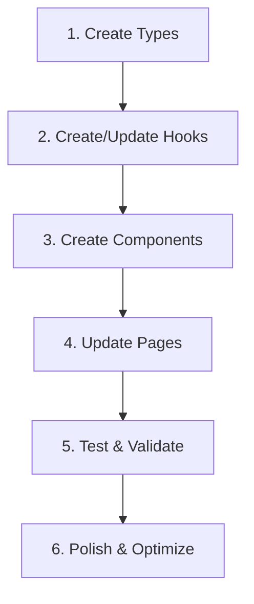

# 008: Events → Supabase Connection Plan

**Created:** 2025-01-29  
**Status:** In Progress  
**Goal:** Connect Events UI to Supabase with robust hooks, proper states, and production-ready patterns

---

## 📋 Executive Summary

**Current State:**
- ✅ Supabase tables exist (`events`, `registrations`)
- ✅ RLS policies configured
- ⚠️ Events pages use hardcoded mock data
- ⚠️ No real registration flow
- ⚠️ Hooks exist but need validation/fixes

**Target State:**
- ✅ All Events data from Supabase
- ✅ Real-time registration with proper error handling
- ✅ Loading/error/empty states on all pages
- ✅ Type-safe hooks with proper returns
- ✅ Production-ready validation and edge cases

---

## 🔍 Schema Validation

### Tables Verified

**events table:**
```sql
- id (uuid, PK)
- title (text)
- description (text)
- event_date (timestamptz)
- end_date (timestamptz)
- image_url (text)
- is_virtual (boolean)
- virtual_url (text)
- capacity (integer)
- registered_count (integer)
- status (event_status: draft|published|closed)
- organizer_id (uuid)
- slug (text)
- tags (text[])
- created_at (timestamptz)
- updated_at (timestamptz)
- deleted_at (timestamptz)
```

**registrations table:**
```sql
- id (uuid, PK)
- event_id (uuid, FK → events)
- profile_id (uuid) ← CRITICAL: uses profile_id, NOT user_id
- status (registration_status: pending|confirmed|cancelled|attended|no_show)
- created_at (timestamptz)
- updated_at (timestamptz)
- check_in_time (timestamptz)
- attended (boolean)
- payment_amount (numeric)
- payment_status (payment_status)
- payment_reference (text)
- ticket_id (uuid)
```

### RLS Policies Verified

**events:**
- ✅ Anonymous: Read published events only
- ✅ Organizers: Full CRUD on own events
- ✅ Admin: Full access

**registrations:**
- ✅ Users: Create own registrations for published events
- ✅ Users: Read/update/delete own registrations
- ✅ Organizers: Read registrations for their events
- ✅ Admin: Full access

---

## ✅ Implementation Checklist

### Phase 1: Data Layer (Types + Hooks)

- [ ] **1.1** Create `src/types/events.ts`
  - Event type matching DB schema
  - Registration type
  - Export both types
  
- [ ] **1.2** Update `src/hooks/useEvents.ts`
  - Remove mock user ID
  - Use proper Supabase query
  - Add loading/error states
  - Handle empty arrays gracefully
  - Return { data, isLoading, error, refetch }
  
- [ ] **1.3** Create `src/hooks/useEventDetail.ts`
  - Accept eventId parameter
  - Use `.maybeSingle()` for 404 handling
  - Return null if not found (not error)
  - Include refetch function
  
- [ ] **1.4** Create `src/hooks/useEventRegistration.ts`
  - Check registration status (head query + count)
  - Register mutation with proper error handling
  - Cancel registration mutation
  - Handle duplicate registration (23505 code)
  - Handle auth required errors
  - Return { isRegistered, register, cancel, isLoading }

### Phase 2: UI Components

- [ ] **2.1** Create `src/components/events/EventCard.tsx`
  - Extract from Events page
  - Accept Event type
  - Show image, title, date, location
  - Link to detail page
  - Show capacity/registration count
  
- [ ] **2.2** Create `src/components/events/EventCardSkeleton.tsx`
  - Loading skeleton matching EventCard layout
  - Reusable count prop
  
- [ ] **2.3** Create `src/components/events/RegistrationButton.tsx`
  - Accept event + registration state
  - Handle all states: not logged in, loading, registered, available
  - Show appropriate button/badge
  - Toast notifications for all outcomes

### Phase 3: Page Updates

- [ ] **3.1** Update `src/pages/Events.tsx`
  - Replace mock data with `useEvents()` hook
  - Add loading state → show skeletons
  - Add error state → show ErrorState with retry
  - Add empty state → show EmptyState
  - Map events to EventCard components
  - Keep existing filters/tabs (enhance later)
  
- [ ] **3.2** Update `src/pages/EventDetail.tsx`
  - Use `useParams()` to get eventId
  - Use `useEventDetail(eventId)` hook
  - Use `useEventRegistration(eventId)` hook
  - Use `useAuth()` for user context
  - Add loading state → show skeleton
  - Add error state → show ErrorState
  - Add not found state → show 404 message
  - Wire RegistrationButton component
  - Show event details from real data

### Phase 4: Error Handling & Edge Cases

- [ ] **4.1** Auth Guards
  - Registration requires login → toast message
  - Redirect to /auth with return URL
  
- [ ] **4.2** Duplicate Registration
  - Detect 23505 error code
  - Toast: "Already registered"
  - Don't show as error state
  
- [ ] **4.3** Capacity Full
  - Check registered_count vs capacity
  - Disable register button
  - Show "Event Full" badge
  
- [ ] **4.4** Event Closed/Cancelled
  - Check event status
  - Hide register button
  - Show status badge
  
- [ ] **4.5** Network Errors
  - Show retry button
  - Toast error messages
  - Maintain form state

### Phase 5: Testing & Validation

- [ ] **5.1** Unit Tests (Manual)
  - Events list loads
  - Empty state shows when no events
  - Error state shows with retry
  - Filters work (if implemented)
  
- [ ] **5.2** Detail Page Tests
  - Event detail loads
  - 404 shows for invalid ID
  - Registration button states correct
  - Toast notifications work
  
- [ ] **5.3** Registration Flow
  - Not logged in → redirects
  - First registration → success toast + badge
  - Duplicate → error toast, no badge change
  - Cancel → success toast + button returns
  
- [ ] **5.4** Edge Cases
  - Capacity reached → button disabled
  - Event past → no registration
  - Network failure → retry works
  - Multiple rapid clicks → debounced

### Phase 6: Performance & Polish

- [ ] **6.1** Query Optimization
  - Add .limit() to prevent huge fetches
  - Use .select() to get only needed columns
  - Consider pagination for large lists
  
- [ ] **6.2** Caching Strategy
  - React Query cache time
  - Refetch on window focus (configurable)
  - Optimistic updates for registration
  
- [ ] **6.3** Loading States
  - Skeleton screens match final layout
  - Smooth transitions
  - No layout shift
  
- [ ] **6.4** Error Messages
  - User-friendly copy
  - Actionable next steps
  - Consistent tone

---

## 🎯 Success Criteria

### Functional Requirements
- ✅ Events list populated from Supabase
- ✅ Detail page shows correct event data
- ✅ Registration creates record in DB
- ✅ Duplicate registration prevented
- ✅ Auth required enforced
- ✅ All toasts fire correctly
- ✅ Loading/error/empty states present

### Technical Requirements
- ✅ No TypeScript errors
- ✅ No console errors or warnings
- ✅ Uses `profile_id` (NOT `user_id`)
- ✅ Uses `.maybeSingle()` for detail fetch
- ✅ Head query for registration check
- ✅ Proper error handling (try/catch)
- ✅ Type-safe throughout

### UX Requirements
- ✅ Fast loading (<1s on good connection)
- ✅ Smooth skeleton transitions
- ✅ Clear error messages with retry
- ✅ Immediate feedback on actions
- ✅ No empty/broken states
- ✅ Mobile-friendly (44px tap targets)

### Production Readiness
- ✅ RLS policies verified working
- ✅ Error boundaries catch failures
- ✅ No hardcoded IDs or test data
- ✅ Analytics events (optional but recommended)
- ✅ SEO metadata on pages
- ✅ Accessible (ARIA, keyboard nav)

---

## 🚨 Known Issues & Fixes

### Issue 1: Mock User ID in useMyEvents
**Problem:** useMyEvents uses hardcoded test profile ID in DEV mode  
**Fix:** Remove mock, require real auth, show appropriate message when not logged in  
**Status:** To be fixed in Phase 1.2

### Issue 2: Events Page Uses Hardcoded Data
**Problem:** src/pages/Events.tsx has hardcoded events array  
**Fix:** Replace with useEvents() hook  
**Status:** To be fixed in Phase 3.1

### Issue 3: EventDetail Has Mock Registration
**Problem:** Registration just sets local state, doesn't save to DB  
**Fix:** Implement real Supabase insert with error handling  
**Status:** To be fixed in Phase 3.2

### Issue 4: No Loading States
**Problem:** Pages don't show loading skeletons  
**Fix:** Add proper loading states before data arrives  
**Status:** To be fixed in Phase 3

### Issue 5: No Error Recovery
**Problem:** Network errors just fail silently  
**Fix:** Show ErrorState component with retry button  
**Status:** To be fixed in Phase 3

---

## 📐 Architecture Decisions

### Decision 1: Separate Registration Hook
**Rationale:** Registration logic is complex (auth check, duplicate handling, status management)  
**Alternative:** Include in useEventDetail  
**Choice:** Separate hook for better separation of concerns and reusability

### Decision 2: Use .maybeSingle() for Detail
**Rationale:** 404 is a valid state, not an error  
**Alternative:** Use .single() and catch error  
**Choice:** .maybeSingle() is cleaner, returns null for not found

### Decision 3: Head Query for Registration Check
**Rationale:** Only need to know if registration exists, not the data  
**Alternative:** Select full record  
**Choice:** Head query is faster, reduces bandwidth

### Decision 4: Optimistic Updates
**Rationale:** Instant feedback improves UX  
**Alternative:** Wait for server response  
**Choice:** Show immediate state change, rollback on error

### Decision 5: Component Extraction
**Rationale:** Pages getting too large (EventDetail is 316 lines)  
**Alternative:** Keep everything in page files  
**Choice:** Extract EventCard, RegistrationButton for maintainability

---

## 🔄 Implementation Order & Dependencies



**Phase Dependencies:**
1. Types → needed by all hooks
2. Hooks → needed by components and pages
3. Components → needed by pages
4. Pages → wire everything together
5. Testing → validate it works
6. Polish → performance and UX refinements

---

## 🧪 Testing Plan

### Manual Testing Checklist

**Events List Page:**
- [ ] Navigate to /events
- [ ] Verify events load from Supabase
- [ ] Check loading skeleton appears first
- [ ] Verify empty state if no events
- [ ] Test error state by turning off network
- [ ] Click retry button works
- [ ] Click event card navigates to detail

**Event Detail Page:**
- [ ] Navigate to /events/:id with valid ID
- [ ] Verify event details load
- [ ] Check registration status loads
- [ ] Test 404 with invalid ID
- [ ] Test registration flow (logged out)
- [ ] Test registration flow (logged in)
- [ ] Verify duplicate registration handling
- [ ] Check success toasts appear
- [ ] Verify badge replaces button when registered

**Registration Flow:**
- [ ] Not logged in: shows auth prompt
- [ ] Logged in + not registered: shows register button
- [ ] Click register: shows loading state
- [ ] Success: shows success toast + badge
- [ ] Already registered: shows badge immediately
- [ ] Click register twice fast: handles gracefully
- [ ] Network error: shows error toast + retry

**Edge Cases:**
- [ ] Event at capacity: register disabled
- [ ] Event past: no registration option
- [ ] Event cancelled: shows cancelled badge
- [ ] Very long event title: truncates nicely
- [ ] Missing image: shows placeholder
- [ ] Mobile view: buttons 44px minimum

---

## 📊 Progress Tracking

| Phase | Tasks | Completed | % Done | Status |
|-------|-------|-----------|--------|--------|
| 1. Data Layer | 4 | 0 | 0% | Not Started |
| 2. UI Components | 3 | 0 | 0% | Not Started |
| 3. Page Updates | 2 | 0 | 0% | Not Started |
| 4. Error Handling | 5 | 0 | 0% | Not Started |
| 5. Testing | 4 | 0 | 0% | Not Started |
| 6. Performance | 4 | 0 | 0% | Not Started |
| **TOTAL** | **22** | **0** | **0%** | **Not Started** |

---

## 🎬 Next Steps

### Immediate (Today)
1. ✅ Create this plan document
2. ⏳ Create types file
3. ⏳ Update useEvents hook
4. ⏳ Create useEventDetail hook
5. ⏳ Create useEventRegistration hook

### Short-term (This Week)
6. Create EventCard component
7. Create EventCardSkeleton component
8. Create RegistrationButton component
9. Update Events page
10. Update EventDetail page

### Medium-term (Next Week)
11. Comprehensive testing
12. Error handling polish
13. Performance optimization
14. Analytics integration
15. Documentation updates

---

## 📝 Code Quality Standards

### TypeScript
- ✅ Strict mode enabled
- ✅ No `any` types (use `unknown` if needed)
- ✅ Export types from separate files
- ✅ Use type inference where obvious
- ✅ Proper generics for hooks

### React Hooks
- ✅ Follow rules of hooks
- ✅ Proper dependency arrays
- ✅ Clean up effects when needed
- ✅ Avoid infinite loops
- ✅ Use useCallback for functions

### Error Handling
- ✅ Try/catch in async functions
- ✅ Meaningful error messages
- ✅ User-friendly error display
- ✅ Retry mechanisms where appropriate
- ✅ Log errors for debugging

### UI/UX
- ✅ Loading states before data
- ✅ Error states with recovery
- ✅ Empty states with guidance
- ✅ Toast feedback for actions
- ✅ Accessible markup (ARIA)
- ✅ Mobile-first responsive

---

## 🔗 Related Documents

- [Progress Tracker](./007-progress-tracker.md) - Overall project status
- [Supabase Schema](../supabase/migrations/) - Database migrations
- [Component Library](../src/components/ui/) - UI components

---

## ✅ Sign-off Checklist

Before marking this implementation complete:

- [ ] All 22 tasks completed
- [ ] Zero TypeScript errors
- [ ] Zero console errors
- [ ] All success criteria met
- [ ] Manual testing passed
- [ ] Edge cases handled
- [ ] Performance acceptable (<2s load)
- [ ] Mobile UX validated
- [ ] Accessibility checked
- [ ] Documentation updated
- [ ] Code reviewed
- [ ] Ready for production

---

**Status:** 📝 Plan Complete → Ready to Implement  
**Next Action:** Begin Phase 1 - Create types and update hooks  
**Owner:** Development Team  
**Timeline:** 2-3 days for full implementation
