# 🚀 UNIFIED LOVABLE PROMPT - PITCH DECK PRESENTATION AI

**Date:** October 15, 2025
**Purpose:** Complete, actionable guide for Lovable to build the Pitch Deck Presentation Wizard
**Approach:** Examine → Plan → Implement step-by-step
**UI Inspiration:** Decktopus clean interface + AI-first approach
**Reference:** `/home/sk/medellin-spark/presentation-ai` structure

---

## 📋 SECTION 1: EXAMINE CURRENT SETUP

Hey Lovable! Before we start building, let's first **examine the current state** of the Medellin AI Hub site to understand what already exists and what needs to be built.

### Step 1.1: Scan Existing Pages

Please examine these existing pages and components:

**✅ Already Built (Working):**
```
/                          Landing page (hero, stats, CTAs)
/programs                  Programs page (accelerator info)
/events                    Events calendar
/perks                     Perks library ($500K+ credits)
/blog                      Blog posts (3 articles)
/about                     About us (mission, team)
/contact                   Contact form

/dashboard                 User dashboard with:
                          • Quick Actions section
                          • Stats cards (Events, Jobs, Perks, Views)
                          • "Generate Pitch Deck" quick action ✅
                          • Upcoming events
                          • Recommended jobs

/pitch-deck               Pitch deck input form with:
                          • Topic textarea (SMALL - needs enlargement)
                          • Slides dropdown (5 slides - change to 10)
                          • Language selector (English)
                          • Web Search toggle
                          • "Generate Presentation" button (TEAL - change to PURPLE)
                          • "Try these examples" section below

/startup-profile          Multi-step startup wizard:
                          • 5-step progress indicator
                          • Company basics form
                          • Right sidebar with Profile Strength
                          • Auto-saving indicator
                          • Good pattern to reuse! ✅

/profile                  Public user profile
/presentations            My Presentations page with:
                          • "Create New Presentation" cards ✅
                          • "My Presentations" grid ✅
                          • "Recommended Templates" section
                          • PROBLEM: "Edit Deck" buttons link to
                            non-existent pages ❌
```

**❌ Critical Missing Pages (BLOCKING users):**
```
/presentations/:id/outline    Outline editor - DOES NOT EXIST ❌
/presentations/:id/edit       Slide editor - DOES NOT EXIST ❌
/presentations/:id/view       Presentation viewer - DOES NOT EXIST ❌
```

### Step 1.2: Identify Existing Design System

**Colors (from existing pages):**
- Primary: `#5EAEA8` (Teal/Cyan) - used for general buttons
- Secondary: `#8B5CF6` (Purple) - occasionally used
- Background: `#FFFFFF` (White)
- Text: `#1F2937` (Dark gray)
- Borders: `#E5E7EB` (Light gray)
- Cards: White with subtle shadows

**Components Already Available:**
- Card components (white background, rounded corners, hover shadows)
- Button styles (teal primary, white secondary, purple accent)
- Form inputs (text, textarea, select, checkbox)
- Progress indicators (percentage circles, bars)
- Stat cards (with numbers and icons)
- Multi-step wizard pattern (from startup profile)

**Typography:**
- Headings: Bold, large (text-2xl to text-4xl)
- Body: Regular, readable (text-base to text-lg)
- Hints: Smaller, gray (text-sm text-gray-600)

### Step 1.3: Understand Current Database Structure

```typescript
// Supabase Tables (already exist):

// profiles table
{
  id: uuid (primary key, references auth.users)
  email: string
  full_name: string
  created_at: timestamp
  updated_at: timestamp
  // ... other profile fields
}

// presentations table
{
  id: uuid (primary key)
  profile_id: uuid (foreign key → profiles.id)
  title: string (e.g., "EventOS Investor Pitch")
  topic: text (user's original input)
  slide_count: integer (10)
  presentation_style: string ("professional", "casual", "technical")
  status: string ("draft", "outline", "complete")
  theme: string ("purple", "blue", "dark")
  outline: jsonb (array of slide titles)
  content: jsonb (array of slide objects with title, content, layout)
  created_at: timestamp
  updated_at: timestamp
}

// presentations.outline structure (JSONB):
[
  { "id": "slide-1", "title": "EventOS - Investor Pitch" },
  { "id": "slide-2", "title": "The Problem We Solve" },
  { "id": "slide-3", "title": "Our Solution" },
  // ... 10 slides total
]

// presentations.content structure (JSONB):
{
  "slides": [
    {
      "id": "slide-1",
      "title": "EventOS - Investor Pitch",
      "content": "EventOS is an AI-powered platform...",
      "layout": "title"
    },
    {
      "id": "slide-2",
      "title": "The Problem We Solve",
      "content": "Event organizers spend 40+ hours...",
      "layout": "content"
    }
  ],
  "slideCount": 10
}
```

### Step 1.4: Review Reference Implementation

Please examine the structure of `/home/sk/medellin-spark/presentation-ai` to understand the pattern, but note that we're adapting it for Lovable + Supabase (NOT copying directly):

**What to Adapt:**
```
presentation-ai/
├── src/
│   ├── components/
│   │   ├── presentations/
│   │   │   ├── PresentationOutline.tsx      → Outline editor patterns
│   │   │   ├── SlideEditor.tsx             → Editor layout patterns
│   │   │   ├── PresentationViewer.tsx      → Viewer patterns
│   │   │   ├── ThemePicker.tsx             → Theme selection UI
│   │   └── ui/
│   │       ├── AutoSaveIndicator.tsx       → Save status display
│   │       └── ...
│   ├── stores/
│   │   └── presentationStore.ts            → State management (adapt to useState)
│   └── types/
│       └── presentation.ts                  → TypeScript interfaces
```

**What to Skip:**
- Prisma (we use Supabase)
- Zustand (we use React useState)
- NextAuth (we use Supabase Auth)
- Complex rich text editor (we use simple textarea for MVP)
- Image generation (skip for MVP)
- 15+ layouts (we use 2: title, content)

---

## 📐 SECTION 2: CREATE IMPLEMENTATION PLAN

Based on your examination, here's the plan we'll follow:

### 2.1: Master System Architecture

```mermaid
graph TB
    subgraph UserInterface["👤 USER INTERFACE - LOVABLE/REACT"]
        Start([User Opens Dashboard])

        Dashboard["Dashboard ✅
        • Quick Actions
        • 'Generate Pitch Deck' button"]

        Input["Input Page ✅
        /pitch-deck
        • ENHANCE: Large textarea
        • ENHANCE: Quick start buttons
        • ENHANCE: Purple button
        • Submit form"]

        Outline["Outline Editor ❌ NEW
        /presentations/:id/outline
        • Review AI outline
        • Drag & drop reorder ⠿
        • Edit titles inline ✏️
        • Delete slides 🗑️
        • Theme selector ●●●
        • Generate full deck"]

        Editor["Slide Editor ❌ NEW
        /presentations/:id/edit
        • Thumbnails panel (left)
        • Content editor (right)
        • Edit title + content
        • Auto-save every 2 sec
        • Preview button"]

        Viewer["Viewer ❌ NEW
        /presentations/:id/view
        • Full-screen presentation
        • Keyboard navigation
        • Arrow keys, Space, ESC
        • Theme colors applied"]

        MyDecks["My Pitch Decks ✅
        /presentations
        • FIX: Edit button links
        • FIX: View button links"]
    end

    subgraph Backend["⚡ SUPABASE BACKEND"]
        Auth["Supabase Auth
        • User sessions
        • RLS policies"]

        DB["PostgreSQL + JSONB
        • profiles table
        • presentations table
        • outline: jsonb
        • content: jsonb"]

        Edge1["Edge Function
        generate-outline
        • Calls Claude API
        • Returns 10 slide titles"]

        Edge2["Edge Function
        generate-presentation
        • Calls Claude API
        • Returns full content
        • Shows progress"]
    end

    subgraph AI["🤖 AI - ANTHROPIC CLAUDE"]
        Claude["Claude API
        • Outline generation
        • Content generation
        • Streaming responses"]
    end

    Start --> Dashboard
    Dashboard -->|Click Generate| Input
    Input -->|Submit form| Edge1
    Edge1 -->|Call AI| Claude
    Claude -->|Return outline| Edge1
    Edge1 -->|Save to DB| DB
    DB -->|Return ID + outline| Outline

    Outline -->|Edit & save| DB
    Outline -->|Generate full| Edge2
    Edge2 -->|Call AI| Claude
    Claude -->|Stream content| Edge2
    Edge2 -->|Update DB| DB
    DB -->|Load slides| Editor

    Editor -->|Auto-save| DB
    Editor -->|Click Preview| Viewer
    Viewer -->|ESC key| Editor
    Editor -->|Back| MyDecks

    Auth -.->|Protect| Outline
    Auth -.->|Protect| Editor
    Auth -.->|Protect| Viewer

    style Dashboard fill:#51cf66,stroke:#2f9e44
    style Input fill:#51cf66,stroke:#2f9e44
    style Outline fill:#ff6b6b,stroke:#c92a2a,stroke-width:3px
    style Editor fill:#ff6b6b,stroke:#c92a2a,stroke-width:3px
    style Viewer fill:#ff6b6b,stroke:#c92a2a,stroke-width:3px
    style MyDecks fill:#ffd43b,stroke:#fab005
```



### 2.2: Complete User Journey Flow


### 2.3: Data Flow Diagram


### 2.4: Component Hierarchy

```mermaid
graph TD
    App[App Root]

    App --> Dashboard[Dashboard Page ✅]
    App --> Input[Input Page ✅ ENHANCE]
    App --> Outline[Outline Editor ❌ NEW]
    App --> Editor[Slide Editor ❌ NEW]
    App --> Viewer[Viewer ❌ NEW]
    App --> MyDecks[My Decks ✅ FIX]

    Input --> Textarea[Large Textarea]
    Input --> QuickStarts[Quick Start Buttons]
    Input --> GenerateBtn[Generate Button PURPLE]

    Outline --> OutlineHeader[Header + Auto-save]
    Outline --> SlideList[Draggable Slide List]
    Outline --> ThemeSelector[Theme Selector]
    Outline --> GenBtn[Generate Presentation Btn]

    SlideList --> SlideRow1[Slide Row 1]
    SlideList --> SlideRow2[Slide Row 2]
    SlideList --> SlideRowN[Slide Row N...]

    SlideRow1 --> DragHandle[⠿ Drag Handle]
    SlideRow1 --> TitleInput[Title Input]
    SlideRow1 --> EditBtn[✏️ Edit]
    SlideRow1 --> DelBtn[🗑️ Delete]

    ThemeSelector --> ThemeCard1[Purple Theme ●●●]
    ThemeSelector --> ThemeCard2[Blue Theme ●●●]
    ThemeSelector --> ThemeCard3[Dark Theme ●●●]

    Editor --> EditorHeader[Header + Auto-save]
    Editor --> Thumbnails[Thumbnail Panel]
    Editor --> EditorArea[Content Editor]

    Thumbnails --> Thumb1[Slide 1]
    Thumbnails --> Thumb2[Slide 2 ▶]
    Thumbnails --> ThumbN[Slide N...]

    EditorArea --> TitleField[Title Input]
    EditorArea --> ContentField[Content Textarea]
    EditorArea --> NavButtons[Prev/Next Buttons]
    EditorArea --> PreviewBtn[View Presentation Btn]

    Viewer --> ViewerHeader[Controls Auto-hide]
    Viewer --> SlideDisplay[Full-screen Slide]
    Viewer --> ViewerControls[← 1/10 →  🗙]

    style Outline fill:#ff6b6b,stroke:#c92a2a,stroke-width:3px
    style Editor fill:#ff6b6b,stroke:#c92a2a,stroke-width:3px
    style Viewer fill:#ff6b6b,stroke:#c92a2a,stroke-width:3px
    style Input fill:#ffd43b,stroke:#fab005
    style MyDecks fill:#ffd43b,stroke:#fab005
```



---

## 🎨 SECTION 3: UI/UX WIREFRAMES (DECKTOPUS-INSPIRED)

### 3.1: Enhanced Input Page (EXISTING - NEEDS ENHANCEMENT)

**Current State:**
```
Small textarea (3 lines)
Teal button
Examples at bottom
```

**NEW Enhanced State (Decktopus-inspired):**

```
┌────────────────────────────────────────────────────────────────┐
│                                                                 │
│               Create Your Startup Pitch Deck                   │
│        Transform your idea into a professional investor pitch  │
│                                                                 │
│  What's your startup about?                                    │
│  ┌────────────────────────────────────────────────────────┐   │
│  │                                                         │   │
│  │ We're building an AI-powered event management          │   │  ← LARGE
│  │ platform that helps organizers create, manage, and     │   │    (10 lines)
│  │ launch events in under 5 minutes. Our platform uses    │   │
│  │ artificial intelligence to automate ticketing,         │   │
│  │ scheduling, and attendee engagement.                   │   │
│  │                                                         │   │
│  │ Target market: B2B event organizers in Latin America   │   │
│  │ Business model: SaaS with per-event pricing            │   │
│  │                                              250 chars  │   │
│  └────────────────────────────────────────────────────────┘   │
│                                                                 │
│  Or try these quick starts:                                    │
│  ┌──────────────┐ ┌──────────────┐ ┌──────────────┐          │
│  │ SaaS Platform│ │ Marketplace  │ │ AI/ML Product│          │
│  └──────────────┘ └──────────────┘ └──────────────┘          │
│  ┌──────────────┐ ┌──────────────┐ ┌──────────────┐          │
│  │   Fintech    │ │  E-commerce  │ │  Dev Tools   │          │
│  └──────────────┘ └──────────────┘ └──────────────┘          │
│                                                                 │
│  Number of slides: [10 slides ▼]  Style: [Professional ▼]     │
│                                                                 │
│  ┌─────────────────────────────────────────┐                  │
│  │  🎯 Generate Pitch Deck →               │ ← PURPLE         │
│  └─────────────────────────────────────────┘   #8B5CF6        │
│                                                                 │
└────────────────────────────────────────────────────────────────┘
```

**Key Changes:**
1. **Enlarge textarea**: `min-height: 250px` (was ~80px)
2. **Add quick start buttons**: 6 buttons in 2 rows
3. **Change button color**: Purple `#8B5CF6` (was teal)
4. **Better placeholder**: Detailed guidance text
5. **Move examples**: Inline as quick start buttons (not below)

**Quick Start Button Behavior:**
```typescript
const quickStarts = {
  'SaaS Platform': `B2B SaaS platform that helps [target customers] solve [specific problem].
Our platform features [key features] and serves [customer segment].
Business model: [subscription/usage-based pricing].`,

  'Marketplace': `Two-sided marketplace connecting [buyers] and [sellers] in the [industry] space.
We facilitate [transaction type] and generate revenue through [commission/fees].
Target market: [geographic/demographic focus].`,

  'AI/ML Product': `AI-powered tool that automates [specific process] using machine learning.
Our technology [key innovation] and helps [target users] achieve [outcome].
Differentiator: [unique approach/technology].`,

  'Fintech': `Financial technology solution that [value proposition] for [target market].
We're disrupting [traditional process] with [innovation].
Compliance: [regulatory approach].`,

  'E-commerce': `Direct-to-consumer brand selling [products] to [target market].
Our unique selling point is [differentiation: quality/price/sustainability].
Distribution: [online/omnichannel strategy].`,

  'Dev Tools': `Developer tool that helps engineers [specific task] more efficiently.
Integrates with [platforms: GitHub, VS Code, etc.] and supports [use cases].
Pricing: [freemium/per-seat/usage-based].`
}

function handleQuickStart(template: string) {
  setTopic(quickStarts[template])
  // Optionally: Auto-fill style and slide count based on template
}
```

### 3.2: Outline Editor (NEW PAGE - PRIMARY FOCUS)

**Layout Pattern (Decktopus-inspired):**

```
┌─────────────────────────────────────────────────────────────────────┐
│  ← Back to Dashboard            Review Your Outline       💾 Saved  │ ← Header
├─────────────────────────────────────────────────────────────────────┤
│                                                                      │
│  Edit your slide titles, reorder, or remove slides                  │
│                                                                      │
│  10 slides • ~5 min presentation                                    │
│                                                                      │
│  ┌─────────────────────────────────────────────────────────────┐   │
│  │  ⠿  1. [EventOS - Investor Pitch Deck              ] ✏️ 🗑️ ⌄│   │ ← Slide Row
│  └─────────────────────────────────────────────────────────────┘   │
│  ┌─────────────────────────────────────────────────────────────┐   │
│  │  ⠿  2. [The Problem with Event Planning            ] ✏️ 🗑️ ⌄│   │
│  └─────────────────────────────────────────────────────────────┘   │
│  ┌─────────────────────────────────────────────────────────────┐   │
│  │  ⠿  3. [Our Solution: AI-Powered Platform          ] ✏️ 🗑️ ⌄│   │
│  └─────────────────────────────────────────────────────────────┘   │
│  ┌─────────────────────────────────────────────────────────────┐   │
│  │  ⠿  4. [How EventOS Works - Demo                   ] ✏️ 🗑️ ⌄│   │
│  └─────────────────────────────────────────────────────────────┘   │
│  ┌─────────────────────────────────────────────────────────────┐   │
│  │  ⠿  5. [Market Opportunity - $2.5B TAM             ] ✏️ 🗑️ ⌄│   │
│  └─────────────────────────────────────────────────────────────┘   │
│  ┌─────────────────────────────────────────────────────────────┐   │
│  │  ⠿  6. [Business Model and Revenue Streams         ] ✏️ 🗑️ ⌄│   │
│  └─────────────────────────────────────────────────────────────┘   │
│  ┌─────────────────────────────────────────────────────────────┐   │
│  │  ⠿  7. [Traction and Key Milestones                ] ✏️ 🗑️ ⌄│   │
│  └─────────────────────────────────────────────────────────────┘   │
│  ┌─────────────────────────────────────────────────────────────┐   │
│  │  ⠿  8. [The Team Behind EventOS                    ] ✏️ 🗑️ ⌄│   │
│  └─────────────────────────────────────────────────────────────┘   │
│  ┌─────────────────────────────────────────────────────────────┐   │
│  │  ⠿  9. [Financial Projections and Ask              ] ✏️ 🗑️ ⌄│   │
│  └─────────────────────────────────────────────────────────────┘   │
│  ┌─────────────────────────────────────────────────────────────┐   │
│  │  ⠿ 10. [Vision: Transforming Events Across LATAM   ] ✏️ 🗑️ ⌄│   │
│  └─────────────────────────────────────────────────────────────┘   │
│                                                                      │
│  + Add Slide                                                        │
│                                                                      │
├─────────────────────────────────────────────────────────────────────┤
│  Choose a Theme                                                      │
│                                                                      │
│  ┌──────────────────┐  ┌──────────────────┐  ┌──────────────────┐ │
│  │   Purple         │  │     Blue         │  │     Dark         │ │
│  │                  │  │                  │  │                  │ │
│  │   ●  ●  ●        │  │   ●  ●  ●        │  │   ●  ●  ●        │ │ ← Color dots
│  │        ◉         │  │        ○         │  │        ○         │ │ ← Radio
│  │  Professional    │  │  Trustworthy     │  │   Executive      │ │
│  └──────────────────┘  └──────────────────┘  └──────────────────┘ │
│   SELECTED              Not selected          Not selected         │
│   (2px purple border)                                               │
│                                                                      │
│  ┌───────────────┐  ┌──────────────────────────────────┐          │
│  │  ← Edit Info  │  │  Generate Presentation  →        │ ← PURPLE │
│  └───────────────┘  └──────────────────────────────────┘          │
│                                                                      │
└─────────────────────────────────────────────────────────────────────┘
```

**Slide Row Component Breakdown:**

```
┌─────────────────────────────────────────────────────────────────┐
│  ⠿  2. [The Problem with Event Planning            ] ✏️ 🗑️ ⌄  │
│  │  │  └─────────────────────────────────────────┘  │  │  │   │
│  │  │                                                │  │  │   │
│  │  │  Editable title (click or click ✏️)          │  │  │   │
│  │  │  Auto-saves 2 sec after typing stops          │  │  └───┼─ Dropdown (more options)
│  │  │                                                │  └──────┼─ Delete (with confirmation)
│  │  └─ Slide number                                  └─────────┼─ Edit (makes title editable)
│  └─ Drag handle (cursor: grab)                                 │
│                                                                 │
│  Hover state: Background → light purple #F5F3FF                │
│  Dragging state: Opacity → 0.5, shadow appears                 │
└─────────────────────────────────────────────────────────────────┘
```

**Theme Card Component Breakdown:**

```
┌──────────────────┐
│   Purple         │ ← Theme name (font-semibold)
│                  │
│   ●  ●  ●        │ ← Color dots (3 circles)
│   #8B5CF6        │   Colors: primary, secondary, accent
│   #A78BFA        │   w-4 h-4, rounded-full
│   #DDD6FE        │
│        ◉         │ ← Radio button (only one selected)
│  Professional    │ ← Description (text-sm)
└──────────────────┘

State changes:
• Not selected: border-gray-200, hover:border-purple-300
• Selected:     border-purple-600 (2px), bg-purple-50, radio filled
• Click anywhere on card to select (not just radio)
```

### 3.3: Slide Editor (NEW PAGE)

**Layout Pattern (Split view with thumbnails):**

```
┌────────────┬──────────────────────────────────────────────────────────┐
│  SLIDES    │  ← Back               SLIDE 3 OF 10           💾 Saved   │
│            ├──────────────────────────────────────────────────────────┤
│ ┌────────┐ │                                                           │
│ │ Slide1 │ │  Slide Title                                             │
│ │ Title  │ │  ┌─────────────────────────────────────────────────────┐│
│ └────────┘ │  │ Our Solution: AI-Powered Event Management           ││
│            │  └─────────────────────────────────────────────────────┘│
│ ┌────────┐ │                                                           │
│ │ Slide2 │ │  Slide Content                                           │
│ │ Problem│ │  ┌─────────────────────────────────────────────────────┐│
│ └────────┘ │  │                                                      ││
│            │  │ EventOS is an AI-powered event management platform  ││
│ ┌────────┐ │  │ that helps businesses create, manage, and launch    ││
│ │▶Slide3 │◄┼──┼─ SELECTED (purple border + arrow)                   ││
│ │Solution│ │  │ events in under 5 minutes.                          ││
│ └────────┘ │  │                                                      ││
│            │  │ Key Features:                                        ││
│ ┌────────┐ │  │ • AI-powered event creation wizard                  ││
│ │ Slide4 │ │  │ • Automated attendee management and invitations     ││
│ │ Demo   │ │  │ • Real-time analytics and event insights            ││
│ └────────┘ │  │ • Multi-platform integration (Zoom, Teams, etc.)    ││
│            │  │                                                      ││
│ ┌────────┐ │  │                                                      ││
│ │ Slide5 │ │  └─────────────────────────────────────────────────────┘│
│ │ Market │ │                                                           │
│ └────────┘ │  Simple textarea (no rich text for MVP)                 │
│            │  Auto-saves 2 sec after typing stops                     │
│   ...      │                                                           │
│            │  ┌──────────────┐  ┌──────────────────────────────────┐│
│            │  │ ← Previous   │  │          Next →                  ││
│            │  └──────────────┘  └──────────────────────────────────┘│
│            │                                                           │
│            │  ┌───────────────────────────────────────────────────┐  │
│            │  │  View Presentation  →                             │  │ ← PURPLE
│            │  └───────────────────────────────────────────────────┘  │
│            │                                                           │
└────────────┴──────────────────────────────────────────────────────────┘
    192px                     Flex-1
    width                  (fills remaining)
```

**Thumbnail Panel Details:**

```
Width: 192px fixed (w-48)
Background: gray-50 (#F9FAFB)
Border-right: 1px solid #E5E7EB
Overflow-y: auto (scrollable)

Each thumbnail card:
┌──────────────┐
│ Slide 1      │ ← text-xs text-gray-500
│ EventOS...   │ ← text-sm font-medium, truncated
└──────────────┘
Padding: p-3
Margin-bottom: mb-2
Border-radius: rounded

Not selected:
• bg-white
• border-gray-200

Selected:
• bg-white
• border-purple-600 (2px)
• shadow-md
• Left indicator: ▶ in purple
```

### 3.4: Presentation Viewer (NEW PAGE)

**Layout Pattern (Full-screen):**

```
┌──────────────────────────────────────────────────────────────────────┐
│                                                                       │
│                                                                       │
│                                                                       │
│                                                                       │
│                        EventOS - Investor Pitch                      │
│                                                                       │
│                Transforming Event Management with AI                 │
│                                                                       │
│                                                                       │
│                                                                       │
│                                                                       │
│                                                                       │
│  ← →  3/10  ⏸️                                        🗙 Exit        │ ← Controls
│                                                                       │
└──────────────────────────────────────────────────────────────────────┘

Full viewport: w-screen h-screen
Background: Theme-specific (Purple: #1F2937, Blue: #1E3A8A, Dark: #000)
Text color: White (#FFFFFF)

Controls auto-hide after 3 seconds of no mouse movement
Show on mouse move or hover at bottom

Keyboard navigation:
• Arrow Left  → Previous slide
• Arrow Right → Next slide
• Space       → Next slide
• Escape      → Exit viewer (back to editor)
• F           → Toggle fullscreen (browser native)
```

**Slide Layouts (2 types for MVP):**

**Title Layout (First slide):**
```
Centered content:
• Title: text-6xl font-bold
• Subtitle: text-2xl text-gray-300
• Vertical centering
• Max-width: 4xl
```

**Content Layout (All other slides):**
```
Left-aligned:
• Title: text-4xl font-bold, margin-bottom: 2rem
• Content: text-xl leading-relaxed, whitespace-pre-wrap
• Max-width: 5xl
• Padding: 3rem
```

---

## 🛠️ SECTION 4: IMPLEMENTATION STEPS

Now let's build this step by step!

### PHASE 1: Enhance Input Page (Day 1) - 4 hours

**File:** `/src/pages/PitchDeckWizard.tsx` (should already exist)

**Step 1.1:** Enlarge the textarea
```tsx
// CHANGE THIS:
<textarea
  className="w-full min-h-[80px] p-4 border rounded-lg"
  placeholder="Create a pitch deck for..."
/>

// TO THIS:
<textarea
  className="w-full min-h-[250px] p-4 border rounded-lg text-base"
  placeholder="Describe your startup in detail. What problem do you solve? Who are your customers? What makes you different? Include your business model, target market, and key features."
  value={topic}
  onChange={(e) => setTopic(e.target.value)}
/>
```

**Step 1.2:** Add quick start buttons ABOVE textarea
```tsx
// Add before the textarea:
<div className="mb-4">
  <p className="text-sm text-gray-600 mb-3">Or try these quick starts:</p>
  <div className="grid grid-cols-3 gap-2">
    {[
      'SaaS Platform',
      'Marketplace',
      'AI/ML Product',
      'Fintech',
      'E-commerce',
      'Dev Tools'
    ].map(type => (
      <button
        key={type}
        onClick={() => handleQuickStart(type)}
        className="px-4 py-3 border-2 border-purple-200 text-purple-700 rounded-lg hover:bg-purple-50 hover:border-purple-400 transition-all text-sm font-medium"
      >
        {type}
      </button>
    ))}
  </div>
</div>

// Add the handler function:
const quickStartTemplates = {
  'SaaS Platform': `B2B SaaS platform that helps [target customers] solve [specific problem].\nOur platform features [key features] and serves [customer segment].\nBusiness model: [subscription/usage-based pricing].`,
  'Marketplace': `Two-sided marketplace connecting [buyers] and [sellers] in the [industry] space.\nWe facilitate [transaction type] and generate revenue through [commission/fees].\nTarget market: [geographic/demographic focus].`,
  'AI/ML Product': `AI-powered tool that automates [specific process] using machine learning.\nOur technology [key innovation] and helps [target users] achieve [outcome].\nDifferentiator: [unique approach/technology].`,
  'Fintech': `Financial technology solution that [value proposition] for [target market].\nWe're disrupting [traditional process] with [innovation].\nCompliance: [regulatory approach].`,
  'E-commerce': `Direct-to-consumer brand selling [products] to [target market].\nOur unique selling point is [differentiation].\nDistribution: [online/omnichannel strategy].`,
  'Dev Tools': `Developer tool that helps engineers [specific task] more efficiently.\nIntegrates with [platforms] and supports [use cases].\nPricing: [freemium/per-seat/usage-based].`
}

function handleQuickStart(template: string) {
  setTopic(quickStartTemplates[template])
}
```

**Step 1.3:** Change button color to purple
```tsx
// CHANGE THIS:
<button className="w-full bg-cyan-600 hover:bg-cyan-700 text-white ...">
  Generate Presentation
</button>

// TO THIS:
<button className="w-full bg-purple-600 hover:bg-purple-700 text-white font-semibold py-4 px-6 rounded-lg transition-colors flex items-center justify-center gap-2">
  <span>🎯</span>
  Generate Pitch Deck
  <span>→</span>
</button>
```

**Step 1.4:** Set default slide count to 10
```tsx
const [slideCount, setSlideCount] = useState(10) // Was: 5
```

**Step 1.5:** Test the enhancements
- [ ] Textarea is larger (10 lines visible)
- [ ] Quick start buttons appear above textarea
- [ ] Clicking quick start fills textarea with template
- [ ] Button is purple (#8B5CF6)
- [ ] Button text is "Generate Pitch Deck"
- [ ] Default slide count is 10

---

### PHASE 2: Build Outline Editor (Days 2-3) - 12 hours

**Step 2.1:** Install dependencies
```bash
pnpm add @dnd-kit/core @dnd-kit/sortable @dnd-kit/utilities use-debounce
```

**Step 2.2:** Create the route file
Create: `/src/pages/presentations/[id]/outline.tsx`

```tsx
import { useEffect, useState } from 'react'
import { useRouter } from 'next/router'
import { DndContext, closestCenter, DragEndEvent } from '@dnd-kit/core'
import { SortableContext, verticalListSortingStrategy, arrayMove } from '@dnd-kit/sortable'
import { useDebouncedCallback } from 'use-debounce'
import { supabase } from '@/integrations/supabase/client'
import SlideRow from '@/components/presentations/SlideRow'
import ThemeCard from '@/components/presentations/ThemeCard'
import AutoSaveIndicator from '@/components/presentations/AutoSaveIndicator'

interface Slide {
  id: string
  title: string
}

interface Theme {
  id: string
  name: string
  colors: [string, string, string]
  description: string
}

const themes: Theme[] = [
  {
    id: 'purple',
    name: 'Purple',
    colors: ['#8B5CF6', '#A78BFA', '#DDD6FE'],
    description: 'Professional'
  },
  {
    id: 'blue',
    name: 'Blue',
    colors: ['#3B82F6', '#60A5FA', '#DBEAFE'],
    description: 'Trustworthy'
  },
  {
    id: 'dark',
    name: 'Dark',
    colors: ['#1F2937', '#374151', '#6B7280'],
    description: 'Executive'
  }
]

export default function OutlineEditor() {
  const router = useRouter()
  const { id: presentationId } = router.query

  const [slides, setSlides] = useState<Slide[]>([])
  const [selectedTheme, setSelectedTheme] = useState('purple')
  const [saveStatus, setSaveStatus] = useState<'saved' | 'saving' | 'error'>('saved')
  const [isGenerating, setIsGenerating] = useState(false)

  // Load presentation on mount
  useEffect(() => {
    if (!presentationId) return

    async function loadPresentation() {
      const { data, error } = await supabase
        .from('presentations')
        .select('outline, theme')
        .eq('id', presentationId)
        .single()

      if (error) {
        console.error('Failed to load presentation:', error)
        return
      }

      setSlides(data.outline || [])
      setSelectedTheme(data.theme || 'purple')
    }

    loadPresentation()
  }, [presentationId])

  // Debounced save function (2 seconds)
  const saveOutline = useDebouncedCallback(async (newOutline: Slide[]) => {
    if (!presentationId) return

    setSaveStatus('saving')

    const { error } = await supabase
      .from('presentations')
      .update({
        outline: newOutline,
        updated_at: new Date().toISOString()
      })
      .eq('id', presentationId)

    if (error) {
      console.error('Failed to save outline:', error)
      setSaveStatus('error')
    } else {
      setSaveStatus('saved')
    }
  }, 2000)

  // Handle drag end
  function handleDragEnd(event: DragEndEvent) {
    const { active, over } = event
    if (!over || active.id === over.id) return

    setSlides(prevSlides => {
      const oldIndex = prevSlides.findIndex(s => s.id === active.id)
      const newIndex = prevSlides.findIndex(s => s.id === over.id)
      const newSlides = arrayMove(prevSlides, oldIndex, newIndex)
      saveOutline(newSlides)
      return newSlides
    })
  }

  // Handle title edit
  function handleTitleEdit(slideId: string, newTitle: string) {
    setSlides(prevSlides => {
      const newSlides = prevSlides.map(s =>
        s.id === slideId ? { ...s, title: newTitle } : s
      )
      saveOutline(newSlides)
      return newSlides
    })
  }

  // Handle delete
  function handleDelete(slideId: string) {
    if (slides.length <= 1) {
      alert('You need at least 1 slide')
      return
    }

    if (!confirm('Delete this slide?')) return

    setSlides(prevSlides => {
      const newSlides = prevSlides.filter(s => s.id !== slideId)
      saveOutline(newSlides)
      return newSlides
    })
  }

  // Handle add slide
  function handleAddSlide() {
    const newSlide: Slide = {
      id: `slide-${Date.now()}`,
      title: 'New Slide'
    }
    setSlides(prevSlides => {
      const newSlides = [...prevSlides, newSlide]
      saveOutline(newSlides)
      return newSlides
    })
  }

  // Handle theme change
  async function handleThemeChange(themeId: string) {
    setSelectedTheme(themeId)

    if (!presentationId) return

    await supabase
      .from('presentations')
      .update({
        theme: themeId,
        updated_at: new Date().toISOString()
      })
      .eq('id', presentationId)
  }

  // Handle generate presentation
  async function handleGeneratePresentation() {
    if (!presentationId) return

    setIsGenerating(true)

    try {
      const { data, error } = await supabase.functions.invoke('generate-presentation', {
        body: {
          presentationId,
          outline: slides,
          theme: selectedTheme
        }
      })

      if (error) throw error

      // Redirect to editor
      router.push(`/presentations/${presentationId}/edit`)
    } catch (error) {
      console.error('Failed to generate presentation:', error)
      alert('Failed to generate presentation. Please try again.')
    } finally {
      setIsGenerating(false)
    }
  }

  return (
    <div className="min-h-screen bg-gray-50 p-8">
      <div className="max-w-4xl mx-auto">
        {/* Header */}
        <header className="flex items-center justify-between mb-8">
          <button
            onClick={() => router.push('/dashboard')}
            className="text-gray-600 hover:text-gray-900 flex items-center gap-2"
          >
            ← Back to Dashboard
          </button>
          <h1 className="text-2xl font-bold text-gray-900">Review Your Outline</h1>
          <AutoSaveIndicator status={saveStatus} />
        </header>

        {/* Instructions */}
        <p className="text-gray-600 mb-4">
          Edit your slide titles, reorder, or remove slides before generating
        </p>

        {/* Stats */}
        <p className="text-sm text-gray-500 mb-6">
          {slides.length} slides • ~{Math.round(slides.length * 0.5)} min presentation
        </p>

        {/* Slide List */}
        <DndContext collisionDetection={closestCenter} onDragEnd={handleDragEnd}>
          <SortableContext items={slides} strategy={verticalListSortingStrategy}>
            <div className="space-y-2 mb-4">
              {slides.map((slide, index) => (
                <SlideRow
                  key={slide.id}
                  slide={slide}
                  index={index}
                  onTitleEdit={handleTitleEdit}
                  onDelete={handleDelete}
                />
              ))}
            </div>
          </SortableContext>
        </DndContext>

        {/* Add Slide Button */}
        <button
          onClick={handleAddSlide}
          className="text-purple-600 hover:text-purple-700 font-medium mb-8"
        >
          + Add Slide
        </button>

        {/* Theme Selector */}
        <div className="mt-12 mb-8">
          <h2 className="text-xl font-semibold mb-4">Choose a Theme</h2>
          <div className="grid grid-cols-3 gap-4">
            {themes.map(theme => (
              <ThemeCard
                key={theme.id}
                theme={theme}
                isSelected={selectedTheme === theme.id}
                onSelect={handleThemeChange}
              />
            ))}
          </div>
        </div>

        {/* Action Buttons */}
        <div className="flex gap-4">
          <button
            onClick={() => router.back()}
            className="px-6 py-3 border border-gray-300 rounded-lg hover:bg-gray-50"
          >
            ← Edit Info
          </button>
          <button
            onClick={handleGeneratePresentation}
            disabled={isGenerating}
            className="flex-1 px-6 py-3 bg-purple-600 text-white rounded-lg hover:bg-purple-700 disabled:bg-gray-400 font-semibold flex items-center justify-center gap-2"
          >
            {isGenerating ? (
              <>
                <span className="animate-spin">⚙️</span>
                Generating...
              </>
            ) : (
              <>
                Generate Presentation
                <span>→</span>
              </>
            )}
          </button>
        </div>
      </div>
    </div>
  )
}
```

**Step 2.3:** Create SlideRow component
Create: `/src/components/presentations/SlideRow.tsx`

```tsx
import { useState } from 'react'
import { useSortable } from '@dnd-kit/sortable'
import { CSS } from '@dnd-kit/utilities'

interface SlideRowProps {
  slide: { id: string; title: string }
  index: number
  onTitleEdit: (id: string, newTitle: string) => void
  onDelete: (id: string) => void
}

export default function SlideRow({ slide, index, onTitleEdit, onDelete }: SlideRowProps) {
  const [isEditing, setIsEditing] = useState(false)
  const [title, setTitle] = useState(slide.title)

  const {
    attributes,
    listeners,
    setNodeRef,
    transform,
    transition,
    isDragging
  } = useSortable({ id: slide.id })

  const style = {
    transform: CSS.Transform.toString(transform),
    transition,
    opacity: isDragging ? 0.5 : 1
  }

  function handleTitleChange(newTitle: string) {
    setTitle(newTitle)
    onTitleEdit(slide.id, newTitle)
  }

  return (
    <div
      ref={setNodeRef}
      style={style}
      className="group flex items-center gap-3 p-4 bg-white border border-gray-200 rounded-lg hover:bg-purple-50 hover:border-purple-300 transition-all"
    >
      {/* Drag Handle */}
      <div
        {...attributes}
        {...listeners}
        className="text-gray-400 hover:text-gray-600 cursor-grab active:cursor-grabbing text-xl"
      >
        ⠿
      </div>

      {/* Slide Number */}
      <span className="text-gray-500 font-medium w-8">
        {index + 1}.
      </span>

      {/* Title Input */}
      {isEditing ? (
        <input
          value={title}
          onChange={(e) => handleTitleChange(e.target.value)}
          onBlur={() => setIsEditing(false)}
          onKeyDown={(e) => {
            if (e.key === 'Enter') setIsEditing(false)
          }}
          autoFocus
          className="flex-1 px-3 py-1 border border-purple-600 rounded focus:outline-none focus:ring-2 focus:ring-purple-600"
        />
      ) : (
        <span
          onClick={() => setIsEditing(true)}
          className="flex-1 cursor-text hover:text-purple-600 transition-colors"
        >
          {title}
        </span>
      )}

      {/* Action Buttons */}
      <div className="flex items-center gap-2 opacity-0 group-hover:opacity-100 transition-opacity">
        <button
          onClick={() => setIsEditing(true)}
          className="p-1 hover:scale-110 transition-transform"
          title="Edit title"
        >
          ✏️
        </button>
        <button
          onClick={() => onDelete(slide.id)}
          className="p-1 hover:scale-110 transition-transform"
          title="Delete slide"
        >
          🗑️
        </button>
        <button
          className="p-1 hover:scale-110 transition-transform"
          title="More options"
        >
          ⌄
        </button>
      </div>
    </div>
  )
}
```

**Step 2.4:** Create ThemeCard component
Create: `/src/components/presentations/ThemeCard.tsx`

```tsx
interface Theme {
  id: string
  name: string
  colors: [string, string, string]
  description: string
}

interface ThemeCardProps {
  theme: Theme
  isSelected: boolean
  onSelect: (themeId: string) => void
}

export default function ThemeCard({ theme, isSelected, onSelect }: ThemeCardProps) {
  return (
    <div
      onClick={() => onSelect(theme.id)}
      className={`
        cursor-pointer p-6 rounded-lg border-2 transition-all
        ${isSelected
          ? 'border-purple-600 bg-purple-50 shadow-md'
          : 'border-gray-200 hover:border-purple-300 hover:shadow-sm'
        }
      `}
    >
      {/* Theme Name */}
      <h3 className="font-semibold text-lg mb-3">{theme.name}</h3>

      {/* Color Dots */}
      <div className="flex gap-2 mb-4">
        {theme.colors.map((color, i) => (
          <div
            key={i}
            className="w-4 h-4 rounded-full"
            style={{ backgroundColor: color }}
          />
        ))}
      </div>

      {/* Radio Button + Description */}
      <div className="flex items-center gap-2">
        <div className={`
          w-5 h-5 rounded-full border-2 flex items-center justify-center
          ${isSelected ? 'border-purple-600' : 'border-gray-300'}
        `}>
          {isSelected && (
            <div className="w-2.5 h-2.5 rounded-full bg-purple-600" />
          )}
        </div>
        <span className="text-sm text-gray-600">{theme.description}</span>
      </div>
    </div>
  )
}
```

**Step 2.5:** Create AutoSaveIndicator component
Create: `/src/components/presentations/AutoSaveIndicator.tsx`

```tsx
interface AutoSaveIndicatorProps {
  status: 'saved' | 'saving' | 'error'
}

export default function AutoSaveIndicator({ status }: AutoSaveIndicatorProps) {
  return (
    <div className={`
      flex items-center gap-2 px-3 py-1.5 rounded-md text-sm font-medium transition-all
      ${status === 'saving' && 'bg-gray-100 text-gray-600'}
      ${status === 'saved' && 'bg-green-50 text-green-700'}
      ${status === 'error' && 'bg-red-50 text-red-700'}
    `}>
      {status === 'saving' && (
        <>
          <span className="animate-pulse">💾</span>
          Saving...
        </>
      )}
      {status === 'saved' && (
        <>
          <span>💾</span>
          Saved
        </>
      )}
      {status === 'error' && (
        <>
          <span>⚠️</span>
          Failed to save
        </>
      )}
    </div>
  )
}
```

**Step 2.6:** Test outline editor
- [ ] Page loads at `/presentations/:id/outline`
- [ ] Slides load from database
- [ ] Can drag slides to reorder (smooth animation)
- [ ] Can click slide title to edit inline
- [ ] Auto-saves 2 seconds after editing stops
- [ ] Can delete slides (shows confirmation)
- [ ] Cannot delete last remaining slide
- [ ] Can add new slides
- [ ] Theme selector shows 3 themes with color dots
- [ ] Can select theme (updates database)
- [ ] "Generate Presentation" button works
- [ ] Shows loading state during generation
- [ ] Redirects to editor after generation

---

### PHASE 3: Build Slide Editor (Days 4-5) - 12 hours

**Step 3.1:** Create the route file
Create: `/src/pages/presentations/[id]/edit.tsx`

```tsx
import { useEffect, useState } from 'react'
import { useRouter } from 'next/router'
import { useDebouncedCallback } from 'use-debounce'
import { supabase } from '@/integrations/supabase/client'
import ThumbnailPanel from '@/components/presentations/ThumbnailPanel'
import AutoSaveIndicator from '@/components/presentations/AutoSaveIndicator'

interface Slide {
  id: string
  title: string
  content: string
  layout: 'title' | 'content'
}

export default function SlideEditor() {
  const router = useRouter()
  const { id: presentationId } = router.query

  const [slides, setSlides] = useState<Slide[]>([])
  const [currentIndex, setCurrentIndex] = useState(0)
  const [saveStatus, setSaveStatus] = useState<'saved' | 'saving' | 'error'>('saved')

  const currentSlide = slides[currentIndex]

  // Load presentation on mount
  useEffect(() => {
    if (!presentationId) return

    async function loadPresentation() {
      const { data, error } = await supabase
        .from('presentations')
        .select('content')
        .eq('id', presentationId)
        .single()

      if (error) {
        console.error('Failed to load presentation:', error)
        return
      }

      const content = data.content as { slides: Slide[] }
      setSlides(content.slides || [])
    }

    loadPresentation()
  }, [presentationId])

  // Debounced save function
  const saveSlide = useDebouncedCallback(async (slideId: string, updates: Partial<Slide>) => {
    if (!presentationId) return

    setSaveStatus('saving')

    // Get current content
    const { data } = await supabase
      .from('presentations')
      .select('content')
      .eq('id', presentationId)
      .single()

    if (!data) {
      setSaveStatus('error')
      return
    }

    // Update specific slide
    const content = data.content as { slides: Slide[] }
    const slideIndex = content.slides.findIndex(s => s.id === slideId)
    content.slides[slideIndex] = { ...content.slides[slideIndex], ...updates }

    // Save back to database
    const { error } = await supabase
      .from('presentations')
      .update({
        content: content,
        updated_at: new Date().toISOString()
      })
      .eq('id', presentationId)

    if (error) {
      console.error('Failed to save slide:', error)
      setSaveStatus('error')
    } else {
      setSaveStatus('saved')
    }
  }, 2000)

  // Handle title change
  function handleTitleChange(newTitle: string) {
    setSlides(prevSlides => {
      const newSlides = [...prevSlides]
      newSlides[currentIndex] = { ...newSlides[currentIndex], title: newTitle }
      return newSlides
    })
    saveSlide(currentSlide.id, { title: newTitle })
  }

  // Handle content change
  function handleContentChange(newContent: string) {
    setSlides(prevSlides => {
      const newSlides = [...prevSlides]
      newSlides[currentIndex] = { ...newSlides[currentIndex], content: newContent }
      return newSlides
    })
    saveSlide(currentSlide.id, { content: newContent })
  }

  // Navigation
  function goToPrevious() {
    setCurrentIndex(i => Math.max(0, i - 1))
  }

  function goToNext() {
    setCurrentIndex(i => Math.min(slides.length - 1, i + 1))
  }

  if (!currentSlide) return <div>Loading...</div>

  return (
    <div className="flex h-screen bg-gray-50">
      {/* Left: Thumbnail Panel */}
      <ThumbnailPanel
        slides={slides}
        currentSlideIndex={currentIndex}
        onSelectSlide={setCurrentIndex}
      />

      {/* Right: Editor Area */}
      <div className="flex-1 flex flex-col">
        {/* Header */}
        <header className="flex items-center justify-between p-6 bg-white border-b">
          <button
            onClick={() => router.push(`/presentations/${presentationId}/outline`)}
            className="text-gray-600 hover:text-gray-900 flex items-center gap-2"
          >
            ← Back to Outline
          </button>
          <div className="font-medium text-gray-700">
            SLIDE {currentIndex + 1} OF {slides.length}
          </div>
          <AutoSaveIndicator status={saveStatus} />
        </header>

        {/* Content Area */}
        <div className="flex-1 overflow-y-auto p-8">
          <div className="max-w-3xl mx-auto space-y-6">
            {/* Title Input */}
            <div>
              <label className="block text-sm font-medium text-gray-700 mb-2">
                Slide Title
              </label>
              <input
                type="text"
                value={currentSlide.title}
                onChange={(e) => handleTitleChange(e.target.value)}
                className="w-full px-4 py-2 text-lg font-semibold border border-gray-300 rounded-lg focus:ring-2 focus:ring-purple-600 focus:border-transparent"
              />
            </div>

            {/* Content Textarea */}
            <div>
              <label className="block text-sm font-medium text-gray-700 mb-2">
                Slide Content
              </label>
              <textarea
                value={currentSlide.content}
                onChange={(e) => handleContentChange(e.target.value)}
                className="w-full min-h-[400px] px-4 py-3 border border-gray-300 rounded-lg focus:ring-2 focus:ring-purple-600 focus:border-transparent resize-y"
                placeholder="Enter your slide content here..."
              />
            </div>

            {/* Navigation Buttons */}
            <div className="flex justify-between">
              <button
                onClick={goToPrevious}
                disabled={currentIndex === 0}
                className="px-6 py-2 border border-gray-300 rounded-lg hover:bg-gray-50 disabled:opacity-50 disabled:cursor-not-allowed"
              >
                ← Previous
              </button>
              <button
                onClick={goToNext}
                disabled={currentIndex === slides.length - 1}
                className="px-6 py-2 border border-gray-300 rounded-lg hover:bg-gray-50 disabled:opacity-50 disabled:cursor-not-allowed"
              >
                Next →
              </button>
            </div>

            {/* View Presentation Button */}
            <div className="pt-8 text-center">
              <button
                onClick={() => router.push(`/presentations/${presentationId}/view`)}
                className="px-8 py-3 bg-purple-600 text-white rounded-lg hover:bg-purple-700 font-semibold flex items-center gap-2 mx-auto"
              >
                <span>▶️</span>
                View Presentation
                <span>→</span>
              </button>
            </div>
          </div>
        </div>
      </div>
    </div>
  )
}
```

**Step 3.2:** Create ThumbnailPanel component
Create: `/src/components/presentations/ThumbnailPanel.tsx`

```tsx
interface Slide {
  id: string
  title: string
  content: string
}

interface ThumbnailPanelProps {
  slides: Slide[]
  currentSlideIndex: number
  onSelectSlide: (index: number) => void
}

export default function ThumbnailPanel({ slides, currentSlideIndex, onSelectSlide }: ThumbnailPanelProps) {
  return (
    <div className="w-48 bg-gray-50 border-r border-gray-200 overflow-y-auto">
      <div className="p-4">
        <h3 className="font-semibold text-sm text-gray-700 mb-3">SLIDES</h3>
        <div className="space-y-2">
          {slides.map((slide, index) => (
            <div
              key={slide.id}
              onClick={() => onSelectSlide(index)}
              className={`
                p-3 rounded cursor-pointer transition-all
                ${index === currentSlideIndex
                  ? 'bg-white border-2 border-purple-600 shadow-md'
                  : 'bg-white border border-gray-200 hover:border-purple-300'
                }
              `}
            >
              <div className="flex items-start gap-2">
                {index === currentSlideIndex && (
                  <span className="text-purple-600 text-sm mt-0.5">▶</span>
                )}
                <div className="flex-1 min-w-0">
                  <div className="text-xs text-gray-500">Slide {index + 1}</div>
                  <div className="text-sm font-medium truncate">{slide.title}</div>
                </div>
              </div>
            </div>
          ))}
        </div>
      </div>
    </div>
  )
}
```

**Step 3.3:** Test slide editor
- [ ] Page loads at `/presentations/:id/edit`
- [ ] Thumbnail panel shows all slides
- [ ] Can click thumbnail to switch slides
- [ ] Selected thumbnail has purple border + arrow
- [ ] Title and content load correctly
- [ ] Can edit title (auto-saves after 2 sec)
- [ ] Can edit content (auto-saves after 2 sec)
- [ ] Previous button works (disabled on first slide)
- [ ] Next button works (disabled on last slide)
- [ ] "View Presentation" button opens viewer
- [ ] Auto-save indicator shows status correctly
- [ ] Mobile responsive (thumbnails collapse or stack)

---

### PHASE 4: Build Presentation Viewer (Day 6) - 8 hours

**Step 4.1:** Create the route file
Create: `/src/pages/presentations/[id]/view.tsx`

```tsx
import { useEffect, useState } from 'react'
import { useRouter } from 'next/router'
import { supabase } from '@/integrations/supabase/client'

interface Slide {
  id: string
  title: string
  content: string
  layout: 'title' | 'content'
}

const themeColors = {
  purple: {
    bg: '#1F2937',
    primary: '#8B5CF6',
    text: '#FFFFFF'
  },
  blue: {
    bg: '#1E3A8A',
    primary: '#3B82F6',
    text: '#FFFFFF'
  },
  dark: {
    bg: '#000000',
    primary: '#1F2937',
    text: '#FFFFFF'
  }
}

export default function PresentationViewer() {
  const router = useRouter()
  const { id: presentationId } = router.query

  const [slides, setSlides] = useState<Slide[]>([])
  const [currentIndex, setCurrentIndex] = useState(0)
  const [theme, setTheme] = useState<'purple' | 'blue' | 'dark'>('purple')
  const [showControls, setShowControls] = useState(true)

  const currentSlide = slides[currentIndex]
  const colors = themeColors[theme]

  // Load presentation on mount
  useEffect(() => {
    if (!presentationId) return

    async function loadPresentation() {
      const { data, error } = await supabase
        .from('presentations')
        .select('content, theme')
        .eq('id', presentationId)
        .single()

      if (error) {
        console.error('Failed to load presentation:', error)
        return
      }

      const content = data.content as { slides: Slide[] }
      setSlides(content.slides || [])
      setTheme(data.theme || 'purple')
    }

    loadPresentation()
  }, [presentationId])

  // Keyboard navigation
  useEffect(() => {
    function handleKeyPress(e: KeyboardEvent) {
      // Prevent default for presentation keys
      if (['ArrowLeft', 'ArrowRight', ' ', 'Escape'].includes(e.key)) {
        e.preventDefault()
      }

      if (e.key === 'ArrowLeft') {
        setCurrentIndex(i => Math.max(0, i - 1))
      }
      if (e.key === 'ArrowRight' || e.key === ' ') {
        setCurrentIndex(i => Math.min(slides.length - 1, i + 1))
      }
      if (e.key === 'Escape') {
        router.back()
      }
    }

    window.addEventListener('keydown', handleKeyPress)
    return () => window.removeEventListener('keydown', handleKeyPress)
  }, [slides.length, router])

  // Auto-hide controls
  useEffect(() => {
    const timer = setTimeout(() => setShowControls(false), 3000)
    return () => clearTimeout(timer)
  }, [showControls])

  if (!currentSlide) return <div>Loading...</div>

  return (
    <div
      className="h-screen w-screen flex items-center justify-center text-white overflow-hidden"
      style={{ backgroundColor: colors.bg, color: colors.text }}
      onMouseMove={() => setShowControls(true)}
    >
      {/* Slide Content */}
      <div className="max-w-5xl mx-auto p-12 w-full">
        {currentSlide.layout === 'title' ? (
          // Title Layout (First slide)
          <div className="text-center">
            <h1 className="text-6xl font-bold mb-6">{currentSlide.title}</h1>
            <p className="text-2xl text-gray-300 whitespace-pre-wrap">
              {currentSlide.content}
            </p>
          </div>
        ) : (
          // Content Layout (All other slides)
          <div>
            <h2 className="text-4xl font-bold mb-8">{currentSlide.title}</h2>
            <div className="text-xl leading-relaxed whitespace-pre-wrap">
              {currentSlide.content}
            </div>
          </div>
        )}
      </div>

      {/* Controls (auto-hide) */}
      {showControls && (
        <div
          className="fixed bottom-0 left-0 right-0 p-4 transition-opacity duration-300"
          style={{
            background: 'linear-gradient(to top, rgba(0,0,0,0.8), transparent)'
          }}
        >
          <div className="flex items-center justify-between max-w-5xl mx-auto">
            <div className="flex items-center gap-4">
              <button
                onClick={() => setCurrentIndex(i => Math.max(0, i - 1))}
                disabled={currentIndex === 0}
                className="text-2xl hover:scale-110 transition-transform disabled:opacity-30 disabled:cursor-not-allowed"
              >
                ←
              </button>
              <button
                onClick={() => setCurrentIndex(i => Math.min(slides.length - 1, i + 1))}
                disabled={currentIndex === slides.length - 1}
                className="text-2xl hover:scale-110 transition-transform disabled:opacity-30 disabled:cursor-not-allowed"
              >
                →
              </button>
              <span className="text-sm">
                {currentIndex + 1} / {slides.length}
              </span>
            </div>

            <button
              onClick={() => router.back()}
              className="px-4 py-2 bg-white/20 hover:bg-white/30 rounded-lg transition-colors flex items-center gap-2"
            >
              <span>🗙</span>
              Exit Fullscreen
            </button>
          </div>
        </div>
      )}
    </div>
  )
}
```

**Step 4.2:** Test presentation viewer
- [ ] Page loads at `/presentations/:id/view`
- [ ] Full-screen layout (100vw x 100vh)
- [ ] Slides render with theme colors
- [ ] First slide uses title layout (centered, larger text)
- [ ] Other slides use content layout (left-aligned, smaller text)
- [ ] Arrow Left key goes to previous slide
- [ ] Arrow Right key goes to next slide
- [ ] Space key advances to next slide
- [ ] Escape key exits viewer (returns to editor)
- [ ] Controls show on mouse move
- [ ] Controls auto-hide after 3 seconds
- [ ] Slide counter shows current/total (e.g., "3/10")
- [ ] Exit button returns to editor
- [ ] Mobile responsive (text scales appropriately)

---

### PHASE 5: Fix "My Pitch Decks" Page (Day 7) - 2 hours

**File:** `/src/pages/presentations/index.tsx` (should already exist)

**Step 5.1:** Update "Edit Deck" button links
```tsx
// CHANGE THIS:
<button onClick={() => router.push(`/presentations/${deck.id}`)}>
  Edit Deck
</button>

// TO THIS:
<button
  onClick={() => router.push(`/presentations/${deck.id}/edit`)}
  className="flex-1 px-4 py-2 border border-purple-600 text-purple-600 rounded-lg hover:bg-purple-50 transition-colors"
>
  ✏️ Edit Deck
</button>
```

**Step 5.2:** Add "View" button
```tsx
<div className="flex gap-2">
  <button
    onClick={() => router.push(`/presentations/${deck.id}/edit`)}
    className="flex-1 px-4 py-2 border border-purple-600 text-purple-600 rounded-lg hover:bg-purple-50"
  >
    ✏️ Edit Deck
  </button>
  <button
    onClick={() => router.push(`/presentations/${deck.id}/view`)}
    className="flex-1 px-4 py-2 bg-purple-600 text-white rounded-lg hover:bg-purple-700"
  >
    ▶️ View
  </button>
</div>
```

**Step 5.3:** Update "AI Generate" card link
```tsx
<div
  onClick={() => router.push('/pitch-deck')}
  className="create-option-card cursor-pointer p-6 border-2 border-purple-200 rounded-lg hover:border-purple-400 hover:bg-purple-50 transition-all"
>
  <div className="text-4xl mb-3">✨</div>
  <h3 className="font-semibold text-lg mb-2">AI Generate</h3>
  <p className="text-gray-600 text-sm">Create with artificial intelligence</p>
  <button className="mt-4 w-full px-4 py-2 bg-purple-600 text-white rounded-lg hover:bg-purple-700">
    Get Started
  </button>
</div>
```

**Step 5.4:** Add status badges
```tsx
<div className="presentation-card bg-white rounded-lg overflow-hidden shadow-sm hover:shadow-md transition-shadow">
  

  {/* Status Badge */}
  <div className="p-4">
    {deck.status === 'draft' && (
      <span className="inline-block px-2 py-1 bg-yellow-100 text-yellow-800 text-xs font-medium rounded mb-2">
        Draft
      </span>
    )}
    {deck.status === 'complete' && (
      <span className="inline-block px-2 py-1 bg-green-100 text-green-800 text-xs font-medium rounded mb-2">
        Complete
      </span>
    )}

    <h4 className="font-semibold text-lg mb-1">{deck.title}</h4>
    <p className="text-sm text-gray-600 mb-4">
      {deck.slideCount} slides • Updated {deck.updatedAt}
    </p>

    {/* Action Buttons */}
    <div className="flex gap-2">
      <button className="flex-1 ...">✏️ Edit Deck</button>
      <button className="flex-1 ...">▶️ View</button>
    </div>
  </div>
</div>
```

**Step 5.5:** Test "My Pitch Decks" page
- [ ] "Edit Deck" button opens `/presentations/:id/edit`
- [ ] "View" button opens `/presentations/:id/view`
- [ ] "AI Generate" card opens `/pitch-deck`
- [ ] Status badges show correctly (Draft, Complete)
- [ ] Presentation cards show thumbnail, title, slide count, last updated
- [ ] All links work (no 404 errors)

---

### PHASE 6: End-to-End Testing & Polish (Day 8) - 6 hours

**Step 6.1:** Test complete user flow
```
Test Path:
1. Open /dashboard
2. Click "Generate Pitch Deck" quick action
3. Land on /pitch-deck (enhanced input page)
4. Click a quick start button → textarea fills with template
5. Click "Generate Pitch Deck" (purple button)
6. Loading shows: "Generating outline..."
7. Land on /presentations/:id/outline
8. See 10 slide titles
9. Drag a slide to reorder → auto-saves
10. Edit a slide title → auto-saves
11. Delete a slide → confirms → auto-saves
12. Select a theme (blue) → saves
13. Click "Generate Presentation"
14. Loading shows: "Generating slide 5/10..."
15. Land on /presentations/:id/edit
16. See thumbnails on left, editor on right
17. Click thumbnail #5 → switches to slide 5
18. Edit title → auto-saves
19. Edit content → auto-saves
20. Click "Previous" → goes to slide 4
21. Click "Next" → goes to slide 6
22. Click "View Presentation"
23. Full-screen viewer opens
24. Press → (right arrow) → next slide
25. Press ← (left arrow) → previous slide
26. Press Space → next slide
27. Press Escape → exits to editor
28. Click back button → returns to /presentations
29. See presentation card with "Edit" and "View" buttons
30. Click "View" → opens viewer directly
```

**All checks must pass:**
- [ ] No 404 errors at any step
- [ ] No console errors
- [ ] All buttons work
- [ ] Auto-save indicators show correctly
- [ ] Loading states show during AI processing
- [ ] Keyboard navigation works in viewer
- [ ] Theme colors apply correctly
- [ ] Mobile responsive (test on small screen)
- [ ] Can complete entire flow without getting stuck

**Step 6.2:** Polish UI consistency
- [ ] All purple buttons use same shade (#8B5CF6)
- [ ] All cards have consistent shadows and hover effects
- [ ] All form inputs have consistent styling
- [ ] All page headers have consistent layout
- [ ] Font sizes are consistent across pages
- [ ] Spacing is consistent (padding, margins)

**Step 6.3:** Error handling
- [ ] Shows user-friendly error if AI generation fails
- [ ] Shows error if auto-save fails
- [ ] Shows error if presentation fails to load
- [ ] Graceful handling of network errors
- [ ] Can recover from errors without refresh

**Step 6.4:** Performance optimization
- [ ] Debounced auto-save prevents database spam
- [ ] Loading indicators provide feedback
- [ ] Smooth animations (not janky)
- [ ] Fast page transitions
- [ ] No memory leaks (cleanup useEffects)

---

## ✅ SECTION 5: FINAL SUCCESS CHECKLIST

### Input Page Enhancements ✅
- [ ] Textarea enlarged to 10 lines (min-height: 250px)
- [ ] 6 quick start buttons added above textarea
- [ ] Quick start buttons fill textarea with template
- [ ] Button color changed to purple (#8B5CF6)
- [ ] Button text is "Generate Pitch Deck"
- [ ] Default slide count is 10
- [ ] Placeholder text provides clear guidance

### Outline Editor (NEW) ✅
- [ ] Page created at `/presentations/:id/outline`
- [ ] @dnd-kit dependencies installed
- [ ] Slides load from database (presentations.outline)
- [ ] Can drag slides to reorder with ⠿ handle
- [ ] Can edit slide titles inline (click or click ✏️)
- [ ] Can delete slides with 🗑️ button (shows confirmation)
- [ ] Cannot delete last remaining slide
- [ ] Can add new slides with "+ Add Slide"
- [ ] Theme selector shows 3 themes with color dots (●●●)
- [ ] Can select theme (click anywhere on card)
- [ ] Selected theme has purple border + filled radio
- [ ] Auto-save indicator shows status (💾 Saved)
- [ ] Changes auto-save 2 seconds after editing stops
- [ ] "Generate Presentation" button calls Edge Function
- [ ] Shows loading with progress: "Generating slide 5/10..."
- [ ] Redirects to editor after successful generation
- [ ] Shows error toast if generation fails

### Slide Editor (NEW) ✅
- [ ] Page created at `/presentations/:id/edit`
- [ ] Thumbnail panel on left (192px wide)
- [ ] Editor area on right (flex-1)
- [ ] Thumbnails show all slides
- [ ] Can click thumbnail to switch slides
- [ ] Selected thumbnail has purple border + ▶ arrow
- [ ] Title and content load from database (presentations.content)
- [ ] Can edit title in input field
- [ ] Can edit content in textarea (simple, no rich text)
- [ ] Title auto-saves 2 seconds after editing stops
- [ ] Content auto-saves 2 seconds after editing stops
- [ ] Previous button works (disabled on first slide)
- [ ] Next button works (disabled on last slide)
- [ ] "View Presentation" button opens viewer
- [ ] Auto-save indicator shows status
- [ ] Mobile responsive (thumbnails stack on small screens)

### Presentation Viewer (NEW) ✅
- [ ] Page created at `/presentations/:id/view`
- [ ] Full-screen layout (w-screen h-screen)
- [ ] Slides load from database
- [ ] Theme colors load from database
- [ ] First slide uses title layout (centered, text-6xl)
- [ ] Other slides use content layout (left-aligned, text-4xl)
- [ ] Background color matches theme (purple: #1F2937, blue: #1E3A8A, dark: #000)
- [ ] Arrow Left key goes to previous slide
- [ ] Arrow Right key goes to next slide
- [ ] Space key advances to next slide
- [ ] Escape key exits viewer (returns to editor)
- [ ] Controls show on mouse move
- [ ] Controls auto-hide after 3 seconds of no movement
- [ ] Slide counter shows current/total (e.g., "3/10")
- [ ] Exit button returns to editor
- [ ] Mobile responsive (text scales, controls remain visible)

### My Pitch Decks Page Updates ✅
- [ ] "Edit Deck" button links to `/presentations/:id/edit`
- [ ] "View" button added next to "Edit Deck"
- [ ] "View" button links to `/presentations/:id/view`
- [ ] "AI Generate" card links to `/pitch-deck`
- [ ] Status badges show (Draft = yellow, Complete = green)
- [ ] Presentation cards show thumbnail, title, slide count, last updated
- [ ] All links work correctly (no 404 errors)

### Complete User Flow ✅
- [ ] Dashboard → "Generate Pitch Deck" → Input page
- [ ] Input page → Fill form → Generate → Outline editor
- [ ] Outline editor → Review → Edit → Select theme → Generate → Slide editor
- [ ] Slide editor → Edit slides → Auto-save → View Presentation → Viewer
- [ ] Viewer → Navigate with keyboard → ESC → Editor
- [ ] My Pitch Decks → Edit Deck → Editor
- [ ] My Pitch Decks → View → Viewer
- [ ] No broken links anywhere in the flow
- [ ] All navigation works as expected
- [ ] Auto-save works on all pages
- [ ] Loading states show during AI processing
- [ ] Error states show user-friendly messages

### Design Consistency ✅
- [ ] Purple (#8B5CF6) used for all presentation buttons
- [ ] Consistent card shadows and hover effects
- [ ] Consistent form input styling
- [ ] Consistent page header layout
- [ ] Consistent font sizes and weights
- [ ] Consistent spacing (padding, margins)
- [ ] Smooth transitions and animations

### Performance & Quality ✅
- [ ] Debounced auto-save (2 seconds)
- [ ] No console errors
- [ ] No memory leaks
- [ ] Fast page loads
- [ ] Smooth animations
- [ ] Mobile responsive
- [ ] Works in Chrome, Firefox, Safari
- [ ] No TypeScript errors
- [ ] Code is clean and maintainable

---

## 🎯 CONGRATULATIONS!

You've successfully built the **Pitch Deck Presentation Wizard** for Medellin AI Hub!

**What you accomplished:**
✅ Enhanced input page with Decktopus-inspired UI
✅ Built outline editor with drag & drop, inline editing, theme selector
✅ Built slide editor with thumbnails, auto-save, content editing
✅ Built presentation viewer with keyboard navigation, full-screen mode
✅ Fixed "My Pitch Decks" page links
✅ Created complete end-to-end user journey

**Impact:**
- Users can now create professional 10-slide pitch decks in under 5 minutes
- The primary user journey is 100% unblocked
- The AI-powered wizard provides a seamless experience from input to presentation

**Next Steps (Post-MVP):**
- Add PDF/PPTX export
- Add image generation for slides
- Add more themes and layouts
- Add collaboration features (comments, sharing)
- Add analytics (track views, time spent)
- Add presentation templates library

---

**Created:** October 15, 2025
**Completed:** [Your completion date]
**Version:** 1.0 MVP
**Status:** 🎉 SHIPPED!
