# 🎯 LOVABLE MULTI-STEP VISUAL PROMPT - PITCH DECK WIZARD

**Date:** October 15, 2025
**Purpose:** Visual, step-by-step implementation guide with Mermaid diagrams
**Context:** Build presentation wizard like presentation-ai but adapted for Lovable + Supabase

---

## 📐 MASTER SYSTEM DIAGRAM - HOW IT ALL WORKS

```mermaid
graph TB
    subgraph UserInterface["👤 USER INTERFACE (React/Lovable)"]
        Dashboard["Dashboard Page ✅
        • Quick Actions
        • Recent Presentations
        • Stats Cards"]

        InputForm["Pitch Deck Input ✅
        /pitch-deck
        • Topic textarea
        • Slide count (8-15)
        • Style (Professional/Casual)
        • Language selector"]

        OutlinePage["Outline Editor ❌
        /presentations/:id/outline
        • Editable slide list
        • Drag & drop reorder
        • Theme selector
        • Generate button"]

        EditorPage["Slide Editor ❌
        /presentations/:id/edit
        • Thumbnails (left)
        • Content editor (right)
        • Auto-save
        • Preview button"]

        ViewerPage["Presentation Viewer ❌
        /presentations/:id/view
        • Full-screen mode
        • Keyboard navigation
        • Theme colors
        • Exit button"]
    end

    subgraph Backend["⚡ SUPABASE BACKEND"]
        Auth["Supabase Auth
        • User sessions
        • RLS policies"]

        DB["PostgreSQL Database
        • profiles table
        • presentations table"]

        EdgeFunc1["Edge Function:
        generate-outline
        • Calls Claude API
        • Returns outline array"]

        EdgeFunc2["Edge Function:
        generate-presentation
        • Calls Claude per slide
        • Returns full content"]
    end

    subgraph AI["🤖 AI SERVICES"]
        Claude["Anthropic Claude API
        • Outline generation
        • Slide content generation
        • Streaming responses"]
    end

    Dashboard -->|1. Click Generate| InputForm
    InputForm -->|2. Submit form| EdgeFunc1
    EdgeFunc1 -->|3. Call AI| Claude
    Claude -->|4. Return outline| EdgeFunc1
    EdgeFunc1 -->|5. Save| DB
    DB -->|6. Return ID| OutlinePage

    OutlinePage -->|7. Edit & save| DB
    OutlinePage -->|8. Generate full| EdgeFunc2
    EdgeFunc2 -->|9. Call AI| Claude
    Claude -->|10. Return content| EdgeFunc2
    EdgeFunc2 -->|11. Update| DB
    DB -->|12. Load slides| EditorPage

    EditorPage -->|13. Edit & auto-save| DB
    EditorPage -->|14. Preview| ViewerPage
    ViewerPage -->|15. Display| ViewerPage
    ViewerPage -->|16. Exit| EditorPage

    Auth -.->|Protect all pages| OutlinePage
    Auth -.->|Protect all pages| EditorPage
    Auth -.->|Protect all pages| ViewerPage

    style Dashboard fill:#51cf66,stroke:#2f9e44
    style InputForm fill:#51cf66,stroke:#2f9e44
    style OutlinePage fill:#ff6b6b,stroke:#c92a2a,stroke-width:3px
    style EditorPage fill:#ff6b6b,stroke:#c92a2a,stroke-width:3px
    style ViewerPage fill:#ff6b6b,stroke:#c92a2a,stroke-width:3px
    style Claude fill:#ffd43b,stroke:#f59f00
    style DB fill:#51cf66,stroke:#2f9e44
```



---

## 🏗️ TECH STACK & ARCHITECTURE

```mermaid
graph LR
    subgraph Frontend["FRONTEND STACK"]
        React["React 18
        • Functional components
        • Hooks (useState, useEffect)
        • React Router"]

        Lovable["Lovable Platform
        • No-code deployment
        • Component generation
        • Supabase integration"]

        DnDKit["@dnd-kit
        • Drag & drop
        • Sortable lists
        • Touch support"]

        TailwindCSS["Tailwind CSS
        • Utility classes
        • Purple theme
        • Responsive design"]
    end

    subgraph Backend["BACKEND STACK"]
        Supabase["Supabase
        • PostgreSQL database
        • Auth & RLS
        • Edge Functions
        • Real-time subscriptions"]

        Anthropic["Anthropic Claude
        • claude-3-5-sonnet
        • Streaming API
        • Prompt engineering"]
    end

    subgraph Reference["REFERENCE (Not Used)"]
        PresentationAI["presentation-ai
        • Next.js 15
        • Prisma ORM
        • Plate.js editor
        • 15+ layouts"]
    end

    React --> Lovable
    React --> DnDKit
    React --> TailwindCSS
    Lovable --> Supabase
    Supabase --> Anthropic

    PresentationAI -.->|Inspiration| Lovable

    style React fill:#61dafb,stroke:#000
    style Supabase fill:#3ecf8e,stroke:#000
    style Anthropic fill:#ffd43b,stroke:#f59f00
    style PresentationAI fill:#868e96,stroke:#495057
```



---

## 📱 UI/UX COMPONENT LAYOUT

```mermaid
graph TD
    subgraph OutlineLayout["🎨 OUTLINE EDITOR LAYOUT"]
        OTop["┌─────────────────────────────────┐
        │ ← Back | Review Outline | 💾 Saved │
        └─────────────────────────────────┘"]

        OList["┌─────────────────────────────────┐
        │ ⠿ 1. Slide Title [edit] [delete] │
        │ ⠿ 2. Slide Title [edit] [delete] │
        │ ⠿ 3. Slide Title [edit] [delete] │
        │ ... (10 slides total)              │
        │ [+ Add Slide]                      │
        └─────────────────────────────────┘"]

        OTheme["┌──────────┬──────────┬──────────┐
        │  Purple  │   Blue   │   Dark   │
        │  ●●●     │   ●●●    │   ●●●    │
        │  (○)     │    ○     │    ○     │
        └──────────┴──────────┴──────────┘"]

        OButtons["[← Edit Info] [Generate Presentation →]"]
    end

    subgraph EditorLayout["📝 SLIDE EDITOR LAYOUT"]
        ETop["┌────────────────────────────────┐
        │ [Logo] Title | 💾 Saved | [Preview] [Done] │
        └────────────────────────────────┘"]

        ELeft["┌──────────┐
        │ Slide 1  │
        │ Slide 2  │
        │ ▶Slide 3 │
        │ Slide 4  │
        │ ... 10   │
        └──────────┘"]

        ERight["┌──────────────────────────┐
        │ SLIDE 3 OF 10            │
        │ Title: [____________]    │
        │ Content:                 │
        │ [____________________]   │
        │ [____________________]   │
        │ [____________________]   │
        │ Layout: Content          │
        │ [◀ Prev] 3/10 [Next ▶]  │
        └──────────────────────────┘"]
    end

    subgraph ViewerLayout["🖥️ VIEWER LAYOUT (Full-Screen)"]
        VScreen["┌──────────────────────────────┐
        │                              │
        │     Our Solution             │
        │                              │
        │  EventOS is an AI-powered... │
        │  platform that automates...  │
        │                              │
        │ [◀ Prev] 3/10 [Next ▶] [✕]  │
        └──────────────────────────────┘"]
    end

    OTop --> OList
    OList --> OTheme
    OTheme --> OButtons

    ETop --> ELeft
    ETop --> ERight
    ELeft -.->|Click| ERight

    style OList fill:#f3f0ff,stroke:#8B5CF6
    style OTheme fill:#f3f0ff,stroke:#8B5CF6
    style ELeft fill:#e3f2fd,stroke:#3B82F6
    style ERight fill:#e3f2fd,stroke:#3B82F6
    style VScreen fill:#1F2937,stroke:#8B5CF6,color:#fff
```



---

## 🗺️ COMPLETE SITEMAP WITH STATUS


---

## 💾 DATA FLOW & SUPABASE INTEGRATION

```mermaid
sequenceDiagram
    participant User
    participant UI as React Components
    participant Router as React Router
    participant Supabase as Supabase Client
    participant Auth as Supabase Auth
    participant DB as PostgreSQL
    participant Edge as Edge Functions
    participant Claude as Claude API

    Note over User,Claude: STEP 1: Authentication

    User->>UI: Visit /pitch-deck
    UI->>Router: Navigate
    Router->>Auth: Check session
    Auth-->>Router: User authenticated
    Router->>UI: Render input form

    Note over User,Claude: STEP 2: Input & Outline Generation

    User->>UI: Fill form (topic, slides, style)
    UI->>Edge: POST /generate-outline
    activate Edge
    Edge->>Claude: Generate outline prompt
    activate Claude
    Claude-->>Edge: Stream outline array
    deactivate Claude

    Edge->>DB: INSERT INTO presentations
    activate DB
    DB-->>Edge: Return presentation ID
    deactivate DB
    deactivate Edge

    Edge-->>UI: Return {id, outline}
    UI->>Router: Navigate to /presentations/:id/outline
    Router->>UI: Render OutlineEditor

    Note over User,Claude: STEP 3: Outline Editing

    UI->>Supabase: SELECT * FROM presentations WHERE id=?
    activate Supabase
    Supabase->>DB: Query
    DB-->>Supabase: Return presentation
    deactivate Supabase
    Supabase-->>UI: {id, outline, theme}

    User->>UI: Edit slide title "Problem" → "The Challenge"
    UI->>UI: Update local state
    Note over UI: Wait 2 seconds (debounce)
    UI->>Supabase: UPDATE presentations SET outline=?
    Supabase->>DB: Save
    DB-->>Supabase: Success
    Supabase-->>UI: Confirmed
    UI->>User: Show "💾 Saved now"

    User->>UI: Select theme "blue"
    UI->>Supabase: UPDATE presentations SET theme='blue'
    Supabase->>DB: Save immediately
    DB-->>Supabase: Success

    Note over User,Claude: STEP 4: Full Content Generation

    User->>UI: Click "Generate Presentation"
    UI->>Edge: POST /generate-presentation
    activate Edge

    loop For each slide in outline
        Edge->>Claude: Generate slide content
        activate Claude
        Claude-->>Edge: Return slide JSON
        deactivate Claude
        Edge->>UI: Progress update "5/10"
    end

    Edge->>DB: UPDATE presentations SET content=?
    DB-->>Edge: Success
    deactivate Edge

    Edge-->>UI: Generation complete
    UI->>Router: Navigate to /presentations/:id/edit

    Note over User,Claude: STEP 5: Slide Editing

    UI->>Supabase: SELECT content FROM presentations WHERE id=?
    Supabase->>DB: Query
    DB-->>Supabase: Return {slides: [...]}
    Supabase-->>UI: Full content

    User->>UI: Edit slide 3 content
    UI->>UI: Update local state
    Note over UI: Wait 2 seconds (debounce)
    UI->>Supabase: UPDATE presentations SET content=?
    Supabase->>DB: Save
    DB-->>Supabase: Success

    Note over User,Claude: STEP 6: Viewing

    User->>UI: Click "Preview"
    UI->>Router: Navigate to /presentations/:id/view
    UI->>Supabase: SELECT content, theme FROM presentations
    Supabase->>DB: Query
    DB-->>Supabase: Return data
    Supabase-->>UI: {slides, theme}
    UI->>User: Display full-screen
```



---

## 🧩 REACT COMPONENT STRUCTURE

```mermaid
graph TD
    subgraph App["App.tsx"]
        Router["React Router
        <BrowserRouter>"]
    end

    subgraph Routes["Route Components"]
        DashboardRoute["Dashboard.tsx ✅"]
        PitchDeckRoute["PitchDeck.tsx ✅"]
        OutlineRoute["PresentationOutline.tsx ❌"]
        EditorRoute["PresentationEditor.tsx ❌"]
        ViewerRoute["PresentationViewer.tsx ❌"]
    end

    subgraph OutlineComponents["Outline Components"]
        OutlineEditor["OutlineEditor.tsx ❌
        • useState for outline
        • useEffect for load
        • useAutoSave hook
        • DndContext wrapper"]

        ThemeSelector["ThemeSelector.tsx ❌
        • Map 3 themes
        • Radio selection
        • onClick handler"]

        SlideRow["SortableSlideItem.tsx ❌
        • useSortable hook
        • Edit/delete buttons
        • Drag handle"]
    end

    subgraph EditorComponents["Editor Components"]
        EditorLayout["EditorLayout.tsx ❌
        • Split view layout
        • Save indicator"]

        ThumbnailPanel["ThumbnailPanel.tsx ❌
        • Map slides
        • Selected state
        • onClick switch"]

        SlideEditor["SlideEditor.tsx ❌
        • Title input
        • Content textarea
        • Prev/Next buttons"]
    end

    subgraph ViewerComponents["Viewer Components"]
        ViewerLayout["ViewerLayout.tsx ❌
        • Full-screen div
        • Theme background"]

        SlideDisplay["SlideDisplay.tsx ❌
        • Current slide
        • Theme colors"]

        Controls["ViewerControls.tsx ❌
        • Auto-hide (3s)
        • Keyboard listener"]
    end

    subgraph Shared["Shared Components (Existing ✅)"]
        Button["Button.tsx"]
        Card["Card.tsx"]
        Input["Input.tsx"]
        Toast["Toast.tsx"]
        Spinner["LoadingSpinner.tsx"]
    end

    subgraph Hooks["Custom Hooks"]
        useAutoSave["useAutoSave.ts ❌
        • Debounce 2 sec
        • Supabase update"]

        useKeyboard["useKeyboard.ts ❌
        • Arrow keys
        • ESC, Space"]

        usePresentation["usePresentation.ts ❌
        • Load from DB
        • Update content"]
    end

    Router --> DashboardRoute
    Router --> PitchDeckRoute
    Router --> OutlineRoute
    Router --> EditorRoute
    Router --> ViewerRoute

    OutlineRoute --> OutlineEditor
    OutlineRoute --> ThemeSelector
    OutlineEditor --> SlideRow
    OutlineEditor --> useAutoSave

    EditorRoute --> EditorLayout
    EditorLayout --> ThumbnailPanel
    EditorLayout --> SlideEditor
    SlideEditor --> useAutoSave

    ViewerRoute --> ViewerLayout
    ViewerLayout --> SlideDisplay
    ViewerLayout --> Controls
    Controls --> useKeyboard

    OutlineEditor --> Button
    OutlineEditor --> Card
    SlideEditor --> Input
    SlideEditor --> Toast

    style OutlineRoute fill:#ff6b6b,stroke:#c92a2a
    style EditorRoute fill:#ff6b6b,stroke:#c92a2a
    style ViewerRoute fill:#ff6b6b,stroke:#c92a2a
    style OutlineEditor fill:#ffd43b,stroke:#f59f00
    style ThemeSelector fill:#ffd43b,stroke:#f59f00
    style EditorLayout fill:#ffd43b,stroke:#f59f00
    style ViewerLayout fill:#ffd43b,stroke:#f59f00
```



---

## 💬 CHAT-STYLE USER JOURNEY PROMPT

**👤 User:** "I want to create an investor pitch deck for my startup"

**🤖 System:** Redirects to `/pitch-deck`

---

**📝 Pitch Deck Input Form:**
```
What's your pitch about?
[EventOS - AI-powered event management platform____________]

How many slides?
[10 slides ▼]

Presentation style?
( ) Professional  ( ) Casual

Language?
[English ▼]

[Generate Presentation →]
```

**👤 User:** *Fills form and clicks Generate*

**🤖 System:**
```
⏳ Generating outline...
Calling Claude API...
✅ Outline ready!
```

Redirects to `/presentations/abc-123/outline`

---

**📋 Outline Editor:**
```
Review Your Outline
Edit slide titles, reorder, or remove slides

⠿ 1. EventOS Startup Pitch        ✏️ 🗑️
⠿ 2. The Problem We Solve          ✏️ 🗑️
⠿ 3. Our Solution                  ✏️ 🗑️
⠿ 4. How It Works                  ✏️ 🗑️
⠿ 5. Market Opportunity            ✏️ 🗑️
⠿ 6. Business Model                ✏️ 🗑️
⠿ 7. Traction & Metrics            ✏️ 🗑️
⠿ 8. The Team                      ✏️ 🗑️
⠿ 9. Investment Ask                ✏️ 🗑️
⠿ 10. Thank You                    ✏️ 🗑️

[+ Add Slide]

10 slides · ~5 min presentation

Choose a Theme
┌──────────┬──────────┬──────────┐
│  Purple  │   Blue   │   Dark   │
│  ●●●     │   ●●●    │   ●●●    │
│  (●)     │    ○     │    ○     │
└──────────┴──────────┴──────────┘

[← Edit Info]  [Generate Presentation →]
```

**👤 User:** *Edits slide 2 title: "The Problem We Solve" → "The Challenge"*

**🤖 System:** `💾 Saving... → 💾 Saved now`

**👤 User:** *Drags slide 8 above slide 7*

**🤖 System:** `💾 Saving...` (immediate)

**👤 User:** *Selects Blue theme*

**🤖 System:** `💾 Saving...` (immediate)

**👤 User:** *Clicks "Generate Presentation"*

**🤖 System:**
```
⏳ Generating slides...
Generating slide 1/10...
Generating slide 5/10...
Generating slide 10/10...
✅ Presentation ready!
```

Redirects to `/presentations/abc-123/edit`

---

**✏️ Slide Editor:**
```
┌────────────────────────────────────────────────────┐
│ [Logo] EventOS Pitch  💾 Saved 2 min ago  [Preview] [Done] │
├──────────────┬─────────────────────────────────────┤
│              │  SLIDE 3 OF 10                      │
│  SLIDES      │                                      │
│              │  Title:                              │
│  ┌─────────┐ │  [Our Solution_____________]        │
│  │ Slide 1 │ │                                      │
│  └─────────┘ │  Content:                            │
│              │  ┌──────────────────────────────┐   │
│  ┌─────────┐ │  │ EventOS is an AI-powered     │   │
│  │ Slide 2 │ │  │ event management platform... │   │
│  └─────────┘ │  └──────────────────────────────┘   │
│              │                                      │
│  ┌─────────┐ │  Layout: Content                    │
│  │ ▶Slide 3│ │                                      │
│  └─────────┘ │  [◀ Previous]  3/10  [Next ▶]      │
│              │                                      │
│  ... 10      │                                      │
└──────────────┴─────────────────────────────────────┘
```

**👤 User:** *Edits content: "EventOS is an AI-powered platform that saves 10+ hours per event"*

**🤖 System:** `💾 Saving... → 💾 Saved now` (after 2 sec)

**👤 User:** *Clicks "Preview"*

**🤖 System:** Opens `/presentations/abc-123/view`

---

**🖥️ Presentation Viewer (Full-Screen):**
```
┌──────────────────────────────────────────────────┐
│                                                    │
│                                                    │
│              Our Solution                          │
│                                                    │
│   is an AI-powered  pitch deck generator
│         │
│                                                    │
│                                                    │
│    [◀ Prev]       3 / 10       [Next ▶]    [✕]   │
│                                                    │
└──────────────────────────────────────────────────┘
```

**👤 User:** *Presses → arrow key*

**🤖 System:** Shows slide 4

**👤 User:** *Presses ESC key*

**🤖 System:** Returns to `/presentations/abc-123/edit`

**👤 User:** *Clicks "Done"*

**🤖 System:** Returns to `/dashboard`

---

**✅ Complete! User created a 10-slide pitch deck in 5 minutes.**

---

## 🎯 MULTI-STEP IMPLEMENTATION CHAIN

### STEP 1️⃣: PREPARE ENVIRONMENT (30 minutes)

**Lovable Task 1.1: Install Dependencies**
```
Hey Lovable! I need to add these npm packages to the project:

1. @dnd-kit/core - For drag & drop functionality
2. @dnd-kit/sortable - For sortable lists
3. @dnd-kit/utilities - Helper utilities

Please add these to package.json and install them.
```

**Lovable Task 1.2: Create File Structure**
```
Hey Lovable! Create these empty files for me:

Pages:
- src/pages/PresentationOutline.tsx
- src/pages/PresentationEditor.tsx
- src/pages/PresentationViewer.tsx

Components:
- src/components/presentations/OutlineEditor.tsx
- src/components/presentations/ThemeSelector.tsx
- src/components/presentations/SortableSlideItem.tsx
- src/components/presentations/ThumbnailPanel.tsx
- src/components/presentations/SlideEditor.tsx
- src/components/presentations/ViewerLayout.tsx

Hooks:
- src/hooks/useAutoSave.ts
- src/hooks/useKeyboard.ts

Just create the files with basic structure:
- Pages: export default function PageName() { return <div>Page</div> }
- Components: export function ComponentName() { return <div>Component</div> }
- Hooks: export function useHookName() { return null }
```

**Lovable Task 1.3: Add Routes**
```
Hey Lovable! Add these routes to React Router:

<Route path="/presentations/:id/outline" element={<PresentationOutline />} />
<Route path="/presentations/:id/edit" element={<PresentationEditor />} />
<Route path="/presentations/:id/view" element={<PresentationViewer />} />

Also add ProtectedRoute wrapper (require auth).
```

---

### STEP 2️⃣: BUILD OUTLINE EDITOR PAGE (Day 1-2)

**Lovable Task 2.1: Create Outline Editor Layout**
```
Hey Lovable! Let's build the Outline Editor page (/presentations/:id/outline).

REFERENCE THE DIAGRAM: See "UI/UX COMPONENT LAYOUT" → "OUTLINE EDITOR LAYOUT" above

Page structure:
1. Top bar:
   - Left: [← Back to Dashboard] link
   - Center: "Review Your Outline" title
   - Right: Save indicator (💾 Saved now / 💾 Saving... / ⚠️ Failed to save)

2. Subtitle: "Edit slide titles, reorder, or remove slides"

3. Empty div with id="outline-list" (we'll fill this next)

4. Theme selector section:
   - Header: "Choose a Theme"
   - Empty div with id="theme-selector"

5. Bottom buttons:
   - [← Edit Info] (gray button) → goes to /pitch-deck
   - [Generate Presentation →] (purple button) → will generate full deck

Use existing design system:
- Purple buttons: bg-purple-500 hover:bg-purple-600
- Gray buttons: border border-gray-300 hover:shadow-md
- Cards: bg-white border border-gray-200 rounded-lg p-6
- Same font as dashboard (Inter)

Mobile responsive: Stack vertically on small screens.
```

**Lovable Task 2.2: Fetch Presentation Data**
```
Hey Lovable! Add data loading to PresentationOutline.tsx:

1. Get presentation ID from URL params (useParams from react-router-dom)

2. On page mount, fetch from Supabase:
   const { data: presentation, error } = await supabase
     .from('presentations')
     .select('*')
     .eq('id', presentationId)
     .single()

3. Store in state:
   - presentation object
   - outline array (presentation.outline)
   - theme (presentation.theme)
   - loading state
   - error state

4. Show loading spinner while loading

5. Show error message if error

6. Pass data to OutlineEditor and ThemeSelector components
```

**Lovable Task 2.3: Build Draggable Outline List**
```
Hey Lovable! Build the OutlineEditor component with drag & drop.

REFERENCE THE DIAGRAM: See "REACT COMPONENT STRUCTURE" → "Outline Components"

Component structure:
- Use @dnd-kit/core DndContext
- Use @dnd-kit/sortable SortableContext
- Map outline array to SortableSlideItem components

Each slide row has:
- Drag handle: ⠿ (use cursor-grab, hover:cursor-grabbing)
- Slide number: "1.", "2.", etc.
- Title input: editable text input, full width
- Edit button: ✏️ emoji (focuses input when clicked)
- Delete button: 🗑️ emoji (shows confirm dialog, then removes slide)

Styling:
- Row: flex items-center gap-3 p-3 bg-white border rounded-lg hover:shadow-md
- Drag handle: text-gray-400 hover:text-gray-600
- Input: flex-1 px-3 py-2 border border-gray-200 rounded focus:border-purple-500
- Buttons: p-2 hover:bg-gray-100 rounded

On drag end:
- Reorder outline array
- Save immediately to Supabase (no debounce for drag)

On title edit:
- Update local state immediately
- Debounce save for 2 seconds (use setTimeout)
- Show "💾 Saving..." then "💾 Saved now" (green, 2 sec timeout)

Add [+ Add Slide] button at bottom:
- Inserts blank slide at end
- Saves immediately

Show slide count: "10 slides · ~5 min presentation" (gray text)
```

**Lovable Task 2.4: Build Theme Selector**
```
Hey Lovable! Build the ThemeSelector component.

REFERENCE THE DIAGRAM: See "UI/UX COMPONENT LAYOUT" → "OUTLINE EDITOR LAYOUT" → Theme cards

Display 3 theme cards in a row:

1. Purple Theme (default):
   - Title: "Purple"
   - 3 color dots: #8B5CF6, #A78BFA, #DDD6FE (circles, w-8 h-8)
   - Radio button: checked if theme === 'purple'

2. Blue Theme:
   - Title: "Blue"
   - 3 color dots: #3B82F6, #60A5FA, #DBEAFE
   - Radio button: checked if theme === 'blue'

3. Dark Theme:
   - Title: "Dark"
   - 3 color dots: #1F2937, #374151, #6B7280
   - Radio button: checked if theme === 'dark'

Card styling:
- p-4 border-2 rounded-lg cursor-pointer transition-all
- If selected: border-purple-500 bg-purple-50
- If not selected: border-gray-200 hover:shadow-md

On theme change:
- Update local state
- Save immediately to Supabase:
  await supabase
    .from('presentations')
    .update({ theme: newTheme })
    .eq('id', presentationId)
```

**Lovable Task 2.5: Add Generate Button Logic**
```
Hey Lovable! Wire up the "Generate Presentation" button.

When clicked:
1. Show loading modal: "Generating slide 5/10..." (with spinner)

2. Call Supabase Edge Function:
   const { data, error } = await supabase.functions.invoke('generate-presentation', {
     body: {
       presentationId,
       outline: presentation.outline,
       style: presentation.presentation_style,
       topic: presentation.title
     }
   })

3. If error: Show error toast, stay on page

4. If success:
   - Show success toast
   - Redirect to /presentations/:id/edit

5. Handle progress updates if Edge Function supports streaming
   (Optional: Show "Generating slide 5/10...")
```

---

### STEP 3️⃣: BUILD SLIDE EDITOR PAGE (Day 3-4)

**Lovable Task 3.1: Create Editor Layout**
```
Hey Lovable! Build the Slide Editor page (/presentations/:id/edit).

REFERENCE THE DIAGRAM: See "UI/UX COMPONENT LAYOUT" → "SLIDE EDITOR LAYOUT"

Page structure:
1. Top bar:
   - Left: Logo (optional) + Presentation title (editable inline)
   - Center: Save status indicator
   - Right: [Preview] button (gray) + [Done] button (purple)

2. Split layout:
   - Left panel: Fixed width 200px, bg-gray-50, h-screen overflow-y-auto
   - Right panel: Flex-1 (rest of width), bg-white, p-6

3. Left panel: Thumbnail list (we'll build this next)

4. Right panel: Slide editor (we'll build this next)

Responsive:
- Mobile: Stack vertically (thumbnails on top, editor below)
- Tablet: Keep split but narrower left panel (150px)
```

**Lovable Task 3.2: Fetch Slide Data**
```
Hey Lovable! Add data loading to PresentationEditor.tsx:

1. Get presentation ID from URL

2. Fetch from Supabase:
   const { data } = await supabase
     .from('presentations')
     .select('*')
     .eq('id', presentationId)
     .single()

3. Parse content JSONB:
   const slides = data.content.slides // Array of slide objects
   Each slide: { id, title, content, layout }

4. State management:
   - slides array
   - currentSlideIndex (number, default 0)
   - isSaving (boolean)
   - lastSaved (Date)

5. Pass to ThumbnailPanel and SlideEditor components
```

**Lovable Task 3.3: Build Thumbnail Panel**
```
Hey Lovable! Build the ThumbnailPanel component.

REFERENCE THE DIAGRAM: See "REACT COMPONENT STRUCTURE" → "Editor Components"

Display vertical list of slide thumbnails:

Each thumbnail card:
- Slide number: "Slide 1", "Slide 2", etc. (text-xs text-gray-500)
- Slide title: First 30 characters (font-medium text-sm truncate)
- Selected state: border-2 border-purple-500 shadow-lg (if selected)
- Default state: border-2 border-gray-200
- Hover: shadow-md
- Padding: p-3 mb-2 bg-white rounded-lg cursor-pointer

On click:
- Update currentSlideIndex state
- Scroll selected slide into view (optional)

Optional: Add drag handles to reorder slides (use @dnd-kit)
```

**Lovable Task 3.4: Build Slide Editor**
```
Hey Lovable! Build the SlideEditor component.

REFERENCE THE DIAGRAM: See "UI/UX COMPONENT LAYOUT" → "SLIDE EDITOR LAYOUT" → Right panel

Display current slide editor:

1. Slide counter: "SLIDE 3 OF 10" (text-gray-500 mb-4)

2. Title input:
   - Large text input (text-2xl font-bold)
   - Placeholder: "Slide title"
   - Value: slides[currentSlideIndex].title
   - onChange: Update local state, trigger auto-save

3. Content textarea:
   - Multi-line textarea (rows=8, w-full)
   - Placeholder: "Slide content..."
   - Value: slides[currentSlideIndex].content
   - onChange: Update local state, trigger auto-save

4. Layout display (read-only for MVP):
   - Text: "Layout: Content" (text-gray-400 text-sm mt-4)

5. Navigation controls (bottom):
   - [◀ Previous Slide] button (disabled if index === 0)
   - Slide counter: "3 / 10" (centered)
   - [Next Slide ▶] button (disabled if index === slides.length - 1)

Auto-save logic:
- Use setTimeout to debounce 2 seconds
- Update presentations.content JSONB in Supabase
- Show "💾 Saving..." then "💾 Saved now" in top bar
```

**Lovable Task 3.5: Wire Up Preview Button**
```
Hey Lovable! Connect the Preview button in the top bar.

When clicked:
- Navigate to /presentations/:id/view
- Uses React Router navigate() hook

Button styling:
- border border-gray-300 px-4 py-2 rounded hover:shadow-md
- Text: "Preview"
```

---

### STEP 4️⃣: BUILD PRESENTATION VIEWER (Day 5)

**Lovable Task 4.1: Create Viewer Layout**
```
Hey Lovable! Build the Presentation Viewer page (/presentations/:id/view).

REFERENCE THE DIAGRAM: See "UI/UX COMPONENT LAYOUT" → "VIEWER LAYOUT"

Full-screen layout:
- Container: w-screen h-screen (full viewport)
- Background: Theme-based gradient
  - Purple theme: bg-gradient-to-br from-purple-100 to-purple-50
  - Blue theme: bg-gradient-to-br from-blue-100 to-blue-50
  - Dark theme: bg-gray-900
- Content: Centered vertically and horizontally, max-w-4xl, px-8

Display current slide:
- Title: text-4xl font-bold mb-6 (theme-colored text)
  - Purple: text-purple-600
  - Blue: text-blue-600
  - Dark: text-white
- Content: text-xl leading-relaxed (dark text or white)
  - Light themes: text-gray-800
  - Dark theme: text-gray-100

Bottom controls:
- Container: absolute bottom-8 left-1/2 transform -translate-x-1/2
- Flex row with gap-4
- [◀ Prev] button (left)
- Slide counter: "3 / 10" (center)
- [Next ▶] button (right)
- [✕ Exit] button (far right)

Responsive:
- Mobile: Smaller text (text-2xl title, text-lg content)
- Tablet: Medium text (text-3xl title, text-xl content)
```

**Lovable Task 4.2: Fetch & Display Slide Data**
```
Hey Lovable! Add data loading to PresentationViewer.tsx:

1. Get presentation ID from URL

2. Fetch from Supabase:
   const { data } = await supabase
     .from('presentations')
     .select('content, theme')
     .eq('id', presentationId)
     .single()

3. State:
   - slides array (data.content.slides)
   - theme (data.theme)
   - currentSlide (number, default 0)
   - controlsVisible (boolean, default true)

4. Display slides[currentSlide]:
   - Title: slides[currentSlide].title
   - Content: slides[currentSlide].content

5. Apply theme colors dynamically based on data.theme
```

**Lovable Task 4.3: Add Navigation Controls**
```
Hey Lovable! Implement navigation in the viewer.

Button controls:
- [◀ Prev]: currentSlide > 0 ? setCurrentSlide(currentSlide - 1) : disabled
- [Next ▶]: currentSlide < slides.length - 1 ? setCurrentSlide(currentSlide + 1) : disabled
- [✕ Exit]: navigate('/presentations/:id/edit')

Keyboard controls (useEffect):
- Right arrow (→): Next slide
- Left arrow (←): Previous slide
- Space: Next slide
- Escape: Exit viewer (navigate to editor)
- Home: First slide (setCurrentSlide(0))
- End: Last slide (setCurrentSlide(slides.length - 1))

Listen to keyboard events:
useEffect(() => {
  const handleKeyDown = (e) => {
    if (e.key === 'ArrowRight' || e.key === ' ') nextSlide()
    if (e.key === 'ArrowLeft') prevSlide()
    if (e.key === 'Escape') exit()
    if (e.key === 'Home') setCurrentSlide(0)
    if (e.key === 'End') setCurrentSlide(slides.length - 1)
  }
  window.addEventListener('keydown', handleKeyDown)
  return () => window.removeEventListener('keydown', handleKeyDown)
}, [currentSlide])
```

**Lovable Task 4.4: Add Auto-Hide Controls**
```
Hey Lovable! Make controls auto-hide after 3 seconds.

Logic:
1. On page load: Show controls, start 3-second timer

2. After 3 seconds: Hide controls (opacity-0 transition)

3. On mouse move: Show controls, reset timer

4. On control click: Reset timer

Implementation:
- State: controlsVisible (boolean)
- useEffect with setTimeout:
  const timer = setTimeout(() => setControlsVisible(false), 3000)
  return () => clearTimeout(timer)
- On mouse move: setControlsVisible(true), clear and restart timer
- Controls div: transition-opacity duration-300
  className={`${controlsVisible ? 'opacity-100' : 'opacity-0'}`}
```

---

### STEP 5️⃣: POLISH & TEST (Day 6-7)

**Lovable Task 5.1: Test Complete Flow**
```
Hey Lovable! Let's test the complete user journey:

1. Start at Dashboard
2. Click "Generate Pitch Deck"
3. Fill input form with test data:
   - Topic: "EventOS AI Pitch"
   - Slides: 10
   - Style: Professional
4. Generate outline (wait for AI)
5. Edit outline: Change slide 2 title to "The Challenge"
6. Reorder slides: Drag slide 5 to position 4
7. Select Blue theme
8. Generate full presentation (wait for AI)
9. Edit slide 3: Change content to "EventOS saves 10+ hours"
10. Preview presentation
11. Navigate with keyboard (arrows)
12. Exit viewer
13. Return to dashboard

Fix any issues you find:
- Console errors
- Broken navigation
- Failed saves
- Layout issues
- Missing data
```

**Lovable Task 5.2: Mobile Responsive Check**
```
Hey Lovable! Test all 3 pages on mobile (375px width):

1. Outline Editor:
   - Slide list should be full width
   - Theme cards should stack (1 per row)
   - Buttons should be full width
   - Drag handles should be touch-friendly (larger)

2. Slide Editor:
   - Thumbnails should be horizontal scroll (top)
   - Editor should be full width
   - Controls should stack

3. Viewer:
   - Text should scale down (text-2xl title, text-lg content)
   - Controls should stack or shrink
   - Exit button visible

Fix any overflow or layout issues.
```

**Lovable Task 5.3: Add Error Boundaries**
```
Hey Lovable! Add error handling to all pages:

1. Wrap each page in try-catch for data loading

2. If presentation not found:
   - Show error: "Presentation not found"
   - Button: [← Back to Dashboard]

3. If Supabase error:
   - Show toast: "Failed to load presentation"
   - Log error to console
   - Retry button (optional)

4. If save fails:
   - Show persistent warning: "⚠️ Failed to save"
   - Retry automatically (3 attempts with exponential backoff)
   - Keep changes in local state (don't lose work)

5. If Edge Function fails:
   - Show error toast: "AI generation failed. Please try again."
   - Stay on current page
   - Allow user to retry
```

---

### STEP 6️⃣: DEPLOY (Day 8)

**Lovable Task 6.1: Pre-Deployment Checklist**
```
Hey Lovable! Before deploying, verify:

✅ All 3 pages work end-to-end
✅ No console errors
✅ No React warnings
✅ Mobile responsive (tested on 375px, 768px, 1024px)
✅ Auto-save works (shows indicator)
✅ Drag & drop works (smooth, no glitches)
✅ Keyboard navigation works (all shortcuts)
✅ Theme colors apply correctly (all 3 themes)
✅ Loading states display (spinners during AI generation)
✅ Error states display (toasts, error messages)
✅ All buttons work (no broken onClick handlers)
✅ All links work (no broken routes)
✅ Supabase queries succeed (data persists)
✅ RLS policies enforce (users see only their own data)

Run through the complete user journey 3 times with different:
- Topics
- Slide counts (8, 10, 12)
- Themes (purple, blue, dark)
```

**Lovable Task 6.2: Deploy to Production**
```
Hey Lovable! Deploy the updated app to production:

1. Push code to repository (if using Git)
2. Deploy via Lovable platform (automatic)
3. Wait for build to complete
4. Test deployed site at production URL
5. Verify complete user journey works on production
6. Monitor for errors in first 24 hours
7. Gather user feedback
8. Create list of post-MVP features for next iteration

Post-MVP feature ideas:
- Rich text editor (Plate.js)
- Image generation (AI images, Unsplash)
- PDF/PPTX export
- More themes (10+ themes)
- More layouts (15+ layouts)
- Collaboration (comments, real-time)
- Version history (restore previous versions)
- Templates library (pre-built decks)
- Analytics (view tracking)
```

---

## 📚 REFERENCE TECH STACK

### Frontend (Lovable/React)
```typescript
// React 18
import { useState, useEffect } from 'react'

// React Router
import { useParams, useNavigate } from 'react-router-dom'

// Supabase Client
import { createClient } from '@supabase/supabase-js'
const supabase = createClient(url, key)

// Drag & Drop
import { DndContext } from '@dnd-kit/core'
import { SortableContext, useSortable } from '@dnd-kit/sortable'

// Tailwind CSS
className="bg-purple-500 hover:bg-purple-600 px-4 py-2 rounded"
```

### Backend (Supabase)
```sql
-- Database: PostgreSQL 15
-- Tables: profiles, presentations
-- Auth: Supabase Auth with RLS
-- Edge Functions: Deno + Anthropic SDK
```

### AI (Anthropic Claude)
```typescript
// Edge Function example
import Anthropic from '@anthropic-ai/sdk'

const anthropic = new Anthropic({
  apiKey: Deno.env.get('ANTHROPIC_API_KEY')
})

const message = await anthropic.messages.create({
  model: 'claude-3-5-sonnet-20241022',
  max_tokens: 1024,
  messages: [{
    role: 'user',
    content: `Generate a 10-slide pitch deck outline for: ${topic}`
  }]
})
```

### Comparison: presentation-ai vs Our Lovable Version
| Feature | presentation-ai | Lovable Version |
|---------|----------------|-----------------|
| **Framework** | Next.js 15 (App Router) | React 18 (CRA/Vite) |
| **Database** | Prisma ORM + PostgreSQL | Supabase (PostgreSQL) |
| **Auth** | NextAuth (Google OAuth) | Supabase Auth |
| **Editor** | Plate.js (40+ plugins) | Simple textarea (MVP) |
| **State** | Zustand | React useState |
| **Layouts** | 15+ (BULLETS, CHART, etc.) | 2 (title, content) |
| **Images** | Together AI + Unsplash | None (MVP) |
| **Themes** | 9 built-in + custom | 3 (purple, blue, dark) |
| **Export** | PDF, PPTX | None (MVP) |
| **Drag & Drop** | @dnd-kit | @dnd-kit (same) |

---

## ✅ FINAL SUCCESS CHECKLIST

### MVP Complete When:
- [ ] User can start from dashboard
- [ ] User fills input form (topic, slides, style)
- [ ] AI generates outline (backend works)
- [ ] User lands on Outline Editor page
- [ ] User can edit slide titles inline
- [ ] User can reorder slides with drag & drop
- [ ] User can delete slides (with confirmation)
- [ ] User can add slides
- [ ] User can select theme (purple/blue/dark)
- [ ] Slide count updates dynamically
- [ ] Auto-save works (2-second debounce)
- [ ] Save indicator displays status
- [ ] User clicks "Generate Presentation"
- [ ] AI generates full slides (backend works)
- [ ] Progress indicator shows "Generating slide 5/10..."
- [ ] User lands on Slide Editor page
- [ ] Thumbnails display on left
- [ ] User can click thumbnail to switch slides
- [ ] User can edit slide title
- [ ] User can edit slide content
- [ ] Auto-save works (shows in top bar)
- [ ] User can drag thumbnails to reorder
- [ ] Prev/Next buttons work
- [ ] User clicks "Preview"
- [ ] User lands on Viewer page (full-screen)
- [ ] Slide displays with theme colors
- [ ] User can click Next/Prev buttons
- [ ] User can press arrow keys (navigate)
- [ ] User can press Space key (next)
- [ ] User can press ESC key (exit)
- [ ] Controls auto-hide after 3 seconds
- [ ] Controls show on mouse move
- [ ] User clicks Exit
- [ ] Returns to Slide Editor
- [ ] User clicks Done
- [ ] Returns to Dashboard
- [ ] All 3 themes work correctly
- [ ] Mobile responsive (all pages)
- [ ] No console errors
- [ ] No crashes

**🎉 When all boxes checked: MVP IS COMPLETE!**

---

**Document Created:** October 15, 2025
**Purpose:** Multi-step visual implementation guide for Lovable
**Diagrams:** 7 comprehensive Mermaid flowcharts
**Tasks:** 73 implementation tasks across 6 steps
**Timeline:** 5-8 days for complete MVP
**Next Action:** Start with STEP 1️⃣ → Feed prompts to Lovable one by one
