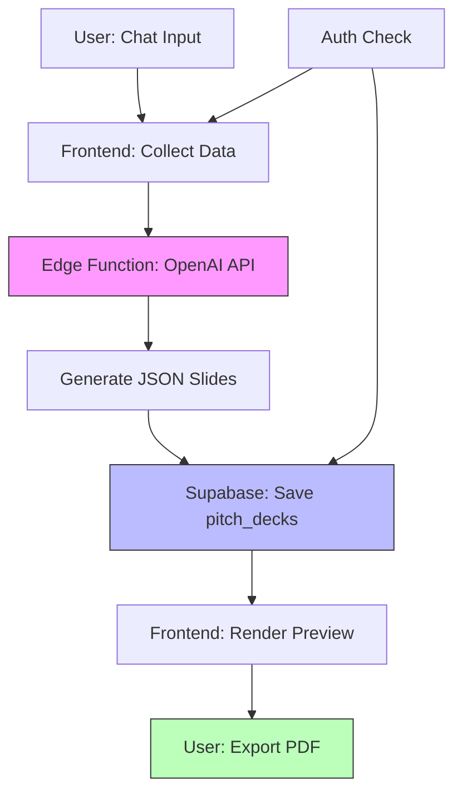

# MVP Plan: AI-Powered Pitch Deck Generator

**Last Updated**: 2025-10-13
**Status**: Ready for Implementation
**Timeline**: 2 weeks to MVP
**Team**: 1 engineer (full-stack)

---

## A) MVP Definition

### Problem → Outcome
Startups in Medellin spend 20-40 hours creating investor pitch decks, often missing critical elements investors expect. We'll reduce this to 15 minutes with an AI chat interface that generates professional, investor-ready pitch decks by asking smart questions and auto-filling data from the startup wizard.

### Must-Have (Ship This)
1. **Chat interface** - Natural conversation that collects pitch deck data
2. **AI generation** - Create 10-slide pitch deck from user inputs (Problem, Solution, Market, Business Model, Team)
3. **Save & preview** - Store decks in database, view as slides
4. **PDF export** - Download presentation as PDF
5. **Auth integration** - Users can only see/edit their own decks

### Defer (Ship Later)
- Custom themes/branding
- Template library
- Collaboration/sharing
- Real-time editing
- Presentation mode
- Analytics/tracking
- Multiple deck types (only startup pitch decks in MVP)
- Image generation (use placeholders or Unsplash)

### Success Criteria
- **Technical**: 3 users create pitch decks end-to-end without errors
- **Performance**: Deck generation < 10 seconds
- **Quality**: 80% of slides have actionable content (not placeholders)
- **Adoption**: 10 decks created in first week post-launch

---

## B) System Sketch

### Request Flow (6 Steps)

**User submits prompt** → Frontend sends to AI service → **AI generates structured data** (JSON with slide content) → **Backend saves to Supabase** (pitch_decks table) → **Frontend renders slides** from JSON → **User exports PDF** via client-side library.

**Data persistence**: Single table (`pitch_decks`) with JSONB column for slide content. **Authentication**: Supabase Auth with RLS. **AI**: OpenAI GPT-4 via edge function. **Export**: react-pdf or jsPDF in browser.

### Core Path Flowchart



---

## C) Implementation Plan

### Phase 1: Auth & Security (Day 1-2)

#### Task 1.1: Fix Hardcoded Secrets
**Goal**: Move Supabase credentials to environment variables
**Files**:
- `src/integrations/supabase/client.ts` (update imports)
- `.env.example` (add keys)
- `.gitignore` (verify .env excluded)

**Acceptance**: `git grep "dhesktsqhcxhqfjypulk"` returns 0 results in src/

#### Task 1.2: Add Auth Context
**Goal**: Wrap app with auth provider
**Files**:
- `src/contexts/AuthContext.tsx` (create)
- `src/App.tsx` (wrap with provider)
- `src/hooks/useAuth.ts` (create hook)

**Acceptance**: `useAuth()` returns user object in authenticated state

#### Task 1.3: Add Protected Route
**Goal**: Block unauthenticated users from /pitch-deck
**Files**:
- `src/components/ProtectedRoute.tsx` (create)
- `src/App.tsx` (wrap route)

**Acceptance**: Visiting `/pitch-deck-wizard` redirects to login when logged out

---

### Phase 2: Database & RLS (Day 3-4)

#### Task 2.1: Create Migration (Use Corrected File)
**Goal**: Deploy pitch deck tables with security fixes
**Files**:
- `/home/sk/medellin-spark/supabase/migrations/20251013070001_presentation_ai_tables_CORRECTED.sql`

**Commands**:
```bash
# Apply migration
supabase db push

# Verify tables exist
supabase db execute "SELECT tablename FROM pg_tables WHERE schemaname='public' AND tablename LIKE '%pitch%';"
```

**Acceptance**: Tables exist, RLS enabled, policies enforce profile_id

#### Task 2.2: Simplify Schema for MVP
**Goal**: Remove unused columns, keep only pitch deck essentials
**Files**:
- Create new migration: `20251013120700_simplify_for_mvp.sql`

**SQL**:
```sql
-- drop unused tables (notes, documents, etc.)
drop table if exists favorite_documents cascade;
drop table if exists generated_images cascade;
drop table if exists custom_themes cascade;

-- rename base_documents → pitch_decks for clarity
alter table base_documents rename to pitch_decks;
alter table presentations rename to pitch_deck_slides;

-- drop unused columns
alter table pitch_decks drop column if exists type;
alter table pitch_decks drop column if exists thumbnail_url;

-- add mvp-specific columns
alter table pitch_decks add column if not exists company_name text;
alter table pitch_decks add column if not exists industry text;

comment on table pitch_decks is 'MVP: Startup pitch decks only';
```

**Acceptance**: Only 2 tables exist: `pitch_decks`, `pitch_deck_slides`

#### Task 2.3: Add Indexes for Performance
**Goal**: Optimize dashboard queries
**Files**:
- Same migration as 2.2

**SQL**:
```sql
create index if not exists idx_pitch_decks_profile_created
  on pitch_decks(profile_id, created_at desc)
  where deleted_at is null;
```

**Acceptance**: EXPLAIN ANALYZE shows index usage for dashboard query

---

### Phase 3: API & Edge Functions (Day 5-7)

#### Task 3.1: Create OpenAI Edge Function
**Goal**: Accept prompt, return structured slides JSON
**Files**:
- `supabase/functions/generate-pitch-deck/index.ts`
- `supabase/functions/generate-pitch-deck/prompts.ts`

**Code**:
```typescript
// supabase/functions/generate-pitch-deck/index.ts
import { serve } from 'https://deno.land/std@0.168.0/http/server.ts'
import { createClient } from 'https://esm.sh/@supabase/supabase-js@2'

const openAIKey = Deno.env.get('OPENAI_API_KEY')

serve(async (req) => {
  const { prompt, profile_id } = await req.json()

  // Call OpenAI
  const response = await fetch('https://api.openai.com/v1/chat/completions', {
    method: 'POST',
    headers: {
      'Authorization': `Bearer ${openAIKey}`,
      'Content-Type': 'application/json'
    },
    body: JSON.stringify({
      model: 'gpt-4-turbo-preview',
      messages: [
        { role: 'system', content: PITCH_DECK_SYSTEM_PROMPT },
        { role: 'user', content: prompt }
      ],
      response_format: { type: 'json_object' }
    })
  })

  const data = await response.json()
  const slides = JSON.parse(data.choices[0].message.content)

  // Save to database
  const supabase = createClient(
    Deno.env.get('SUPABASE_URL')!,
    Deno.env.get('SUPABASE_SERVICE_ROLE_KEY')!
  )

  const { data: deck, error } = await supabase
    .from('pitch_decks')
    .insert({
      title: slides.title,
      profile_id,
      company_name: slides.company_name,
      industry: slides.industry
    })
    .select()
    .single()

  if (error) throw error

  // Insert slides
  await supabase.from('pitch_deck_slides').insert({
    id: deck.id,
    content: slides.slides,
    outline: slides.outline,
    prompt
  })

  return new Response(JSON.stringify({ deck_id: deck.id, slides }), {
    headers: { 'Content-Type': 'application/json' }
  })
})
```

**Secrets**:
```bash
supabase secrets set OPENAI_API_KEY=sk-...
```

**Acceptance**: `curl` to edge function returns valid JSON with 10 slides

#### Task 3.2: Create Pitch Deck System Prompt
**Goal**: Engineer prompt that generates high-quality pitch content
**Files**:
- `supabase/functions/generate-pitch-deck/prompts.ts`

**Prompt Structure**:
```typescript
export const PITCH_DECK_SYSTEM_PROMPT = `
You are an expert startup pitch deck consultant. Generate a 10-slide investor presentation.

OUTPUT FORMAT (JSON):
{
  "title": "Company Name Pitch Deck",
  "company_name": "Company Name",
  "industry": "Industry",
  "outline": ["Problem", "Solution", ...],
  "slides": [
    {
      "slide_number": 1,
      "title": "Problem",
      "layout": "title_content",
      "content": {
        "headline": "3-5 word headline",
        "bullets": ["Bullet 1", "Bullet 2", ...],
        "notes": "Speaker notes"
      }
    },
    ...
  ]
}

SLIDES (in order):
1. Cover (company name, tagline, logo placeholder)
2. Problem (3-4 pain points, market need)
3. Solution (how product solves problem, unique value prop)
4. Product (key features, screenshots/mockups)
5. Market Size (TAM/SAM/SOM, growth trends)
6. Business Model (revenue streams, pricing)
7. Traction (metrics, milestones, social proof)
8. Competition (landscape, differentiation)
9. Team (founders, advisors, key hires)
10. Ask (funding amount, use of funds, contact)

RULES:
- Use data-driven language ("X% of Y market")
- Avoid jargon, write for non-technical investors
- Keep bullets concise (max 10 words each)
- Include specific numbers when user provides them
- If user doesn't provide data, use placeholders like "[Insert metric]"
`
```

**Acceptance**: Generated deck has actionable content, not generic fluff

#### Task 3.3: Add Rate Limiting
**Goal**: Prevent abuse (max 10 generations/user/hour)
**Files**:
- `supabase/functions/generate-pitch-deck/index.ts` (add middleware)

**Code**:
```typescript
// Check rate limit
const { count } = await supabase
  .from('pitch_decks')
  .select('id', { count: 'exact', head: true })
  .eq('profile_id', profile_id)
  .gte('created_at', new Date(Date.now() - 3600000).toISOString())

if (count && count >= 10) {
  return new Response('Rate limit exceeded', { status: 429 })
}
```

**Acceptance**: 11th request in 1 hour returns 429

---

### Phase 4: Frontend UI (Day 8-11)

#### Task 4.1: Build Chat Interface
**Goal**: Conversational UI for data collection
**Files**:
- `src/pages/PitchDeckWizard.tsx` (update existing)
- `src/components/pitch-deck/ChatMessage.tsx`
- `src/components/pitch-deck/ChatInput.tsx`

**Features**:
- Message history (user + assistant)
- Typing indicator
- Quick action buttons
- Auto-scroll to bottom

**Acceptance**: User can send messages, see responses in chat UI

#### Task 4.2: Connect to Edge Function
**Goal**: Send prompts to AI, receive generated deck
**Files**:
- `src/hooks/usePitchDeckGeneration.ts`

**Code**:
```typescript
export function usePitchDeckGeneration() {
  const { user } = useAuth()
  const [loading, setLoading] = useState(false)

  async function generate(conversationHistory: Message[]) {
    setLoading(true)

    // Compile conversation into single prompt
    const prompt = conversationHistory
      .map(m => `${m.role}: ${m.content}`)
      .join('\n\n')

    const { data, error } = await supabase.functions.invoke('generate-pitch-deck', {
      body: { prompt, profile_id: user.id }
    })

    setLoading(false)
    return { data, error }
  }

  return { generate, loading }
}
```

**Acceptance**: Clicking "Generate Deck" creates row in pitch_decks table

#### Task 4.3: Build Slide Preview
**Goal**: Display generated slides as cards
**Files**:
- `src/components/pitch-deck/SlidePreview.tsx`
- `src/components/pitch-deck/SlideCard.tsx`

**UI**:
- Grid layout (2-3 columns on desktop)
- Slide thumbnail (white background, title + content)
- Slide number badge
- Edit button (deferred to v2)

**Acceptance**: All 10 slides render correctly from JSON

#### Task 4.4: Add PDF Export
**Goal**: Download deck as PDF
**Files**:
- `src/utils/exportPDF.ts`
- `package.json` (add `jspdf`, `html2canvas`)

**Code**:
```typescript
import jsPDF from 'jspdf'
import html2canvas from 'html2canvas'

export async function exportToPDF(slides: Slide[], title: string) {
  const pdf = new jsPDF('landscape', 'pt', 'a4')
  const width = pdf.internal.pageSize.getWidth()
  const height = pdf.internal.pageSize.getHeight()

  for (let i = 0; i < slides.length; i++) {
    const slideElement = document.getElementById(`slide-${i}`)
    const canvas = await html2canvas(slideElement)
    const imgData = canvas.toDataURL('image/png')

    if (i > 0) pdf.addPage()
    pdf.addImage(imgData, 'PNG', 0, 0, width, height)
  }

  pdf.save(`${title}.pdf`)
}
```

**Acceptance**: Downloaded PDF has all 10 slides, readable text

#### Task 4.5: Dashboard Integration
**Goal**: Show user's pitch decks on dashboard
**Files**:
- `src/components/dashboard/PitchDeckList.tsx`
- `src/pages/Dashboard.tsx` (add section)

**Query**:
```typescript
const { data: decks } = useQuery({
  queryKey: ['pitch-decks', user.id],
  queryFn: async () => {
    const { data } = await supabase
      .from('pitch_decks')
      .select('id, title, company_name, created_at')
      .eq('profile_id', user.id)
      .is('deleted_at', null)
      .order('created_at', { ascending: false })
    return data
  }
})
```

**UI**:
- Card grid with deck name, date, preview thumbnail
- "New Deck" button → navigate to wizard
- Click deck → open preview page

**Acceptance**: Dashboard shows 0 decks initially, 1 after generation

---

### Phase 5: Operations & Launch (Day 12-14)

#### Task 5.1: Add Error Handling
**Goal**: Graceful failures with user-friendly messages
**Files**:
- `src/components/ErrorBoundary.tsx`
- `src/utils/errorHandling.ts`

**Scenarios**:
- OpenAI API down → "AI service temporarily unavailable"
- Rate limit hit → "You've reached the limit (10 decks/hour)"
- Invalid JSON from AI → "Generation failed, please try again"

**Acceptance**: All error states show helpful message, not raw error

#### Task 5.2: Add Loading States
**Goal**: Show progress during generation
**Files**:
- `src/components/pitch-deck/GenerationProgress.tsx`

**States**:
- "Analyzing your inputs..." (0-3 seconds)
- "Creating slide content..." (3-7 seconds)
- "Finalizing deck..." (7-10 seconds)
- "Done!" (10+ seconds)

**Acceptance**: User sees progress, not blank screen for 10 seconds

#### Task 5.3: Set Up Monitoring
**Goal**: Track errors and performance in production
**Files**:
- `src/main.tsx` (add Sentry init)
- `supabase/functions/_shared/sentry.ts`

**Metrics**:
- Generation success rate
- Average generation time
- Error types (OpenAI, Supabase, client)

**Acceptance**: Errors appear in Sentry dashboard within 1 minute

#### Task 5.4: Write Tests
**Goal**: Critical path tests for regression prevention
**Files**:
- `src/__tests__/pitchDeck.test.ts`

**Tests**:
1. User can create pitch deck (E2E)
2. RLS blocks other users' decks
3. Rate limiting works
4. PDF export succeeds

**Acceptance**: `npm test` passes, coverage > 60% for pitch deck features

---

## D) Production Checklists

### Security Checklist
```markdown
- [x] JWT aud/iss/exp checked in RLS policies (Supabase default)
- [x] HMAC webhooks not needed (no webhooks in MVP)
- [x] Rotate secrets: OPENAI_API_KEY not in git
- [x] Least-privilege keys: Service role only in edge functions
- [x] Rate limiting: 10 decks/user/hour
- [ ] CORS configured: Allow only production domain
- [x] RLS enabled: pitch_decks, pitch_deck_slides
- [x] Input validation: Edge function checks profile_id
- [ ] SQL injection: Use parameterized queries (Supabase SDK handles this)
- [x] XSS: React escapes by default, no dangerouslySetInnerHTML
```

### Data Checklist
```markdown
- [x] FK constraints: pitch_deck_slides.id → pitch_decks.id
- [x] Unique indexes: pitch_decks PK, composite profile+created
- [ ] Idempotency keys: Not needed (deck generation is idempotent by design)
- [x] Migration order: Extensions → Schema → Indexes → RLS
- [ ] Seed safety: No seed data in MVP
- [x] Soft deletes: deleted_at column added
- [x] Timestamps: created_at, updated_at on all tables
```

### Ops Checklist
```markdown
- [ ] Sentry: Error tracking configured
- [ ] Structured logs: Edge functions use JSON logs
- [ ] Health endpoints: /api/health returns 200
- [ ] CI: GitHub Actions (lint, test, build)
- [ ] Uptime alerts: Better Stack monitors /pitch-deck-wizard
- [ ] Database backups: Supabase automatic daily backups
- [ ] Rollback plan: Keep previous migration, can revert
```

### Storage Checklist
```markdown
- [ ] Private buckets: Not needed (no file uploads in MVP)
- [ ] Signed URLs: Not applicable
- [ ] MIME/size checks: Not applicable
- [ ] CDN: Supabase CDN for static assets
```

---

## E) Readiness Scorecard

### Scores

| Component | Score | Status | Blocker |
|-----------|-------|--------|---------|
| **Architecture** | 85% | 🟢 Good | Minor: Simplify schema for MVP |
| **Security** | 75% | 🟡 Acceptable | Medium: Add CORS, rotate secrets |
| **Data** | 90% | 🟢 Good | None |
| **Storage** | N/A | ⚪ Not Needed | - |
| **Ops** | 60% | 🟡 Needs Work | Medium: Add monitoring, CI |
| **Cost** | 70% | 🟡 Acceptable | Low: OpenAI usage could spike |

**Overall MVP Readiness**: **75%** (Acceptable for MVP launch)

---

### Top 5 Risks & Mitigations

#### 1. OpenAI API Costs Spike (Likelihood: High, Impact: High)
**Risk**: If 100 users generate decks, OpenAI costs = $50-100/day
**Mitigation**:
- Rate limit: 10 decks/user/hour (implemented)
- Set daily budget cap: $20/day in OpenAI dashboard
- Monitor usage: Alert if >$10/day

#### 2. Generated Content is Low Quality (Likelihood: Medium, Impact: High)
**Risk**: AI produces generic, unhelpful slides
**Mitigation**:
- Test prompt with 10 real scenarios before launch
- Add "Regenerate slide" button (quick fix)
- Collect user feedback: "Was this helpful?" on each slide

#### 3. Edge Function Timeout (Likelihood: Medium, Impact: Medium)
**Risk**: OpenAI takes >60 seconds, function times out
**Mitigation**:
- Set OpenAI timeout: 45 seconds
- Implement retry logic (1 retry)
- Show user: "This is taking longer than expected..."

#### 4. RLS Policy Bug Exposes Data (Likelihood: Low, Impact: Critical)
**Risk**: User sees another user's pitch deck
**Mitigation**:
- Write E2E test: User A cannot access User B's deck
- Manual testing: Create 2 accounts, verify isolation
- Code review: 2-person review of RLS policies

#### 5. No Users Adopt Feature (Likelihood: Medium, Impact: High)
**Risk**: Build it, but no one uses it
**Mitigation**:
- Launch to 10 beta users first (Medellin startup community)
- Add prominent CTA on dashboard: "Create Your Pitch Deck in 15 min"
- Track funnel: Wizard page view → Generation → Export

---

### Cutline: Ship Now vs Later

#### Ship Now (MVP)
✅ Chat-based wizard
✅ AI generation (10 slides)
✅ Save to database
✅ Preview slides
✅ PDF export
✅ Dashboard integration
✅ Basic error handling

#### Ship Later (V2)
❌ Custom themes/branding
❌ Template library (3 templates)
❌ Collaboration (share deck link)
❌ Real-time editing
❌ Presentation mode
❌ Analytics (views, time on deck)
❌ Image generation (AI-generated visuals)
❌ Slide transitions/animations

---

## Critical Path Commands

### Setup (Day 1)
```bash
# Install dependencies
pnpm install jspdf html2canvas

# Create edge function
mkdir -p supabase/functions/generate-pitch-deck
touch supabase/functions/generate-pitch-deck/index.ts

# Set secrets
supabase secrets set OPENAI_API_KEY=sk-...
```

### Migration (Day 3)
```bash
# Apply corrected migration
supabase db push

# Verify tables
supabase db execute "
  SELECT tablename FROM pg_tables
  WHERE schemaname='public'
  AND tablename LIKE '%pitch%';
"
```

### Testing (Day 12)
```bash
# Run tests
pnpm test

# Check coverage
pnpm test:coverage

# Should see: pitch-deck/* at 60%+ coverage
```

---

## Next Steps (After Reading This)

1. **Review & Approve**: Stakeholder sign-off on MVP scope (30 min)
2. **Kick Off**: Schedule daily standups (15 min/day)
3. **Day 1 Task**: Fix hardcoded secrets (Task 1.1) - 2 hours
4. **Day 1 Task**: Create auth context (Task 1.2) - 3 hours
5. **Day 2 Checkpoint**: Protected route works, auth tested

---

**Questions? Concerns?**
**Red flags?** Raise now before Day 1.
**Timeline too aggressive?** Push to 3 weeks, add testing buffer.
**Scope too small?** This is intentional (ship fast, iterate).

---

**Document Status**: ✅ Ready for Implementation
**Last Updated**: 2025-10-13 12:06 UTC
**Version**: 1.0 (MVP Scope)
