# 001 - Flowchart: Presentation-AI System Overview

## Mermaid Diagram

```mermaid
flowchart LR
    Start([User Opens App]) --> Auth{Authenticated?}
    Auth -->|No| Login[Google OAuth Login]
    Auth -->|Yes| Dashboard
    Login --> Dashboard[Dashboard Page]

    subgraph UserInput["📝 User Input Layer"]
        Dashboard --> Input[Enter Topic/Prompt]
        Input --> Config[Configure Settings]
        Config --> |"• Slides: 5-20<br/>• Language<br/>• Style<br/>• AI Model<br/>• Theme<br/>• Web Search"| Generate[Click Generate]
    end

    subgraph StateLayer["🔄 State Management (Zustand)"]
        Generate --> State[Update Global State]
        State --> CreateDoc[Create BaseDocument]
    end

    subgraph Navigation["🧭 Navigation Layer"]
        CreateDoc --> Redirect["/presentation/generate/[id]"]
    end

    subgraph AIOutline["🤖 AI Outline Generation"]
        Redirect --> SearchCheck{Web Search<br/>Enabled?}
        SearchCheck -->|Yes| OutlineSearch["/api/outline-with-search"]
        SearchCheck -->|No| OutlineSimple["/api/outline"]

        OutlineSearch --> Tavily[Tavily Search API]
        Tavily --> GPT1[OpenAI GPT-4<br/>with Search Context]

        OutlineSimple --> GPT2[OpenAI GPT-4<br/>Knowledge Only]

        GPT1 --> StreamTitle[Stream: Title]
        GPT2 --> StreamTitle
        StreamTitle --> StreamOutline[Stream: Outline Topics]
    end

    subgraph AISlides["✨ AI Slide Generation"]
        StreamOutline --> GenAPI["/api/presentation/generate"]
        GenAPI --> GPT3[OpenAI GPT-4]
        GPT3 --> StreamXML[Stream XML Response]
        StreamXML --> Parse[Parse XML to JSON]
        Parse --> CreateSlides[Create Slide Objects]
    end

    subgraph Database["💾 Database Layer (Prisma + PostgreSQL)"]
        CreateSlides --> SaveDB[(Save to Database)]
        SaveDB --> UpdateTables[Update Tables:<br/>BaseDocument<br/>Presentation]
    end

    subgraph Rendering["🎨 Rendering Layer (Plate Editor)"]
        CreateSlides --> InitEditor[Initialize Plate Editor]
        InitEditor --> MapJSON[Map JSON to Components]
        MapJSON --> RenderLayouts[Render Layouts:<br/>TEXT, BULLETS, CHART,<br/>TABLE, TIMELINE, etc.]

        RenderLayouts --> ImageCheck{Has Image<br/>Queries?}
        ImageCheck -->|Yes| GenImages[Generate Images]
        ImageCheck -->|No| Display

        GenImages --> ImageAPI[Together AI /<br/>Unsplash API]
        ImageAPI --> Display[Display Presentation]
    end

    subgraph UserActions["👤 User Actions"]
        Display --> Action{User Action?}
        Action -->|Edit| PlateEdit[Plate Rich Text Editor]
        Action -->|Reorder| DragDrop[Drag & Drop Slides]
        Action -->|Present| Fullscreen[Fullscreen Mode]
        Action -->|Export| ExportMenu[Export Menu]

        PlateEdit --> AutoSave[Auto-save to DB]
        DragDrop --> AutoSave

        ExportMenu --> PDF[Generate PDF]
        ExportMenu --> PPTX[Generate PPTX]
    end

    AutoSave --> UpdateTables
    PDF --> Download1[📥 Download]
    PPTX --> Download2[📥 Download]

    style Start fill:#e1f5ff
    style Dashboard fill:#fff4e1
    style GPT1 fill:#ffebee
    style GPT2 fill:#ffebee
    style GPT3 fill:#ffebee
    style SaveDB fill:#e8f5e9
    style Display fill:#f3e5f5
    style Download1 fill:#c8e6c9
    style Download2 fill:#c8e6c9
```

## Explanation

**Presentation-AI** transforms any topic into professional slides through a multi-layered architecture. The system starts with user authentication (Google OAuth), then captures user input with configurable settings (slide count, language, style, AI model, theme, and web search toggle). The state management layer (Zustand) orchestrates the flow, creating a database record and navigating to the generation page.

The AI generation happens in two phases: First, outline generation via two paths—either with web search (Tavily + GPT-4) or without (GPT-4 knowledge only)—streaming the title and topics. Second, slide generation where GPT-4 creates streaming XML content that gets parsed to JSON and transformed into slide objects. These slides are saved to PostgreSQL via Prisma.

The rendering layer uses Plate Editor to map JSON to React components, supporting 15+ layout types (TEXT, BULLETS, CHART, TABLE, TIMELINE, etc.). Images are generated asynchronously via Together AI or Unsplash. Users can then edit (rich text), reorder (drag-and-drop), present (fullscreen), or export (PDF/PPTX) with auto-save functionality persisting changes to the database.

## Best Practices & Optimizations

### Current Strengths ✅
- **Streaming responses** - Users see content as it's generated (better UX)
- **Two-path outline generation** - Flexible (with/without web search)
- **Async image loading** - Doesn't block slide rendering
- **Auto-save debouncing** - Prevents excessive database writes
- **Modular architecture** - Clear separation of concerns

### Suggested Optimizations 🚀
1. **Caching Layer** - Add Redis for common topic outlines (reduce API costs)
2. **Batch Image Generation** - Parallel API calls for multiple images
3. **Progressive Loading** - Load 5 slides at a time for large presentations
4. **Service Worker** - Enable offline editing capabilities
5. **CDN Integration** - Serve generated images from CDN (faster loads)
6. **WebSocket Alternative** - Consider WebSocket for real-time collaboration features

## Key Technologies

- **Frontend**: Next.js 15 (App Router), React 19, Zustand, Plate Editor, TailwindCSS
- **Backend**: Next.js API Routes, Vercel AI SDK, Prisma ORM
- **Database**: PostgreSQL
- **AI Services**: OpenAI GPT-4, Tavily Search, Together AI, Unsplash
- **Auth**: NextAuth.js (Google OAuth)
- **Export**: html2canvas, pdf-lib, pptxgenjs

---

**Updated**: 2025-10-13
**Repository**: https://github.com/allweonedev/presentation-ai
**Documentation Series**: Part 1 of 6
