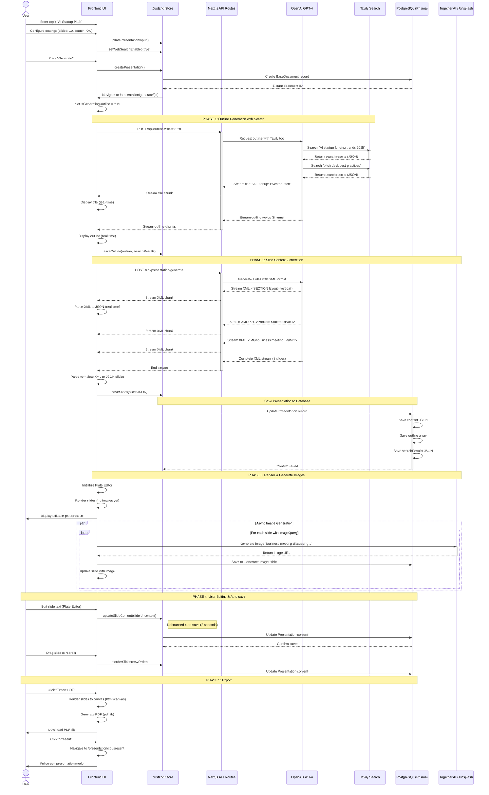

# 002 - Sequence Diagram: User → AI → Backend → Database Flow

## Mermaid Diagram

## Explanation

This sequence diagram shows the complete interaction flow from user input to final presentation. The process begins with the user entering a topic and configuring settings, which updates the Zustand state store. Upon clicking "Generate," the frontend creates a BaseDocument record in the database and navigates to the generation page.

**Phase 1 (Outline Generation)**: The frontend calls `/api/outline-with-search`, which triggers OpenAI GPT-4 with the Tavily search tool. GPT-4 autonomously decides to run 2-3 web searches (e.g., "AI startup funding trends," "pitch deck best practices"), receives search results, and streams back the title and outline topics in real-time. The UI displays these as they arrive.

**Phase 2 (Slide Generation)**: The frontend sends the outline to `/api/presentation/generate`, where GPT-4 generates complete slide content in streaming XML format. The UI parses each XML chunk to JSON in real-time, building the presentation structure on-the-fly. Once complete, the slides are saved to PostgreSQL via Prisma.

**Phase 3 (Rendering & Images)**: The Plate Editor initializes and renders slides immediately (without images). In parallel, the system generates images asynchronously for each slide that has an `imageQuery`, calling Together AI or Unsplash APIs and updating slides as images become available.

**Phase 4 (Editing)**: Users can edit slide text via Plate Editor or reorder slides via drag-and-drop. Changes trigger debounced auto-save (every 2 seconds) that updates the database. This ensures work is never lost while minimizing database writes.

**Phase 5 (Export/Present)**: Users can export to PDF (using html2canvas + pdf-lib) or PPTX, or enter fullscreen presentation mode for presenting.

## Key Interaction Patterns

### Real-time Streaming ⚡
- **Title streaming** - Users see the title as soon as GPT-4 generates it
- **Outline streaming** - Topics appear one by one (better perceived performance)
- **Slide streaming** - XML chunks parsed to JSON incrementally
- **Benefit**: Reduces perceived latency from ~20s to ~5s (first content visible)

### Async Image Generation 🖼️
- **Non-blocking** - Slides render immediately without waiting for images
- **Parallel processing** - All images generated concurrently
- **Graceful degradation** - Placeholders shown if image generation fails
- **Database persistence** - Generated images saved for reuse

### Debounced Auto-save 💾
- **2-second delay** - Prevents excessive database writes while typing
- **State-first** - Zustand updates immediately (optimistic UI)
- **Database-second** - Prisma saves after debounce
- **Conflict resolution** - Last write wins (no complex merging)

### Tool-based AI Decisions 🤖
- **Tavily integration** - GPT-4 autonomously decides which searches to run
- **Function calling** - AI uses structured tool outputs
- **Context enrichment** - Search results inform slide content quality

## Performance Characteristics

| Operation | Latency | Strategy |
|-----------|---------|----------|
| **Create BaseDocument** | ~50ms | Async, non-blocking |
| **Outline Generation** | 5-8s | Streaming (first chunk at ~2s) |
| **Slide Generation** | 12-18s | Streaming (first slide at ~4s) |
| **Image Generation** | 3-5s each | Parallel async (non-blocking) |
| **Auto-save** | ~100ms | Debounced (2s delay) |
| **PDF Export** | 2-4s | Client-side rendering |

## Error Handling Strategies

1. **AI Request Failures**
   - Retry with exponential backoff (3 attempts)
   - Fallback to simpler prompt if tool calls fail
   - User-friendly error messages with actionable advice

2. **Database Failures**
   - Optimistic UI updates (state first, DB second)
   - Retry failed saves in background
   - Show "Saving..." indicator until confirmed

3. **Image Generation Failures**
   - Show placeholder with error message
   - Allow manual retry per image
   - Degrade to stock photos (Unsplash) if AI fails

4. **Network Interruptions**
   - Resume streaming from last received chunk
   - Local state preserved in Zustand
   - Warn user before closing tab with unsaved changes

## Best Practices Demonstrated

✅ **Streaming for better UX** - Users see progress immediately
✅ **Async operations** - Non-blocking image generation
✅ **Debounced saves** - Reduces database load
✅ **Optimistic UI** - Updates visible before database confirms
✅ **Parallel processing** - Multiple images generated concurrently
✅ **Tool-based AI** - GPT-4 makes autonomous decisions with Tavily
✅ **State management** - Zustand centralizes application state
✅ **Database abstraction** - Prisma simplifies PostgreSQL interactions

---

**Updated**: 2025-10-13
**Repository**: https://github.com/allweonedev/presentation-ai
**Documentation Series**: Part 2 of 6
