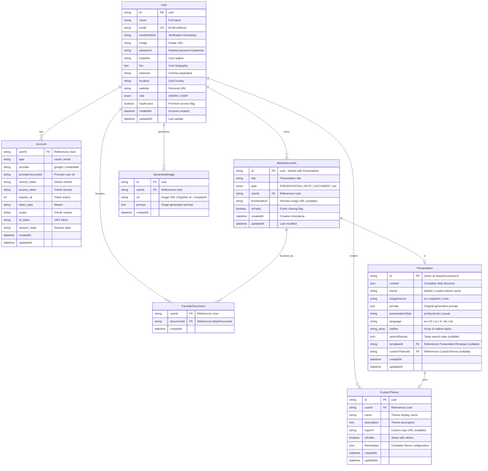

# 004 - Entity Relationship Diagram: Core Data Model

## Mermaid Diagram



## Explanation

The Presentation-AI data model uses a **polymorphic pattern** where `BaseDocument` serves as the parent entity for all document types (presentations, notes, documents, drawings, etc.). The `Presentation` table shares the same `id` as `BaseDocument`, creating a one-to-one relationship that allows for type-specific fields while maintaining a unified document list.

**User authentication** supports both OAuth (Google) and credential-based login via the `Account` table. Users have roles (`ADMIN` or `USER`) and a `hasAccess` flag for premium features. Each user can own multiple presentations, create custom themes, generate images, and favorite documents.

**Presentations** store their complete structure in a `content` JSON field (slides, layouts, text, charts, etc.). The `outline` array stores the topic structure generated during the outline phase. If web search was enabled, `searchResults` stores the Tavily API response as JSON. Presentations can use built-in themes (`theme: "default"`) or reference a `CustomTheme` via `customThemeId`.

**Images** are tracked separately in `GeneratedImage`, storing the URL and prompt used to generate them. This allows for image reuse (same prompt returns cached image) and user history tracking. The `imageSource` field in `Presentation` indicates whether images come from AI generation, Unsplash stock photos, or are absent.

## Database Schema Details

### Primary Tables

#### User Table
**Purpose**: Core user authentication and profile management

**Key Fields**:
- `id` (PK): Unique identifier (cuid format)
- `email` (UK): Unique email constraint for authentication
- `role`: Enum (`ADMIN` | `USER`) for access control
- `hasAccess`: Boolean flag for premium features (AI generation limits, custom themes)
- `password`: Nullable (only for credential-based auth, not OAuth)

**Relationships**:
- One-to-many with `Account` (supports multiple OAuth providers)
- One-to-many with `BaseDocument` (user's presentations)
- One-to-many with `CustomTheme` (user-created themes)
- One-to-many with `GeneratedImage` (image history)
- One-to-many with `FavoriteDocument` (starred items)

#### BaseDocument Table
**Purpose**: Polymorphic parent for all document types (PRESENTATION, NOTE, DOCUMENT, DRAWING, DESIGN, STICKY_NOTES, MIND_MAP, RAG, RESEARCH_PAPER, FLIPBOOK)

**Key Fields**:
- `id` (PK): Shared with type-specific table (e.g., Presentation)
- `type`: Enum determining which child table to join
- `thumbnailUrl`: Preview image for dashboard grid view (nullable)
- `isPublic`: Enables public sharing via URL

**Design Pattern**: **Single Table Inheritance Alternative**
- Instead of storing all document data in one table, uses separate type-specific tables
- `BaseDocument.id` is reused as PK in child tables (e.g., `Presentation.id = BaseDocument.id`)
- Allows type-specific fields without NULL columns or JSON overload

#### Presentation Table
**Purpose**: Stores presentation-specific data (slides, outline, AI metadata)

**Key Fields**:
- `content` (JSON): Complete slide structure including:
  ```json
  {
    "slides": [
      {
        "id": "slide-1",
        "layout": "vertical",
        "content": [/* Plate Editor nodes */],
        "imageQuery": "business meeting discussing challenges"
      }
    ]
  }
  ```
- `outline` (String[]): Array of topic strings from outline generation:
  ```json
  ["# Problem Statement\n- Pain point 1", "# Solution\n- Feature 1"]
  ```
- `searchResults` (JSON): Tavily API response when web search enabled:
  ```json
  {
    "results": [
      {"url": "...", "title": "...", "content": "..."}
    ]
  }
  ```
- `theme`: String ("default" or custom theme name)
- `imageSource`: Enum (`ai` | `unsplash` | `none`)
- `presentationStyle`: Enum (`professional` | `casual`)
- `language`: String (ISO code: "en-US", "es", "fr", etc.)

#### CustomTheme Table
**Purpose**: User-created presentation themes (colors, fonts, layouts)

**Key Fields**:
- `themeData` (JSON): Complete theme configuration:
  ```json
  {
    "colors": {
      "primary": "#3b82f6",
      "secondary": "#8b5cf6",
      "background": "#ffffff",
      "text": "#1f2937"
    },
    "fonts": {
      "heading": "Inter",
      "body": "Inter"
    },
    "layouts": {
      "titleSlide": "vertical",
      "contentSlide": "left"
    }
  }
  ```
- `isPublic`: Boolean (if true, theme appears in community gallery)
- `logoUrl`: Custom logo for branded presentations

#### GeneratedImage Table
**Purpose**: Track AI-generated and fetched images

**Key Fields**:
- `url`: Image URL (Together AI CDN or Unsplash CDN)
- `prompt`: Text used to generate image (for caching/reuse)
- `userId`: Owner (for quota tracking and history)

**Caching Strategy**:
1. Check if `prompt` exists for user → return cached `url`
2. If not, call Together AI or Unsplash API
3. Store new `url` and `prompt` for future reuse

### Junction Tables

#### FavoriteDocument Table
**Purpose**: Many-to-many relationship (User ↔ BaseDocument)

**Composite Key**: (`userId`, `documentId`)

**Use Cases**:
- User favorites/stars a presentation
- Quick access to frequently used presentations
- Dashboard "Favorites" section

#### Account Table
**Purpose**: OAuth provider accounts for NextAuth.js

**Key Fields**:
- `provider`: String ("google", "credentials")
- `providerAccountId`: User ID from OAuth provider
- `access_token`, `refresh_token`: OAuth tokens
- `expires_at`: Token expiration timestamp

**Multi-provider Support**:
- User can link multiple OAuth accounts (Google + GitHub)
- Each provider has separate `Account` record
- All linked to same `User.id`

## JSON Field Schemas

### Presentation.content (JSON)
```typescript
interface PresentationContent {
  slides: Array<{
    id: string;                    // "slide-1", "slide-2", ...
    layout: LayoutType;            // "vertical" | "left" | "right" | "center"
    content: PlateNode[];          // Plate Editor AST
    imageQuery?: string;           // AI image prompt (optional)
    imageUrl?: string;             // Generated image URL (optional)
  }>;
}
```

### Presentation.searchResults (JSON)
```typescript
interface TavilySearchResults {
  results: Array<{
    url: string;                   // Source URL
    title: string;                 // Page title
    content: string;               // Extracted text
    score: number;                 // Relevance score (0-1)
  }>;
  query: string;                   // Original search query
}
```

### CustomTheme.themeData (JSON)
```typescript
interface ThemeData {
  colors: {
    primary: string;               // Hex color
    secondary: string;
    background: string;
    text: string;
    accent?: string;
  };
  fonts: {
    heading: string;               // Font family
    body: string;
  };
  spacing: {
    slide: string;                 // Padding (e.g., "2rem")
    element: string;
  };
  layouts: {
    [key: string]: string;         // Layout defaults
  };
}
```

## Indexing Strategy

### Performance Indexes
```sql
-- User lookups
CREATE INDEX idx_user_email ON User(email);
CREATE INDEX idx_user_role ON User(role);

-- Document queries
CREATE INDEX idx_basedocument_userid ON BaseDocument(userId);
CREATE INDEX idx_basedocument_type ON BaseDocument(type);
CREATE INDEX idx_basedocument_ispublic ON BaseDocument(isPublic);
CREATE INDEX idx_basedocument_createdat ON BaseDocument(createdAt DESC);

-- Presentation queries
CREATE INDEX idx_presentation_theme ON Presentation(theme);
CREATE INDEX idx_presentation_language ON Presentation(language);

-- Favorites
CREATE INDEX idx_favorite_userid ON FavoriteDocument(userId);
CREATE INDEX idx_favorite_documentid ON FavoriteDocument(documentId);

-- Images
CREATE INDEX idx_image_userid ON GeneratedImage(userId);
CREATE INDEX idx_image_prompt ON GeneratedImage(prompt);
```

### Query Optimization Examples

**Dashboard: User's presentations (most recent first)**
```sql
SELECT bd.*, p.*
FROM BaseDocument bd
JOIN Presentation p ON p.id = bd.id
WHERE bd.userId = $1 AND bd.type = 'PRESENTATION'
ORDER BY bd.updatedAt DESC
LIMIT 20;
```
- Uses `idx_basedocument_userid` and `idx_basedocument_type`
- Fast with composite index on (`userId`, `type`, `updatedAt`)

**Check if image prompt already exists (caching)**
```sql
SELECT url FROM GeneratedImage
WHERE userId = $1 AND prompt = $2
LIMIT 1;
```
- Uses `idx_image_userid` and `idx_image_prompt`
- Returns cached image URL if exists

## Data Relationships & Cardinality

### One-to-Many Relationships
- **User → BaseDocument** (1:N)
  - One user owns many presentations
  - Cascade delete: Delete user → delete all documents

- **User → CustomTheme** (1:N)
  - One user creates many themes
  - Cascade delete: Delete user → delete themes (unless public)

- **User → GeneratedImage** (1:N)
  - One user generates many images
  - Soft delete: Keep images for 30 days after user deletion

### One-to-One Relationships
- **BaseDocument ↔ Presentation** (1:1)
  - Shared primary key (`id`)
  - Delete cascade: Delete BaseDocument → delete Presentation

- **Presentation → CustomTheme** (N:1 optional)
  - Many presentations can use one theme
  - Set NULL on delete: Delete theme → set `customThemeId = NULL`

### Many-to-Many Relationships
- **User ↔ BaseDocument** (via FavoriteDocument)
  - Users can favorite many documents
  - Documents can be favorited by many users
  - Delete cascade: Delete either side → remove favorite record

## Data Constraints

### Unique Constraints
- `User.email` - One email per user
- `FavoriteDocument(userId, documentId)` - No duplicate favorites

### Foreign Key Constraints
```sql
BaseDocument.userId → User.id (ON DELETE CASCADE)
Presentation.id → BaseDocument.id (ON DELETE CASCADE)
Presentation.customThemeId → CustomTheme.id (ON DELETE SET NULL)
Account.userId → User.id (ON DELETE CASCADE)
GeneratedImage.userId → User.id (ON DELETE CASCADE)
FavoriteDocument.userId → User.id (ON DELETE CASCADE)
FavoriteDocument.documentId → BaseDocument.id (ON DELETE CASCADE)
```

### Check Constraints
```sql
-- Ensure valid role
CHECK (role IN ('ADMIN', 'USER'))

-- Ensure valid document type
CHECK (type IN ('PRESENTATION', 'NOTE', 'DOCUMENT', ...))

-- Ensure valid presentation style
CHECK (presentationStyle IN ('professional', 'casual'))

-- Ensure valid image source
CHECK (imageSource IN ('ai', 'unsplash', 'none'))
```

## Storage Considerations

### JSON Field Sizes
- **Presentation.content**: 50-500 KB (10-20 slides with complex layouts)
- **Presentation.searchResults**: 10-50 KB (3-5 search results)
- **CustomTheme.themeData**: 1-5 KB (theme configuration)

### Scaling Strategies
1. **Partition by user**: Shard `BaseDocument` by `userId` hash
2. **Archive old presentations**: Move `createdAt > 1 year` to cold storage
3. **Image CDN**: Store images externally (S3/Cloudinary), only URLs in DB
4. **JSON compression**: PostgreSQL JSONB uses binary format (smaller)

## Best Practices Demonstrated

✅ **Polymorphic associations** - BaseDocument parent with type-specific children
✅ **JSON for flexible data** - Slide content, theme config, search results
✅ **Indexing strategy** - Optimized for common queries (user's presentations, favorites)
✅ **Cascade deletes** - Automatic cleanup when user/document deleted
✅ **Nullable foreign keys** - Optional relationships (customThemeId, thumbnailUrl)
✅ **Audit timestamps** - createdAt, updatedAt on all tables
✅ **Enum constraints** - Type safety for role, documentType, style, etc.
✅ **Unique constraints** - Prevent duplicate emails, favorites

---

**Updated**: 2025-10-13
**Repository**: https://github.com/allweonedev/presentation-ai
**Documentation Series**: Part 4 of 6
