# 006 - Class Diagram: Main Components & Modules

## Mermaid Diagram

```mermaid
classDiagram
    %% Frontend Core
    class NextApp {
        +Router appRouter
        +Middleware middleware
        +RootLayout layout
        +render()
    }

    class PresentationPage {
        -presentationId: string
        +DashboardView dashboardView
        +GenerateView generateView
        +EditView editView
        +PresentView presentView
        +render()
    }

    class PresentationInput {
        -topic: string
        -numSlides: number
        -language: string
        -webSearchEnabled: boolean
        +handleGenerate()
        +validateInput()
    }

    %% State Management
    class PresentationStore {
        -presentationInput: string
        -numSlides: number
        -language: string
        -presentationStyle: string
        -webSearchEnabled: boolean
        -isGeneratingOutline: boolean
        -isGeneratingSlides: boolean
        -outline: string[]
        -slides: Slide[]
        +updatePresentationInput(input: string)
        +setNumSlides(num: number)
        +setWebSearchEnabled(enabled: boolean)
        +saveOutline(outline: string[])
        +saveSlides(slides: Slide[])
        +reset()
    }

    %% API Routes
    class OutlineAPI {
        +POST /api/presentation/outline
        -prompt: string
        -numberOfCards: number
        -language: string
        -modelProvider: string
        +generateOutline()
        +streamResponse()
    }

    class OutlineSearchAPI {
        +POST /api/presentation/outline-with-search
        -prompt: string
        -numberOfCards: number
        -language: string
        -modelProvider: string
        +generateOutlineWithSearch()
        +callTavilyTool()
        +streamResponse()
    }

    class GenerateAPI {
        +POST /api/presentation/generate
        -title: string
        -outline: string[]
        -searchResults: object
        -language: string
        -tone: string
        +generateSlides()
        +streamXMLResponse()
    }

    class ImageAPI {
        +POST /api/images/generate
        -prompt: string
        -source: string
        +generateImage()
        +callTogetherAI()
        +callUnsplash()
    }

    %% AI Services
    class OpenAIService {
        -apiKey: string
        -model: string
        +streamText(prompt: string)
        +generateWithTools(tools: Tool[])
        +parseStreamedResponse()
    }

    class TavilyService {
        -apiKey: string
        +search(query: string)
        +formatResults()
    }

    class TogetherAIService {
        -apiKey: string
        +generateImage(prompt: string)
        +getImageURL()
    }

    class UnsplashService {
        -accessKey: string
        +searchPhotos(query: string)
        +getPhotoURL()
    }

    %% Editor System
    class PlateEditor {
        -plugins: Plugin[]
        -value: PlateNode[]
        +initialize()
        +registerPlugins()
        +onChange(value: PlateNode[])
        +serialize()
        +deserialize()
    }

    class LayoutComponents {
        +TextLayout
        +BulletsLayout
        +ChartLayout
        +TableLayout
        +TimelineLayout
        +ComparisonLayout
        +renderLayout(type: string)
    }

    class DragDropManager {
        -sensors: Sensor[]
        +handleDragStart()
        +handleDragEnd()
        +reorderSlides()
    }

    %% Database Layer
    class PrismaClient {
        -datasource: string
        +user: UserModel
        +baseDocument: BaseDocumentModel
        +presentation: PresentationModel
        +customTheme: CustomThemeModel
        +generatedImage: GeneratedImageModel
        +connect()
        +disconnect()
    }

    class UserModel {
        +id: string
        +email: string
        +name: string
        +role: string
        +hasAccess: boolean
        +findUnique()
        +create()
        +update()
    }

    class BaseDocumentModel {
        +id: string
        +title: string
        +type: string
        +userId: string
        +isPublic: boolean
        +create()
        +findMany()
        +update()
        +delete()
    }

    class PresentationModel {
        +id: string
        +content: object
        +theme: string
        +outline: string[]
        +searchResults: object
        +create()
        +findUnique()
        +update()
    }

    %% Utilities
    class XMLParser {
        +parseXML(xmlString: string)
        +xmlToSlideJSON()
        +extractImageQueries()
        +validateXML()
    }

    class ExportService {
        +generatePDF(slides: Slide[])
        +generatePPTX(slides: Slide[])
        +renderToCanvas()
        +downloadFile()
    }

    class AuthService {
        -nextAuthConfig: NextAuthConfig
        +auth()
        +signIn()
        +signOut()
        +getSession()
    }

    %% Relationships
    NextApp --> PresentationPage
    PresentationPage --> PresentationInput
    PresentationPage --> PresentationStore
    PresentationPage --> PlateEditor

    PresentationInput --> OutlineAPI
    PresentationInput --> OutlineSearchAPI

    OutlineAPI --> OpenAIService
    OutlineSearchAPI --> OpenAIService
    OutlineSearchAPI --> TavilyService

    GenerateAPI --> OpenAIService
    ImageAPI --> TogetherAIService
    ImageAPI --> UnsplashService

    PresentationStore --> PresentationPage
    PlateEditor --> LayoutComponents
    PlateEditor --> DragDropManager

    OutlineAPI --> PrismaClient
    GenerateAPI --> PrismaClient
    ImageAPI --> PrismaClient

    PrismaClient --> UserModel
    PrismaClient --> BaseDocumentModel
    PrismaClient --> PresentationModel

    GenerateAPI --> XMLParser
    PresentationPage --> ExportService
    NextApp --> AuthService

    %% Notes
    note for PresentationStore "Zustand global state\nOptimistic updates\nDebounced auto-save"
    note for OpenAIService "Vercel AI SDK\nStreaming responses\nTool calling (Tavily)"
    note for PlateEditor "Slate.js-based\n40+ plugins\nRich text editing"
    note for XMLParser "Parses GPT-4 XML\nConverts to JSON\nExtracts image queries"
```



## Explanation

This class diagram maps the main components and modules of Presentation-AI across frontend, backend, and database layers. The architecture follows a **clean separation of concerns** with distinct layers for UI (React components), state management (Zustand), API routes (Next.js), AI services (OpenAI, Tavily, Together AI), database (Prisma + PostgreSQL), and utilities (XML parsing, export).

**Frontend Core**: The `NextApp` orchestrates routing and middleware. `PresentationPage` renders different views (dashboard, generate, edit, present) based on the route. `PresentationInput` captures user settings and triggers generation. The `PresentationStore` (Zustand) manages global state, enabling optimistic UI updates and debounced auto-save.

**API Layer**: Three main API routes handle AI generation: `OutlineAPI` (simple outline), `OutlineSearchAPI` (outline with Tavily web search), and `GenerateAPI` (full slide generation). `ImageAPI` handles asynchronous image generation via Together AI or Unsplash. All APIs use the `OpenAIService` for streaming responses.

**AI Services**: `OpenAIService` wraps the Vercel AI SDK, providing `streamText()` for streaming responses and `generateWithTools()` for tool-based AI (Tavily search). `TavilyService` performs web searches, `TogetherAIService` generates AI images (FLUX.1-schnell), and `UnsplashService` fetches stock photos.

**Editor System**: `PlateEditor` (Slate.js) manages rich text editing with 40+ plugins. `LayoutComponents` renders 15+ slide layouts (TEXT, BULLETS, CHART, etc.). `DragDropManager` (@dnd-kit) handles slide reordering with drag-and-drop.

**Database Layer**: `PrismaClient` provides type-safe database access. Models (`UserModel`, `BaseDocumentModel`, `PresentationModel`) map to PostgreSQL tables. The polymorphic design uses `BaseDocument` as a parent entity for all document types.

**Utilities**: `XMLParser` converts GPT-4's XML response to JSON slide objects and extracts image queries. `ExportService` generates PDFs (html2canvas + pdf-lib) and PPTX files (pptxgenjs). `AuthService` wraps NextAuth.js for Google OAuth.

## Component Responsibilities

### Frontend Components

#### NextApp (Root Application)
**Purpose**: Application entry point and routing orchestration

**Key Methods**:
- `render()` - Initializes app with root layout, providers, and router
- Manages global middleware (authentication checks)
- Configures meta tags, fonts, analytics

**Dependencies**:
- Next.js App Router
- TailwindCSS provider
- React Query provider
- Auth session provider

#### PresentationPage (Main Page Component)
**Purpose**: Presentation-specific page container

**Views**:
- `DashboardView` - List of user's presentations (grid/list view)
- `GenerateView` - AI generation interface with progress
- `EditView` - Plate editor with slide customization
- `PresentView` - Fullscreen presentation mode

**Routing**:
- `/presentation` → DashboardView
- `/presentation/generate/[id]` → GenerateView
- `/presentation/[id]` → EditView
- `/presentation/[id]/present` → PresentView

#### PresentationInput (User Input Form)
**Purpose**: Capture generation settings and trigger AI

**State**:
- `topic` - User's presentation topic
- `numSlides` - Slide count (5-20)
- `language` - ISO language code
- `webSearchEnabled` - Tavily search toggle

**Methods**:
- `handleGenerate()` - Validates input, creates BaseDocument, navigates to generate view
- `validateInput()` - Ensures topic not empty, slides in range

**Validation Rules**:
- Topic: 10-500 characters
- Slides: 5-20 (enforced by slider)
- Language: Must be in supported list (12 languages)

### State Management

#### PresentationStore (Zustand Store)
**Purpose**: Global state for presentation generation and editing

**State Shape**:
```typescript
{
  // Input settings
  presentationInput: string;
  numSlides: number;
  language: string;
  presentationStyle: "professional" | "casual";
  webSearchEnabled: boolean;
  modelProvider: "openai" | "ollama" | "lmstudio";
  theme: string;

  // Generation state
  isGeneratingOutline: boolean;
  isGeneratingSlides: boolean;
  shouldStartOutlineGeneration: boolean;
  shouldStartSlideGeneration: boolean;

  // Generated content
  outline: string[];
  searchResults: object | null;
  slides: Slide[];

  // Auto-save
  lastSaved: Date | null;
  isSaving: boolean;
}
```

**Key Methods**:
- `updatePresentationInput(input: string)` - Updates topic, triggers validation
- `setNumSlides(num: number)` - Updates slide count (5-20 constraint)
- `setWebSearchEnabled(enabled: boolean)` - Toggles Tavily search
- `saveOutline(outline: string[], searchResults?: object)` - Stores outline phase result
- `saveSlides(slides: Slide[])` - Stores generated slides, triggers auto-save
- `reset()` - Clears all state (used when starting new presentation)

**Auto-save Logic**:
```typescript
// Debounced auto-save (2 seconds)
const debouncedSave = debounce(async (slides: Slide[]) => {
  set({ isSaving: true });
  await updatePresentation(slides);
  set({ isSaving: false, lastSaved: new Date() });
}, 2000);
```

### API Routes (Backend)

#### OutlineAPI (Simple Outline Generation)
**Endpoint**: `POST /api/presentation/outline`

**Request**:
```typescript
{
  prompt: string;           // User's topic
  numberOfCards: number;    // Slide count
  language: string;         // ISO code
  modelProvider: string;    // "openai" | "ollama" | "lmstudio"
}
```

**Process**:
1. Construct system prompt with outline requirements
2. Call `OpenAIService.streamText()` with prompt
3. Stream response in chunks (title, then topics)
4. Return streaming response to client

**Response Format**:
```xml
<TITLE>Presentation Title</TITLE>

# Topic 1
- Bullet point 1
- Bullet point 2

# Topic 2
- Bullet point 1
- Bullet point 2
```

#### OutlineSearchAPI (Outline with Web Search)
**Endpoint**: `POST /api/presentation/outline-with-search`

**Request**: Same as OutlineAPI

**Process**:
1. Construct system prompt with Tavily search tool
2. Call `OpenAIService.generateWithTools([tavilyTool])`
3. AI autonomously decides which searches to run (2-5 queries)
4. `TavilyService.search()` executes each query
5. AI uses search results to enrich outline
6. Stream response (title, topics, search metadata)

**Search Tool Definition**:
```typescript
const tavilyTool = {
  name: "tavily_search",
  description: "Search the web for current information",
  parameters: {
    query: { type: "string", description: "Search query" }
  }
};
```

**AI Decision Example**:
```
AI decides to search:
1. "AI startup funding trends 2025"
2. "pitch deck best practices"
3. "investor presentation structure"

Uses results to create outline with latest data
```

#### GenerateAPI (Slide Content Generation)
**Endpoint**: `POST /api/presentation/generate`

**Request**:
```typescript
{
  title: string;
  prompt: string;           // Original topic
  outline: string[];        // From outline phase
  language: string;
  tone: string;             // "professional" | "casual"
  searchResults?: object;   // If web search was used
  modelProvider: string;
}
```

**Process**:
1. Construct massive system prompt with:
   - Title and outline
   - Search results (if available)
   - 15+ layout options (TEXT, BULLETS, CHART, etc.)
   - XML format specification
   - Image query requirements
2. Call `OpenAIService.streamText()` with prompt
3. Stream XML chunks to client
4. Client parses XML to JSON in real-time
5. Save final slides to database via `PrismaClient`

**XML Format** (GPT-4 generates this):
```xml
<PRESENTATION>
  <SECTION layout="vertical">
    <H1>Slide Title</H1>
    <TEXT>Slide content...</TEXT>
    image generation prompt here</IMG>
  </SECTION>

  <SECTION layout="left">
    <H2>Slide Title</H2>
    <BULLETS>
      <LI>Bullet 1</LI>
      <LI>Bullet 2</LI>
    </BULLETS>
    another image prompt</IMG>
  </SECTION>
</PRESENTATION>
```

#### ImageAPI (Image Generation)
**Endpoint**: `POST /api/images/generate`

**Request**:
```typescript
{
  prompt: string;           // Image description
  source: "ai" | "unsplash";
}
```

**Process (AI)**:
1. Call `TogetherAIService.generateImage(prompt)`
2. Together AI returns image URL (FLUX.1-schnell model)
3. Save to `GeneratedImage` table
4. Return URL to client

**Process (Unsplash)**:
1. Call `UnsplashService.searchPhotos(prompt)`
2. Return first matching photo URL
3. Save to `GeneratedImage` table
4. Return URL to client

**Caching Strategy**:
```typescript
// Check if image with same prompt exists
const cached = await prisma.generatedImage.findFirst({
  where: { userId, prompt }
});
if (cached) return cached.url;

// Otherwise generate new
const url = await generateImage(prompt);
await prisma.generatedImage.create({ userId, prompt, url });
return url;
```

### AI Services

#### OpenAIService (AI Orchestration)
**Purpose**: Wrapper for Vercel AI SDK

**Configuration**:
```typescript
const openai = createOpenAI({
  apiKey: process.env.OPENAI_API_KEY,
  baseURL: process.env.OPENAI_BASE_URL
});
```

**Methods**:
- `streamText(prompt: string)` - Stream GPT-4 response
  ```typescript
  const { textStream } = await streamText({
    model: openai("gpt-4-turbo"),
    prompt: prompt,
    temperature: 0.7
  });
  return textStream;
  ```

- `generateWithTools(tools: Tool[])` - Tool-based generation (Tavily)
  ```typescript
  const { textStream, toolCalls } = await streamText({
    model: openai("gpt-4-turbo"),
    prompt: prompt,
    tools: { tavily_search: tavilyTool },
    maxToolCalls: 5
  });
  return { textStream, toolCalls };
  ```

- `parseStreamedResponse()` - Extract structured data from stream

**Error Handling**:
- Retry 3 times with exponential backoff
- Fallback to simpler model (gpt-3.5-turbo) if gpt-4 fails
- Log all errors for debugging

#### TavilyService (Web Search)
**Purpose**: Execute web searches for AI context enrichment

**Methods**:
- `search(query: string)` - Perform search
  ```typescript
  const response = await fetch("https://api.tavily.com/search", {
    method: "POST",
    headers: { "X-API-Key": process.env.TAVILY_API_KEY },
    body: JSON.stringify({ query, max_results: 5 })
  });
  return response.json();
  ```

- `formatResults()` - Convert Tavily response to AI-friendly format
  ```typescript
  const formatted = results.map(r => ({
    url: r.url,
    title: r.title,
    content: r.content.substring(0, 500) // Truncate
  }));
  return formatted;
  ```

**Rate Limits**:
- 100 searches/month (free tier)
- 5 results per search (max)
- Cached for 24 hours (same query returns cached)

### Editor System

#### PlateEditor (Rich Text Editor)
**Purpose**: Slate.js-based editor with 40+ plugins

**Initialization**:
```typescript
const editor = createPlateEditor({
  plugins: [
    createParagraphPlugin(),
    createHeadingPlugin(),
    createBoldPlugin(),
    createItalicPlugin(),
    createUnderlinePlugin(),
    createBulletedListPlugin(),
    createNumberedListPlugin(),
    // ... 35+ more plugins
  ],
  value: initialValue, // JSON from database
});
```

**Key Methods**:
- `initialize()` - Loads plugins, sets up event handlers
- `registerPlugins()` - Dynamically adds layout-specific plugins
- `onChange(value: PlateNode[])` - Triggers on any edit, debounces save
- `serialize()` - Converts Plate nodes to JSON for database
- `deserialize()` - Converts database JSON to Plate nodes

**Plugin Examples**:
- `createImagePlugin()` - Image upload and resize
- `createTablePlugin()` - Table creation and editing
- `createChartPlugin()` - Chart data editing
- `createDragPlugin()` - Drag-and-drop within slide

#### LayoutComponents (Slide Layouts)
**Purpose**: Render 15+ slide layout types

**Layout Types**:
1. **TEXT** - Paragraphs with headings
2. **BULLETS** - Icon-based lists
3. **TIMELINE** - Chronological events
4. **STEP-BY-STEP** - Process flows
5. **COMPARISON** - Side-by-side
6. **BEFORE-AFTER** - Transformation
7. **PROS-CONS** - Advantages/disadvantages
8. **TABLE** - Data tables
9. **CHART** - Bar, Pie, Line, Scatter, Radar, Area
10. **ICON-LIST** - Icon-based lists
11. **STAIRCASE** - Progressive steps
12. **PYRAMID** - Hierarchical
13. **CYCLE** - Circular processes
14. **BOX** - Boxed content
15. **CALLOUT** - Highlighted quotes

**Rendering Logic**:
```typescript
renderLayout(type: string, content: any) {
  switch(type) {
    case "TEXT": return <TextLayout content={content} />;
    case "BULLETS": return <BulletsLayout content={content} />;
    case "CHART": return <ChartLayout data={content.data} />;
    // ... 12 more cases
  }
}
```

#### DragDropManager (Slide Reordering)
**Purpose**: Drag-and-drop slide reordering with @dnd-kit

**Sensors**:
```typescript
const sensors = useSensors(
  useSensor(PointerSensor),
  useSensor(KeyboardSensor),
  useSensor(TouchSensor) // Mobile support
);
```

**Methods**:
- `handleDragStart()` - Captures dragged slide ID
- `handleDragEnd()` - Calculates new position, calls `reorderSlides()`
- `reorderSlides(fromIndex: number, toIndex: number)` - Updates Zustand state, triggers auto-save

**Animation**:
- Uses @dnd-kit's `SortableContext` for smooth transitions
- 200ms animation duration
- Visual feedback (shadow, opacity change)

### Database Layer (Prisma)

#### PrismaClient (ORM)
**Purpose**: Type-safe database access

**Models**:
- `UserModel` - User authentication and profile
- `BaseDocumentModel` - Polymorphic parent for all documents
- `PresentationModel` - Presentation-specific data
- `CustomThemeModel` - User-created themes
- `GeneratedImageModel` - Image generation history

**Connection Pooling**:
```typescript
const prisma = new PrismaClient({
  datasources: {
    db: { url: process.env.DATABASE_URL }
  },
  log: ["query", "error", "warn"]
});
```

**Transaction Example**:
```typescript
await prisma.$transaction([
  prisma.baseDocument.create({ data: baseDocData }),
  prisma.presentation.create({ data: presentationData })
]);
```

### Utilities

#### XMLParser (XML to JSON Converter)
**Purpose**: Parse GPT-4's XML response to JSON slides

**Methods**:
- `parseXML(xmlString: string)` - Uses `fast-xml-parser` to convert XML to JSON
- `xmlToSlideJSON()` - Transforms parsed XML to Slide[] array
- `extractImageQueries()` - Finds all `` tags and returns prompts
- `validateXML()` - Ensures XML is well-formed

**Transformation Example**:
```typescript
// XML input
<SECTION layout="left">
  <H2>Title</H2>
  <BULLETS>
    <LI>Item 1</LI>
  </BULLETS>
  prompt here</IMG>
</SECTION>

// JSON output
{
  id: "slide-1",
  layout: "left",
  content: [
    { type: "H2", text: "Title" },
    { type: "BULLETS", children: [
      { type: "LI", text: "Item 1" }
    ]}
  ],
  imageQuery: "prompt here"
}
```

#### ExportService (PDF/PPTX Generation)
**Purpose**: Export presentations to downloadable files

**Methods**:
- `generatePDF(slides: Slide[])` - Uses html2canvas + pdf-lib
  ```typescript
  for (const slide of slides) {
    const canvas = await html2canvas(slideElement);
    const imgData = canvas.toDataURL("image/png");
    pdfDoc.addPage().drawImage(imgData);
  }
  return pdfDoc.save();
  ```

- `generatePPTX(slides: Slide[])` - Uses pptxgenjs
  ```typescript
  const pptx = new PptxGenJS();
  for (const slide of slides) {
    const pptxSlide = pptx.addSlide();
    pptxSlide.addText(slide.title, { x: 1, y: 1 });
    // Limited layout support
  }
  return pptx.write();
  ```

- `renderToCanvas()` - Renders slide HTML to canvas
- `downloadFile(blob: Blob, filename: string)` - Triggers browser download

**PDF Quality Settings**:
- 300 DPI for print quality
- Image compression (80% JPEG)
- Embedded fonts (Inter)
- File size optimization (< 5MB for 10 slides)

## Class Relationships

### Inheritance
- None (composition over inheritance pattern)

### Composition
- `NextApp` has-a `PresentationPage`
- `PresentationPage` has-a `PresentationInput`, `PresentationStore`, `PlateEditor`
- `PlateEditor` has-a `LayoutComponents`, `DragDropManager`
- `PrismaClient` has-a `UserModel`, `BaseDocumentModel`, `PresentationModel`

### Dependency
- `PresentationInput` depends-on `OutlineAPI`, `OutlineSearchAPI`
- `OutlineAPI` depends-on `OpenAIService`
- `OutlineSearchAPI` depends-on `OpenAIService`, `TavilyService`
- `GenerateAPI` depends-on `OpenAIService`, `XMLParser`, `PrismaClient`
- `ImageAPI` depends-on `TogetherAIService`, `UnsplashService`

### Association
- `PresentationStore` associated-with `PresentationPage` (global state)
- `AuthService` associated-with `NextApp` (session management)
- `ExportService` associated-with `PresentationPage` (export actions)

## Design Patterns Used

### 1. **Facade Pattern**
- `OpenAIService` wraps Vercel AI SDK complexity
- `PrismaClient` wraps raw SQL queries
- `ExportService` abstracts PDF/PPTX generation

### 2. **Strategy Pattern**
- `OutlineAPI` vs `OutlineSearchAPI` (outline generation strategies)
- `TogetherAIService` vs `UnsplashService` (image generation strategies)

### 3. **Observer Pattern**
- Zustand store notifies components on state changes
- PlateEditor notifies on content changes (triggers auto-save)

### 4. **Factory Pattern**
- `LayoutComponents.renderLayout()` creates layout components dynamically
- `PlateEditor.registerPlugins()` creates plugins based on configuration

### 5. **Singleton Pattern**
- `PrismaClient` (single database connection pool)
- `PresentationStore` (single global state instance)

### 6. **Repository Pattern**
- `UserModel`, `BaseDocumentModel`, `PresentationModel` abstract database operations

## Best Practices Demonstrated

✅ **Separation of concerns** - UI, state, API, DB in separate layers
✅ **Type safety** - TypeScript + Prisma for compile-time checks
✅ **Dependency injection** - Services passed as props/params
✅ **Composition over inheritance** - No deep class hierarchies
✅ **Single responsibility** - Each class has one clear purpose
✅ **Interface segregation** - APIs have minimal, focused methods
✅ **DRY principle** - Shared utilities (XMLParser, ExportService)
✅ **Error boundaries** - Try/catch in all async operations
✅ **Streaming architecture** - Non-blocking AI responses
✅ **Optimistic UI** - State updates before database confirms

---

**Updated**: 2025-10-13
**Repository**: https://github.com/allweonedev/presentation-ai
**Documentation Series**: Part 6 of 6
