# 🎯 LOVABLE UI/UX MASTER PLAN - UPDATED
**Medellin Spark - Complete Page Design Strategy**

**Date:** October 15, 2025 (Updated after screenshot analysis)  
**Project:** Medellin AI Hub + Presentation AI  
**Goal:** Design remaining pages using competitor best practices

---

## 📋 WHAT'S ALREADY BUILT ✅

### Pages Complete in Lovable
1. **✅ Landing Page** (`/pitch-deck`) - AI generation wizard with examples, settings
2. **✅ Dashboard** (`/dashboard/pitch-decks`) - Deck cards, creation options, templates
3. **✅ Startup Profile Wizard** (`/startup-profile`) - Multi-step form, progress indicator, upload areas
4. **✅ User Profile** (`/profile`) - Hero section, stats, social links, profile strength
5. **✅ Main Dashboard** (`/dashboard`) - Stats, quick actions, events, jobs recommendations
6. **✅ Chat Interface** - Clean messaging UI (ready)

### Quality Check
- Design quality matches Decktopus/Gamma competitors ✅
- Responsive layouts work on mobile ✅
- Professional styling and components ✅
- Missing: Editor, Viewer, Outline editing

---

## 🎯 COMPETITOR ANALYSIS (Decktopus)

### What They Do Best
1. **Outline Editing** - Clean list view with slide numbers, drag handles, per-slide actions
2. **Layout Picker** - Modal with 12+ layouts (stats cards, team grid, timeline, funnel)
3. **Theme System** - 10+ themes with 3-dot color indicators (Vivid Pop, Ocean Breeze, etc.)
4. **Per-Slide Actions** - Regenerate, Make Concise, Expand buttons on each slide
5. **Context Sidebar** - Shows original prompt and refinement options
6. **Expandable Slides** - Click to expand/collapse slide content inline

### Features to Copy
- **Drag handles** (⠿) for reordering slides
- **Action buttons** per slide (🔄 Regenerate, ➖ Make Concise, ➕ Expand)
- **Layout picker modal** - Grid of 12+ professional layouts
- **Theme previews** - Visual thumbnails with color dots
- **Collapsible slides** - Expand to see full content

---

## 📊 UPDATED STATUS TABLE

| Page | Route | Status | Priority | What's Built | What's Missing |
|------|-------|--------|----------|--------------|----------------|
| **✅ Landing** | `/pitch-deck` | Done | 🟢 | AI wizard, examples, settings | Nothing |
| **✅ Dashboard** | `/dashboard/pitch-decks` | Done | 🟢 | Deck cards, filters, templates | Nothing |
| **✅ Main Dash** | `/dashboard` | Done | 🟢 | Stats, actions, events, jobs | Nothing |
| **✅ User Profile** | `/profile` | Done | 🟢 | Hero, stats, social links | Edit mode |
| **✅ Startup Wizard** | `/startup-profile` | Done | 🟢 | Multi-step form, uploads | Nothing |
| **✅ Chat** | `/chat` | Done | 🟢 | Message UI, composer | Backend |
| **❌ Editor** | `/presentations/:id/edit` | **NEED** | 🔴 | Nothing | Everything |
| **❌ Outline** | `/presentations/:id/outline` | **NEED** | 🔴 | Nothing | Decktopus-style editing |
| **❌ Viewer** | `/presentations/:id/view` | **NEED** | 🔴 | Nothing | Full-screen slides |
| **❌ Settings** | `/settings` | **NEED** | 🟡 | Nothing | Tabs, forms, API keys |
| **❌ Events** | `/events` | **NEED** | 🟡 | Nothing | Cards, filters, RSVP |
| **❌ Jobs** | `/jobs` | **NEED** | 🟡 | Nothing | Job listings, search |
| **❌ Perks** | `/perks` | **NEED** | 🟡 | Nothing | Perk cards, claim flow |

---

## 🚀 WHAT TO BUILD NEXT

### Phase 1: Critical Pages (Week 1) 🔴

#### 1. Presentation Outline Editor (`/presentations/:id/outline`)
**Why:** Core editing experience, highest user value  
**Copy from:** Decktopus outline view

**Features:**
- Left sidebar with prompt context and refinement options
- Center: List of slides (numbered, with drag handles)
- Per-slide actions: Regenerate, Make Concise, Expand, Delete
- Click slide to expand/collapse content
- "Choose a Layout" button opens modal with 12+ layouts
- "Change Design" button opens theme picker
- "Generate Presentation" button (purple, prominent)

**Layout (Decktopus-inspired):**
```
┌──────────────────────────────────────────────────────┐
│ [Logo]  Presentation Outline  11 Slides  [Help]     │
│                                          [Generate ▶]│
├────────────────┬─────────────────────────────────────┤
│ Refine your    │ ⊞ Title            [••• Colors]     │
│ presentation ▼ │                                      │
│                │ ⠿ Slide 1  EventOS Startup Pitch    │
│ [Prompt Box]   │    [🔄][➖][📋][🗑️][▼]             │
│                │                                      │
│ Event planning │ ⠿ Slide 2  The Problem with Events  │
│ is broken...   │    Event planning is complex... ▼   │
│                │    [Full content shown when expanded]│
│ EventOS fixes  │    [🔄 Regenerate][➖ Concise][▼]   │
│ this. It's an  │                                      │
│ AI-powered...  │ ⠿ Slide 3  Introducing EventOS      │
│                │    [🔄][➖][📋][🗑️][▼]             │
│ [Regenerate]   │                                      │
│ [Make Concise] │ ⠿ Slide 4  How EventOS Works        │
│                │    [Actions...]                      │
│                │                                      │
│                │ [+ Add Slide]                        │
└────────────────┴─────────────────────────────────────┘
```

**Key Components:**
- Drag handle (⠿) - 6 dots in 2x3 grid
- Action buttons: 🔄 Regenerate, ➖ Make Concise, ➕ Expand, 📋 Duplicate, 🗑️ Delete
- Collapsible slide content (click title to expand)
- Modal: "Choose a Layout" with grid of 12 layouts
- Modal: "Choose a Theme" with 10+ theme previews

---

#### 2. Layout Picker Modal
**Why:** Essential for slide customization  
**Copy from:** Decktopus layout modal

**Features:**
- Modal overlay (80% width, centered)
- Header: "Choose a Layout" + subtitle "Choose a layout to organize your slide content efficiently"
- Left preview: Large preview of selected layout with sample content
- Right grid: 12+ layout cards (2 columns)
- Each card: thumbnail + name below
- Layouts: Four Number Cards, Thank You, Mission Split, References, Two Step Icons, Four Team Grid, Timeline Split, Semi-Circle Graph, Venn Diagram, Funnel Diagram
- Buttons: "Regenerate" (outline icon), "Make Concise" (compress icon), "Apply Layout" (purple, prominent)

**Layout:**
```
┌────────────────────────────────────────────────────────────────┐
│  Choose a Layout                                          [×]   │
│  Choose a layout to organize your slide content efficiently    │
├──────────────────────────┬─────────────────────────────────────┤
│                          │  Title         Title                │
│  [Large Preview]         │  ●●●           ●●●                  │
│  Company Overview        │  Four Number   Green Meadow         │
│  2019  2,350  50  10.5k  │  Cards                              │
│                          │  Title         Title                │
│                          │  ●●●           ●●●                  │
│  [🔄 Regenerate]          │  Tangerine     Ocean Breeze         │
│  [➖ Make Concise]        │                                     │
│                          │  Title         Title                │
│  [Apply Layout]          │  ●●●           ●●●                  │
│                          │  Mission Split Four Team Grid       │
└──────────────────────────┴─────────────────────────────────────┘
```

---

#### 3. Theme Picker Modal
**Why:** Visual customization is key to pitch deck branding  
**Copy from:** Decktopus theme modal

**Features:**
- Modal overlay
- Header: "Choose a Theme" + subtitle
- Tabs: "Default" vs "Brand" (custom themes)
- Grid of theme cards (3-4 columns)
- Each card: Dark rectangle with "Title" text + 3 colored dots
- Theme names: Sunset Glow, Green Meadow, Tangerine, Ocean Breeze, Candy Burst, Vivid Pop, Royal Purple, Midnight Blue, Indigo Wave, Void, Ember Night
- Selected theme has border highlight
- Button: "Apply Theme" (purple, prominent)

**Layout:**
```
┌────────────────────────────────────────────────────────┐
│  Choose a Theme                                   [×]  │
│  That fits your presentation concept                   │
├────────────────────────────────────────────────────────┤
│  ○ Default          ○ Brand                            │
├────────────────────────────────────────────────────────┤
│  ┌──────┐  ┌──────┐  ┌──────┐  ┌──────┐               │
│  │Title │  │Title │  │Title │  │Title │               │
│  │ ●●●  │  │ ●●●  │  │ ●●●  │  │ ●●●  │               │
│  └──────┘  └──────┘  └──────┘  └──────┘               │
│  Sunset    Green     Tangerine Ocean                   │
│  Glow      Meadow              Breeze                  │
│                                                         │
│  ┌──────┐  ┌──────┐  ┌──────┐  ┌──────┐               │
│  │Title │  │Title │  │Title │  │Title │               │
│  │ ●●●  │  │ ●●●  │  │ ●●●  │  │ ●●●  │               │
│  └──────┘  └──────┘  └──────┘  └──────┘               │
│  Candy     Vivid Pop Royal     Midnight                │
│  Burst              Purple     Blue                     │
│                                                         │
│                                  [Apply Theme]         │
└────────────────────────────────────────────────────────┘
```

---

#### 4. Presentation Viewer (`/presentations/:id/view`)
**Why:** Users need to preview before presenting  
**Simple, focused interface**

**Features:**
- Full-screen single slide view
- Bottom bar (auto-hide after 3s): prev/next arrows, slide counter "3 / 15", exit button
- Keyboard: arrows navigate, escape exits
- Touch: swipe left/right
- Clean, minimal design (no toolbars, just content)

**Layout:**
```
┌──────────────────────────────────────────────────────┐
│                                                      │
│                                                      │
│                                                      │
│              [SLIDE CONTENT FULL-SCREEN]            │
│                     EventOS                          │
│                AI-Powered Event Management           │
│                                                      │
│                    [Hero Image]                      │
│                                                      │
│                                                      │
│     [←]              3 / 15               [→]  [Exit]│
└──────────────────────────────────────────────────────┘
```

---

### Phase 2: User Pages (Week 2) 🟡

#### 5. Settings Page (`/settings`)
**Features:**
- Tabs: Profile, Account, Notifications, API Keys, Billing
- Form sections with labels + inputs
- Save button (bottom right, sticky)
- Toast notifications for save success

**Layout:**
```
┌────────────────────────────────────────────────────────┐
│  Settings                                              │
├────────────────────────────────────────────────────────┤
│  [Profile] [Account] [Notifications] [API Keys] [...] │
├────────────────────────────────────────────────────────┤
│                                                        │
│  Email Notifications                                   │
│  ├─ ☑ New presentation comments                       │
│  ├─ ☑ Collaboration invites                           │
│  └─ ☐ Marketing emails                                │
│                                                        │
│  Push Notifications                                    │
│  ├─ ☑ Presentation shared with me                     │
│  └─ ☑ Mentions in comments                            │
│                                                        │
│                                    [Cancel] [Save]    │
└────────────────────────────────────────────────────────┘
```

---

#### 6. Events Page (`/events`)
**Features:**
- Featured event banner (hero image, title, date, CTA)
- Filter chips: All, Workshops, Networking, Hackathons, Conferences
- Event cards grid (3 columns desktop, 1 mobile)
- Each card: image, date badge, title, location, attendee count, RSVP button
- Search bar + sort dropdown

---

### Phase 3: Community Pages (Week 3) 🟡

#### 7. Jobs Page (`/jobs`)
**Features:**
- Job cards with: company logo, title, salary, location, type badge (Full-time, Remote, Hybrid)
- Filters: Location, Job Type, Salary Range
- Search bar
- "Save" bookmark button per job
- Match percentage badge (e.g., "89% Match" in green)

---

#### 8. Perks Page (`/perks`)
**Features:**
- Hero banner: "$500K+ in credits available" stat
- Category tabs: All, Cloud (AWS, GCP), AI (OpenAI, Anthropic), Tools, Marketing
- Perk cards: partner logo, title, value badge ("$10K credits"), description, "Claim" button
- Premium badge for accelerator-only perks
- Filter dropdown: Sort by Value, Popularity, A-Z

---

## 🎨 DESIGN SYSTEM (KEEP SIMPLE)

### Colors (from Lovable screenshots)
- Primary: Teal/Cyan (#50D3C2 approx)
- Accent: Purple (#7C3AED approx)
- Gray: #6B7280 (text), #F3F4F6 (bg), #E5E7EB (borders)
- Success: #10B981
- Warning: #F59E0B
- Error: #EF4444

### Typography
- Headings: Bold, 24-36px
- Body: Regular, 16px
- Small: 14px
- Tiny: 12px

### Components (Already in Lovable)
- Cards with rounded corners (8px radius)
- Buttons: Primary (filled purple/teal), Secondary (outline)
- Inputs: Gray border, focused teal outline
- Badges: Pill-shaped, colored backgrounds
- Stats cards: Number + label + icon
- Image uploads: Dashed border drop zones

---

## ✅ SIMPLE CHECKLIST PER PAGE

### Before Export from Lovable
- [ ] Desktop layout works (1920px)
- [ ] Tablet layout works (768px)
- [ ] Mobile layout works (375px)
- [ ] All buttons have hover states
- [ ] All interactions work (click, expand, etc.)
- [ ] Loading/empty/error states included
- [ ] Real content (not "Lorem ipsum")
- [ ] Images optimized (WebP if possible)

### After Import to Codebase
- [ ] Routes configured
- [ ] Components renamed to match conventions
- [ ] Supabase data connected (replace mock data)
- [ ] Auth guards added for protected pages
- [ ] Forms submit to backend
- [ ] Toasts/notifications work
- [ ] No console errors

---

## 🎯 IMMEDIATE NEXT STEPS

### This Week (Days 1-3)
1. **Design Outline Editor in Lovable** - Copy Decktopus layout, add drag handles, per-slide actions
2. **Design Layout Picker Modal** - 12 layout cards in grid, apply button
3. **Design Theme Picker Modal** - 10 theme cards with color dots, apply button

### This Week (Days 4-7)
4. **Design Viewer Page** - Full-screen slide, minimal controls
5. **Test on Mobile** - Verify all pages work on 375px
6. **Export & Import** - Move pages to `/src/pages/presentations/`

### Next Week
7. **Design Settings Page** - Tabs + forms
8. **Design Events Page** - Cards + filters
9. **Design Jobs Page** - Listings + search
10. **Design Perks Page** - Benefits + claim flow

---

## 📝 LOVABLE PROMPTS (COPY-PASTE READY)

### 1. Outline Editor
```
Design a presentation outline editor page inspired by Decktopus:

LEFT SIDEBAR (240px):
- Header: "Refine your presentation" (collapsible)
- Prompt box showing original topic/description
- Action buttons: "Regenerate" and "Make Concise"

CENTER AREA:
- Header: "Presentation Outline" + "11 Slides" + AI Image dropdown + Generate button
- Mac window style title bar with colored dots
- List of slides with:
  * Drag handle (6 dots icon) on left
  * Slide number and title
  * Action buttons: Regenerate, Make Concise, Duplicate, Delete, Expand
  * Click to expand/collapse full slide content
  * When expanded, show full paragraph with Regenerate/Make Concise/Expand buttons
- "+ Add Slide" button at bottom

TOP RIGHT:
- "Change Design" button opens theme picker

Mobile: Stack sidebar above, collapsible
Colors: Use purple buttons, gray backgrounds
```

### 2. Layout Picker Modal
```
Design a modal for choosing slide layouts:

STRUCTURE:
- Modal overlay (dark background, 80% width, centered)
- Header: "Choose a Layout" + subtitle
- Close X button top right

LAYOUT:
- Left side (40%): Large preview of selected layout
  * Show sample layout with placeholder content
  * "Four Number Cards" example with 4 colored stat cards
  * Action buttons below: "Regenerate" + "Make Concise"
  * Purple "Apply Layout" button at bottom

- Right side (60%): Scrollable grid of layouts (2 columns)
  * Each card: thumbnail preview + name below
  * Layouts to include:
    - Four Number Cards (4 stat boxes)
    - Thank You - Background Image (simple thank you)
    - Mission Split (text + image side by side)
    - References (list with small images)
    - Two Step Icons - Caption (2 steps with icons)
    - Four Team Grid (4 team member photos in grid)
    - Timeline Split (timeline with events)
    - Semi-Circle Graph (half-pie chart)
    - Venn Diagram (overlapping circles)
    - Funnel Diagram (inverted triangle stages)

Colors: Dark preview background, white cards
Mobile: Stack vertically, preview on top
```

### 3. Theme Picker Modal
```
Design a modal for choosing presentation themes:

STRUCTURE:
- Modal overlay
- Header: "Choose a Theme" + subtitle "That fits your presentation concept"
- Close X button
- Tabs: "Default" (active) + "Brand" (custom themes)

GRID (4 columns desktop, 2 mobile):
- Each theme card shows:
  * Dark rectangle with "Title" text
  * 3 colored dots in a row (theme accent colors)
  * Theme name below card
- Themes to include:
  * Sunset Glow (red/pink/orange dots)
  * Green Meadow (green shades)
  * Tangerine (orange shades)
  * Ocean Breeze (blue/cyan shades)
  * Candy Burst (purple/pink/orange)
  * Vivid Pop (purple/pink/orange - brightest)
  * Royal Purple (purple shades)
  * Midnight Blue (dark blue shades)
  * Indigo Wave (indigo shades)
  * Void (black/gray)
  * Ember Night (black with red/orange dots)

INTERACTIONS:
- Click theme card to select (adds border highlight)
- "Apply Theme" button at bottom (purple, prominent)

Colors: Dark theme cards, colorful dots, white background
```

### 4. Viewer Page
```
Design a full-screen presentation viewer:

LAYOUT:
- Single slide takes full viewport
- Slide content centered (maintains aspect ratio, max width 1200px)
- Bottom control bar (auto-hides after 3 seconds of no mouse movement)

CONTROLS (bottom bar):
- Left: ← Previous button
- Center: Slide counter "3 / 15"
- Right: Next → button + Exit button
- Dark semi-transparent background on bar
- White text and icons

INTERACTIONS:
- Click arrows to navigate
- Keyboard: arrow keys for next/prev, Escape to exit
- Touch: swipe left/right for next/prev
- Mouse idle 3s: hide controls
- Mouse move: show controls

SLIDE CONTENT:
- Display slide exactly as designed (no editing UI)
- Support all layouts (title, content, images, charts)

Mobile: Same layout, optimized touch targets (44px minimum)
Colors: Slide content as designed, dark control bar
```

---

## 🎯 SUCCESS METRICS

### Completion Targets
- **Week 1:** Outline editor + Layout picker + Theme picker + Viewer = 4 pages ✅
- **Week 2:** Settings + Events + Jobs + Perks = 4 pages ✅
- **Week 3:** Polish + mobile optimization + integration ✅

### Quality Targets
- Mobile responsive: 100% pages work on 375px ✅
- Lovable export: Clean code, no errors ✅
- Import success: 90% components work without changes ✅
- User testing: Founders can create deck in <15 minutes ✅

---

## 🗺️ COMPLETE USER JOURNEY & FLOW

### End-to-End User Experience
From first visit to pitch deck creation - complete visual flow with all screens, forms, and decision points.

**Reference:** See `/home/sk/medellin-spark/main/lovable/06-complete-user-journey.md` for detailed screen-by-screen breakdown.

### Mermaid Diagram: Full Platform Flow

```mermaid
graph TD
    Start([New User Visits Site]) --> Landing[Landing Page /]
    Landing --> SignUp[Sign Up /auth/signup]
    SignUp --> Verify[Email Verification /auth/verify]
    Verify --> Onboarding[Onboarding Wizard /wizard]

    Onboarding --> StartupProfile[Startup Profile Wizard /startup-profile]
    StartupProfile --> MainDash[Main Dashboard /dashboard]

    MainDash --> PitchDeckNav{Navigate to Pitch Decks}
    PitchDeckNav --> PitchDash[Pitch Deck Dashboard /dashboard/pitch-decks]

    PitchDash --> CreateChoice{Choose Creation Method}

    CreateChoice -->|AI Generate| AIWizard[AI Generation Wizard /pitch-deck]
    CreateChoice -->|Template| TemplatePicker[Template Library Modal]
    CreateChoice -->|Blank| BlankEditor[Editor - Empty Deck]

    AIWizard --> AISettings[Step 1: Prompt + Settings]
    AISettings --> AIExamples[Step 2: View Examples]
    AIExamples --> AIGenerate[Step 3: AI Generates Outline]

    AIGenerate --> OutlineReview[Outline Editor /presentations/:id/outline]
    OutlineReview --> LayoutChoice{Customize Layout?}

    LayoutChoice -->|Yes| LayoutModal[Layout Picker Modal]
    LayoutChoice -->|No| ThemeChoice{Customize Theme?}

    LayoutModal --> ThemeChoice
    ThemeChoice -->|Yes| ThemeModal[Theme Picker Modal]
    ThemeChoice -->|No| GenerateFull[Generate Full Presentation]

    ThemeModal --> GenerateFull
    GenerateFull --> Editor[Presentation Editor /presentations/:id/edit]

    TemplatePicker --> TemplatePreview[Template Preview Modal]
    TemplatePreview --> Editor

    BlankEditor --> Editor

    Editor --> EditActions{User Actions in Editor}
    EditActions -->|Edit Text| Editor
    EditActions -->|Add Elements| Editor
    EditActions -->|Change Theme| Editor
    EditActions -->|Preview| Viewer[Presentation Viewer /presentations/:id/view]

    Viewer --> ViewActions{User Actions in Viewer}
    ViewActions -->|Navigate Slides| Viewer
    ViewActions -->|Back to Edit| Editor
    ViewActions -->|Export| ExportChoice{Export Format}
    ViewActions -->|Share| ShareModal[Share Link Modal]

    ExportChoice -->|PDF| DownloadPDF[Download PDF]
    ExportChoice -->|PPTX| DownloadPPTX[Download PowerPoint]

    DownloadPDF --> Complete([Complete ✅])
    DownloadPPTX --> Complete
    ShareModal --> Complete

    %% Returning User Path
    Start --> SignIn[Sign In /auth/signin]
    SignIn --> MainDash

    %% Edit Existing Deck Path
    PitchDash -->|Edit Existing| Editor

    style Start fill:#e1f5fe
    style Complete fill:#c8e6c9
    style AIWizard fill:#fff3e0
    style OutlineReview fill:#fff3e0
    style Editor fill:#f3e5f5
    style Viewer fill:#e8f5e9
```



### 3 Primary User Journeys

**Journey 1: New User → First Deck (AI Generation)**
- Time: 20-30 minutes
- Conversion: 60-70%
- Steps: Landing → Sign Up → Verify → Onboarding → Profile → Dashboard → AI Wizard → Outline → Editor → Viewer → Export
- Critical screens: AI Wizard, Outline Editor, Layout Picker, Theme Picker

**Journey 2: Returning User → Edit Existing Deck**
- Time: 10-15 minutes
- Frequency: 70% of sessions
- Steps: Sign In → Dashboard → Pitch Decks → Select Deck → Editor → Viewer → Share
- Critical screens: Pitch Deck Dashboard, Editor, Viewer

**Journey 3: Template-Based Creation**
- Time: 25-30 minutes
- Conversion: 20-30%
- Steps: Dashboard → Pitch Decks → Browse Templates → Preview → Use Template → Editor → Customize → Export
- Critical screens: Template Library, Template Preview Modal, Editor

### Key Decision Points
1. **Creation Method**: AI (60%) vs Template (20%) vs Blank (20%)
2. **Outline Customization**: Layout change (40%), Theme change (30%), No changes (30%)
3. **Export Format**: PDF (70%), PPTX (20%), Share Link (10%)

### Missing Critical Pages (Build First)
1. ❌ **Outline Editor** (`/presentations/:id/outline`) - Decktopus-style with drag handles
2. ❌ **Layout Picker Modal** - 12+ layout options with preview
3. ❌ **Theme Picker Modal** - 10+ themes with color dots
4. ❌ **Auth Pages** - Sign In, Sign Up, Email Verification

---

## 💡 FINAL TIPS

### Keep It Simple
- Copy what works (Decktopus patterns are proven)
- Don't over-design (clean beats complex)
- Mobile-first (test on small screen first)
- Real content (no Lorem ipsum in Lovable)

### Lovable Workflow
1. Design page in Lovable with real example content
2. Test responsiveness (use Lovable's device previews)
3. Export code
4. Import to `/src/pages/presentations/`
5. Connect to Supabase (replace mock data)
6. Test auth guards
7. QA on staging

### When Stuck
- Reference competitor screenshots in `/home/sk/medellin-spark/screens/`
- Check existing Lovable pages for patterns
- Ask for specific Lovable prompts (copy-paste from this doc)

---

**Ready to start?** Begin with the **Outline Editor** - it's the most complex and sets the pattern for modals (layout picker, theme picker). Use the copy-paste Lovable prompts above.

**Total Pages:** 22  
**Already Built:** 6 ✅ (Landing, Dashboard x2, Profile x2, Chat)  
**Need to Build:** 16  
**Critical (Week 1):** 4 pages (Outline, Layout modal, Theme modal, Viewer)  
**Estimated Time:** 3-4 weeks total
