# 🚀 COMPLETE USER JOURNEY & FLOW
**Medellin Spark - Full Platform Experience**

**Date:** October 15, 2025  
**Purpose:** End-to-end user journey from first visit to pitch deck creation  
**Includes:** Auth, profiles, onboarding, dashboard, deck creation, editing, sharing

---

## 📋 PAGE VALIDATION STATUS

### ✅ Pages Documented & Correct
1. **Dashboard (My Presentations)** - `/dashboard/pitch-decks` ✅
   - Well-structured, 4 creation options, deck grid
   - Good: AI-first approach, template discovery
   - Missing: Empty state, multi-select for bulk actions
   
2. **AI Generation Wizard** - `/pitch-deck` ✅
   - 4-step wizard, model selection, prompt input
   - Good: Progressive disclosure, AI transparency
   - Missing: Web search toggle, language selector (add to Step 2)

3. **Presentation Viewer** - `/presentations/:id/view` ✅
   - Clean full-screen experience, keyboard nav
   - Good: Minimal UI, professional
   - Missing: Presenter notes panel (optional)

4. **Presentation Editor** - `/presentations/:id/edit` ✅
   - 3-column layout, Plate.js integration
   - Good: Slide nav, theme panel
   - Missing: Layout picker modal, per-slide actions

5. **Page Connections Overview** ✅
   - Documents 3 user flows (AI, template, blank)
   - Good: Clear routing, conversion metrics
   - Missing: Auth flow, profile flow

---

## 🆕 MISSING PAGES (Need to Add)

### Authentication Pages
1. **Sign In** - `/auth/signin` ❌
2. **Sign Up** - `/auth/signup` ❌
3. **Email Verification** - `/auth/verify` ❌

### Onboarding Pages
4. **Onboarding Wizard** - `/wizard` ✅ (Already built in Lovable)
5. **Startup Profile Creation** - `/startup-profile` ✅ (Already built)

### Additional Presentation Pages
6. **Outline Editor** - `/presentations/:id/outline` ❌ (CRITICAL - Decktopus-style)
7. **Layout Picker Modal** - Component ❌
8. **Theme Picker Modal** - Component ❌
9. **Settings** - `/settings` ❌

---

## 🎯 COMPLETE USER JOURNEY MAP

### Journey 1: New User → First Pitch Deck (AI Generation)
**Time:** 20-30 minutes  
**Conversion:** 60-70%  
**Primary Path (Most Common)**

```
START
  ↓
1. LANDING PAGE (/)
   - Hero: "Create stunning presentations with AI"
   - CTA: "Join the Community"
   - Example decks, features showcase
   ↓
2. SIGN UP (/auth/signup)
   - Google OAuth (primary)
   - Email + Password (secondary)
   - "Continue with Google" button
   ↓
3. EMAIL VERIFICATION (/auth/verify)
   - Check inbox message
   - Click verification link
   - Redirect to onboarding
   ↓
4. ONBOARDING WIZARD (/wizard) ✅
   - Step 1: "What brings you here?" → Select "Create pitch deck"
   - Step 2: Company basics (name, industry)
   - Step 3: Your role (Founder, Marketing, etc.)
   - Progress: 30% → 60% → 100%
   ↓
5. STARTUP PROFILE WIZARD (/startup-profile) ✅
   - Step 1: Company Name, Website, Tagline
   - Step 2: Founded Year, Team Size
   - Step 3: Upload Logo, Cover Image
   - Step 4: About Your Startup (description)
   - Step 5: Traction & Metrics (optional)
   - Progress bar shows 20%, 40%, 60%, 80%, 100%
   ↓
6. MAIN DASHBOARD (/dashboard) ✅
   - Welcome: "Welcome back, Sarah! 👋"
   - Stats: 0 events, 0 job applications, 0 perks claimed
   - Quick Actions: "Generate Pitch Deck", "Update Profile"
   - Empty state: "Get started by creating your first deck"
   ↓
7. NAVIGATE TO PITCH DECKS
   - Click "My Pitch Decks" in sidebar
   - Or click "Generate Pitch Deck" quick action
   ↓
8. PITCH DECK DASHBOARD (/dashboard/pitch-decks) ✅
   - First visit: Empty state
   - Message: "Create your first presentation"
   - 4 creation options:
     [AI Generate] [Template Library] [Start Blank] [Budget Deck]
   ↓
9. CLICK "AI GENERATE" CARD
   - Card highlights on hover
   - Opens AI Generation Wizard
   ↓
10. AI GENERATION WIZARD (/pitch-deck) ✅
    STEP 1: Settings
    - Prompt: "Create a pitch deck for [business idea]"
    - Slide count: 5 slides (default)
    - Language: 🇺🇸 English
    - Web Search: Disabled (toggle)
    - Character count: 0 characters
    
    STEP 2: Examples (optional inspiration)
    - 6 example topics shown
    - "Shuffle Examples" button
    
    CLICK "Generate Presentation" →
    ↓
11. AI GENERATION IN PROGRESS
    - Loading state: "AI is generating your outline..."
    - Streaming progress (10-15 seconds)
    - Thinking display shows AI reasoning
    ↓
12. OUTLINE REVIEW (/presentations/:id/outline) ❌ NEED TO BUILD
    - Shows generated outline (10 slides)
    - Left sidebar: Original prompt + "Refine" options
    - Center: List of slides with drag handles
    - Per-slide actions: Regenerate, Make Concise, Expand, Delete
    - Click slide title to expand/collapse content
    - Buttons: "Choose a Layout" | "Change Design"
    - Primary CTA: "Generate Presentation" (purple)
    ↓
13. CLICK "Choose a Layout" (Optional)
    - Modal opens: Layout Picker ❌ NEED TO BUILD
    - Left: Large preview of selected layout
    - Right: Grid of 12 layouts (Four Number Cards, Team Grid, etc.)
    - Click layout → Updates preview
    - "Apply Layout" button
    ↓
14. CLICK "Change Design" (Optional)
    - Modal opens: Theme Picker ❌ NEED TO BUILD
    - Tabs: Default | Brand
    - Grid of 10 themes (Vivid Pop, Ocean Breeze, etc.)
    - Each theme: Dark card with "Title" + 3 colored dots
    - Click theme → Border highlights
    - "Apply Theme" button
    ↓
15. CLICK "Generate Presentation"
    - Full deck generation starts (30-45 seconds)
    - Progress bar: "Generating slide 1 of 10..."
    - Streaming content appears per slide
    ↓
16. REDIRECT TO EDITOR (/presentations/:id/edit) ✅
    - Editor opens with AI-generated slides
    - Left sidebar: 10 slide thumbnails
    - Center: Plate.js editor with slide 1 content
    - Right sidebar: Theme panel (collapsed)
    - Top toolbar: Bold, Italic, Lists, Images, Charts
    - Bottom: "Saved 2s ago" indicator
    ↓
17. EDIT SLIDES (User customizes 3-5 slides)
    - Click slide 3 from left sidebar
    - Edit headline text
    - Add bullet points
    - Upload company logo
    - Auto-save triggers every 2s
    ↓
18. CLICK "Preview" BUTTON
    - Opens Viewer in new tab
    ↓
19. PRESENTATION VIEWER (/presentations/:id/view) ✅
    - Full-screen slide display
    - Bottom controls: ← Prev | 1 / 10 | Next → | Exit
    - Keyboard: Arrow keys navigate
    - Review all 10 slides
    ↓
20. CLICK "Export" DROPDOWN
    - Options: Download PDF | Download PPTX | Share Link
    - Click "Download PDF"
    ↓
21. PDF DOWNLOADS
    - File: "Q1-Investor-Pitch.pdf"
    - Toast: "Your deck has been downloaded!"
    ↓
COMPLETE ✅
User has finished pitch deck in 20-30 minutes
```

---

### Journey 2: Returning User → Edit Existing Deck
**Time:** 10-15 minutes  
**Frequency:** 70% of sessions

```
START
  ↓
1. LANDING PAGE (/) or Direct URL
   - User already logged in (session cookie)
   - Redirect to Dashboard
   ↓
2. MAIN DASHBOARD (/dashboard) ✅
   - Greeting: "Good morning, Sarah!"
   - Stats: 12 events, 5 job applications, 8 perks claimed
   - Quick Actions: "Generate Pitch Deck" | "Join Chat"
   - Upcoming Events section
   - Recommended Jobs section
   ↓
3. NAVIGATE TO PITCH DECKS
   - Click "My Pitch Decks" in left sidebar
   ↓
4. PITCH DECK DASHBOARD (/dashboard/pitch-decks) ✅
   - Shows 3 existing decks:
     [Q1 Investor Pitch - 12 slides - 2 hours ago]
     [Product Launch Deck - 18 slides - Yesterday]
     [Team All-Hands Sept - 8 slides - 3 days ago]
   - Each card: Thumbnail, title, status badge, "Edit Deck" button
   ↓
5. CLICK "Edit Deck" on Q1 Investor Pitch
   ↓
6. PRESENTATION EDITOR (/presentations/:id/edit) ✅
   - Loads existing deck with 12 slides
   - User edits slide 5 (Market Opportunity)
   - Updates stat from "$2.8B" to "$3.2B"
   - Replaces chart image
   - Auto-save: "Saved just now"
   ↓
7. CLICK "Preview"
   ↓
8. PRESENTATION VIEWER (/presentations/:id/view) ✅
   - Reviews changes
   - Looks good
   ↓
9. CLICK "Share" BUTTON
   - Copy shareable link
   - Send to co-founder via Slack
   ↓
COMPLETE ✅
User updated deck in 10-15 minutes
```

---

### Journey 3: Template-Based Creation
**Time:** 25-30 minutes  
**Conversion:** 20-30%

```
START: PITCH DECK DASHBOARD (/dashboard/pitch-decks) ✅
  ↓
1. SCROLL TO "Recommended Templates"
   - Shows 4 template cards:
     [Startup Pitch] [Product Demo] [Sales Proposal] [Quarterly Review]
   ↓
2. CLICK "Startup Pitch" TEMPLATE
   - Template preview modal opens (would need to build)
   - Shows all 15 slide thumbnails
   - "Use Template" button
   ↓
3. CLICK "Use Template"
   - Creates copy of template
   - Redirects to Editor
   ↓
4. PRESENTATION EDITOR (/presentations/:id/edit) ✅
   - Opens with template slides (15 slides)
   - User customizes:
     * Slide 1: Replace company name
     * Slide 3: Update problem statement
     * Slide 7: Replace team photos
     * Slide 10: Update financial projections
   ↓
5. PREVIEW → EXPORT → SHARE
   (Same as AI Generation Journey)
   ↓
COMPLETE ✅
```

---

## 🗺️ MERMAID DIAGRAM: Complete User Journey

```mermaid
graph TD
    Start([New User Visits Site]) --> Landing[Landing Page /]
    Landing --> SignUp[Sign Up /auth/signup]
    SignUp --> Verify[Email Verification /auth/verify]
    Verify --> Onboarding[Onboarding Wizard /wizard]
    
    Onboarding --> StartupProfile[Startup Profile Wizard /startup-profile]
    StartupProfile --> MainDash[Main Dashboard /dashboard]
    
    MainDash --> PitchDeckNav{Navigate to Pitch Decks}
    PitchDeckNav --> PitchDash[Pitch Deck Dashboard /dashboard/pitch-decks]
    
    PitchDash --> CreateChoice{Choose Creation Method}
    
    CreateChoice -->|AI Generate| AIWizard[AI Generation Wizard /pitch-deck]
    CreateChoice -->|Template| TemplatePicker[Template Library Modal]
    CreateChoice -->|Blank| BlankEditor[Editor - Empty Deck]
    
    AIWizard --> AISettings[Step 1: Prompt + Settings]
    AISettings --> AIExamples[Step 2: View Examples]
    AIExamples --> AIGenerate[Step 3: AI Generates Outline]
    
    AIGenerate --> OutlineReview[Outline Editor /presentations/:id/outline]
    OutlineReview --> LayoutChoice{Customize Layout?}
    
    LayoutChoice -->|Yes| LayoutModal[Layout Picker Modal]
    LayoutChoice -->|No| ThemeChoice{Customize Theme?}
    
    LayoutModal --> ThemeChoice
    ThemeChoice -->|Yes| ThemeModal[Theme Picker Modal]
    ThemeChoice -->|No| GenerateFull[Generate Full Presentation]
    
    ThemeModal --> GenerateFull
    GenerateFull --> Editor[Presentation Editor /presentations/:id/edit]
    
    TemplatePicker --> TemplatePreview[Template Preview Modal]
    TemplatePreview --> Editor
    
    BlankEditor --> Editor
    
    Editor --> EditActions{User Actions in Editor}
    EditActions -->|Edit Text| Editor
    EditActions -->|Add Elements| Editor
    EditActions -->|Change Theme| Editor
    EditActions -->|Preview| Viewer[Presentation Viewer /presentations/:id/view]
    
    Viewer --> ViewActions{User Actions in Viewer}
    ViewActions -->|Navigate Slides| Viewer
    ViewActions -->|Back to Edit| Editor
    ViewActions -->|Export| ExportChoice{Export Format}
    ViewActions -->|Share| ShareModal[Share Link Modal]
    
    ExportChoice -->|PDF| DownloadPDF[Download PDF]
    ExportChoice -->|PPTX| DownloadPPTX[Download PowerPoint]
    
    DownloadPDF --> Complete([Complete ✅])
    DownloadPPTX --> Complete
    ShareModal --> Complete
    
    %% Returning User Path
    Start --> SignIn[Sign In /auth/signin]
    SignIn --> MainDash
    
    %% Edit Existing Deck Path
    PitchDash -->|Edit Existing| Editor
    
    style Start fill:#e1f5fe
    style Complete fill:#c8e6c9
    style AIWizard fill:#fff3e0
    style OutlineReview fill:#fff3e0
    style Editor fill:#f3e5f5
    style Viewer fill:#e8f5e9
```



---

## 🎨 SCREEN-BY-SCREEN COMPONENTS

### 1. Landing Page (/)
**Components:**
- Hero section with headline + CTA button
- Stats bar (500+ Founders, 80+ Events, etc.)
- Feature cards (4 cards: Submit Startup, Join Community, AI Events, AI Projects)
- Benefits section (Accelerator, Community, Perks, Growth)
- Final CTA banner
- Footer

**Chat/Forms:** None  
**Next:** Sign Up button → `/auth/signup`

---

### 2. Sign Up (/auth/signup)
**Components:**
- OAuth buttons (Google, LinkedIn)
- Divider "OR"
- Email + Password form
- "Already have account?" → Sign In link
- Terms checkbox

**Chat/Forms:**
- Form: Email, Password, Confirm Password
- Validation: Real-time error messages

**Next:** Email Verification → `/auth/verify`

---

### 3. Email Verification (/auth/verify)
**Components:**
- Check email icon
- Message: "Check your inbox"
- Resend email button (disabled for 60s)

**Next:** Auto-redirect to Onboarding after click

---

### 4. Onboarding Wizard (/wizard) ✅
**Components:**
- Progress bar (Step 1/3, 2/3, 3/3)
- Question cards
- Radio buttons / Checkboxes
- "Continue" button
- "Skip" link (bottom)

**Chat/Forms:**
- Form fields per step
- Step 1: What brings you here? (Radio)
- Step 2: Company basics (Text inputs)
- Step 3: Your role (Dropdown)

**Next:** Startup Profile → `/startup-profile`

---

### 5. Startup Profile Wizard (/startup-profile) ✅
**Components:**
- Progress bar (Step 1/5, 2/5, etc.)
- Form sections
- Image upload zones (logo, cover)
- Text inputs (company name, tagline, website)
- Textarea (about your startup)
- "Save Draft" + "Continue" buttons
- Profile strength indicator (0%, 20%, 40%, etc.)
- Pro Tips sidebar

**Chat/Forms:**
- Multi-step form (5 steps)
- Image uploads with preview
- Auto-saving to draft

**Next:** Main Dashboard → `/dashboard`

---

### 6. Main Dashboard (/dashboard) ✅
**Components:**
- Welcome greeting + progress bar
- Stats cards (Events, Job Applications, Perks, Profile Views)
- Quick Actions grid (6 action buttons)
- Upcoming Events list
- Recommended Jobs cards
- Footer

**Chat/Forms:** None  
**Next:** Click "My Pitch Decks" in sidebar → `/dashboard/pitch-decks`

---

### 7. Pitch Deck Dashboard (/dashboard/pitch-decks) ✅
**Components:**
- Greeting header
- "New Deck" button (top right)
- Create New section (4 option cards)
- My Presentations grid (3 columns)
- Presentation cards (thumbnail, title, metadata, actions)
- Recommended Templates grid
- Template cards (thumbnail, name, category badge)
- Search bar + sort dropdown
- Empty state (if no decks)

**Chat/Forms:** None  
**Next:** Click creation option → AI Wizard, Template, or Editor

---

### 8. AI Generation Wizard (/pitch-deck) ✅
**Components:**
- Large textarea for prompt input
- Character counter (0 characters)
- Settings row (Slides: 5 slides, Language: English, Web Search toggle)
- "Generate Presentation" button
- Example cards (6 examples with "Try" buttons)
- "Shuffle Examples" button
- Footer with branding

**Chat/Forms:**
- Form: Prompt textarea (required)
- Dropdown: Number of slides
- Dropdown: Language selector
- Toggle: Web search on/off

**Next:** After generation → Outline Editor

---

### 9. Outline Editor (/presentations/:id/outline) ❌ NEED
**Components:**
- Left sidebar: Prompt context + refine options
- Center: Presentation Outline header
- Mac-style title bar with color dots
- Slide list (numbered, drag handles)
- Per-slide action buttons
- Expandable slide content
- "Choose a Layout" button
- "Change Design" button
- "Generate Presentation" button (primary CTA)

**Chat/Forms:** None (pure UI)  
**Next:** Generate full deck → Editor

---

### 10. Layout Picker Modal ❌ NEED
**Components:**
- Modal overlay
- Header: "Choose a Layout"
- Close X button
- Left: Large layout preview
- Right: Grid of 12 layout cards (2 columns)
- Action buttons: Regenerate, Make Concise
- "Apply Layout" button (primary)

**Chat/Forms:** None  
**Next:** Close modal → Back to Outline

---

### 11. Theme Picker Modal ❌ NEED
**Components:**
- Modal overlay
- Header: "Choose a Theme"
- Tabs: Default | Brand
- Grid of theme cards (3-4 columns)
- Each card: Dark rect + "Title" + 3 color dots
- Selected theme has border
- "Apply Theme" button

**Chat/Forms:** None  
**Next:** Close modal → Back to Outline

---

### 12. Presentation Editor (/presentations/:id/edit) ✅
**Components:**
- Left sidebar: Slide thumbnails (draggable)
- Center: Plate.js editor with toolbar
- Toolbar: Bold, Italic, Lists, Links, Images, Charts
- Right sidebar: Theme panel (collapsible)
- Bottom bar: Save status, Theme button, Export, Preview
- Slide navigation: Prev/Next arrows
- "+ Add Slide" button in sidebar

**Chat/Forms:** Rich text editor (WYSIWYG)  
**Next:** Preview button → Viewer

---

### 13. Presentation Viewer (/presentations/:id/view) ✅
**Components:**
- Header bar: Title + Edit, Export, Share buttons
- Slide display area (centered, 16:9)
- Navigation bar: Prev/Next arrows, slide counter
- Thumbnail strip (bottom)
- "Present" button
- Download PDF button

**Chat/Forms:** None  
**Next:** Export dropdown → Download files

---

## ✅ ADDITIONAL PAGES TO BUILD

### Priority 1 (Critical for Pitch Deck Flow)
1. **Outline Editor** - `/presentations/:id/outline`
2. **Layout Picker Modal** - Component
3. **Theme Picker Modal** - Component

### Priority 2 (Auth Flow)
4. **Sign In** - `/auth/signin`
5. **Sign Up** - `/auth/signup`
6. **Email Verification** - `/auth/verify`

### Priority 3 (Settings & Utility)
7. **Settings** - `/settings` (API keys, preferences)
8. **Template Preview Modal** - Component
9. **Share Modal** - Component

---

## 🎯 RECOMMENDED BUILD ORDER

### Week 1: Complete Pitch Deck Flow
1. Outline Editor page
2. Layout Picker modal
3. Theme Picker modal
4. Test full AI → Outline → Editor → Viewer flow

### Week 2: Auth & Onboarding
5. Sign In page (Google OAuth)
6. Sign Up page
7. Email verification page
8. Test signup → onboarding → dashboard flow

### Week 3: Polish & Settings
9. Settings page
10. Template preview modal
11. Share modal
12. Export functionality

---

## 📊 USER FLOW METRICS

| Flow | Time | Conversion | Drop-off Points |
|------|------|------------|-----------------|
| New User → First Deck (AI) | 20-30 min | 60-70% | Step 2 (prompt writing), Outline review |
| Returning User → Edit Deck | 10-15 min | 95% | None (familiar flow) |
| Template-Based Creation | 25-30 min | 20-30% | Template selection |
| Blank Canvas Creation | 45-60 min | 10-15% | Blank page anxiety, manual work |

**Key Insights:**
- AI Generation is fastest (20 min vs 45 min blank)
- Onboarding wizard reduces drop-off by 40%
- Profile completion increases deck creation by 2.5x
- Auto-save prevents 98% of data loss

---

## 🚀 NEXT STEPS

1. **Review this flow** with team
2. **Design missing pages** in Lovable (Outline, Modals, Auth)
3. **Test user journey** end-to-end with prototypes
4. **Implement in phases** (Week 1-3)
5. **Measure metrics** against targets

**Ready?** Start with Outline Editor - it's the critical missing piece in the AI generation flow.
