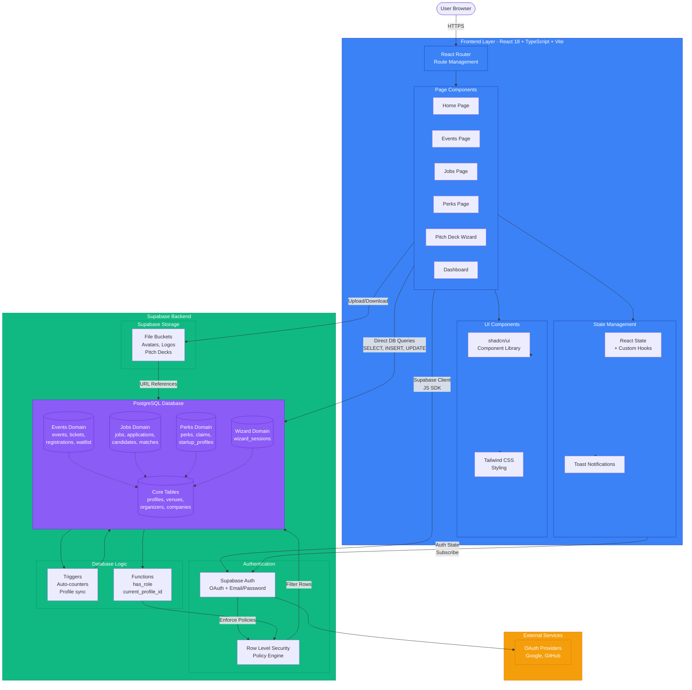

# 001 - Flowchart: Medellin-Spark System Overview

## Mermaid Diagram



## Explanation

The Medellin-Spark system follows a **serverless, JAMstack architecture** using React 18 for the frontend and Supabase as the backend-as-a-service. The frontend is built with **TypeScript**, **Vite** (build tool), **React Router** (routing), **shadcn/ui** (component library), and **Tailwind CSS** (styling). State management is handled via React's built-in hooks and custom hooks (no Redux/Zustand). The Supabase JavaScript SDK provides direct database access from the browser, eliminating the need for a custom API layer.

**Authentication** is managed by Supabase Auth, supporting OAuth (Google, GitHub) and email/password login. Upon successful authentication, the `upsert_profile()` database trigger automatically creates or updates a `profiles` record linked to the `auth.users` table. **Row Level Security (RLS)** policies enforce data access rules at the database level, ensuring users can only access data they own or have permission to view (e.g., candidates see their own applications; companies see applications for their jobs).

**Database operations** are performed directly from React components via the Supabase client. For example, fetching published events: `supabase.from('events').select('*').eq('status', 'published').is('deleted_at', null)`. The database includes **19 core tables** organized into 4 domains (Events, Jobs, Perks, Wizard), with **triggers** maintaining auto-incrementing counters (`registered_count`, `sold_count`) and **helper functions** (`has_role()`, `current_profile_id()`) supporting RLS policies.

## System Characteristics

### Technology Stack
- **Frontend**: React 18.3 + TypeScript 5.x + Vite 5.x
- **UI**: shadcn/ui + Tailwind CSS 3.x + Radix UI primitives
- **Backend**: Supabase (PostgreSQL 15 + Auth + Storage + RLS)
- **Deployment**: Vercel (frontend), Supabase Cloud (backend)
- **Dev Tools**: pnpm, Claude Code, Task Master AI

### Data Flow Patterns

**Pattern 1: Read-Heavy Public Data (Events, Jobs, Perks)**
```
User → React Component → Supabase Client → RLS Check → Database → Return Rows → Render UI
```
- **No custom API**: Direct database queries via Supabase SDK
- **RLS filtering**: Database filters rows based on user permissions
- **Caching**: Supabase client caches queries automatically

**Pattern 2: Authenticated Write Operations (Registrations, Applications, Claims)**
```
User → Form Submit → Validation → Supabase Client.insert() → RLS Policy Check → Trigger Execution → Database Update → Success Toast
```
- **Optimistic updates**: UI updates immediately, reverts on error
- **Trigger cascade**: Database triggers update related counters automatically
- **Error handling**: Try-catch with toast notifications

**Pattern 3: File Uploads (Avatars, Logos, Pitch Decks)**
```
User → File Input → Supabase Storage.upload() → Generate Public URL → Store URL in Database → Display Image
```
- **Storage buckets**: Separate buckets for avatars, logos, documents
- **Public URLs**: Time-limited signed URLs or permanent public URLs
- **Security**: RLS policies on storage buckets (user can only upload own files)

### Key Architectural Decisions

**1. No Custom API Layer**
**Why**: Supabase provides auto-generated REST API + RLS
**Benefit**: Faster development, fewer moving parts, simpler deployment
**Trade-off**: Complex business logic must live in database (triggers, functions) or client

**2. Direct Database Access from Browser**
**Why**: Supabase RLS ensures security at row level
**Benefit**: Zero-latency API design, no need for server endpoints
**Trade-off**: Must trust Supabase RLS policies (no additional auth layer)

**3. Soft Deletes for Events and Jobs**
**Why**: Allow recovery and maintain referential integrity
**Benefit**: Accidental deletes can be restored; analytics preserved
**Trade-off**: Partial indexes required to exclude deleted rows

**4. JSONB for Flexible Schema (wizard_sessions, perk_claims)**
**Why**: Wizard state and claim details vary by use case
**Benefit**: No schema migrations for new wizard steps or perk types
**Trade-off**: Less type safety; must validate JSONB structure in client

**5. Enum Types at Database Level**
**Why**: Ensure valid status values (event_status, job_status, etc.)
**Benefit**: Database-enforced constraints prevent invalid states
**Trade-off**: Schema migration required to add new enum values

## Performance Optimizations

### Database Level
1. **70+ Indexes**: Every FK has index; composite indexes on common filters
2. **Partial Indexes**: Exclude soft-deleted rows (`WHERE deleted_at IS NULL`)
3. **Auto-Increment Triggers**: Avoid N+1 queries for counters
4. **Connection Pooling**: Supabase Pooler handles 200+ concurrent connections

### Frontend Level
1. **Code Splitting**: React.lazy() + Suspense for page-level chunking
2. **Image Optimization**: Supabase Image Transformation API (resize, compress)
3. **Debounced Search**: 500ms debounce on search inputs
4. **Optimistic UI Updates**: Immediate feedback, revert on error

### Network Level
1. **CDN**: Vercel Edge Network (300+ global locations)
2. **HTTP/2**: Multiplexing reduces connection overhead
3. **Gzip Compression**: Supabase auto-compresses API responses

## Security Model

### Authentication
- **OAuth**: Google, GitHub (via Supabase Auth)
- **Email/Password**: bcrypt hashing (Supabase managed)
- **JWT**: Signed tokens with 1-hour expiry
- **Refresh Tokens**: Auto-refresh via Supabase client

### Authorization (RLS Policies)
- **Public Read**: Published events, jobs, perks visible to all
- **Authenticated Write**: Users can only insert records they own
- **Owner Manage**: Users can update/delete only their records
- **Admin Override**: `has_role('admin')` bypasses ownership checks

### Data Protection
- **SSL/TLS**: All connections encrypted (Supabase enforces HTTPS)
- **API Keys**: Environment variables (`.env.local`, not committed)
- **Rate Limiting**: Supabase enforces 100 req/second per client
- **SQL Injection**: Parameterized queries via Supabase SDK

## Recommendations

### 1. Add API Layer for Complex Logic
**Current**: Business logic in database triggers or client-side
**Issue**: Hard to test, debug, and version control
**Fix**: Introduce Supabase Edge Functions for:
- Sending registration confirmation emails
- Generating AI-powered job matches
- Processing perk claims with external APIs

**Benefits**: Centralized logic, easier testing, better error handling

### 2. Implement Caching Layer
**Current**: All queries hit database (Supabase client cache is basic)
**Issue**: Repeated queries for same public data (events, jobs)
**Fix**: Add React Query with stale-while-revalidate:
```ts
const { data: events } = useQuery('events', fetchEvents, {
  staleTime: 5 * 60 * 1000, // 5 minutes
  cacheTime: 10 * 60 * 1000 // 10 minutes
});
```

**Benefits**: Reduced database load, faster page loads, offline support

---

**Architecture**: Serverless JAMstack (React + Supabase)
**Deployment**: Vercel (frontend) + Supabase Cloud (backend)
**Documentation**: Medellin-Spark MVP - System Overview
