# 002 - Sequence Diagram: Event Registration Flow

## Mermaid Diagram

```mermaid
sequenceDiagram
    actor User
    participant Browser as React App<br/>(Events Page)
    participant SupaClient as Supabase Client<br/>(JS SDK)
    participant Auth as Supabase Auth
    participant RLS as RLS Policy Engine
    participant DB as PostgreSQL<br/>Database
    participant Trigger as Database Triggers

    Note over User,Trigger: Phase 1: Browse Published Events

    User->>Browser: Navigate to /events
    Browser->>SupaClient: supabase.from('events')<br/>.select('*, tickets(*)')<br/>.eq('status', 'published')<br/>.is('deleted_at', null)
    SupaClient->>Auth: Get current user JWT
    Auth-->>SupaClient: JWT or null (anon)
    SupaClient->>RLS: Apply RLS policies
    Note right of RLS: Policy: "events_select_published"<br/>WHERE status='published'<br/>AND deleted_at IS NULL
    RLS->>DB: Filtered SELECT query
    DB-->>RLS: Published events + tickets
    RLS-->>SupaClient: Rows passed RLS check
    SupaClient-->>Browser: Events data (JSON)
    Browser->>Browser: Render event cards
    Browser->>User: Display 10 upcoming events

    Note over User,Trigger: Phase 2: View Event Details

    User->>Browser: Click "AI Startup Meetup"
    Browser->>SupaClient: supabase.from('events')<br/>.select('*, tickets(*), organizers(*), venues(*)')<br/>.eq('slug', 'ai-startup-meetup')<br/>.single()
    SupaClient->>RLS: Apply RLS policies
    RLS->>DB: JOIN query with related tables
    DB-->>SupaClient: Event with nested data
    SupaClient-->>Browser: Event details (JSON)
    Browser->>Browser: Render event page
    Browser->>User: Show event info, 3 ticket tiers

    Note over User,Trigger: Phase 3: User Authentication

    User->>Browser: Click "Register for Event"
    Browser->>SupaClient: Check auth state
    SupaClient->>Auth: supabase.auth.getUser()
    Auth-->>SupaClient: User null (not logged in)
    SupaClient-->>Browser: Redirect to login
    Browser->>User: Show Google OAuth button

    User->>Browser: Click "Sign in with Google"
    Browser->>Auth: supabase.auth.signInWithOAuth({ provider: 'google' })
    Auth->>OAuth: Redirect to Google OAuth
    OAuth-->>User: Google consent screen
    User->>OAuth: Grant permissions
    OAuth-->>Auth: OAuth code + user profile
    Auth->>DB: Create auth.users record
    DB-->>Auth: User ID
    Auth->>Trigger: Trigger: on_auth_user_created
    activate Trigger
    Trigger->>DB: INSERT INTO profiles<br/>(user_id, email, full_name, avatar_url)<br/>FROM auth.users
    DB-->>Trigger: Profile created
    deactivate Trigger
    Auth-->>Browser: JWT + session
    Browser->>User: Redirect to event page (logged in)

    Note over User,Trigger: Phase 4: Select Ticket & Register

    User->>Browser: Select "Early Bird" ticket ($50)
    Browser->>Browser: Store ticket selection in state
    User->>Browser: Click "Complete Registration"
    Browser->>SupaClient: supabase.from('registrations')<br/>.insert({<br/>  event_id: eventId,<br/>  profile_id: profileId,<br/>  ticket_id: ticketId,<br/>  status: 'pending',<br/>  payment_status: 'pending',<br/>  payment_amount: 50<br/>})
    SupaClient->>Auth: Get JWT
    Auth-->>SupaClient: JWT (logged in)
    SupaClient->>RLS: Apply RLS policies
    Note right of RLS: Policy: "registrations_insert_authenticated"<br/>CHECK profile_id = current_profile_id()<br/>AND event is published
    RLS->>DB: Validated INSERT
    DB->>DB: Check unique constraint<br/>(event_id, profile_id)
    DB->>Trigger: Trigger: trg_update_event_registered_count
    activate Trigger
    Trigger->>DB: UPDATE events<br/>SET registered_count = (<br/>  SELECT count(*)<br/>  FROM registrations<br/>  WHERE event_id = eventId<br/>  AND status IN ('confirmed', 'attended')<br/>)
    DB-->>Trigger: Count updated
    deactivate Trigger
    DB->>Trigger: Trigger: trg_update_ticket_sold_count
    activate Trigger
    Trigger->>DB: UPDATE tickets<br/>SET sold_count = (<br/>  SELECT count(*)<br/>  FROM registrations<br/>  WHERE ticket_id = ticketId<br/>  AND payment_status = 'completed'<br/>)
    DB-->>Trigger: Count updated
    deactivate Trigger
    DB-->>RLS: Registration created
    RLS-->>SupaClient: Success response
    SupaClient-->>Browser: Registration data
    Browser->>User: Show success toast<br/>"Registered successfully!"

    Note over User,Trigger: Phase 5: Payment Processing (Simulated)

    Browser->>Browser: Redirect to payment page
    User->>Browser: Enter payment details
    Browser->>SupaClient: supabase.from('registrations')<br/>.update({<br/>  status: 'confirmed',<br/>  payment_status: 'completed',<br/>  payment_reference: 'pay_123'<br/>})<br/>.eq('id', registrationId)
    SupaClient->>RLS: Apply RLS policies
    Note right of RLS: Policy: "registrations_update_own"<br/>WHERE profile_id = current_profile_id()
    RLS->>DB: UPDATE registrations
    DB->>Trigger: Trigger: trg_update_event_registered_count
    activate Trigger
    Trigger->>DB: UPDATE events<br/>SET registered_count = registered_count + 1
    deactivate Trigger
    DB->>Trigger: Trigger: trg_update_ticket_sold_count
    activate Trigger
    Trigger->>DB: UPDATE tickets<br/>SET sold_count = sold_count + 1
    deactivate Trigger
    DB-->>SupaClient: Update success
    SupaClient-->>Browser: Payment confirmed
    Browser->>User: Show confirmation page<br/>"You're registered!"

    Note over User,Trigger: Phase 6: Check-in (Day of Event)

    User->>Browser: Navigate to dashboard
    Browser->>SupaClient: supabase.from('registrations')<br/>.select('*, events(*)')<br/>.eq('profile_id', profileId)<br/>.eq('status', 'confirmed')
    SupaClient->>RLS: Apply RLS policies
    RLS->>DB: SELECT user's registrations
    DB-->>SupaClient: Upcoming events
    SupaClient-->>Browser: Registration list
    Browser->>User: Show "AI Startup Meetup" tomorrow

    Note over User,Trigger: (Organizer checks user in at event)

    Browser->>SupaClient: supabase.from('registrations')<br/>.update({<br/>  attended: true,<br/>  check_in_time: now(),<br/>  status: 'attended'<br/>})<br/>.eq('id', registrationId)
    SupaClient->>RLS: Apply RLS policies (organizer can update)
    RLS->>DB: UPDATE registration
    DB-->>SupaClient: Check-in recorded
    SupaClient-->>Browser: Success
    Browser->>User: Show "Checked in successfully!"
```



## Explanation

This sequence diagram illustrates the **event registration flow** in Medellin-Spark, demonstrating how React components interact with Supabase to create an end-to-end user journey. The flow spans 6 phases: browsing events (public), viewing details, authentication, registration, payment, and check-in.

**Phase 1 (Browse)**: The user navigates to `/events`, triggering a Supabase query filtered by RLS policy `events_select_published`. The policy ensures only published, non-deleted events are visible to all users (authenticated or anonymous). The query uses Supabase's auto-join syntax `tickets(*)` to fetch related ticket tiers in a single request.

**Phase 2 (Details)**: Clicking an event fetches full details using the event's `slug` as the identifier. The query joins `organizers` and `venues` tables via `organizers(*)` and `venues(*)` syntax, returning nested JSON. This single query replaces what would typically require 3-4 REST API calls.

**Phase 3 (Auth)**: When the user attempts to register without authentication, Supabase Auth redirects to Google OAuth. Upon successful authentication, Supabase Auth creates an `auth.users` record, triggering the `on_auth_user_created` trigger which automatically creates a `profiles` record with the user's email, name, and avatar from the OAuth response (`raw_user_meta_data`).

**Phase 4 (Register)**: The user selects a ticket tier and clicks "Complete Registration." The React app inserts a `registrations` record via Supabase Client. The RLS policy `registrations_insert_authenticated` validates that `profile_id = current_profile_id()` (preventing users from registering others) and that the event is published. Upon successful insert, two triggers fire:
1. `trg_update_event_registered_count` - Recalculates `events.registered_count` by counting confirmed/attended registrations
2. `trg_update_ticket_sold_count` - Recalculates `tickets.sold_count` by counting paid registrations

**Phase 5 (Payment)**: The user completes payment (simulated in this MVP), and the frontend updates the registration status to `confirmed` and `payment_status` to `completed`. The update triggers fire again, incrementing the counters. This demonstrates **database-enforced consistency** - application bugs cannot cause counter drift.

**Phase 6 (Check-in)**: On the day of the event, the organizer checks the user in via a dashboard. The organizer's RLS policy (`registrations_update_organizer`) allows updating registrations for their events. The `check_in_time` timestamp and `attended` flag are set, and `status` transitions to `attended`.

## Key Patterns

### 1. **Direct Database Access**
**Pattern**: React components call Supabase Client directly (no API layer)
**Security**: RLS policies enforce permissions at database level
**Benefit**: Zero-latency API design, no need for Express/FastAPI endpoints

### 2. **Optimistic UI Updates**
**Pattern**: Browser updates UI immediately, reverts on error
**Example**:
```ts
// Optimistic update
setRegistrations([...registrations, newRegistration]);

// Supabase insert
const { error } = await supabase.from('registrations').insert(newRegistration);

// Revert on error
if (error) {
  setRegistrations(registrations.filter(r => r.id !== newRegistration.id));
  toast.error('Registration failed');
}
```

### 3. **Database Triggers for Consistency**
**Pattern**: Counters auto-update via triggers (not application code)
**Why**: Prevents race conditions and drift between `registered_count` and actual registrations
**Trade-off**: Complex logic hidden in database; harder to debug

### 4. **Nested Data in Single Query**
**Pattern**: Use Supabase's auto-join syntax `events(*, tickets(*), venues(*))`
**Benefit**: Reduces round trips from N+1 queries to 1 query
**Example**:
```ts
// Single query fetches event + tickets + venues
const { data } = await supabase
  .from('events')
  .select('*, tickets(*), event_venues(venues(*))')
  .eq('slug', slug)
  .single();
```

### 5. **RLS Policy Composition**
**Pattern**: Multiple RLS policies per table (select, insert, update, delete)
**Example** (`registrations` table):
- `registrations_select_own` - Users see their registrations
- `registrations_select_organizer` - Organizers see registrations for their events
- `registrations_insert_authenticated` - Users can only register themselves
- `registrations_update_own` - Users can cancel their registrations
- `registrations_update_organizer` - Organizers can check in attendees

## Performance Characteristics

| Operation | Latency | Notes |
|-----------|---------|-------|
| **Browse events** | ~150ms | SELECT with JOIN, cached by Supabase |
| **Event details** | ~100ms | Single query, 3 table joins |
| **OAuth login** | ~2-3s | Google OAuth redirect + profile creation |
| **Registration insert** | ~200ms | 1 INSERT + 2 trigger UPDATEs |
| **Payment update** | ~150ms | 1 UPDATE + 2 trigger UPDATEs |
| **Check-in update** | ~100ms | 1 UPDATE (no triggers fired) |

**Bottlenecks**:
1. OAuth redirect adds 2-3 seconds (unavoidable with third-party auth)
2. Trigger execution adds ~50-100ms per operation (trade-off for consistency)
3. No query caching in browser (all queries hit database)

## Error Handling

### Client-Side Errors
```ts
const { data, error } = await supabase.from('registrations').insert(newRegistration);

if (error) {
  if (error.code === '23505') {
    // Unique constraint violation (user already registered)
    toast.error('You are already registered for this event');
  } else if (error.code === '23503') {
    // Foreign key violation (event or ticket not found)
    toast.error('Event or ticket no longer available');
  } else {
    toast.error('Registration failed. Please try again.');
  }
  return;
}
```

### RLS Policy Errors
If RLS policy blocks an operation, Supabase returns `error` with code `42501` (insufficient privilege). The client should treat this as unauthorized:
```ts
if (error?.code === '42501') {
  toast.error('You do not have permission to perform this action');
  router.push('/login');
}
```

### Database Constraint Errors
CHECK constraints return error code `23514`:
```ts
if (error?.code === '23514') {
  // Example: registrations_payment_amount_matches_ticket
  toast.error('Payment amount must be provided for paid tickets');
}
```

## Recommendations

### 1. Add Idempotency Keys
**Current**: Duplicate registration possible if user clicks "Register" twice rapidly
**Fix**: Generate idempotency key on client, store in `registrations` table:
```ts
const idempotencyKey = crypto.randomUUID();
await supabase.from('registrations').insert({
  ...registration,
  idempotency_key: idempotencyKey
});
```

**Add unique constraint**: `UNIQUE(event_id, profile_id, idempotency_key)`

### 2. Implement Retry Logic with Exponential Backoff
**Current**: Single attempt for Supabase operations; user sees error on transient failures
**Fix**: Add retry wrapper with exponential backoff:
```ts
async function withRetry(fn, maxRetries = 3) {
  for (let i = 0; i < maxRetries; i++) {
    try {
      return await fn();
    } catch (error) {
      if (i === maxRetries - 1) throw error;
      await new Promise(resolve => setTimeout(resolve, 2 ** i * 1000));
    }
  }
}
```

---

**Flow**: Event Registration (6 phases)
**Latency**: ~3-4 seconds (OAuth) + ~500ms (registration + payment)
**Consistency**: Database triggers ensure counter accuracy
**Documentation**: Medellin-Spark MVP - Sequence Diagram
