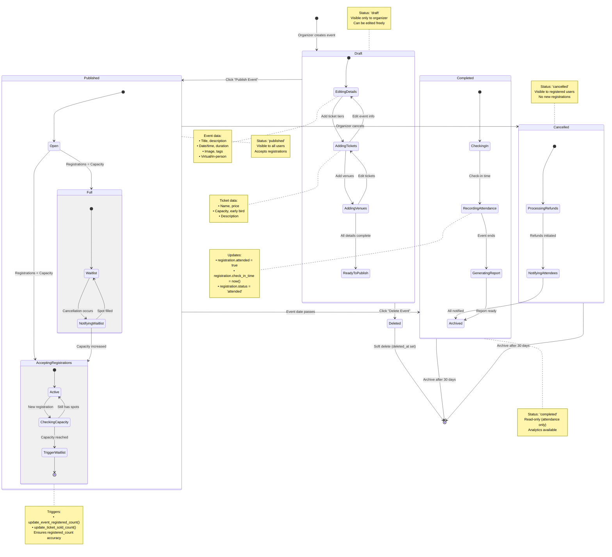

# 003 - State Diagram: Event Lifecycle

## Mermaid Diagram



## Explanation

The event lifecycle in Medellin-Spark follows a **state machine pattern** with four primary states: **Draft**, **Published**, **Cancelled**, and **Completed**. Each state is represented by the `event_status` enum in the database, ensuring type-safe transitions at the database level. State transitions are triggered by organizer actions (publish, cancel, delete) or automatic time-based transitions (event date passes → Completed).

**Draft State**: Events begin in draft mode, visible only to the organizer via RLS policy `events_select_own_organizer`. The organizer adds details (title, description, date), ticket tiers, and venues. The event can be edited freely without affecting public visibility. Transition to Published requires all required fields (title, description, date, at least one ticket tier).

**Published State**: Upon publishing, the event becomes visible to all users via RLS policy `events_select_published`. The Published state has two sub-states: **AcceptingRegistrations** (capacity > registered_count) and **Full** (capacity = registered_count). When a registration is created, the `trg_update_event_registered_count` trigger fires, recalculating `registered_count` from the database. If the count reaches capacity, the event transitions to Full, and subsequent registration attempts add users to the `waitlist` table (ordered by `position` column). If a cancellation occurs, the waitlist is notified (via `waitlist.notified = true`) and the first unnotified user is promoted.

**Cancelled State**: Organizers can cancel published events via the dashboard. The event status transitions to `cancelled`, and the system initiates refund processing (simulated in MVP). Registered users are notified via email/notification (future feature). Cancelled events remain visible to registered users for 30 days, then transition to archived (soft delete via `deleted_at` timestamp).

**Completed State**: On the event date, the system automatically transitions the event to `completed` status (via a scheduled job or manual organizer action). During the event, organizers check in attendees, setting `registration.attended = true`, `check_in_time = now()`, and `status = 'attended'`. After the event concludes, the system generates analytics reports (attendance rate, revenue, ticket tier distribution). Completed events are archived after 30 days.

## State Transition Rules

| From State | To State | Trigger | Conditions |
|------------|----------|---------|------------|
| **Draft** | Published | Organizer clicks "Publish" | Required fields filled, at least 1 ticket tier |
| **Draft** | Deleted | Organizer clicks "Delete" | No registrations exist |
| **Published** | Cancelled | Organizer clicks "Cancel" | Any time before event date |
| **Published** | Completed | Automatic or Manual | Event date has passed |
| **Published** | AcceptingRegistrations | Registration created | registered_count < capacity |
| **Published** | Full | Registration created | registered_count = capacity |
| **Full** | AcceptingRegistrations | Cancellation or capacity increase | registered_count < capacity |
| **Cancelled** | Archived | Automatic | 30 days after cancellation |
| **Completed** | Archived | Automatic | 30 days after completion |

## Sub-State Details

### Draft Sub-States
```
EditingDetails → AddingTickets → AddingVenues → ReadyToPublish
```
**Validation**:
- Title: max 200 characters, required
- Description: max 5000 characters, required
- Event date: must be in future
- End date: must be after event date (or null)
- Virtual URL: required if is_virtual = true

### Published Sub-States
```
AcceptingRegistrations (capacity > registered_count)
  ↓ (registration triggers counter update)
Full (capacity = registered_count)
  ↓ (cancellation frees spot)
AcceptingRegistrations (notify waitlist position 1)
```

**Trigger Logic**:
```sql
-- Executed on every registration INSERT/UPDATE/DELETE
CREATE TRIGGER trg_update_event_registered_count
  AFTER INSERT OR UPDATE OR DELETE ON registrations
  FOR EACH ROW EXECUTE FUNCTION update_event_registered_count();

-- Function recalculates count
CREATE FUNCTION update_event_registered_count() RETURNS trigger AS $$
BEGIN
  UPDATE events
  SET registered_count = (
    SELECT count(*)
    FROM registrations
    WHERE event_id = event_id_to_update
      AND status IN ('confirmed', 'attended')
  )
  WHERE id = event_id_to_update;
  RETURN NEW;
END;
$$ LANGUAGE plpgsql;
```

### Completed Sub-States
```
CheckingIn → RecordingAttendance → GeneratingReport → Archived
```

**Check-in Flow**:
1. Organizer scans QR code or searches attendee name
2. System validates registration exists and status = 'confirmed'
3. Update: `attended = true`, `check_in_time = now()`, `status = 'attended'`
4. Real-time counter: `SELECT count(*) FROM registrations WHERE attended = true`

**Report Metrics**:
- Attendance rate: `(attended / registered_count) * 100%`
- Revenue: `SUM(payment_amount) WHERE payment_status = 'completed'`
- No-show rate: `(status = 'no_show' / registered_count) * 100%`
- Ticket tier breakdown: `GROUP BY ticket_id`

## Persistence Strategy

### Database State (Source of Truth)
- **events.status** - Current state (enum: draft | published | cancelled | completed)
- **events.registered_count** - Auto-updated by triggers
- **events.deleted_at** - Soft delete timestamp (NULL = active)
- **registrations.status** - Registration state (enum: pending | confirmed | cancelled | attended | no_show)

### Client State (React)
- **Event list** - Fetched on page load, cached for 5 minutes
- **Event details** - Fetched on demand, real-time updates via Supabase subscriptions
- **Registration status** - Optimistic updates (immediate UI feedback, revert on error)

### Real-Time Updates (Supabase Realtime)
```ts
// Subscribe to registration changes for event
supabase
  .channel('event-123')
  .on('postgres_changes', {
    event: 'INSERT',
    schema: 'public',
    table: 'registrations',
    filter: 'event_id=eq.123'
  }, (payload) => {
    // Update registered_count in UI
    setRegisteredCount(prev => prev + 1);
  })
  .subscribe();
```

## Error States & Recovery

### Invalid Transition Errors
**Example**: Organizer tries to publish event without ticket tiers
**Handling**:
```ts
const { data, error } = await supabase
  .from('events')
  .update({ status: 'published' })
  .eq('id', eventId);

if (error) {
  if (ticketCount === 0) {
    toast.error('Cannot publish event without ticket tiers');
    return;
  }
  toast.error('Failed to publish event. Please try again.');
}
```

### Capacity Overflow (Race Condition)
**Scenario**: Two users register simultaneously when only 1 spot remains
**Database Protection**:
```sql
-- CHECK constraint prevents overflow
CONSTRAINT events_registered_within_capacity
  CHECK (capacity IS NULL OR registered_count <= capacity)
```

**Result**: One INSERT succeeds, other fails with error code `23514` (check constraint violation). Client shows "Event is full" message and redirects to waitlist.

### Trigger Failure
**Scenario**: `update_event_registered_count()` trigger fails due to deadlock
**Recovery**:
1. Database automatically retries transaction (PostgreSQL default)
2. If 3 retries fail, registration INSERT is rolled back
3. Client receives error, user sees "Registration failed. Please try again."
4. Organizer can manually recalculate count via admin dashboard

## Best Practices Demonstrated

✅ **Enum types** - Type-safe state transitions at database level
✅ **Triggers** - Automatic counter updates (no manual sync logic)
✅ **Soft deletes** - 30-day recovery window for cancelled/completed events
✅ **CHECK constraints** - Prevent invalid states (capacity overflow, negative prices)
✅ **Unique constraints** - Prevent duplicate registrations (`(event_id, profile_id)`)
✅ **Partial indexes** - Fast queries on active events (`WHERE deleted_at IS NULL`)
✅ **Composite indexes** - Efficient filtering (`(status, event_date)`)

## Recommendations

### 1. Add State Machine Validation
**Current**: Application enforces state transitions; database allows any `status` update
**Issue**: Bug could set event to invalid state (e.g., Draft → Completed directly)
**Fix**: Add CHECK constraint with allowed transitions:
```sql
ALTER TABLE events ADD CONSTRAINT valid_status_transitions CHECK (
  (status = 'draft') OR
  (status = 'published' AND (
    SELECT status FROM events WHERE id = NEW.id
  ) IN ('draft', 'published')) OR
  (status = 'cancelled' AND (
    SELECT status FROM events WHERE id = NEW.id
  ) = 'published') OR
  (status = 'completed' AND (
    SELECT status FROM events WHERE id = NEW.id
  ) = 'published')
);
```

**Better Alternative**: Use PostgreSQL's `CREATE TRIGGER` to enforce state machine:
```sql
CREATE TRIGGER validate_event_status_transition
  BEFORE UPDATE OF status ON events
  FOR EACH ROW EXECUTE FUNCTION validate_status_transition();
```

### 2. Implement Scheduled State Transitions
**Current**: Events remain in Published state after event date passes
**Issue**: No automatic transition to Completed
**Fix**: Add Supabase Edge Function scheduled via pg_cron:
```sql
-- Run daily at midnight
SELECT cron.schedule(
  'transition-completed-events',
  '0 0 * * *',
  $$
    UPDATE events
    SET status = 'completed'
    WHERE status = 'published'
      AND event_date < now()
      AND deleted_at IS NULL;
  $$
);
```

---

**Lifecycle**: 4 primary states + 6 sub-states
**Consistency**: Database triggers ensure counter accuracy
**Recovery**: Soft delete with 30-day window
**Documentation**: Medellin-Spark MVP - State Diagram
