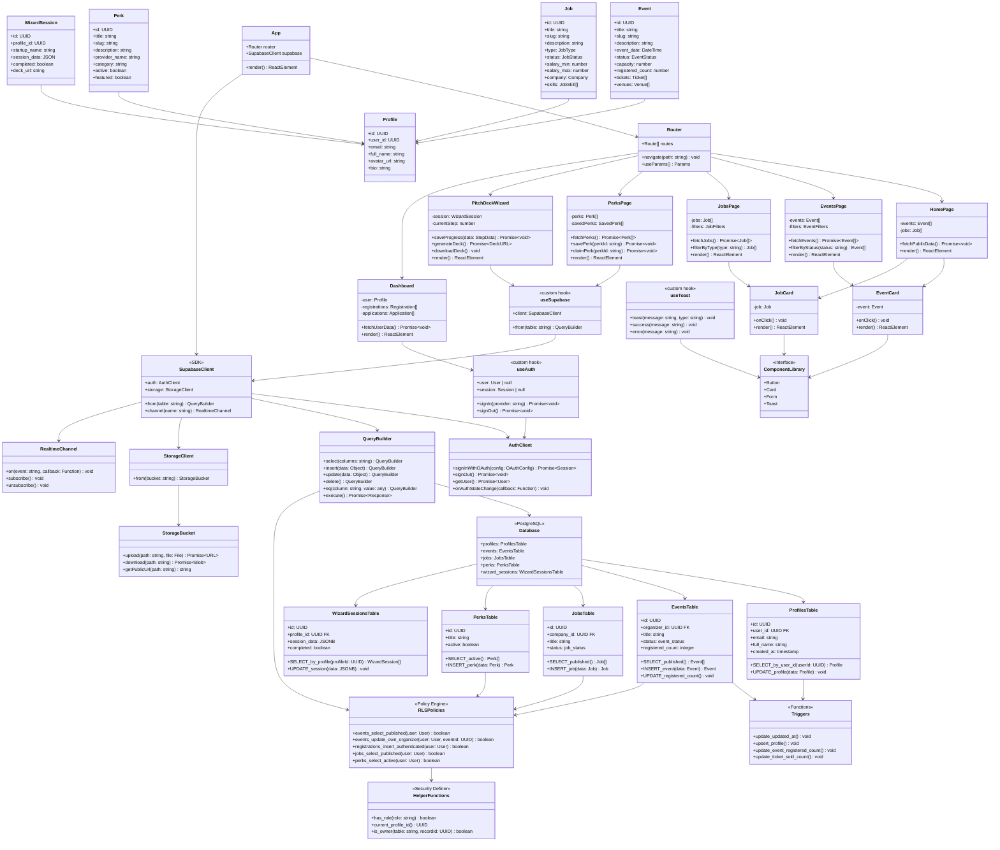

# 006 - Class Diagram: Medellin-Spark Component Architecture

## Mermaid Diagram



## Explanation

The Medellin-Spark architecture follows a **three-layer pattern**: Frontend (React components), Backend (Supabase services), and Database (PostgreSQL with RLS). The architecture is **serverless** (no custom backend), relying entirely on Supabase's auto-generated REST API, authentication, storage, and real-time subscriptions.

**Frontend Layer**: React 18 components organized into pages (`HomePage`, `EventsPage`, `JobsPage`, etc.) and reusable UI components (`EventCard`, `JobCard`). The `App` component initializes the `Router` and `SupabaseClient`, providing them to child components via React Context. Custom hooks (`useAuth`, `useSupabase`, `useToast`) abstract Supabase SDK operations, making page components cleaner and more testable.

**Backend Layer**: Supabase Client SDK provides four core services:
1. **AuthClient** - OAuth (Google) + email/password authentication, JWT-based sessions
2. **QueryBuilder** - Fluent API for database operations (select, insert, update, delete)
3. **StorageClient** - File upload/download (avatars, logos, pitch decks)
4. **RealtimeChannel** - WebSocket-based subscriptions for live updates

**Database Layer**: PostgreSQL 15 with 19 tables across 4 domains (Events, Jobs, Perks, Wizard). The database includes:
- **RLSPolicies** - Row-level security policies enforcing data access rules (e.g., `events_select_published` allows all users to view published events)
- **Triggers** - Automated functions that maintain data consistency (e.g., `update_event_registered_count()` recalculates `registered_count` on every registration change)
- **HelperFunctions** - Security definer functions used by RLS policies (e.g., `current_profile_id()` returns the logged-in user's profile ID)

**Domain Models**: TypeScript interfaces (`Event`, `Job`, `Perk`, `Profile`, `WizardSession`) represent database tables in the frontend. These models are generated manually or via Supabase CLI (`supabase gen types typescript`), ensuring type safety between frontend and database.

## Component Responsibilities

### Frontend Components

**Page Components (Routing Targets)**:
- **HomePage**: Landing page with public events/jobs preview
- **EventsPage**: Browse and filter published events
- **JobsPage**: Browse and apply to job postings
- **PerksPage**: Browse perks, save favorites, submit claims
- **PitchDeckWizard**: Multi-step form for deck generation
- **Dashboard**: User profile, registrations, applications

**UI Components (Reusable)**:
- **EventCard**: Display event summary with thumbnail
- **JobCard**: Display job listing with company logo
- **ComponentLibrary**: shadcn/ui components (Button, Card, Form, Toast)

**Custom Hooks (Logic Abstraction)**:
- **useAuth**: Authentication state and methods (signIn, signOut)
- **useSupabase**: Supabase client instance with helper methods
- **useToast**: Toast notification wrapper

### Backend Services

**AuthClient**:
- `signInWithOAuth({ provider: 'google' })` - OAuth flow initiation
- `getUser()` - Fetch current user from JWT
- `onAuthStateChange(callback)` - Subscribe to auth events

**QueryBuilder**:
- `from('events').select('*').eq('status', 'published')` - Fluent query API
- Auto-joins via nested syntax: `select('*, tickets(*), venues(*)')`
- RLS applied automatically on every query

**StorageClient**:
- `from('avatars').upload(path, file)` - File upload
- `from('avatars').getPublicUrl(path)` - Generate public URL
- Bucket-level RLS policies (users can only upload to own folder)

**RealtimeChannel**:
- `channel('events').on('postgres_changes', callback)` - Live updates
- Subscribe to INSERT/UPDATE/DELETE on any table
- Useful for real-time registration counters

### Database Components

**RLSPolicies**:
- **Select Policies**: `events_select_published` (public read for published events)
- **Insert Policies**: `registrations_insert_authenticated` (users can only register themselves)
- **Update Policies**: `events_update_own_organizer` (organizers can update their events)
- **Delete Policies**: `events_delete_own_organizer` (organizers can delete their events)

**Triggers**:
- **update_updated_at()**: Auto-update `updated_at` column on every UPDATE
- **upsert_profile()**: Auto-create `profiles` record when `auth.users` is created
- **update_event_registered_count()**: Recalculate `registered_count` on registration changes
- **update_ticket_sold_count()**: Recalculate `sold_count` on payment changes

**HelperFunctions**:
- **has_role(role_name)**: Check if user has admin/organizer role (used in RLS)
- **current_profile_id()**: Return profile ID for current auth user (simplifies RLS)
- **is_owner(table_name, record_id)**: Generic ownership check (used in multiple RLS policies)

## Design Patterns

### 1. **Repository Pattern (via QueryBuilder)**
**Pattern**: Abstract database operations behind a fluent API
**Example**:
```ts
// EventRepository (conceptual)
class EventRepository {
  async findPublished(): Promise<Event[]> {
    const { data } = await supabase
      .from('events')
      .select('*, tickets(*)')
      .eq('status', 'published')
      .is('deleted_at', null);
    return data || [];
  }
}
```

### 2. **Custom Hooks Pattern**
**Pattern**: Encapsulate stateful logic in reusable hooks
**Example**:
```ts
function useAuth() {
  const [user, setUser] = useState<User | null>(null);

  useEffect(() => {
    supabase.auth.getUser().then(({ data }) => setUser(data.user));
    const { data } = supabase.auth.onAuthStateChange((event, session) => {
      setUser(session?.user || null);
    });
    return () => data.subscription.unsubscribe();
  }, []);

  return { user, signIn: supabase.auth.signInWithOAuth, signOut: supabase.auth.signOut };
}
```

### 3. **Facade Pattern (Supabase Client)**
**Pattern**: Single interface for complex subsystem (auth, database, storage)
**Benefit**: Simplified API surface for frontend developers
**Trade-off**: Less control over low-level database operations

### 4. **Observer Pattern (Realtime Subscriptions)**
**Pattern**: Components subscribe to database changes via WebSocket
**Example**:
```ts
useEffect(() => {
  const channel = supabase
    .channel('registrations')
    .on('postgres_changes', {
      event: 'INSERT',
      schema: 'public',
      table: 'registrations',
      filter: `event_id=eq.${eventId}`
    }, (payload) => {
      setRegisteredCount(prev => prev + 1);
    })
    .subscribe();

  return () => channel.unsubscribe();
}, [eventId]);
```

### 5. **Policy Pattern (RLS Policies)**
**Pattern**: Encapsulate access control rules in database policies
**Benefit**: Security enforced at database level (no bypass via custom API)
**Trade-off**: Complex policies can impact query performance

## Class Interactions

### Example 1: Event Registration Flow

```
User → EventsPage.onClick()
  → useSupabase.from('registrations').insert(data)
    → QueryBuilder.insert(data)
      → RLSPolicies.registrations_insert_authenticated()
        → HelperFunctions.current_profile_id()
      → EventsTable.INSERT_registration()
        → Triggers.update_event_registered_count()
        → Triggers.update_ticket_sold_count()
      → QueryBuilder.execute()
    → useToast.success("Registered successfully!")
```

### Example 2: Authentication Flow

```
User → HomePage.clickSignIn()
  → useAuth.signIn('google')
    → AuthClient.signInWithOAuth({ provider: 'google' })
      → OAuth Redirect to Google
      → OAuth Callback with code
      → AuthClient.createSession(code)
        → Database.auth_users.INSERT(user_data)
          → Triggers.upsert_profile()
            → ProfilesTable.INSERT_profile(user_data)
        → AuthClient.setSession(jwt)
      → useAuth.setUser(user)
    → Router.navigate('/dashboard')
```

### Example 3: Pitch Deck Generation Flow

```
User → PitchDeckWizard.submitForm()
  → useSupabase.from('wizard_sessions').update({ session_data, completed: true })
    → QueryBuilder.update(data)
      → RLSPolicies.wizard_sessions_update_own()
      → WizardSessionsTable.UPDATE_session(data)
  → PitchDeckWizard.generateDeck()
    → (Future: Call Edge Function to generate PDF)
    → (Future: Store PDF in StorageBucket)
    → useSupabase.from('wizard_sessions').update({ deck_url })
  → useToast.success("Deck generated!")
  → PitchDeckWizard.downloadDeck()
    → window.open(deck_url)
```

## Component Communication

### Parent-Child (Props)
```ts
<EventsPage>
  <EventCard event={event} onClick={() => navigate(`/events/${event.slug}`)} />
</EventsPage>
```

### Global State (React Context + Hooks)
```ts
// Provided by App component
const { user, signIn, signOut } = useAuth();

// Consumed by any descendant component
function Dashboard() {
  const { user } = useAuth();
  return <h1>Welcome, {user.full_name}!</h1>;
}
```

### Database-Driven (Realtime Subscriptions)
```ts
// Component A: Updates database
await supabase.from('registrations').insert(newRegistration);

// Component B: Receives update
supabase.channel('registrations').on('postgres_changes', callback).subscribe();
```

## Best Practices Demonstrated

✅ **Custom hooks** - Encapsulate stateful logic (useAuth, useSupabase, useToast)
✅ **Reusable components** - EventCard, JobCard, ComponentLibrary
✅ **Type safety** - TypeScript interfaces for all domain models
✅ **Separation of concerns** - Pages (routing), Components (UI), Hooks (logic)
✅ **Facade pattern** - Supabase Client abstracts database complexity
✅ **Observer pattern** - Realtime subscriptions for live updates
✅ **Policy pattern** - RLS policies enforce security at database level
✅ **Trigger pattern** - Database triggers maintain data consistency

## Recommendations

### 1. Implement Service Layer
**Current**: Page components call Supabase Client directly
**Issue**: Duplicate query logic across multiple components
**Fix**: Create service classes to centralize database operations:

```ts
// services/EventService.ts
export class EventService {
  static async findPublished(): Promise<Event[]> {
    const { data, error } = await supabase
      .from('events')
      .select('*, tickets(*), event_venues(venues(*))')
      .eq('status', 'published')
      .is('deleted_at', null)
      .order('event_date', { ascending: true });

    if (error) throw error;
    return data;
  }

  static async register(eventId: string, ticketId: string): Promise<Registration> {
    const { data: profile } = await supabase.from('profiles').select('id').single();
    const { data, error } = await supabase
      .from('registrations')
      .insert({
        event_id: eventId,
        profile_id: profile.id,
        ticket_id: ticketId,
        status: 'pending',
        payment_status: 'pending'
      })
      .select()
      .single();

    if (error) throw error;
    return data;
  }
}

// Usage in component
const events = await EventService.findPublished();
await EventService.register(eventId, ticketId);
```

**Benefits**:
- Centralized query logic (single source of truth)
- Easier testing (mock service instead of Supabase client)
- Type-safe return values (no need to cast `data`)

### 2. Add State Management Library
**Current**: Local state + custom hooks (no global state management)
**Issue**: Prop drilling for deeply nested components, no cache for repeated queries
**Fix**: Integrate React Query for server state management:

```ts
import { useQuery, useMutation, useQueryClient } from '@tanstack/react-query';

function useEvents() {
  return useQuery({
    queryKey: ['events', 'published'],
    queryFn: () => EventService.findPublished(),
    staleTime: 5 * 60 * 1000, // 5 minutes
  });
}

function useRegisterEvent() {
  const queryClient = useQueryClient();
  return useMutation({
    mutationFn: ({ eventId, ticketId }) => EventService.register(eventId, ticketId),
    onSuccess: () => {
      queryClient.invalidateQueries({ queryKey: ['events'] });
      toast.success('Registered successfully!');
    }
  });
}

// Usage
const { data: events, isLoading } = useEvents();
const { mutate: register } = useRegisterEvent();
register({ eventId, ticketId });
```

**Benefits**:
- Automatic caching (reduce database load)
- Loading/error states handled automatically
- Optimistic updates with rollback on error
- Reduced component re-renders

---

**Architecture**: Serverless JAMstack (React + Supabase)
**Layers**: 3 (Frontend, Backend Services, Database)
**Total Classes/Components**: 30+ (15 pages/components, 8 hooks/services, 7 database tables)
**Design Patterns**: Repository, Facade, Observer, Policy, Custom Hooks
**Documentation**: Medellin-Spark MVP - Class Diagram
