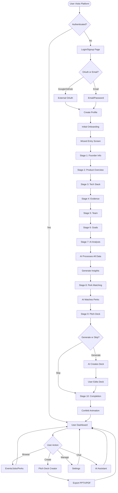
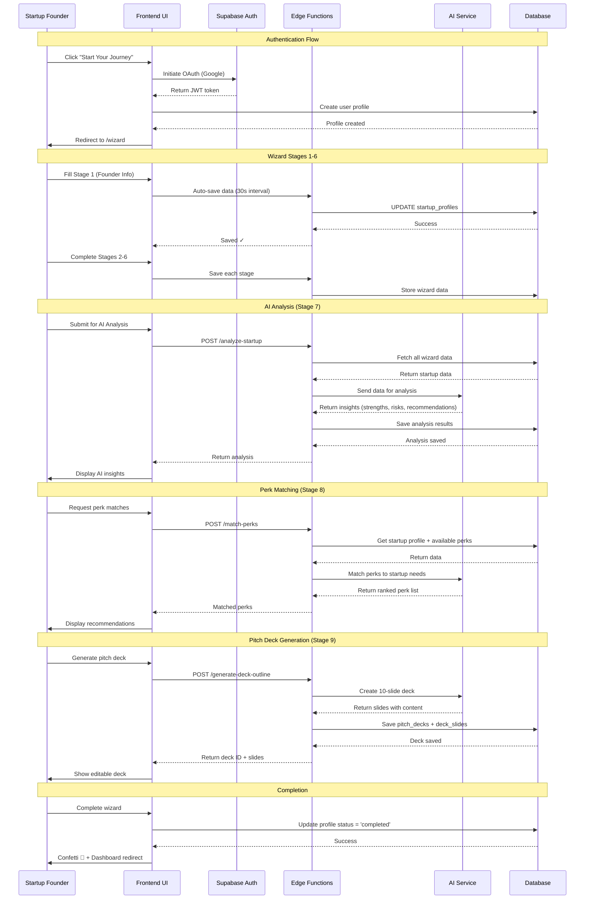
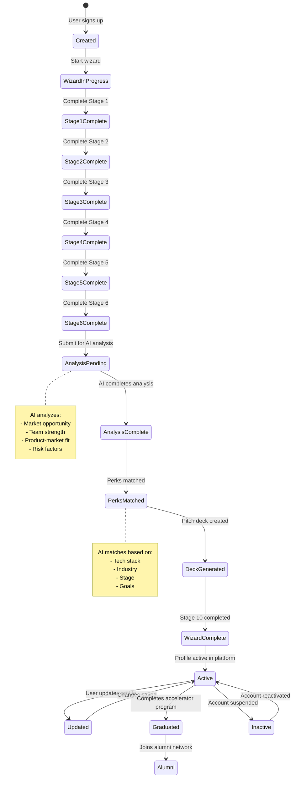
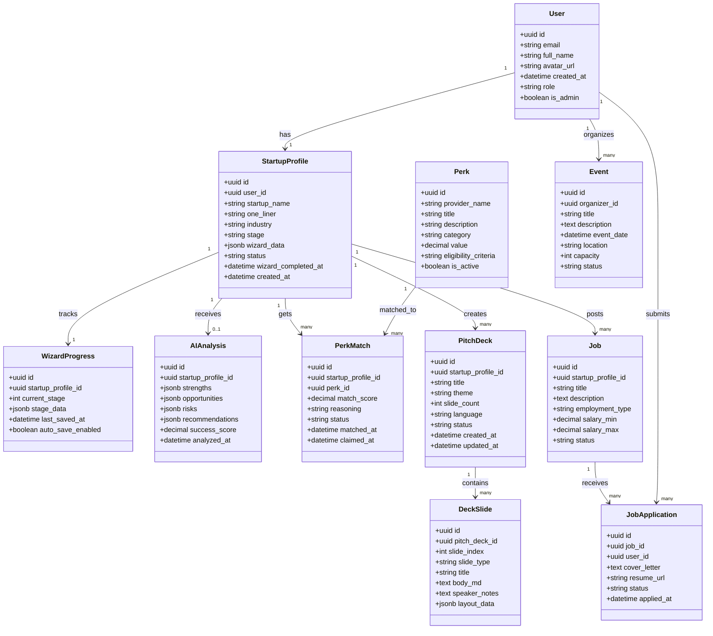
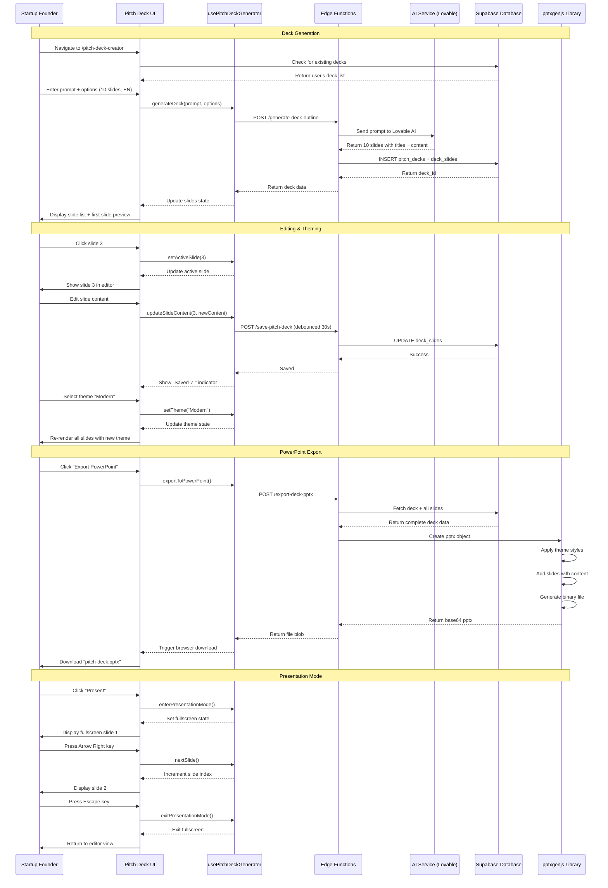
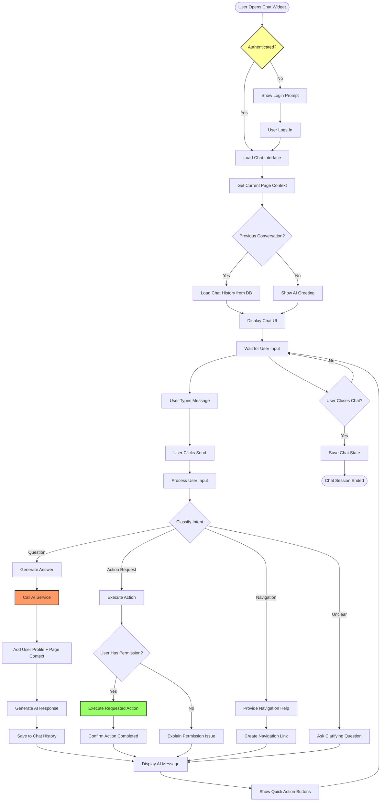
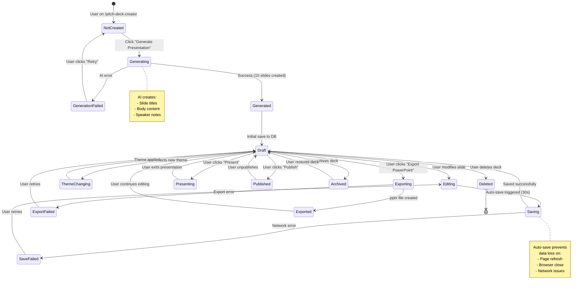
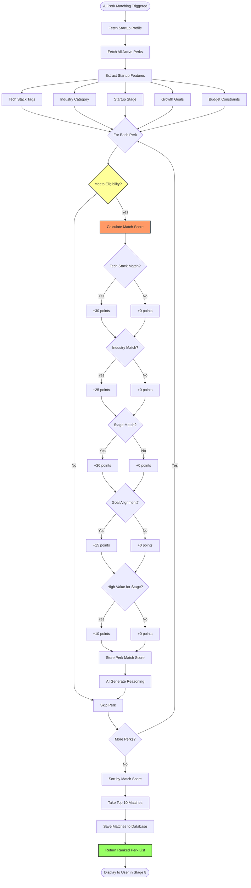
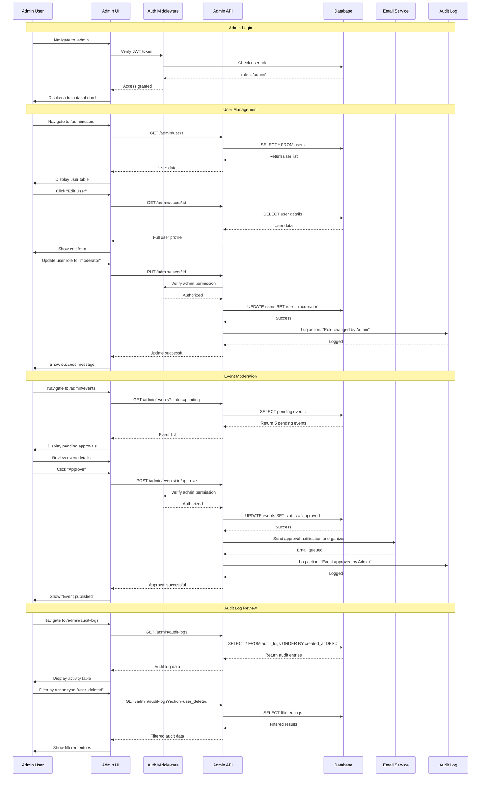

# Medellin AI Hub - System Diagrams

## 📦 PROJECT DESCRIPTION

**Project Name:** Medellin AI Hub
**Goal:** AI-powered startup accelerator platform that connects entrepreneurs with resources, perks, and opportunities through intelligent onboarding and matching.
**Main Actors:** Startup Founder, Admin, AI System, Database, Edge Functions, External APIs (OAuth, Payment)
**Core Workflows:** User signup, 10-stage wizard onboarding, AI analysis, perk matching, pitch deck generation, dashboard management
**Primary Entity for State Diagram:** Startup Profile
**User Journey Stages:** Discovery → Signup → Wizard Onboarding → AI Analysis → Resource Matching → Dashboard Engagement → Community Growth

---

## 1️⃣ FLOWCHART - Overall System Flow



---

## 2️⃣ SEQUENCE DIAGRAM - Startup Wizard Onboarding



---

## 3️⃣ STATE DIAGRAM - Startup Profile Lifecycle



---

## 4️⃣ CLASS DIAGRAM - Database Schema



---

## 5️⃣ USER JOURNEY DIAGRAM - Founder Experience

```mermaid
journey
    title Startup Founder Journey - Medellin AI Hub

    section Discovery
      Visit Homepage: 5: Founder
      Read About Program: 4: Founder
      Check Success Stories: 5: Founder
      Click "Start Your Journey": 5: Founder

    section Authentication
      Choose Signup Method: 4: Founder
      Complete OAuth Flow: 5: System
      Create Initial Profile: 4: Founder
      Receive Welcome Email: 3: System

    section Wizard Onboarding
      Enter Founder Info (Stage 1): 4: Founder
      Describe Product (Stage 2): 5: Founder
      Select Tech Stack (Stage 3): 5: Founder
      Share Metrics (Stage 4): 4: Founder
      List Team Members (Stage 5): 4: Founder
      Define Growth Goals (Stage 6): 5: Founder
      Auto-Save Progress: 5: System

    section AI Analysis
      Submit for Analysis (Stage 7): 5: Founder
      Wait for AI Processing: 3: System
      Review Strengths: 5: Founder
      Understand Risks: 4: Founder
      Read Recommendations: 5: Founder

    section Resource Matching
      View Matched Perks (Stage 8): 5: Founder
      Read Perk Details: 5: Founder
      Claim AWS Credits: 5: Founder
      Claim GitHub Pro: 5: Founder
      Save Perks to Dashboard: 4: System

    section Pitch Deck Creation
      Request Deck Generation (Stage 9): 5: Founder
      AI Creates 10 Slides: 4: System
      Review Generated Content: 4: Founder
      Edit Slide Text: 5: Founder
      Select Theme: 5: Founder
      Export to PowerPoint: 5: Founder
      Download File: 5: System

    section Completion
      See Confetti Celebration (Stage 10): 5: Founder
      Review Next Steps Checklist: 4: Founder
      Navigate to Dashboard: 5: Founder

    section Dashboard Engagement
      View Overview Metrics: 4: Founder
      Browse Upcoming Events: 5: Founder
      Check Job Matches: 4: Founder
      Explore Community Posts: 3: Founder
      Ask AI Assistant Question: 5: Founder, System
      Receive Helpful Response: 5: System

    section Ongoing Usage
      Register for Event: 5: Founder
      Apply to Job Posting: 4: Founder
      Update Startup Profile: 4: Founder
      Generate New Pitch Deck: 5: Founder
      Share Success Story: 5: Founder
      Refer Another Startup: 5: Founder
```

---

## 6️⃣ SEQUENCE DIAGRAM - Pitch Deck Creator Flow



---

## 7️⃣ FLOWCHART - AI Chat Assistant



---

## 8️⃣ STATE DIAGRAM - Pitch Deck Lifecycle



---

## 9️⃣ FLOWCHART - Perk Matching Algorithm



---

## 🔟 SEQUENCE DIAGRAM - Admin Panel Operations



---

## Documentation Notes

### Diagram Usage

**Flowcharts** - Use for:
- Overall system architecture
- Decision trees
- Process flows with branching logic

**Sequence Diagrams** - Use for:
- API interactions
- Multi-step workflows
- Actor-to-actor communication

**State Diagrams** - Use for:
- Entity lifecycle management
- Status transitions
- Workflow states

**Class Diagrams** - Use for:
- Database schema documentation
- Entity relationships
- Data modeling

**Journey Diagrams** - Use for:
- User experience mapping
- Customer journey documentation
- UX research presentations

### Rendering

These diagrams can be rendered in:
- GitHub Markdown (native support)
- Mermaid Live Editor (https://mermaid.live)
- Documentation platforms (GitBook, Docusaurus)
- VS Code (with Mermaid extensions)

### Updating

When updating diagrams:
1. Edit the Mermaid code directly
2. Verify syntax in Mermaid Live Editor
3. Update related documentation
4. Commit with descriptive message

---

**Document Version:** 1.0
**Created:** October 11, 2025
**Project:** Medellin AI Hub
**Purpose:** Visual system architecture documentation
