# 🎨 PITCH DECK WIZARD - MERMAID FLOWCHARTS

**Date:** October 15, 2025
**Purpose:** Visual diagrams showing user journey, technical flow, and data architecture

---

## 📊 DIAGRAM 1: USER JOURNEY (What User Sees)

```mermaid
graph TD
    Start[User logs into Dashboard] --> Dashboard{Dashboard Page}
    Dashboard --> |Click Quick Action| PitchDeckBtn["Generate Pitch Deck" Button]

    PitchDeckBtn --> Input["/pitch-deck Input Page"]

    Input --> |User fills form| FormData["
    • Topic/Title
    • Number of slides (8-15)
    • Presentation style (Professional/Casual)
    • Language (English/Spanish)
    "]

    FormData --> |Click Generate| AIGenerate["AI Generation Started
    Show: 'Generating outline...'"]

    AIGenerate --> |30-60 sec| OutlinePage["/presentations/:id/outline
    ⭐ CRITICAL PAGE (Not Built Yet)"]

    OutlinePage --> Review["User Reviews Outline
    • 10 slide titles generated
    • Can edit titles inline
    • Can reorder with drag & drop
    • Can delete/add slides"]

    Review --> ThemeSelect["User Selects Theme
    • Purple (default)
    • Blue
    • Dark"]

    ThemeSelect --> |Click Generate Presentation| FullGenerate["Full Content Generation
    Show: 'Generating slide 5/10...'"]

    FullGenerate --> |1-2 min| EditorPage["/presentations/:id/edit
    ⭐ CRITICAL PAGE (Not Built Yet)"]

    EditorPage --> EditSlides["User Edits Presentation
    • Click slide thumbnail (left)
    • Edit title & content (right)
    • Auto-saves every 2 sec
    • Drag thumbnails to reorder"]

    EditSlides --> Preview{User Clicks Preview?}
    Preview --> |Yes| ViewerPage["/presentations/:id/view
    ⭐ CRITICAL PAGE (Not Built Yet)"]

    ViewerPage --> FullScreen["Full-Screen Presentation
    • Navigate with arrows
    • Keyboard shortcuts
    • Theme colors applied
    • Auto-hide controls"]

    FullScreen --> Exit{Exit Viewer?}
    Exit --> |ESC key| EditorPage
    Exit --> |Close button| Dashboard

    Preview --> |No, continue editing| EditSlides
    EditSlides --> Done{Done Editing?}
    Done --> |Yes| Dashboard
    Done --> |No| EditSlides

    style OutlinePage fill:#ff6b6b,stroke:#c92a2a,stroke-width:3px
    style EditorPage fill:#ff6b6b,stroke:#c92a2a,stroke-width:3px
    style ViewerPage fill:#ff6b6b,stroke:#c92a2a,stroke-width:3px
    style Dashboard fill:#51cf66,stroke:#2f9e44
    style Input fill:#51cf66,stroke:#2f9e44
```



---

## 🔧 DIAGRAM 2: TECHNICAL ARCHITECTURE (How System Works)

```mermaid
graph TD
    subgraph Frontend["Frontend (React/Lovable)"]
        Dashboard[Dashboard Page]
        InputForm[Pitch Deck Input Form]
        OutlineEditor[Outline Editor Component]
        ThemeSelector[Theme Selector Component]
        SlideEditor[Slide Editor Component]
        Viewer[Presentation Viewer Component]
    end

    subgraph State["State Management (Zustand)"]
        PresentationStore["presentationStore
        • currentPresentation
        • outline
        • theme
        • slides
        • isGenerating"]
    end

    subgraph API["Supabase Edge Functions"]
        GenerateOutline["generate-outline
        Claude API Call
        Input: topic, slideCount, style
        Output: Array of slide titles"]

        GenerateContent["generate-presentation
        Claude API Call (per slide)
        Input: outline, style, topic
        Output: Full slide content"]
    end

    subgraph Database["Supabase PostgreSQL"]
        PresentationsTable["presentations table
        • id (uuid)
        • profile_id (uuid)
        • title (text)
        • outline (text[])
        • content (jsonb)
        • theme (text)
        • presentation_style (text)
        • status (text)
        • created_at / updated_at"]

        ProfilesTable["profiles table
        • id (uuid)
        • email
        • full_name
        • ...startup data"]
    end

    subgraph External["External Services"]
        Claude["Anthropic Claude API
        Model: claude-3-5-sonnet
        Tasks:
        • Generate outlines
        • Generate slide content"]
    end

    Dashboard --> |1. Click Generate| InputForm
    InputForm --> |2. Submit form| GenerateOutline

    GenerateOutline --> |3. Call Claude API| Claude
    Claude --> |4. Return outline| GenerateOutline

    GenerateOutline --> |5. Create presentation record| PresentationsTable
    PresentationsTable --> |6. Return presentation ID| OutlineEditor

    OutlineEditor --> |7. Load outline| PresentationStore
    OutlineEditor --> |8. User edits| PresentationsTable
    PresentationsTable -.->|Auto-save (debounced 2s)| OutlineEditor

    ThemeSelector --> |9. Select theme| PresentationsTable

    OutlineEditor --> |10. Click Generate Presentation| GenerateContent
    GenerateContent --> |11. Call Claude API (per slide)| Claude
    Claude --> |12. Return slide content| GenerateContent

    GenerateContent --> |13. Update content JSONB| PresentationsTable
    PresentationsTable --> |14. Return full presentation| SlideEditor

    SlideEditor --> |15. Load slides| PresentationStore
    SlideEditor --> |16. Edit content| PresentationsTable
    PresentationsTable -.->|Auto-save (debounced 2s)| SlideEditor

    SlideEditor --> |17. Click Preview| Viewer
    Viewer --> |18. Load from store| PresentationStore

    PresentationsTable --> |RLS Filter| ProfilesTable

    style GenerateOutline fill:#339af0,stroke:#1971c2
    style GenerateContent fill:#339af0,stroke:#1971c2
    style Claude fill:#ffd43b,stroke:#f59f00
    style PresentationsTable fill:#51cf66,stroke:#2f9e44
    style PresentationStore fill:#ff6b6b,stroke:#c92a2a
```

---

## 💾 DIAGRAM 3: DATA FLOW (What Data Moves Where)

```mermaid
graph LR
    subgraph UserInput["User Input"]
        FormData["
        topic: 'EventOS Pitch'
        slideCount: 10
        style: 'professional'
        language: 'en'
        "]
    end

    subgraph Step1["Step 1: Generate Outline"]
        AIPrompt1["Prompt to Claude:
        'Create a 10-slide pitch
        deck outline for: EventOS
        Pitch. Style: professional.
        Return slide titles only.'"]

        AIResponse1["Claude Response:
        [
          'EventOS Startup Pitch',
          'The Problem',
          'Our Solution',
          'How It Works',
          'Market Opportunity',
          'Business Model',
          'Traction & Metrics',
          'The Team',
          'Investment Ask',
          'Thank You'
        ]"]
    end

    subgraph Step2["Step 2: Save to Database"]
        DBInsert["INSERT INTO presentations:
        {
          title: 'EventOS Pitch',
          profile_id: user.id,
          outline: [array of titles],
          theme: 'purple',
          presentation_style: 'professional',
          status: 'draft',
          content: { slides: [] }
        }"]

        DBResponse["Returns:
        {
          id: 'abc-123-xyz',
          ...all fields
        }"]
    end

    subgraph Step3["Step 3: User Edits Outline"]
        UserEdits["User actions:
        • Edit title 2 to 'The Challenge'
        • Reorder slides 8 & 9
        • Delete slide 10
        • Select theme: 'blue'"]

        DBUpdate1["UPDATE presentations
        SET
          outline = new_outline,
          theme = 'blue',
          updated_at = NOW()
        WHERE id = 'abc-123-xyz'"]
    end

    subgraph Step4["Step 4: Generate Content"]
        AIPrompt2["For each slide:
        Prompt: 'Write content for
        slide titled {title} in a
        professional style. 2-3
        sentences. Focus on key
        points only.'"]

        AIResponse2["Claude Response (per slide):
        {
          id: 'slide-1',
          title: 'EventOS Startup Pitch',
          content: 'Welcome to EventOS...',
          layout: 'title'
        }"]

        ContentArray["Build full content:
        {
          slides: [
            { id, title, content, layout },
            { id, title, content, layout },
            ...
          ],
          slideCount: 9
        }"]
    end

    subgraph Step5["Step 5: Save Full Content"]
        DBUpdate2["UPDATE presentations
        SET
          content = full_content_json,
          status = 'completed',
          updated_at = NOW()
        WHERE id = 'abc-123-xyz'"]
    end

    subgraph Step6["Step 6: User Edits Slides"]
        SlideEdits["User edits slide 2:
        • Title: 'The Challenge'
        • Content: 'Event organizers
          face 3 major problems...'"]

        DBUpdate3["UPDATE presentations
        SET
          content = updated_content,
          updated_at = NOW()
        WHERE id = 'abc-123-xyz'

        (Debounced auto-save)"]
    end

    subgraph Step7["Step 7: View Presentation"]
        LoadData["SELECT * FROM presentations
        WHERE id = 'abc-123-xyz'"]

        RenderSlides["Render slides:
        • Apply theme colors (blue)
        • Full-screen mode
        • Keyboard navigation
        • Show current slide"]
    end

    FormData --> AIPrompt1
    AIPrompt1 --> AIResponse1
    AIResponse1 --> DBInsert
    DBInsert --> DBResponse
    DBResponse --> UserEdits
    UserEdits --> DBUpdate1
    DBUpdate1 --> AIPrompt2
    AIPrompt2 --> AIResponse2
    AIResponse2 --> ContentArray
    ContentArray --> DBUpdate2
    DBUpdate2 --> SlideEdits
    SlideEdits --> DBUpdate3
    DBUpdate3 --> LoadData
    LoadData --> RenderSlides

    style AIPrompt1 fill:#ffd43b,stroke:#f59f00
    style AIResponse1 fill:#ffd43b,stroke:#f59f00
    style AIPrompt2 fill:#ffd43b,stroke:#f59f00
    style AIResponse2 fill:#ffd43b,stroke:#f59f00
    style DBInsert fill:#51cf66,stroke:#2f9e44
    style DBUpdate1 fill:#51cf66,stroke:#2f9e44
    style DBUpdate2 fill:#51cf66,stroke:#2f9e44
    style DBUpdate3 fill:#51cf66,stroke:#2f9e44
```



---

## 🔄 DIAGRAM 4: STATE MANAGEMENT FLOW

```mermaid
stateDiagram-v2
    [*] --> Idle: User on Dashboard

    Idle --> FormInput: Click "Generate Pitch Deck"

    FormInput --> GeneratingOutline: Submit form

    GeneratingOutline --> OutlineReview: Outline generated
    note right of GeneratingOutline
        State:
        • isGenerating: true
        • currentStep: 'outline'
        • presentation: null
    end note

    OutlineReview --> EditingOutline: User edits titles
    OutlineReview --> SelectingTheme: User picks theme

    EditingOutline --> AutoSaving: Debounce 2 sec
    AutoSaving --> OutlineReview: Saved

    SelectingTheme --> OutlineReview: Theme updated

    OutlineReview --> GeneratingContent: Click "Generate Presentation"
    note right of GeneratingContent
        State:
        • isGenerating: true
        • currentStep: 'content'
        • progress: "5/10 slides"
    end note

    GeneratingContent --> EditingSlides: Content generated
    note right of EditingSlides
        State:
        • isGenerating: false
        • currentPresentation: {...}
        • slides: [...]
        • currentSlideIndex: 0
    end note

    EditingSlides --> EditingSlide: Click slide thumbnail
    EditingSlides --> Previewing: Click "Preview"

    EditingSlide --> AutoSavingSlides: Edit content
    AutoSavingSlides --> EditingSlides: Saved

    Previewing --> FullScreenView: Load presentation
    note right of FullScreenView
        State:
        • isPresenting: true
        • currentSlide: 0
        • theme: 'purple'|'blue'|'dark'
    end note

    FullScreenView --> NavigatingSlides: Arrow keys
    NavigatingSlides --> FullScreenView: Update currentSlide

    FullScreenView --> EditingSlides: Exit (ESC key)

    EditingSlides --> Idle: Done, back to Dashboard
```



---

## 🗄️ DIAGRAM 5: DATABASE SCHEMA RELATIONSHIPS


---

## 🎯 DIAGRAM 6: COMPONENT HIERARCHY

```mermaid
graph TD
    subgraph App["App Component"]
        Router[React Router]
    end

    subgraph PublicRoutes["Public Routes"]
        Landing[Landing Page]
        About[About Page]
        Events[Events Page]
    end

    subgraph AuthRoutes["Protected Routes (Auth Required)"]
        Dashboard[Dashboard Page]
        PitchDeck[Pitch Deck Input Page]
        OutlineRoute[Presentation Outline Page]
        EditorRoute[Presentation Editor Page]
        ViewerRoute[Presentation Viewer Page]
    end

    subgraph PitchDeckComponents["Pitch Deck Components"]
        InputForm[PresentationInput Component]
        GeneratingSpinner[AI Generating Loader]
    end

    subgraph OutlineComponents["Outline Editor Components"]
        OutlineEditor[OutlineEditor Component]
        DragHandle[Drag Handle (DnD Kit)]
        SlideRow[SortableSlideItem Component]
        ThemeSelector[ThemeSelector Component]
        ThemeCard[ThemeCard Component]
    end

    subgraph EditorComponents["Editor Components"]
        EditorLayout[EditorLayout Component]
        ThumbnailPanel[Slide Thumbnails Panel]
        ThumbnailItem[Thumbnail Item Component]
        SlideEditor[SlideEditor Component]
        RichTextEditor[Rich Text Editor (Plate.js?)]
        NavControls[Navigation Controls]
    end

    subgraph ViewerComponents["Viewer Components"]
        ViewerLayout[ViewerLayout Component]
        SlideDisplay[Current Slide Display]
        ViewerControls[Viewer Controls (Auto-hide)]
        KeyboardHandler[Keyboard Navigation Handler]
    end

    subgraph SharedComponents["Shared Components"]
        Button[Button Component]
        Card[Card Component]
        Input[Input Component]
        Toast[Toast Notification]
        LoadingSpinner[Loading Spinner]
    end

    Router --> Landing
    Router --> Dashboard
    Router --> PitchDeck
    Router --> OutlineRoute
    Router --> EditorRoute
    Router --> ViewerRoute

    PitchDeck --> InputForm
    PitchDeck --> GeneratingSpinner

    OutlineRoute --> OutlineEditor
    OutlineRoute --> ThemeSelector

    OutlineEditor --> SlideRow
    SlideRow --> DragHandle

    ThemeSelector --> ThemeCard

    EditorRoute --> EditorLayout
    EditorLayout --> ThumbnailPanel
    EditorLayout --> SlideEditor

    ThumbnailPanel --> ThumbnailItem
    SlideEditor --> RichTextEditor
    SlideEditor --> NavControls

    ViewerRoute --> ViewerLayout
    ViewerLayout --> SlideDisplay
    ViewerLayout --> ViewerControls
    ViewerLayout --> KeyboardHandler

    InputForm --> Button
    InputForm --> Input
    InputForm --> Card

    OutlineEditor --> Toast
    SlideEditor --> Toast

    GeneratingSpinner --> LoadingSpinner

    style OutlineRoute fill:#ff6b6b,stroke:#c92a2a,stroke-width:3px
    style EditorRoute fill:#ff6b6b,stroke:#c92a2a,stroke-width:3px
    style ViewerRoute fill:#ff6b6b,stroke:#c92a2a,stroke-width:3px
    style OutlineEditor fill:#ff6b6b,stroke:#c92a2a,stroke-width:2px
    style ThemeSelector fill:#ff6b6b,stroke:#c92a2a,stroke-width:2px
    style EditorLayout fill:#ff6b6b,stroke:#c92a2a,stroke-width:2px
    style ViewerLayout fill:#ff6b6b,stroke:#c92a2a,stroke-width:2px
```

---

## ⚡ DIAGRAM 7: AUTO-SAVE MECHANISM

```mermaid
sequenceDiagram
    participant User
    participant Component as SlideEditor Component
    participant Debounce as Debounce Hook (2s)
    participant Store as Zustand Store
    participant Supabase as Supabase Client
    participant DB as PostgreSQL Database

    User->>Component: Edit slide title
    Component->>Component: Update local state
    Component->>Debounce: Trigger save (wait 2s)
    Component->>User: Show "💾 Saving..." indicator

    Note over Debounce: Wait 2 seconds...

    Debounce->>Store: Update presentation in store
    Store->>Supabase: supabase.from('presentations').update({...})

    Supabase->>DB: UPDATE presentations SET content = {...}
    DB->>Supabase: Success response

    Supabase->>Store: Update successful
    Store->>Component: Notify save complete
    Component->>User: Show "💾 Saved now" (green)

    alt User edits again within 2 seconds
        User->>Component: Edit again
        Component->>Debounce: Reset timer
        Note over Debounce: Restart 2-second wait
    end

    alt Save fails
        Supabase->>Store: Error response
        Store->>Component: Notify error
        Component->>User: Show "⚠️ Failed to save" (red)
        Component->>Component: Retry after 5 seconds
    end
```



---

## 🔐 DIAGRAM 8: AUTHENTICATION & AUTHORIZATION FLOW


---

## 🎬 DIAGRAM 9: COMPLETE END-TO-END FLOW (Simplified)

```mermaid
graph LR
    A[Dashboard] -->|1| B[Input Form]
    B -->|2: Submit| C[AI Generate Outline]
    C -->|3: 30s| D[Outline Editor ⭐]
    D -->|4: Edit| D
    D -->|5: Pick Theme| D
    D -->|6: Generate| E[AI Generate Content]
    E -->|7: 60s| F[Slide Editor ⭐]
    F -->|8: Edit Slides| F
    F -->|9: Preview| G[Full-Screen Viewer ⭐]
    G -->|10: Exit| F
    F -->|11: Done| A

    style D fill:#ff6b6b,stroke:#c92a2a,stroke-width:3px
    style F fill:#ff6b6b,stroke:#c92a2a,stroke-width:3px
    style G fill:#ff6b6b,stroke:#c92a2a,stroke-width:3px
```



---

## 📝 KEY INSIGHTS FROM DIAGRAMS

### 🔴 Critical Bottleneck (From Diagram 1 & 9)
The flow is blocked at step 3 because the **Outline Editor page doesn't exist**. Users can generate outlines but have nowhere to review/edit them.

### 💾 Data Persistence (From Diagram 3)
Every user action triggers a database update:
- **Initial:** Create draft presentation with empty slides
- **Outline edits:** Update `outline` array field
- **Theme selection:** Update `theme` string field
- **Content generation:** Update `content` JSONB field
- **Slide edits:** Update `content` JSONB field (auto-save every 2s)

### 🔐 Security (From Diagram 8)
Row Level Security (RLS) enforces authorization:
- Users can only CREATE presentations with their own `profile_id`
- Users can only UPDATE/DELETE their own presentations
- Users can only SELECT their own presentations
- No admin backdoor needed (Supabase Auth handles it)

### ⚡ Performance (From Diagram 7)
Auto-save uses debouncing to prevent database spam:
- Wait 2 seconds after last edit before saving
- If user edits again, reset the timer
- Show visual feedback ("Saving..." → "Saved now")
- Retry failed saves after 5 seconds

### 🧩 Component Architecture (From Diagram 6)
Three main component groups to build:
1. **Outline Components** (OutlineEditor, ThemeSelector) - Phase 1
2. **Editor Components** (EditorLayout, SlideEditor) - Phase 2
3. **Viewer Components** (ViewerLayout, SlideDisplay) - Phase 3

---

## 🚀 NEXT STEPS

Based on these diagrams:

1. **Build Outline Editor** (Diagram 6 - red components)
   - Use Lovable prompt from `/home/sk/medellin-spark/main/lovable/12-immediate-action-plan.md`
   - Implements flow steps 3-6 from Diagram 1
   - Unblocks the entire user journey

2. **Build Slide Editor** (Diagram 6 - red components)
   - Implements flow steps 7-8 from Diagram 1
   - Enables content editing with auto-save

3. **Build Viewer** (Diagram 6 - red components)
   - Implements flow steps 9-10 from Diagram 1
   - Enables full-screen presentation mode

---

## 📚 DIAGRAM LEGEND

- 🟢 **Green boxes** = Working (already built)
- 🔴 **Red boxes** = Critical missing (blocks user journey)
- 🟡 **Yellow boxes** = External services (Claude API)
- 🔵 **Blue boxes** = Backend services (Edge Functions)
- ⭐ **Star symbol** = Critical page to build

---

**Generated:** October 15, 2025
**Purpose:** Visualize pitch deck wizard architecture
**Source Files:**
- `/home/sk/medellin-spark/main/lovable/09-mvp-simple.md`
- `/home/sk/medellin-spark/main/lovable/12-immediate-action-plan.md`
- `/home/sk/medellin-spark/data/firecrawl/2025-10-15/CRAWL-REPORT.md`
