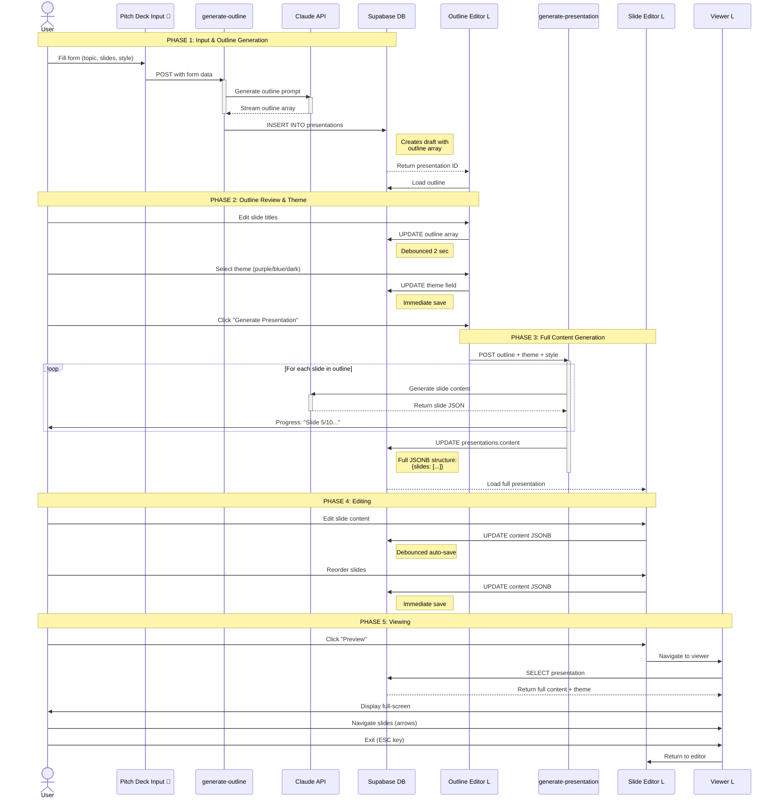
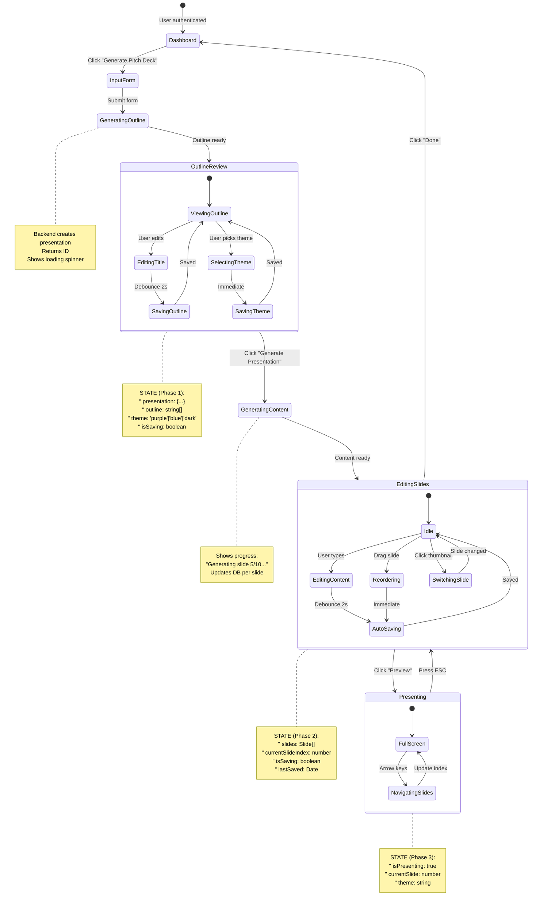
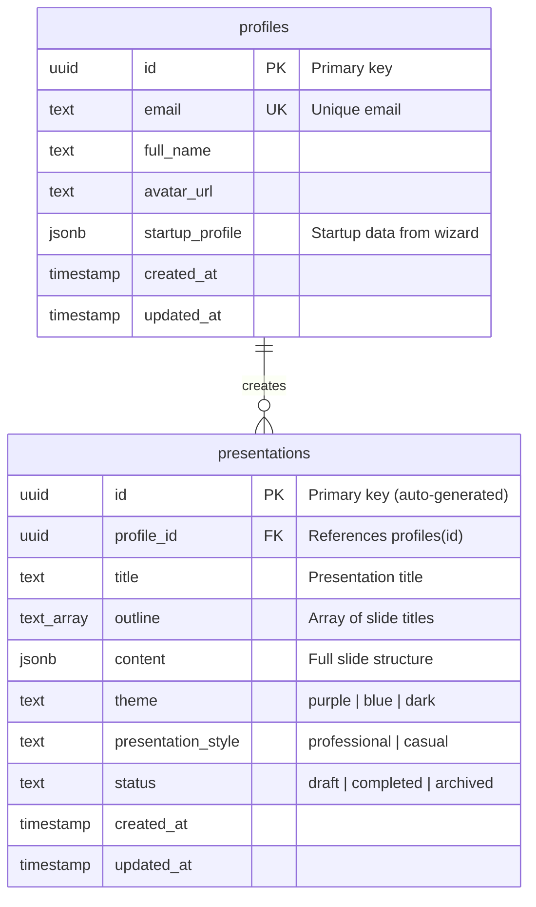
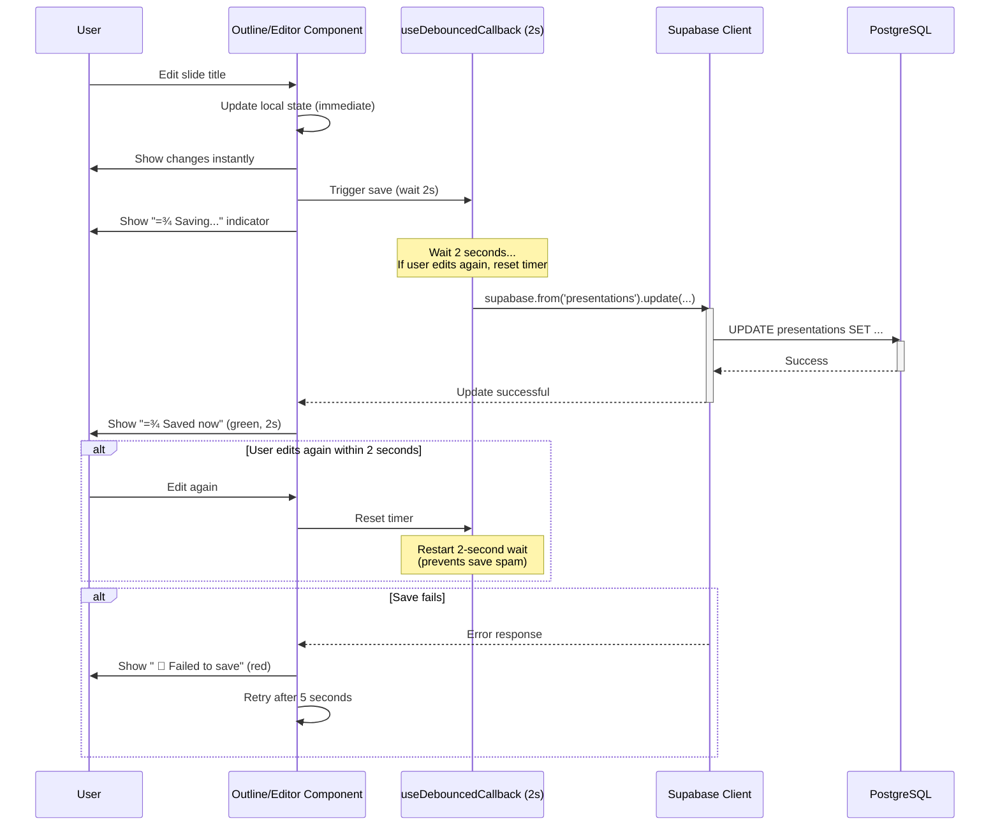
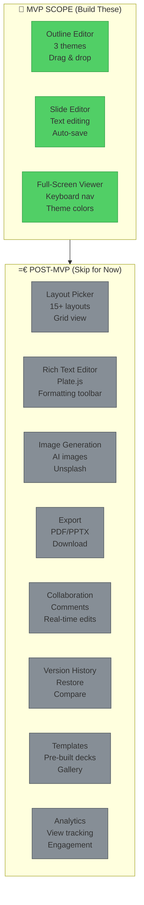

# <¨ PITCH DECK WIZARD - MVP MERMAID DIAGRAMS (LOVABLE)

**Date:** October 15, 2025
**Purpose:** MVP-focused visual diagrams for Lovable implementation
**Context:** Based on live site analysis + presentation-ai reference

---

## =Ê DIAGRAM 1: MVP USER JOURNEY (What Exists vs What's Needed)

```mermaid
graph TD
    Start([User Opens App]) --> Landing[Landing Page ]
    Landing --> Auth{Authenticated?}

    Auth -->|No| Wizard[Onboarding Wizard ]
    Auth -->|Yes| Dashboard[Dashboard ]

    Wizard --> Profile[Startup Profile ]
    Profile --> Dashboard

    Dashboard --> |Click Generate| PitchDeck[Pitch Deck Input <br/>/pitch-deck]

    PitchDeck --> FormFill["User Fills Form 
    " Topic (auto-filled from profile)
    " Number of slides (8-15)
    " Style (Professional/Casual)
    " Language (EN/ES)"]

    FormFill --> |Click Generate| AIGen["AI Generates Outline  
    (Backend exists, not verified)"]

    AIGen --> |30-60 sec| CRITICAL_GAP["=4 CRITICAL GAP
    User is STUCK here!
    No page to land on"]

    CRITICAL_GAP -.->|NEED TO BUILD| OutlineEditor["L Outline Editor
    /presentations/:id/outline
    =4 BLOCKS EVERYTHING"]

    OutlineEditor --> Review["User Reviews Outline L
    " Edit slide titles inline
    " Reorder with drag & drop
    " Delete/add slides
    " See slide count/time estimate"]

    Review --> ThemePick["User Picks Theme L
    " Purple (default)
    " Blue
    " Dark"]

    ThemePick --> |Click Generate Presentation| FullGen["Full Content Generation  
    Show: 'Generating slide 5/10...'"]

    FullGen --> |1-2 min| EditorGap["L Presentation Editor
    /presentations/:id/edit
    =4 CRITICAL PAGE"]

    EditorGap --> EditSlides["User Edits Slides L
    " Click thumbnail (left panel)
    " Edit title & content (right panel)
    " Auto-save every 2 sec
    " Drag to reorder"]

    EditSlides --> Actions{User Action?}

    Actions --> |Preview| ViewerGap["L Presentation Viewer
    /presentations/:id/view
    =4 CRITICAL PAGE"]

    ViewerGap --> FullScreen["Full-Screen Mode L
    " Navigate with arrows
    " Keyboard shortcuts (ESC)
    " Theme colors applied
    " Auto-hide controls"]

    FullScreen --> |Exit| EditSlides

    Actions --> |Done| Dashboard

    style Landing fill:#51cf66,stroke:#2f9e44
    style Dashboard fill:#51cf66,stroke:#2f9e44
    style PitchDeck fill:#51cf66,stroke:#2f9e44
    style FormFill fill:#51cf66,stroke:#2f9e44
    style CRITICAL_GAP fill:#ff6b6b,stroke:#c92a2a,stroke-width:4px
    style OutlineEditor fill:#ff6b6b,stroke:#c92a2a,stroke-width:3px
    style EditorGap fill:#ff6b6b,stroke:#c92a2a,stroke-width:3px
    style ViewerGap fill:#ff6b6b,stroke:#c92a2a,stroke-width:3px
    style Review fill:#ffd43b,stroke:#f59f00
    style ThemePick fill:#ffd43b,stroke:#f59f00
    style EditSlides fill:#ffd43b,stroke:#f59f00
    style FullScreen fill:#ffd43b,stroke:#f59f00
```

**Legend:**
- =â **Green boxes** = Built & working on Lovable
- =4 **Red boxes** = Critical missing pages (MUST BUILD for MVP)
- =á **Yellow boxes** = Features within missing pages
-   **Warning symbol** = Backend exists but not verified

---

## <× DIAGRAM 2: MVP TECHNICAL ARCHITECTURE (Simplified for Lovable)

```mermaid
graph TD
    subgraph Frontend["<¨ Frontend (React/Lovable)"]
        direction TB

        Dashboard[Dashboard Page ]
        InputPage[Pitch Deck Input ]

        OutlinePage[Outline Editor L<br/>PHASE 1 - BUILD THIS FIRST]
        EditorPage[Slide Editor L<br/>PHASE 2]
        ViewerPage[Viewer L<br/>PHASE 3]

        OutlinePage --> ThemeSelector[Theme Selector L]
        OutlinePage --> OutlineList[Draggable Outline List L]

        EditorPage --> Thumbnails[Slide Thumbnails Panel L]
        EditorPage --> ContentEditor[Content Editor L]

        ViewerPage --> FullScreenView[Full-Screen Display L]
        ViewerPage --> KeyboardNav[Keyboard Navigation L]
    end

    subgraph Backend["¡ Supabase Backend"]
        direction TB

        EdgeFunc1["Edge Function:
        generate-outline
        (may exist  )"]

        EdgeFunc2["Edge Function:
        generate-presentation
        (may exist  )"]

        DB[(PostgreSQL Database)]

        PresentationsTable["presentations table 
        " id, profile_id
        " title, outline
        " content (JSONB)
        " theme, status
        " created_at, updated_at"]

        ProfilesTable["profiles table 
        " id, email, full_name
        " startup_profile (JSONB)"]

        DB --> PresentationsTable
        DB --> ProfilesTable
    end

    subgraph External["> External AI"]
        Claude["Anthropic Claude API
        (via Supabase Edge Functions)"]
    end

    Dashboard --> |1. Click Generate| InputPage
    InputPage --> |2. Submit form| EdgeFunc1

    EdgeFunc1 --> |3. Call Claude| Claude
    Claude --> |4. Return outline array| EdgeFunc1

    EdgeFunc1 --> |5. Create record| PresentationsTable
    PresentationsTable --> |6. Return ID| OutlinePage

    OutlinePage --> |7. Edit outline| PresentationsTable
    OutlinePage --> |8. Select theme| PresentationsTable

    OutlinePage --> |9. Generate full deck| EdgeFunc2
    EdgeFunc2 --> |10. Call Claude per slide| Claude
    Claude --> |11. Return content| EdgeFunc2

    EdgeFunc2 --> |12. Update content JSONB| PresentationsTable
    PresentationsTable --> |13. Load presentation| EditorPage

    EditorPage --> |14. Auto-save edits| PresentationsTable
    ViewerPage --> |15. Load for display| PresentationsTable

    ProfilesTable -.->|RLS: profile_id filter| PresentationsTable

    style Dashboard fill:#51cf66,stroke:#2f9e44
    style InputPage fill:#51cf66,stroke:#2f9e44
    style PresentationsTable fill:#51cf66,stroke:#2f9e44
    style ProfilesTable fill:#51cf66,stroke:#2f9e44

    style OutlinePage fill:#ff6b6b,stroke:#c92a2a,stroke-width:3px
    style EditorPage fill:#ff6b6b,stroke:#c92a2a,stroke-width:3px
    style ViewerPage fill:#ff6b6b,stroke:#c92a2a,stroke-width:3px

    style Claude fill:#ffd43b,stroke:#f59f00
    style EdgeFunc1 fill:#339af0,stroke:#1971c2
    style EdgeFunc2 fill:#339af0,stroke:#1971c2
```

---

## =¾ DIAGRAM 3: MVP DATA FLOW (Supabase-Specific)



---

## >é DIAGRAM 4: MVP COMPONENT HIERARCHY

```mermaid
graph TD
    subgraph App["App Root"]
        Router[React Router]
    end

    subgraph LivePages[" Live Pages (Already Built)"]
        Landing[Landing Page]
        Dashboard[Dashboard]
        InputForm[Pitch Deck Input]
        StartupWizard[Startup Profile Wizard]
    end

    subgraph MissingPages["L Missing Pages (MUST BUILD)"]
        OutlineRoute[Outline Editor Route<br/>/presentations/:id/outline]
        EditorRoute[Editor Route<br/>/presentations/:id/edit]
        ViewerRoute[Viewer Route<br/>/presentations/:id/view]
    end

    subgraph Phase1["PHASE 1 Components (Outline Page)"]
        OutlineEditor[OutlineEditor Component<br/>- Draggable list<br/>- Inline editing<br/>- Add/delete slides]

        ThemeSelector[ThemeSelector Component<br/>- 3 theme cards<br/>- Color previews<br/>- Radio selection]

        DragHandle[DragHandle<br/>(@dnd-kit)]

        SlideRow[SortableSlideItem<br/>- Title input<br/>- Edit/delete buttons]
    end

    subgraph Phase2["PHASE 2 Components (Editor Page)"]
        EditorLayout[EditorLayout<br/>- Split view<br/>- Auto-save indicator]

        ThumbnailPanel[Thumbnails Panel<br/>- Vertical list<br/>- Click to select<br/>- Drag to reorder]

        SlideEditor[SlideEditor<br/>- Title input<br/>- Content textarea<br/>- Simple formatting]

        NavControls[Navigation Controls<br/>- Prev/Next buttons<br/>- Slide counter]
    end

    subgraph Phase3["PHASE 3 Components (Viewer Page)"]
        ViewerLayout[ViewerLayout<br/>- Full-screen mode<br/>- Dark background]

        SlideDisplay[SlideDisplay<br/>- Title + content<br/>- Theme colors applied]

        ViewerControls[ViewerControls<br/>- Prev/Next/Exit<br/>- Auto-hide after 3s]

        KeyboardHandler[KeyboardHandler<br/>- Arrow keys<br/>- ESC to exit]
    end

    subgraph Shared["Shared Components (Create as needed)"]
        Button[Button]
        Card[Card]
        Input[Input]
        Toast[Toast Notification]
        LoadingSpinner[Loading Spinner]
    end

    Router --> Landing
    Router --> Dashboard
    Router --> InputForm
    Router --> OutlineRoute
    Router --> EditorRoute
    Router --> ViewerRoute

    OutlineRoute --> OutlineEditor
    OutlineRoute --> ThemeSelector
    OutlineEditor --> SlideRow
    SlideRow --> DragHandle

    EditorRoute --> EditorLayout
    EditorLayout --> ThumbnailPanel
    EditorLayout --> SlideEditor
    EditorLayout --> NavControls

    ViewerRoute --> ViewerLayout
    ViewerLayout --> SlideDisplay
    ViewerLayout --> ViewerControls
    ViewerLayout --> KeyboardHandler

    OutlineEditor --> Toast
    OutlineEditor --> LoadingSpinner
    SlideEditor --> Toast

    style Landing fill:#51cf66,stroke:#2f9e44
    style Dashboard fill:#51cf66,stroke:#2f9e44
    style InputForm fill:#51cf66,stroke:#2f9e44

    style OutlineRoute fill:#ff6b6b,stroke:#c92a2a,stroke-width:3px
    style EditorRoute fill:#ff6b6b,stroke:#c92a2a,stroke-width:3px
    style ViewerRoute fill:#ff6b6b,stroke:#c92a2a,stroke-width:3px

    style OutlineEditor fill:#ffd43b,stroke:#f59f00
    style ThemeSelector fill:#ffd43b,stroke:#f59f00
    style EditorLayout fill:#ffd43b,stroke:#f59f00
    style ViewerLayout fill:#ffd43b,stroke:#f59f00
```

---

## = DIAGRAM 5: MVP STATE MANAGEMENT (Simplified)



---

## =Ë DIAGRAM 6: MVP DATABASE SCHEMA (Supabase-Specific)



**Key Supabase Differences from Prisma/presentation-ai:**
1. L **NO BaseDocument table** - presentations is standalone
2.  **profile_id** not `userId` - matches Supabase naming
3.  **text_array** for outline - PostgreSQL array type
4.  **jsonb** for content - PostgreSQL JSON type
5.  **RLS policies already configured** - users can only see own presentations

**Content JSONB Structure:**
```json
{
  "slides": [
    {
      "id": "slide-1",
      "title": "EventOS Startup Pitch",
      "content": "Welcome to our pitch...",
      "layout": "title"
    },
    {
      "id": "slide-2",
      "title": "The Problem",
      "content": "Event organizers struggle with...",
      "layout": "content"
    }
  ],
  "slideCount": 10
}
```

---

## ¡ DIAGRAM 7: MVP AUTO-SAVE FLOW



---

## <¯ DIAGRAM 8: MVP CRITICAL PATH (Build Order)

```mermaid
graph LR
    Start([Start]) --> P1["PHASE 1<br/>Outline Editor<br/>2-3 days"]

    P1 --> P1A["1. Create route:<br/>/presentations/:id/outline"]
    P1A --> P1B["2. Build OutlineEditor<br/>with drag & drop"]
    P1B --> P1C["3. Build ThemeSelector<br/>3 themes"]
    P1C --> P1D["4. Connect to Supabase<br/>auto-save"]
    P1D --> P1Done[Phase 1 DONE <br/>User can review outlines]

    P1Done --> P2["PHASE 2<br/>Slide Editor<br/>2-3 days"]

    P2 --> P2A["1. Create route:<br/>/presentations/:id/edit"]
    P2A --> P2B["2. Build ThumbnailPanel<br/>left sidebar"]
    P2B --> P2C["3. Build SlideEditor<br/>title + content"]
    P2C --> P2D["4. Connect auto-save<br/>debounced 2s"]
    P2D --> P2Done[Phase 2 DONE <br/>User can edit slides]

    P2Done --> P3["PHASE 3<br/>Viewer<br/>1-2 days"]

    P3 --> P3A["1. Create route:<br/>/presentations/:id/view"]
    P3A --> P3B["2. Build full-screen<br/>layout"]
    P3B --> P3C["3. Add keyboard<br/>navigation"]
    P3C --> P3D["4. Apply theme<br/>colors"]
    P3D --> P3Done[Phase 3 DONE <br/>User can present]

    P3Done --> MVP["MVP COMPLETE! <‰<br/>Total: 5-8 days"]

    style P1 fill:#ff6b6b,stroke:#c92a2a,stroke-width:2px
    style P1Done fill:#51cf66,stroke:#2f9e44,stroke-width:2px
    style P2 fill:#ff6b6b,stroke:#c92a2a,stroke-width:2px
    style P2Done fill:#51cf66,stroke:#2f9e44,stroke-width:2px
    style P3 fill:#ff6b6b,stroke:#c92a2a,stroke-width:2px
    style P3Done fill:#51cf66,stroke:#2f9e44,stroke-width:2px
    style MVP fill:#51cf66,stroke:#2f9e44,stroke-width:3px
```



---

## =
 DIAGRAM 9: MVP vs FULL SYSTEM (Scope Definition)



---

## =Ý KEY MVP PRINCIPLES

### 1. **Focus on Core Flow** <¯
**MVP Goal:** User can create, edit, and view a pitch deck end-to-end

**Must Have:**
-  Outline review with theme selection
-  Text editing with auto-save
-  Full-screen presentation mode

**Nice to Have (Skip):**
- L Advanced layouts (just 1-2 simple layouts)
- L Image generation (text-only for MVP)
- L Export to PDF/PPTX
- L Collaboration features
- L Templates library

### 2. **Simplify Where Possible** ='
**Keep It Simple:**
- **3 themes** not 10+ (purple, blue, dark)
- **Text editing** not rich text editor (simple textarea)
- **2 layouts** not 15+ (title slide, content slide)
- **No images** in MVP (add post-launch)
- **Manual save** indicator not complex sync (show saving/saved)

### 3. **Leverage What Exists** {
**Already Built:**
-  Dashboard with "Generate Pitch Deck" button
-  Input form (`/pitch-deck`)
-  Supabase database with `presentations` table
-  Auth system (Supabase Auth)
-  Design system (consistent UI components)

**Don't Rebuild:**
- Use existing button styles
- Use existing card components
- Use existing color scheme (purple primary)
- Use existing fonts and spacing

### 4. **Prioritize Unblocking** =§
**Critical Blocker:** Outline Editor
- **Why:** Users generate outlines but have nowhere to review them
- **Impact:** 100% of pitch deck flow is blocked
- **Priority:** Build this FIRST (Phase 1)

**Secondary Blocker:** Slide Editor
- **Why:** Users need to edit generated content
- **Impact:** Cannot customize presentations
- **Priority:** Build this SECOND (Phase 2)

**Tertiary:** Viewer
- **Why:** Users need to present/demo
- **Impact:** No way to view final presentation
- **Priority:** Build this THIRD (Phase 3)

### 5. **Test Early, Test Often** >ê
**After Each Phase:**
1. Test complete user flow from start to finish
2. Verify database saves correctly
3. Check auto-save indicator works
4. Test on mobile (responsive design)
5. Verify no errors in console
6. Test with real user account

---

## =€ LOVABLE IMPLEMENTATION STRATEGY

### Week 1: Unblock the Flow

**Day 1-2: Outline Editor**
- Use Lovable prompt from `/home/sk/medellin-spark/main/lovable/12-immediate-action-plan.md`
- Build route `/presentations/:id/outline`
- Install `@dnd-kit` for drag & drop
- Connect to Supabase with auto-save

**Day 3-4: Slide Editor**
- Use prompt from `/home/sk/medellin-spark/main/lovable/09-mvp-simple.md` PART 4
- Build route `/presentations/:id/edit`
- Split view: thumbnails (left) + editor (right)
- Simple textarea for content (no rich text)

**Day 5: Viewer**
- Use prompt from `/home/sk/medellin-spark/main/lovable/09-mvp-simple.md` PART 5
- Build route `/presentations/:id/view`
- Full-screen mode with keyboard navigation
- Apply theme colors (purple/blue/dark)

### Week 2: Polish & Launch

**Day 6-7: Testing**
- End-to-end user journey testing
- Fix bugs and edge cases
- Mobile responsive tweaks
- Performance optimization

**Day 8: Launch MVP**
- Deploy to production
- Monitor for errors
- Gather user feedback
- Plan post-MVP features

---

## =Ê SUCCESS METRICS

**MVP is complete when:**
-  User can create presentation from dashboard
-  User can review and edit AI-generated outline
-  User can select a theme (purple/blue/dark)
-  User can generate full presentation
-  User can edit slide titles and content
-  Auto-save works (shows saving indicator)
-  User can view presentation in full-screen
-  Keyboard navigation works (arrows, ESC)
-  All data persists to Supabase correctly
-  No console errors, no crashes
-  Mobile responsive (stacks properly)

**Target Time:** 5-8 days for full MVP
**Success Criteria:** User can create a 10-slide pitch deck in under 5 minutes

---

## = REFERENCE FILES

**MVP Documentation:**
- `/home/sk/medellin-spark/main/lovable/09-mvp-simple.md` - Complete MVP spec
- `/home/sk/medellin-spark/main/lovable/10-supabase.md` - Supabase integration
- `/home/sk/medellin-spark/main/lovable/11-prompt-pitch.md` - Comprehensive prompts
- `/home/sk/medellin-spark/main/lovable/12-immediate-action-plan.md` - Phase 1 Lovable prompt
- `/home/sk/medellin-spark/main/lovable/13-flowchart-diagrams.md` - Original 9 diagrams

**Live Site Analysis:**
- `/home/sk/medellin-spark/data/firecrawl/2025-10-15/CRAWL-REPORT.md` - What exists
- `/home/sk/medellin-spark/main/lovable/sitemap.md` - Complete sitemap

**Reference Implementation:**
- `/home/sk/medellin-spark/presentation-ai/` - Full Next.js reference app
- `/home/sk/medellin-spark/main/presentation/` - Original diagrams (001-05)

---

**Created:** October 15, 2025
**Purpose:** MVP-focused Mermaid diagrams for Lovable implementation
**Status:**  Ready for development - Start with Phase 1 (Outline Editor)
**Next Action:** Copy Lovable prompt from file 12 and paste into Lovable
