# 🎨 Simple Mermaid Diagrams - Pitch Deck AI Flow

---

## 1️⃣ COMPLETE SYSTEM ARCHITECTURE

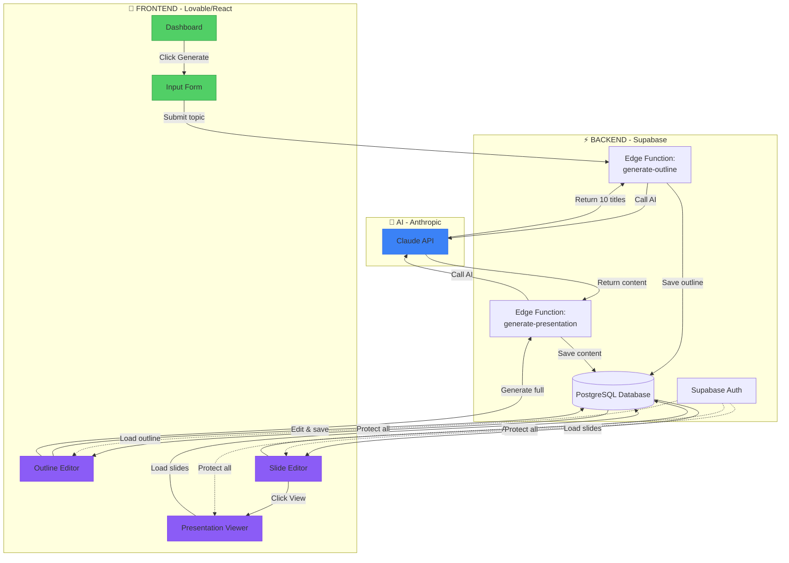

---

## 2️⃣ USER JOURNEY - STAGE BY STAGE

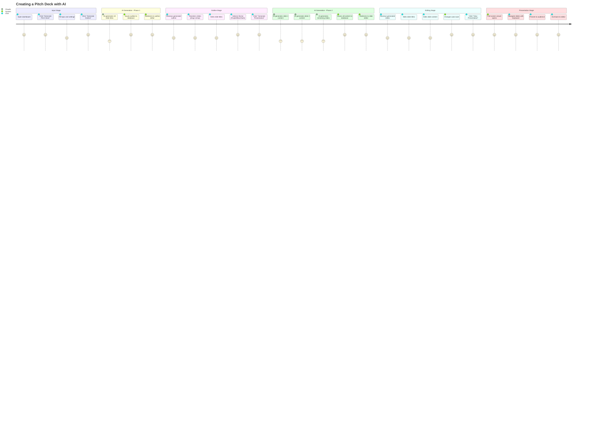

---

## 3️⃣ DATA FLOW - FRONTEND TO BACKEND

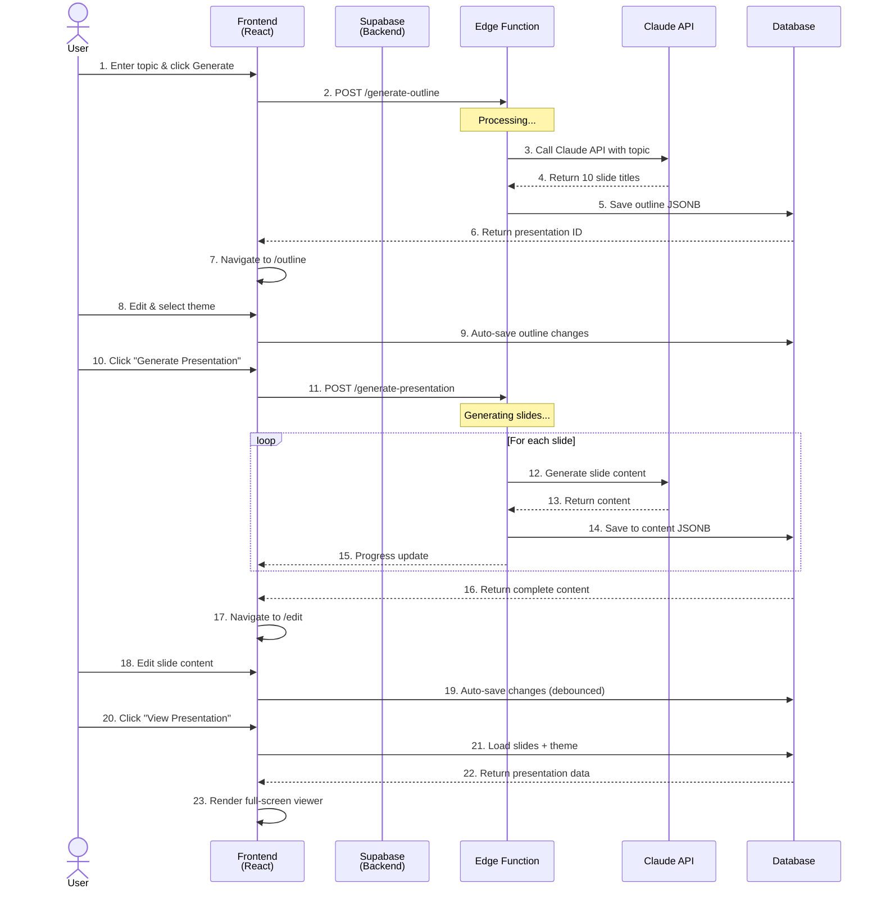

---

## 4️⃣ PAGE FLOW - NAVIGATION

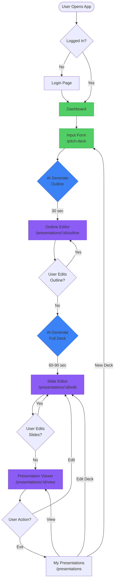

---

## 5️⃣ AI GENERATION FLOW

```mermaid
flowchart LR
    subgraph Phase1["PHASE 1: Outline Generation"]
        A1[User Input:<br/>Topic + Settings] --> B1[Claude API]
        B1 --> C1[Generate 10<br/>Slide Titles]
        C1 --> D1[Save to DB:<br/>outline JSONB]
    end

    subgraph Phase2["PHASE 2: Content Generation"]
        A2[Outline + Theme] --> B2[Claude API]
        B2 --> C2[Generate Slide 1]
        C2 --> D2[Generate Slide 2]
        D2 --> E2[Generate Slide 3-10]
        E2 --> F2[Save to DB:<br/>content JSONB]
    end

    D1 --> A2

    style A1 fill:#ffd43b,stroke:#fab005
    style B1 fill:#3B82F6,stroke:#2563EB
    style B2 fill:#3B82F6,stroke:#2563EB
    style D1 fill:#10B981,stroke:#059669
    style F2 fill:#10B981,stroke:#059669
```

---

## 6️⃣ DATABASE STRUCTURE

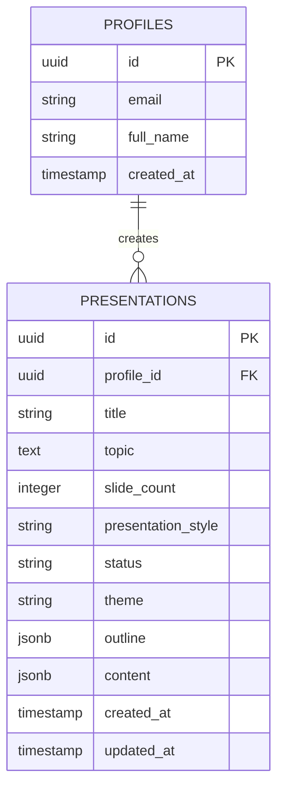

**JSONB Structures:**

```
outline: [
  {id: "slide-1", title: "EventOS Pitch"},
  {id: "slide-2", title: "The Problem"},
  ...
]

content: {
  slides: [
    {
      id: "slide-1",
      title: "EventOS Pitch",
      content: "EventOS is...",
      layout: "title"
    },
    ...
  ],
  slideCount: 10
}
```

---

## 7️⃣ COMPONENT HIERARCHY

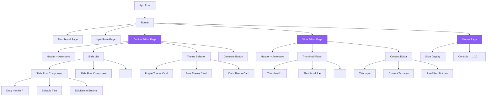

---

## 8️⃣ AUTO-SAVE FLOW

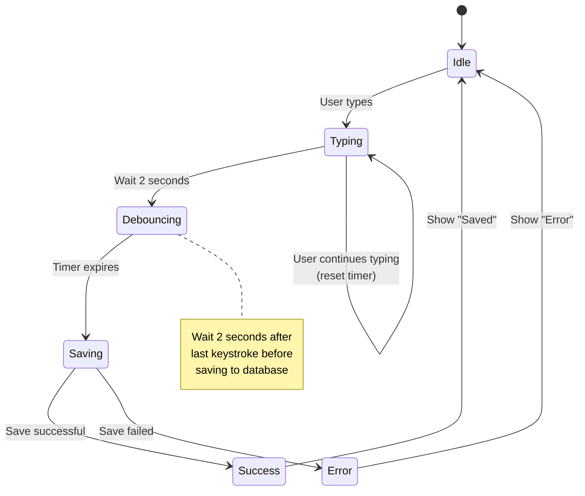

---

## 9️⃣ THEME APPLICATION FLOW

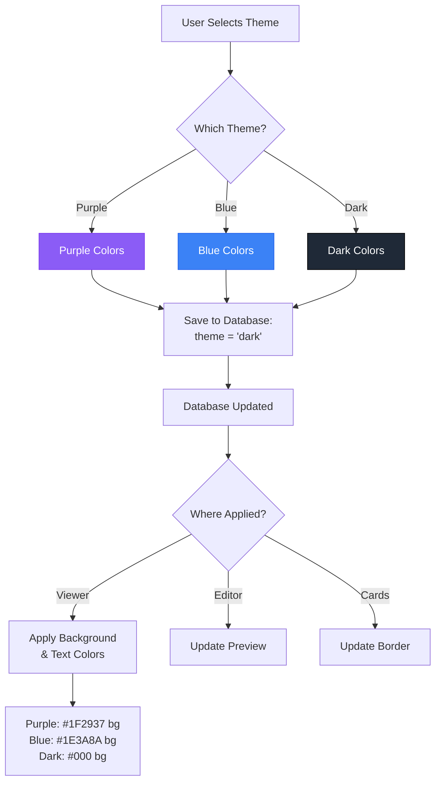

---

## 🔟 ERROR HANDLING FLOW

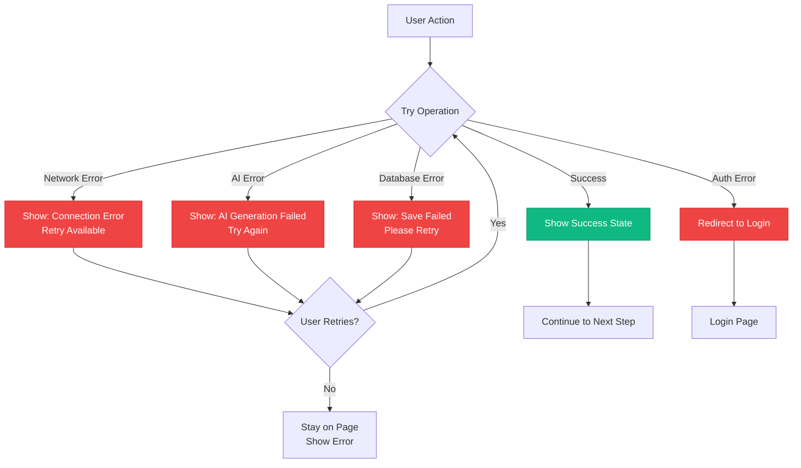

---

## 📊 SUMMARY: THE COMPLETE FLOW

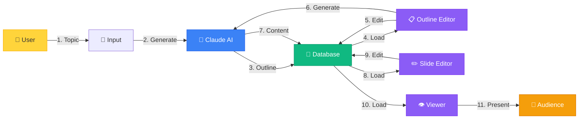

---

## 🎯 KEY TAKEAWAYS

**Three Main Stages:**
1. **Input & Outline** (30 seconds AI) → User reviews and edits outline
2. **Generation & Editing** (60-90 seconds AI) → User edits full slides
3. **Presentation** (Instant) → User presents with full-screen viewer

**Two AI Calls:**
- First: Generate outline (10 slide titles)
- Second: Generate content (full text for each slide)

**Three Database Operations:**
- Save outline after first AI call
- Save content after second AI call
- Auto-save on every user edit (debounced)

**Five Pages:**
1. Input Form (enhance existing)
2. Outline Editor (build new)
3. Slide Editor (build new)
4. Viewer (build new)
5. My Presentations (fix existing)

---

**Use these diagrams to visualize the complete system! 🚀**
