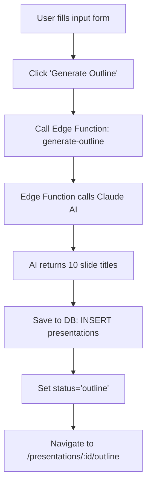
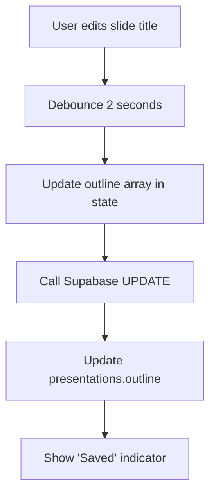
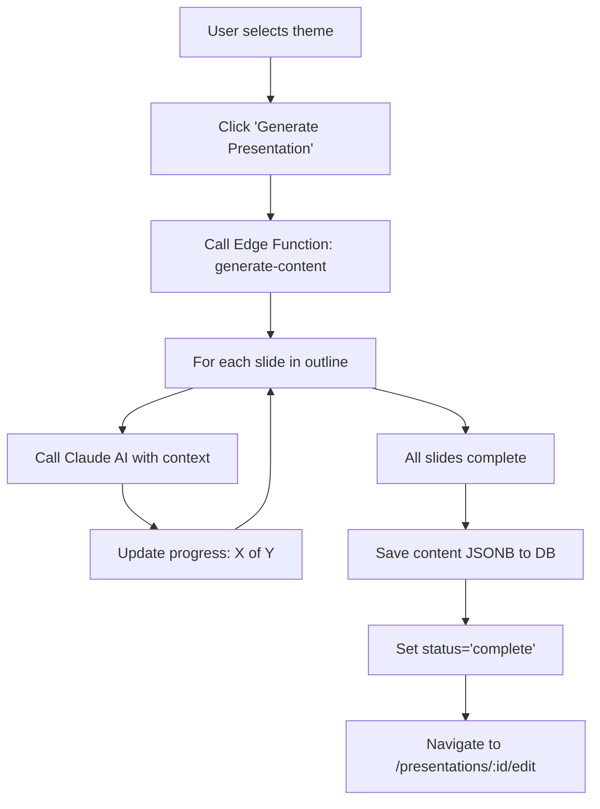
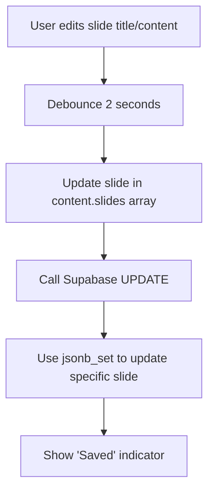

# 02 - Database Architecture

**Created:** 2025-01-15  
**Purpose:** Define all database operations, schemas, and data flows

---

## 📊 Database Schema

### Presentations Table

**Columns Used in MVP:**

```sql
-- Core identification
id                  uuid PRIMARY KEY DEFAULT gen_random_uuid()
profile_id          uuid NOT NULL  -- Owner of the presentation
title               text NOT NULL  -- Presentation title
status              text DEFAULT 'draft'  -- draft | outline | complete

-- User inputs
prompt              text NULL  -- Original user description
presentation_style  text NULL  -- professional | casual | technical
language            text DEFAULT 'en-US'
slide_count         integer DEFAULT 10

-- AI-generated content
outline             text[] NULL  -- Array of slide titles
content             jsonb DEFAULT '{}'  -- Full slide content

-- Visual settings
theme               text DEFAULT 'purple'  -- purple | blue | dark
image_source        text DEFAULT 'ai'

-- Metadata
created_at          timestamptz DEFAULT now()
updated_at          timestamptz DEFAULT now()
last_edited_at      timestamptz DEFAULT now()
```

**Columns NOT used in MVP:**
- `search_results`, `thumbnail_url`, `custom_theme_id`, `is_public`
- `description`, `cover_image_url`, `share_link`, `view_count`
- `last_presented_at`, `deleted_at`, `template_id`, `category`

---

## 📝 Data Structures

### 1. Outline Array (text[])

**Purpose:** Store slide titles for outline editing phase  
**Format:** PostgreSQL text array  

```json
// Database stores as: {"Problem Statement", "Solution Overview", "Market Opportunity"}
// JavaScript receives as:
[
  "Problem Statement",
  "Solution Overview", 
  "Market Opportunity",
  "Business Model",
  "Traction & Metrics",
  "Team & Advisors",
  "Competition Analysis",
  "Financial Projections",
  "Investment Ask",
  "Contact Information"
]
```

**Operations:**
- **Create:** AI generates 10 default titles based on prompt
- **Read:** Display in outline editor as draggable list
- **Update:** Save reordered/edited array on each change
- **Delete:** Remove slide from array (minimum 3 slides required)

---

### 2. Content JSONB

**Purpose:** Store full presentation with all slide content  
**Format:** PostgreSQL JSONB object  

```json
{
  "slides": [
    {
      "id": "slide-1",
      "order": 1,
      "title": "Problem Statement",
      "content": "Event organizers spend 40+ hours per event on repetitive manual tasks:\n\n• Email back-and-forth with speakers\n• Spreadsheet chaos for attendee tracking\n• Last-minute venue changes\n• No centralized communication hub\n\nThis leads to stress, errors, and poor attendee experience.",
      "layout": "content",
      "notes": "Emphasize pain points. Ask audience if they've experienced this."
    },
    {
      "id": "slide-2",
      "order": 2,
      "title": "Solution Overview",
      "content": "EventOS is an AI-powered event management platform that automates the entire event lifecycle...",
      "layout": "content",
      "notes": ""
    }
  ],
  "slideCount": 10,
  "metadata": {
    "generatedAt": "2025-01-15T10:30:00Z",
    "aiModel": "claude-sonnet-4-5",
    "version": "1.0"
  }
}
```

**Slide Object Properties:**
- `id` (string): Unique identifier `slide-1`, `slide-2`, etc.
- `order` (number): Display order (1-indexed)
- `title` (string): Slide title (from outline)
- `content` (string): Markdown-formatted slide content
- `layout` (string): `"title"` for first slide, `"content"` for others
- `notes` (string): Speaker notes (optional)

**Operations:**
- **Create:** AI generates full content for all slides
- **Read:** Display current slide in editor
- **Update:** Save modified slide content (debounced 2s)
- **Navigate:** Switch between slides by index

---

## 🔄 Data Flow Diagrams

### Flow 1: Create New Presentation



**Database Operations:**
```sql
-- 1. Create new presentation
INSERT INTO presentations (
  profile_id,
  title,
  prompt,
  presentation_style,
  language,
  slide_count,
  outline,
  theme,
  status
) VALUES (
  auth.uid(),
  $1,  -- First 50 chars of prompt
  $2,  -- Full user input
  $3,  -- Selected style
  $4,  -- Selected language
  10,  -- Default slide count
  $5,  -- Array of AI-generated titles
  'purple',  -- Default theme
  'outline'
) RETURNING id;
```

---

### Flow 2: Edit Outline



**Database Operations:**
```sql
-- 2. Update outline (reorder, edit, delete)
UPDATE presentations
SET 
  outline = $1,  -- New array with changes
  updated_at = NOW(),
  last_edited_at = NOW()
WHERE id = $2 AND profile_id = auth.uid();
```

---

### Flow 3: Generate Full Presentation



**Database Operations:**
```sql
-- 3. Save generated content
UPDATE presentations
SET 
  content = $1,  -- Full JSONB with all slides
  theme = $2,    -- Selected theme
  status = 'complete',
  updated_at = NOW(),
  last_edited_at = NOW()
WHERE id = $3 AND profile_id = auth.uid();
```

---

### Flow 4: Edit Slide Content



**Database Operations:**
```sql
-- 4. Update specific slide in content JSONB
UPDATE presentations
SET 
  content = jsonb_set(
    content,
    '{slides, $1}',  -- Path to slide by index
    $2::jsonb        -- Updated slide object
  ),
  updated_at = NOW(),
  last_edited_at = NOW()
WHERE id = $3 AND profile_id = auth.uid();
```

---

## 🔐 Row-Level Security (RLS)

**Existing Policies:**

```sql
-- Users can create own presentations
CREATE POLICY "Users can create own presentations"
ON presentations FOR INSERT
WITH CHECK (auth.uid() = profile_id);

-- Users can view own or public presentations
CREATE POLICY "Users can view own presentations or public ones"
ON presentations FOR SELECT
USING (auth.uid() = profile_id OR is_public = true);

-- Users can update own presentations
CREATE POLICY "Users can update own presentations"
ON presentations FOR UPDATE
USING (auth.uid() = profile_id)
WITH CHECK (auth.uid() = profile_id);

-- Users can delete own presentations
CREATE POLICY "Users can delete own presentations"
ON presentations FOR DELETE
USING (auth.uid() = profile_id);
```

**No changes needed for MVP** - existing policies are sufficient.

---

## 📊 Query Patterns

### 1. Fetch Presentation for Editing

```typescript
const { data: presentation, error } = await supabase
  .from('presentations')
  .select('*')
  .eq('id', presentationId)
  .eq('profile_id', userId)
  .single();
```

### 2. Update Outline

```typescript
const { error } = await supabase
  .from('presentations')
  .update({ 
    outline: newOutlineArray,
    updated_at: new Date().toISOString(),
    last_edited_at: new Date().toISOString()
  })
  .eq('id', presentationId)
  .eq('profile_id', userId);
```

### 3. Update Single Slide

```typescript
// First, fetch current content
const { data } = await supabase
  .from('presentations')
  .select('content')
  .eq('id', presentationId)
  .single();

// Update specific slide
const updatedContent = {
  ...data.content,
  slides: data.content.slides.map((slide, idx) => 
    idx === slideIndex 
      ? { ...slide, title, content } 
      : slide
  )
};

// Save back
await supabase
  .from('presentations')
  .update({ 
    content: updatedContent,
    updated_at: new Date().toISOString(),
    last_edited_at: new Date().toISOString()
  })
  .eq('id', presentationId);
```

### 4. Fetch All User Presentations

```typescript
const { data: presentations, error } = await supabase
  .from('presentations')
  .select('id, title, status, slide_count, theme, updated_at, last_edited_at')
  .eq('profile_id', userId)
  .order('last_edited_at', { ascending: false });
```

---

## 🎯 Performance Considerations

**Indexing:**
- `profile_id` already has index (FK)
- `status` should have index for filtering
- `last_edited_at` for sorting dashboard

**JSONB Queries:**
- Avoid frequent `jsonb_set` - use debouncing
- Fetch entire content JSONB, update in memory, save once
- Use `content->>'slides'` for specific queries

**Auto-save Strategy:**
- Debounce user input for 2 seconds
- Show "Saving..." → "Saved" indicator
- Optimistic UI updates (update local state immediately)
- Handle conflicts with last-write-wins

---

## 🔗 Next Steps

1. ✅ Understand database structure
2. → Read `03-user-journey.md` for complete user flow
3. → Read `04-component-architecture.md` for UI components
4. → Read `05-implementation-plan.md` for build order
