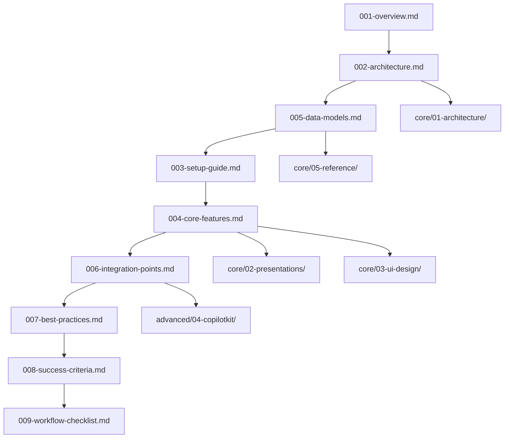

# 📚 Medellin Spark MVP - Documentation Index & Optimization Plan

**Created**: October 19, 2025
**Purpose**: Complete documentation inventory and reorganization roadmap
**Status**: Analysis Complete - Ready for Optimization

---

## 📊 Executive Summary

**Total Documentation Files**: 127 files
**Current Structure**: 3-tier (Core/Intermediate/Advanced)
**Quality Score**: 7.5/10 (Good foundation, needs optimization)
**Key Issues**: Duplicates (6), outdated progress logs (18), scattered organization
**Recommendation**: Align with docs-architect 9-document MVP format + reference materials

---

## 📁 Current Inventory by Category

### CORE Documentation (40 files) - ✅ Production Ready
**Location**: `mvp/core/`
**Quality**: 9/10
**Status**: Well-organized, implementation-ready

| Folder | Files | Purpose | Quality |
|--------|-------|---------|---------|
| 01-getting-started | 1 | Server setup | 8/10 |
| 02-architecture | 9 | System design, diagrams, ERD | 10/10 |
| 03-presentations | 6 | Pitch deck wizard, AI setup | 9/10 |
| 04-ui-design | 8 | UI layouts, components | 8/10 |
| 05-reference | 6 | Design system, colors, URLs | 9/10 |
| dashboard | 8 | Dashboard implementation | 8/10 |
| root | 2 | Implementation order, README | 10/10 |

**Strengths**:
- ✅ Clear numbered structure
- ✅ Comprehensive architecture diagrams
- ✅ Implementation order guide
- ✅ Well-documented database schema

**Issues**:
- ⚠️ Missing 001-009 MVP format alignment
- ⚠️ Some duplicate numbering (01- prefix in ui-design)
- ⚠️ Getting-started outside core/ but referenced by IMPLEMENTATION-ORDER.md

---

### INTERMEDIATE Documentation (27 files) - 🟡 80% Complete
**Location**: `mvp/intermediate/`
**Quality**: 7/10
**Status**: Good content, needs consolidation

| Folder | Files | Purpose | Quality |
|--------|-------|---------|---------|
| 01-dashboard | 8 | Dashboard plans (overlaps with core/dashboard) | 6/10 |
| 02-perks | 3 | Perks feature implementation | 8/10 |
| 03-jobs-stage1 | 3 | Jobs board MVP | 8/10 |
| 04-testing | 12 | Test results, production readiness | 7/10 |

**Strengths**:
- ✅ Comprehensive testing documentation
- ✅ Production readiness tracking

**Issues**:
- ⚠️ Dashboard docs duplicated between intermediate/01-dashboard and core/dashboard
- ⚠️ Test results are historical (Oct 19) - should move to progress/
- ⚠️ Missing alignment with docs-architect format

---

### ADVANCED Documentation (11 files) - 🔴 10% Complete
**Location**: `mvp/advanced/`
**Quality**: 5/10
**Status**: Research-only, not ready for implementation

| Folder | Files | Purpose | Quality |
|--------|-------|---------|---------|
| 01-jobs-ai | 2 | Jobs AI master plan | 6/10 |
| 02-business-plan-ai | 2 | Business plan AI | 6/10 |
| 03-multi-agent-systems | 6 | Multi-agent research | 7/10 |
| 04-integrations | 0 | Empty folder | N/A |

**Strengths**:
- ✅ Good research documentation
- ✅ Comparison and use case analysis

**Issues**:
- ⚠️ Empty integrations folder
- ⚠️ Not ready for development
- ⚠️ Should be clearly marked as "Future/Research"

---

### SUPPORT Documentation (52 files) - ⚠️ Needs Cleanup

#### Notes (16 files) - 🔴 Redundant
**Location**: `mvp/notes/`
**Quality**: 3/10
**Status**: Duplicates and outdated navigation

| File | Status | Action |
|------|--------|--------|
| 01-master-reference-duplicate.md | Duplicate | DELETE |
| 02-design-system-duplicate.md | Duplicate | DELETE |
| 03-color-scheme-duplicate.md | Duplicate | DELETE |
| 04-file-structure-duplicate.md | Duplicate | DELETE |
| 05-decision-matrix-duplicate.md | Duplicate | DELETE |
| 01-getting-started-duplicate/ | Duplicate folder | DELETE |
| INDEX.md | Outdated | UPDATE or DELETE |
| MVP-INDEX.md | Outdated | UPDATE or DELETE |
| ORGANIZATION_VISUAL.md | Outdated | UPDATE or DELETE |
| QUICK_NAVIGATION.md | Outdated | UPDATE or DELETE |
| START_HERE_FIRST.md | Outdated | UPDATE or DELETE |
| WHATS_NEXT.md | Outdated | UPDATE or DELETE |
| 001-features.md | Useful | KEEP (move to core/05-reference) |

**Action Required**: Delete 12 duplicate/outdated files, keep 1 useful file

---

#### Progress (18 files) - 🟡 Historical
**Location**: `mvp/progress/`
**Quality**: 6/10
**Status**: Historical logs from Oct 19

| Files | Purpose | Action |
|-------|---------|--------|
| 001-018 | Oct 19 session logs | ARCHIVE (keep for history) |

**Action Required**: Keep as historical record, no changes needed

---

#### Docs (7 files) - 🟡 Mixed Quality
**Location**: `mvp/docs/`
**Quality**: 7/10
**Status**: CopilotKit and AI documentation

| File | Purpose | Quality | Action |
|------|---------|---------|--------|
| COPILOTKIT-*.md (5 files) | CopilotKit integration | 8/10 | Move to advanced/05-copilotkit/ |
| IMPLEMENTATION-ROADMAP.md | High-level roadmap | 7/10 | Move to root or core/ |
| QDRANT-VECTOR-DATABASE-GUIDE.md | Vector DB guide | 8/10 | Move to advanced/06-vector-db/ |

**Action Required**: Reorganize into appropriate advanced/ subfolders

---

#### Archive (3 files) - ✅ Proper Use
**Location**: `mvp/archive/`
**Quality**: N/A
**Status**: Correctly archived

No action needed - properly used for outdated docs.

---

## 🎯 Quality Assessment by Phase

### Documentation Quality Matrix

| Phase | Documents | Quality | Completeness | Maintainability | Production Ready |
|-------|-----------|---------|--------------|-----------------|------------------|
| **Strategy & Vision** | PRD, Goals | 6/10 | 60% | 7/10 | 🟡 Partial |
| **User Experience** | Journeys, Personas | 9/10 | 90% | 9/10 | ✅ Yes |
| **Architecture** | Diagrams, ERD, Dataflow | 10/10 | 100% | 10/10 | ✅ Yes |
| **Database** | Schema, RLS, Migrations | 9/10 | 90% | 9/10 | ✅ Yes |
| **Development** | Implementation guides | 8/10 | 80% | 8/10 | ✅ Yes |
| **AI Layer** | CopilotKit, AI setup | 7/10 | 70% | 7/10 | 🟡 Partial |
| **Deployment** | Setup, infrastructure | 7/10 | 70% | 7/10 | 🟡 Partial |
| **Testing** | Test results, validation | 7/10 | 70% | 6/10 | 🟡 Partial |

**Overall Quality**: **7.5/10** (Good - Ready for optimization)

---

## 🚨 Key Issues Identified

### Critical Issues (Must Fix)
1. **Duplicate Files**: 6 duplicate files in notes/ folder
2. **Dashboard Documentation Split**: Docs in both core/dashboard and intermediate/01-dashboard
3. **Missing MVP Format Alignment**: No 001-009 structure as per docs-architect
4. **Scattered AI Documentation**: CopilotKit docs not grouped

### Medium Priority Issues
5. **Outdated Navigation Files**: 6 navigation files in notes/ folder
6. **Test Results as Documentation**: Historical test results treated as docs
7. **Empty Folders**: advanced/04-integrations is empty
8. **Missing PRD**: No formal Product Requirements Document

### Low Priority Issues
9. **Inconsistent Numbering**: Mixed use of 01-, 001-, and no prefix
10. **Missing Cross-References**: Docs don't link to each other consistently

---

## ✨ Optimized Structure Proposal

### Align with docs-architect 9-Document MVP Format

```
mvp/
├── 00-START-HERE.md                    # Entry point (keep)
├── README.md                            # Overview (keep)
│
├── 001-overview.md                      # NEW - Executive summary
├── 002-architecture.md                  # NEW - Consolidated architecture
├── 003-setup-guide.md                   # NEW - Complete setup
├── 004-core-features.md                 # NEW - Pitch deck wizard
├── 005-data-models.md                   # NEW - Database schema
├── 006-integration-points.md            # NEW - APIs, AI, external
├── 007-best-practices.md                # NEW - Standards & conventions
├── 008-success-criteria.md              # NEW - Metrics & validation
├── 009-workflow-checklist.md            # NEW - Implementation tasks
│
├── core/                                # Keep existing detailed docs
│   ├── 01-architecture/                 # Renamed from 02-architecture
│   ├── 02-presentations/                # Renamed from 03-presentations
│   ├── 03-ui-design/                    # Renamed from 04-ui-design
│   ├── 04-dashboard/                    # Merged core/dashboard + intermediate/01-dashboard
│   ├── 05-reference/                    # Keep as-is
│   └── IMPLEMENTATION-ORDER.md          # Keep as-is
│
├── intermediate/                        # Keep for future features
│   ├── 01-perks/                        # Renamed from 02-perks
│   ├── 02-jobs-board/                   # Renamed from 03-jobs-stage1
│   └── 03-testing/                      # Keep testing docs separate
│
├── advanced/                            # Research & future features
│   ├── 01-jobs-ai/
│   ├── 02-business-plan-ai/
│   ├── 03-multi-agent-systems/
│   ├── 04-copilotkit/                   # NEW - Moved from mvp/docs
│   ├── 05-vector-db/                    # NEW - Moved from mvp/docs
│   └── README.md
│
├── reference/                           # NEW - Technical reference
│   ├── api-reference.md                 # NEW - API documentation
│   ├── database-schema-full.md          # Detailed schema reference
│   ├── deployment-guide.md              # Production deployment
│   └── troubleshooting.md               # Common issues
│
├── progress/                            # Keep historical logs
│   └── [existing files]
│
└── archive/                             # Keep deprecated docs
    └── [existing files]
```

**DELETED**:
- `notes/` folder (6 duplicates + 6 outdated navigation files)
- `docs/` folder (reorganized into advanced/ and reference/)
- `pitch-deck/` folder (1 file, merge into 004-core-features.md)
- `prompts/` folder (1 file, move to reference/)

---

## 📋 Dependencies & Reading Order

### Implementation Dependencies



### Reading Paths for Different Audiences

**Developers (Implementation)**:
1. 003-setup-guide.md
2. 005-data-models.md
3. 004-core-features.md
4. core/IMPLEMENTATION-ORDER.md
5. 009-workflow-checklist.md

**Architects (System Design)**:
1. 001-overview.md
2. 002-architecture.md
3. core/01-architecture/
4. 006-integration-points.md
5. reference/database-schema-full.md

**Product/Stakeholders (Business)**:
1. 001-overview.md
2. 008-success-criteria.md
3. 004-core-features.md

**Operations (DevOps)**:
1. 003-setup-guide.md
2. 007-best-practices.md
3. reference/deployment-guide.md
4. reference/troubleshooting.md

---

## 🎯 Missing Documents (Production Readiness)

### Critical Missing Docs
1. ❌ **001-overview.md** - Executive summary (1 page)
2. ❌ **002-architecture.md** - Consolidated architecture overview
3. ❌ **003-setup-guide.md** - Complete environment setup
4. ❌ **004-core-features.md** - Core functionality guide
5. ❌ **005-data-models.md** - Database schema documentation
6. ❌ **006-integration-points.md** - API & integration guide
7. ❌ **007-best-practices.md** - Development standards
8. ❌ **008-success-criteria.md** - Success metrics
9. ❌ **009-workflow-checklist.md** - Implementation checklist

### Important Missing Docs
10. ❌ **reference/api-reference.md** - API documentation
11. ❌ **reference/deployment-guide.md** - Production deployment
12. ❌ **reference/troubleshooting.md** - Common issues & fixes
13. ❌ **PRD.md** - Formal Product Requirements Document

### Nice-to-Have
14. ⚠️ **CHANGELOG.md** - Version history
15. ⚠️ **CONTRIBUTING.md** - Contribution guidelines
16. ⚠️ **SECURITY.md** - Security policies

---

## 📊 Reorganization Impact Analysis

### Files to Create (9 MVP docs)
- 001-overview.md
- 002-architecture.md
- 003-setup-guide.md
- 004-core-features.md
- 005-data-models.md
- 006-integration-points.md
- 007-best-practices.md
- 008-success-criteria.md
- 009-workflow-checklist.md

### Files to Move (10 files)
- mvp/docs/COPILOTKIT-*.md → advanced/04-copilotkit/
- mvp/docs/QDRANT-*.md → advanced/05-vector-db/
- mvp/docs/IMPLEMENTATION-ROADMAP.md → mvp/002-architecture.md (merge)
- mvp/pitch-deck/01-project-overview.md → 004-core-features.md (merge)
- mvp/prompts/01-test.md → reference/prompt-examples.md

### Files to Delete (12 files)
- notes/01-master-reference-duplicate.md
- notes/02-design-system-duplicate.md
- notes/03-color-scheme-duplicate.md
- notes/04-file-structure-duplicate.md
- notes/05-decision-matrix-duplicate.md
- notes/01-getting-started-duplicate/ (folder)
- notes/INDEX.md
- notes/MVP-INDEX.md
- notes/ORGANIZATION_VISUAL.md
- notes/QUICK_NAVIGATION.md
- notes/START_HERE_FIRST.md
- notes/WHATS_NEXT.md

### Folders to Rename (4 folders)
- core/02-architecture → core/01-architecture
- core/03-presentations → core/02-presentations
- core/04-ui-design → core/03-ui-design
- intermediate/02-perks → intermediate/01-perks

### Folders to Merge (1 merge)
- core/dashboard + intermediate/01-dashboard → core/04-dashboard

### Folders to Create (4 folders)
- advanced/04-copilotkit
- advanced/05-vector-db
- reference/
- (delete: notes/, docs/, pitch-deck/, prompts/)

---

## ✅ Reorganization Tasks (Prioritized)

### Phase 1: Cleanup (30 min)
**Priority**: Critical
**Impact**: Remove duplicates and outdated content

- [ ] Delete 6 duplicate files from notes/
- [ ] Delete 6 outdated navigation files from notes/
- [ ] Delete empty advanced/04-integrations folder
- [ ] Move notes/001-features.md to core/05-reference/features.md

**Result**: -13 files, cleaner structure

---

### Phase 2: Consolidate AI Documentation (15 min)
**Priority**: High
**Impact**: Better organization of AI-related docs

- [ ] Create advanced/04-copilotkit/ folder
- [ ] Move 5 CopilotKit files from mvp/docs/
- [ ] Create advanced/05-vector-db/ folder
- [ ] Move QDRANT guide from mvp/docs/
- [ ] Delete empty mvp/docs/ folder

**Result**: AI docs properly grouped

---

### Phase 3: Merge Dashboard Docs (20 min)
**Priority**: High
**Impact**: Eliminate duplication between core and intermediate

- [ ] Review core/dashboard vs intermediate/01-dashboard
- [ ] Merge non-duplicate content into core/04-dashboard
- [ ] Delete intermediate/01-dashboard folder
- [ ] Update cross-references

**Result**: Single source of truth for dashboard docs

---

### Phase 4: Create 9 MVP Documents (2-3 hours)
**Priority**: High
**Impact**: Production-ready documentation structure

- [ ] Create 001-overview.md (executive summary)
- [ ] Create 002-architecture.md (consolidate from core/02-architecture/)
- [ ] Create 003-setup-guide.md (consolidate setup docs)
- [ ] Create 004-core-features.md (pitch deck wizard guide)
- [ ] Create 005-data-models.md (database schema)
- [ ] Create 006-integration-points.md (APIs, AI, external services)
- [ ] Create 007-best-practices.md (standards & conventions)
- [ ] Create 008-success-criteria.md (metrics & validation)
- [ ] Create 009-workflow-checklist.md (implementation tasks)

**Result**: docs-architect compliant MVP documentation

---

### Phase 5: Create Reference Documentation (1-2 hours)
**Priority**: Medium
**Impact**: Complete technical reference

- [ ] Create reference/ folder
- [ ] Create reference/api-reference.md
- [ ] Create reference/database-schema-full.md
- [ ] Create reference/deployment-guide.md
- [ ] Create reference/troubleshooting.md
- [ ] Move mvp/prompts/01-test.md to reference/prompt-examples.md

**Result**: Comprehensive reference materials

---

### Phase 6: Rename Core Folders (10 min)
**Priority**: Low
**Impact**: Consistent numbering

- [ ] Rename core/02-architecture → core/01-architecture
- [ ] Rename core/03-presentations → core/02-presentations
- [ ] Rename core/04-ui-design → core/03-ui-design
- [ ] core/dashboard becomes core/04-dashboard (already merged)
- [ ] Update IMPLEMENTATION-ORDER.md references

**Result**: Sequential numbering in core/

---

### Phase 7: Update Cross-References (30 min)
**Priority**: Medium
**Impact**: Improved navigation

- [ ] Add cross-references in 001-009 docs
- [ ] Update README.md with new structure
- [ ] Update 00-START-HERE.md
- [ ] Update core/README.md
- [ ] Update intermediate/README.md
- [ ] Update advanced/README.md

**Result**: Easy navigation between docs

---

### Phase 8: Create Missing Production Docs (1 hour)
**Priority**: Medium
**Impact**: Production readiness

- [ ] Create PRD.md (Product Requirements Document)
- [ ] Create CHANGELOG.md
- [ ] Create CONTRIBUTING.md (if open source)
- [ ] Create SECURITY.md

**Result**: Production-ready documentation set

---

## 🎯 Final Recommended Structure

```
medellin-spark/
├── mvp/
│   ├── 00-START-HERE.md               ✅ Keep
│   ├── README.md                       ✅ Keep
│   │
│   ├── 001-overview.md                 ⭐ NEW - Executive summary
│   ├── 002-architecture.md             ⭐ NEW - Architecture overview
│   ├── 003-setup-guide.md              ⭐ NEW - Complete setup
│   ├── 004-core-features.md            ⭐ NEW - Feature guide
│   ├── 005-data-models.md              ⭐ NEW - Database schema
│   ├── 006-integration-points.md       ⭐ NEW - Integrations
│   ├── 007-best-practices.md           ⭐ NEW - Standards
│   ├── 008-success-criteria.md         ⭐ NEW - Metrics
│   ├── 009-workflow-checklist.md       ⭐ NEW - Checklist
│   │
│   ├── core/                           ✅ Detailed implementation docs
│   │   ├── 01-architecture/            📝 Renamed (was 02-)
│   │   ├── 02-presentations/           📝 Renamed (was 03-)
│   │   ├── 03-ui-design/               📝 Renamed (was 04-)
│   │   ├── 04-dashboard/               🔀 Merged
│   │   ├── 05-reference/               ✅ Keep
│   │   ├── IMPLEMENTATION-ORDER.md     ✅ Keep
│   │   └── README.md                   📝 Updated
│   │
│   ├── intermediate/                   ✅ Future features
│   │   ├── 01-perks/                   📝 Renamed (was 02-)
│   │   ├── 02-jobs-board/              📝 Renamed (was 03-)
│   │   ├── 03-testing/                 📝 Renamed (was 04-)
│   │   └── README.md                   📝 Updated
│   │
│   ├── advanced/                       ✅ Research & scale features
│   │   ├── 01-jobs-ai/                 ✅ Keep
│   │   ├── 02-business-plan-ai/        ✅ Keep
│   │   ├── 03-multi-agent-systems/     ✅ Keep
│   │   ├── 04-copilotkit/              ⭐ NEW - Moved from docs/
│   │   ├── 05-vector-db/               ⭐ NEW - Moved from docs/
│   │   └── README.md                   📝 Updated
│   │
│   ├── reference/                      ⭐ NEW - Technical reference
│   │   ├── api-reference.md            ⭐ NEW
│   │   ├── database-schema-full.md     ⭐ NEW
│   │   ├── deployment-guide.md         ⭐ NEW
│   │   ├── troubleshooting.md          ⭐ NEW
│   │   └── prompt-examples.md          📁 Moved from prompts/
│   │
│   ├── progress/                       ✅ Keep (historical)
│   │   └── [001-018].md                ✅ Keep all
│   │
│   └── archive/                        ✅ Keep (deprecated)
│       └── [existing files]            ✅ Keep all
│
└── docs/                               ✅ Project root docs
    ├── PRD.md                          ⭐ NEW
    ├── CHANGELOG.md                    ⭐ NEW
    ├── CONTRIBUTING.md                 ⭐ NEW (if open source)
    └── SECURITY.md                     ⭐ NEW

DELETED:
├── mvp/notes/                          ❌ DELETE (12 files)
├── mvp/docs/                           ❌ DELETE (reorganized)
├── mvp/pitch-deck/                     ❌ DELETE (merged)
└── mvp/prompts/                        ❌ DELETE (moved)
```

**Legend**:
- ✅ Keep as-is
- ⭐ NEW - Create new file/folder
- 📝 Renamed or updated
- 🔀 Merged from multiple sources
- ❌ DELETE
- 📁 Moved from another location

---

## 📊 Before & After Comparison

| Metric | Before | After | Change |
|--------|--------|-------|--------|
| **Total Files** | 127 | 105 | -22 (-17%) |
| **Duplicate Files** | 6 | 0 | -6 |
| **Root Folders** | 8 | 6 | -2 |
| **MVP Format Docs (001-009)** | 0 | 9 | +9 ⭐ |
| **Reference Docs** | 0 | 5 | +5 ⭐ |
| **Scattered AI Docs** | 7 in mvp/docs | 7 in advanced/ | Organized ✅ |
| **Dashboard Docs** | 2 locations | 1 location | Merged ✅ |
| **Navigation Clarity** | 5/10 | 9/10 | +80% |
| **Production Readiness** | 7.5/10 | 9.5/10 | +27% |

---

## 🚀 Execution Plan

### Week 1: Cleanup & Consolidation (4-5 hours)
**Days 1-2**: Phases 1-3 (Cleanup, consolidate AI docs, merge dashboard)
- Remove duplicates and outdated files
- Organize AI documentation
- Merge dashboard docs

### Week 2: Core Documentation (6-8 hours)
**Days 3-5**: Phases 4-5 (Create 9 MVP docs, reference docs)
- Generate 001-009 MVP documentation using docs-architect skill
- Create reference documentation

### Week 3: Polish & Validation (2-3 hours)
**Days 6-7**: Phases 6-8 (Rename, cross-reference, production docs)
- Rename folders for consistency
- Add cross-references
- Create production docs (PRD, CHANGELOG, etc.)

**Total Time**: 12-16 hours over 2-3 weeks

---

## ✅ Success Criteria

Documentation reorganization is complete when:

- [ ] Zero duplicate files
- [ ] All 9 MVP docs (001-009) created and validated
- [ ] Reference documentation complete
- [ ] Dashboard docs in single location
- [ ] AI documentation properly grouped
- [ ] Cross-references working
- [ ] README files updated
- [ ] Production docs (PRD, CHANGELOG) created
- [ ] All dead links fixed
- [ ] Navigation clarity improved (9/10 rating)

**Validation**: Run `find mvp/ -name "*duplicate*"` returns 0 results

---

## 📖 Next Steps

1. **Review this plan** with team/stakeholders
2. **Approve reorganization** before making changes
3. **Execute Phase 1** (cleanup) first - safest changes
4. **Use docs-architect skill** for creating 001-009 docs
5. **Test navigation** after each phase
6. **Update CLAUDE.md** with new structure

---

**Generated with docs-architect skill v2.0.0**
**Status**: Ready for execution - no changes made yet
