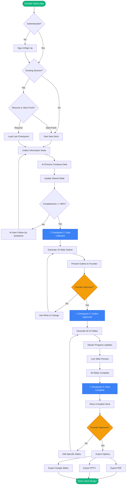
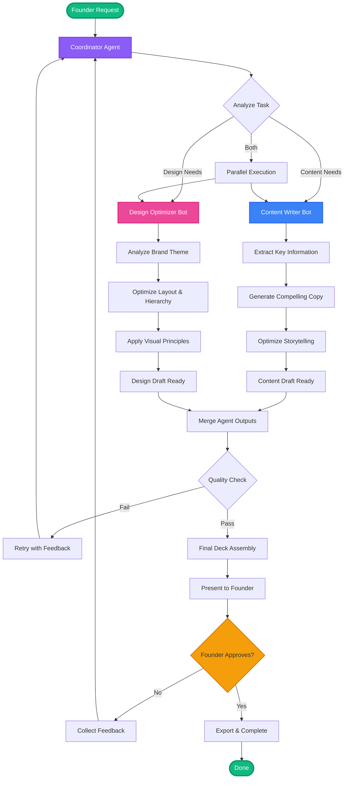
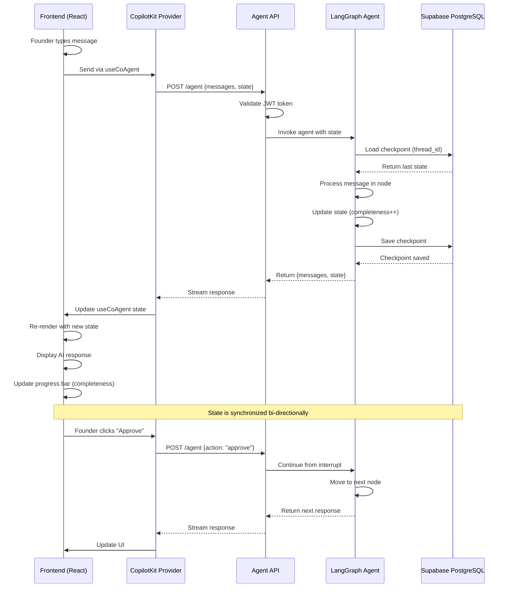
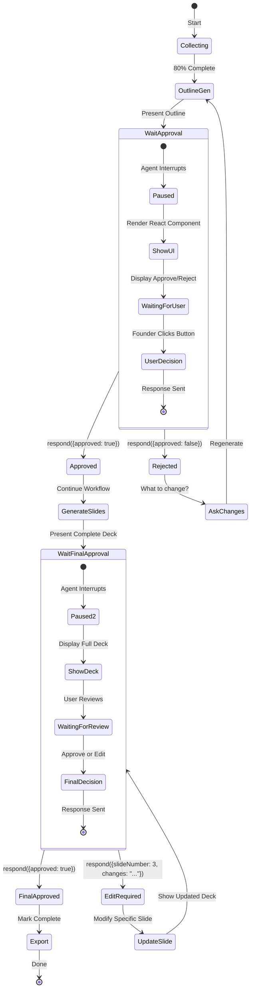
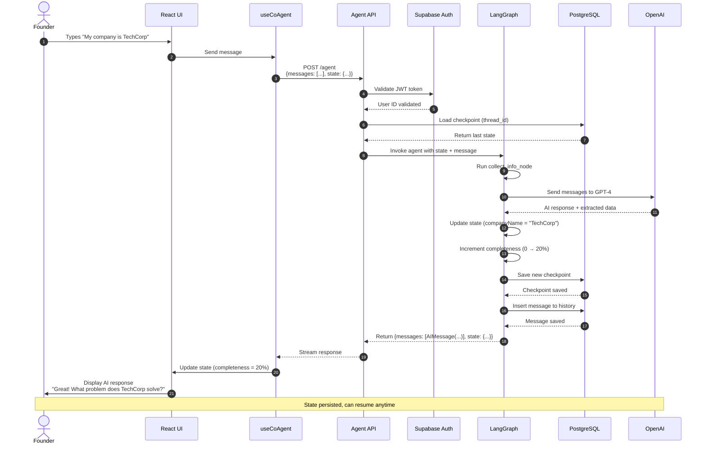
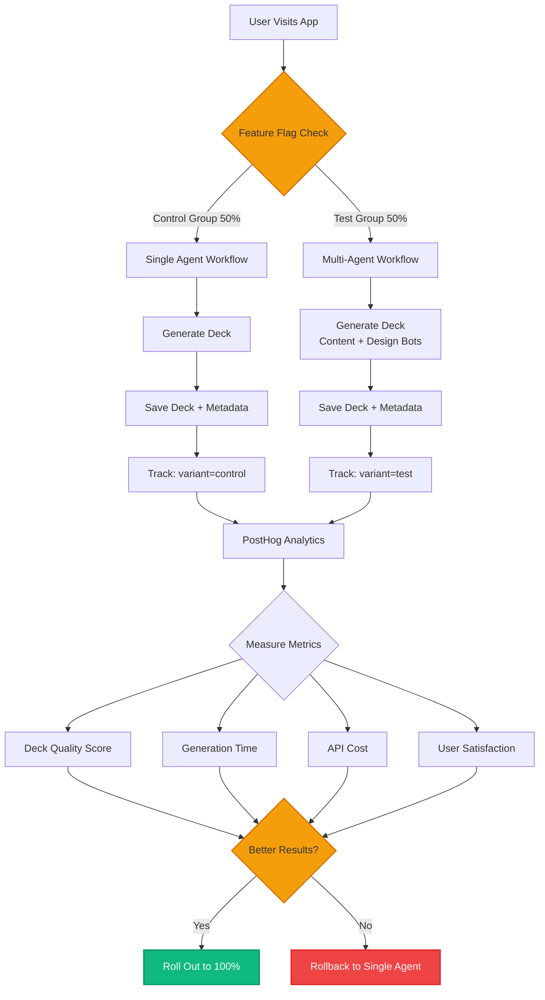

# CopilotKit LangGraph - Architecture Diagrams

**Date**: October 21, 2025  
**Purpose**: Visual representations of pitch deck generator workflows  
**Format**: Mermaid diagrams (production-quality)

---

## 🎨 Diagram Legend

**Standard Color Coding**:
- 🟢 **Green** (#10B981): User-facing steps, success states
- 🔵 **Blue** (#3B82F6): AI processing nodes, system operations
- 🟠 **Orange** (#F59E0B): Human approval gates (HITL), decisions
- 🟣 **Purple** (#8B5CF6): Coordination, orchestration agents
- 🔴 **Pink** (#EC4899): Design/specialist agents
- ⚪ **White/Gray**: External services, databases

**Standard Shapes**:
- **Rectangle**: Process/node/component
- **Diamond**: Decision point/conditional
- **Cylinder**: Database/storage
- **Cloud**: External API/service
- **Rounded Box**: Start/end states
- **Subgraph**: Logical groupings

**Symbols**:
- 💾 **Checkpoint**: State saved to database
- 🟠 **HITL**: Human-in-the-loop approval required
- ⏸️ **Pause**: Workflow interrupts, waits for user

**Cross-References**:
- Diagram 1 → Feature: Node Flow ([02-features-table.md](./02-features-table.md#node-flow))
- Diagram 2 → Feature: Multi-Agent ([02-features-table.md](./02-features-table.md#multi-agent))
- Diagram 3 → Feature: Shared State ([02-features-table.md](./02-features-table.md#shared-state))
- Diagram 4 → Feature: HITL ([02-features-table.md](./02-features-table.md#hitl))
- Diagram 5 → Phase 3 Deployment ([03-phase-plan.md](./03-phase-plan.md#deployment))
- Diagram 6 → Guardrails ([05-guardrails.md](./05-guardrails.md#message-persistence))
- Diagram 7 → Phase 3 ([03-phase-plan.md](./03-phase-plan.md#phase-3))

---

## Diagram 1: Single-Agent Workflow (Phase 1 MVP)

### Purpose
Show how a founder creates a pitch deck through conversational AI workflow with checkpoints and human approval.

### Mermaid Diagram



---

### Key Elements Explained

**Start → Authentication**:
- Supabase Auth validates user
- JWT token issued for agent communication

**Session Check**:
- Query `pitch_conversations` table for `status = 'in_progress'`
- If found → Offer to resume from last checkpoint
- If not → Start fresh

**Collect Information (Node)**:
- AI asks intelligent questions
- Extracts: company name, problem, solution, market, traction, team, ask
- Tracks completeness: 0% → 100%
- Uses `useCoAgent` for shared state

**Checkpoints (💾)**:
1. **After 80% data collection**: Can resume if browser closes
2. **After outline approval**: Most expensive part not re-done
3. **After deck generation**: Complete deck persisted

**Human-in-the-Loop (HITL) Gates** 🟠:
1. **Outline Approval**: Founder reviews 10-slide structure before generation
2. **Deck Approval**: Founder reviews final deck before marking complete

**State Persistence**:
- All state saved to PostgreSQL via LangGraph checkpointer
- Thread ID: `${user_id}_${deck_id}`
- Enables multi-session work

---

## Diagram 2: Multi-Agent Architecture (Phase 3 Advanced)

### Purpose
Show how specialized AI agents collaborate for superior deck quality.

### Mermaid Diagram



---

### Agent Specialization

**Coordinator Agent** 🟣:
- Routes tasks to specialist agents
- Manages agent state and handoffs
- Handles errors and retries

**Content Writer Bot** 🔵:
- **Specialized Model**: GPT-4 fine-tuned on successful pitch decks
- **Responsibilities**:
  - Extract key information from founder input
  - Generate compelling, investor-friendly copy
  - Optimize storytelling (problem → solution → traction)
  - Ensure clarity (no jargon)
- **Output**: Text content for all 10 slides

**Design Optimizer Bot** 🔴:
- **Specialized Model**: GPT-4 Vision + design principles
- **Responsibilities**:
  - Analyze brand theme (colors, fonts, logo)
  - Optimize layout and visual hierarchy
  - Ensure consistency across slides
  - Apply design best practices (white space, contrast, alignment)
- **Output**: Styled slides with visual design applied

**Quality Check**:
- Validate all slides have required fields
- Check content length (not too long/short)
- Verify design consistency
- Run through moderation API

---

## Diagram 3: Shared State Architecture

### Purpose
Show how state flows between frontend (React) and backend (LangGraph agent).

### Mermaid Diagram



---

### State Synchronization Details

**Frontend State (React)**:
```typescript
const { state, setState } = useCoAgent<PitchDeckState>({
  name: "pitch_deck_agent",
  initialState: {
    companyName: "",
    problem: "",
    solution: "",
    completeness: 0,
    status: "collecting"
  }
});

// State updates automatically when agent responds
console.log(state.completeness);  // 0 → 20 → 40 → 80 → 100
```

**Backend State (Python)**:
```python
class PitchDeckState(CopilotKitState):
    company_name: str = ""
    problem: str = ""
    solution: str = ""
    completeness: int = 0
    status: Literal["collecting", "outlining", "generating", "complete"]
```

**Checkpoint Storage (PostgreSQL)**:
```sql
CREATE TABLE langgraph_checkpoints (
    thread_id TEXT PRIMARY KEY,
    checkpoint_ns TEXT,
    checkpoint_id TEXT,
    parent_checkpoint_id TEXT,
    type TEXT,
    checkpoint JSONB,  -- Entire state stored here
    metadata JSONB,
    created_at TIMESTAMP DEFAULT NOW()
);
```

---

## Diagram 4: HITL (Human-in-the-Loop) Flow

### Purpose
Show how agent pauses for human approval using LangGraph interrupts.

### Mermaid Diagram



---

### HITL Implementation Details

**Frontend (React)**:
```typescript
useCopilotAction({
  name: "presentOutline",
  renderAndWaitForResponse: ({ args, respond, status }) => {
    if (status !== "executing") return null;
    
    return (
      <div className="approval-modal">
        <h3>Review Your Deck Outline</h3>
        <ol>
          {args.slides.map((slide, i) => (
            <li key={i}>{slide.title}</li>
          ))}
        </ol>
        
        <div className="actions">
          <button onClick={() => respond({ approved: false })}>
            Make Changes
          </button>
          <button onClick={() => respond({ approved: true })}>
            Generate Deck
          </button>
        </div>
      </div>
    );
  }
});
```

**Backend (Python)**:
```python
from langgraph.types import Command, interrupt

async def present_outline_node(state: PitchDeckState):
    outline = generate_outline(state)
    
    # Interrupt workflow and wait for human response
    approval = interrupt({
        "slides": outline,
        "question": "Do you approve this outline?"
    })
    
    if approval.get("approved"):
        return Command(goto="generate_slides_node")
    else:
        return Command(goto="regenerate_outline_node")
```

---

## Diagram 5: Deployment Architecture

### Purpose
Show production infrastructure and data flow.

### Mermaid Diagram

```mermaid
graph TB
    subgraph "User's Browser"
        UI[React App<br/>Vite + TypeScript]
        CK[CopilotKit Hooks<br/>useCoAgent, useCopilotAction]
    end
    
    subgraph "CDN (Vercel)"
        Static[Static Assets<br/>HTML, CSS, JS]
    end
    
    subgraph "Backend (Railway/Fly.io)"
        API[FastAPI Server<br/>Port 8000]
        Agent[LangGraph Agent<br/>State Machine]
    end
    
    subgraph "AI Services"
        OpenAI[OpenAI API<br/>GPT-4 / GPT-3.5]
        Anthropic[Anthropic API<br/>Claude (optional)]
    end
    
    subgraph "Supabase"
        Auth[Supabase Auth<br/>JWT Tokens]
        DB[(PostgreSQL<br/>User Data + Checkpoints)]
        Storage[Storage<br/>Logos, Exports]
    end
    
    subgraph "Monitoring"
        Sentry[Sentry<br/>Error Tracking]
        Grafana[Grafana<br/>Metrics Dashboard]
    end
    
    UI --> CK
    CK --> Static
    CK --> API
    
    API --> Auth
    Auth --> DB
    
    API --> Agent
    Agent --> OpenAI
    Agent --> Anthropic
    Agent --> DB
    Agent --> Storage
    
    API --> Sentry
    Agent --> Grafana
    
    style UI fill:#3B82F6,stroke:#2563EB,stroke-width:2px,color:#fff
    style Agent fill:#8B5CF6,stroke:#7C3AED,stroke-width:2px,color:#fff
    style DB fill:#10B981,stroke:#059669,stroke-width:2px,color:#fff
    style OpenAI fill:#F59E0B,stroke:#D97706,stroke-width:2px,color:#fff
```

---

### Infrastructure Components

**Frontend (Vercel)**:
- React app built with Vite
- Deployed to Vercel Edge Network
- Auto-SSL, CDN, instant deploys
- Cost: $20/month (Pro plan)

**Backend (Railway/Fly.io)**:
- Python FastAPI server
- LangGraph agent
- WebSocket support for streaming
- Cost: $30-50/month (depending on usage)

**Supabase**:
- PostgreSQL database (user data, checkpoints)
- Authentication (JWT tokens)
- Storage (logos, exported PDFs)
- Cost: $25/month (Pro plan)

**AI APIs**:
- OpenAI: $0.03/1K tokens (GPT-4)
- Anthropic: $0.015/1K tokens (Claude, optional)
- Average cost: $1.50 per deck

**Monitoring**:
- Sentry: Error tracking, $26/month
- Grafana Cloud: Metrics, $49/month
- Total: $75/month

**Total Monthly Cost**: ~$200-250/month

---

## Diagram 6: Data Flow (Message Lifecycle)

### Purpose
Show complete lifecycle of a founder's message.

### Mermaid Diagram



---

### Message Processing Steps

1. **User Input**: Founder types message in React UI
2. **Hook Capture**: `useCoAgent` captures and sends to backend
3. **API Gateway**: FastAPI receives request
4. **Authentication**: Supabase validates JWT token
5. **Load State**: Retrieve last checkpoint from PostgreSQL
6. **Agent Processing**: LangGraph node processes message
7. **AI Invocation**: Send to OpenAI GPT-4
8. **State Update**: Extract data, update completeness
9. **Checkpoint Save**: Persist state to PostgreSQL
10. **Message History**: Save message for audit
11. **Response Streaming**: Stream back to frontend
12. **UI Update**: React re-renders with new state
13. **Display**: Founder sees AI response

**Time**: ~2-3 seconds end-to-end

---

## Diagram 7: Feature Flag & A/B Testing Flow

### Purpose
Show how to gradually roll out new features (e.g., multi-agent).

### Mermaid Diagram



---

### Feature Flag Implementation

**Frontend (PostHog)**:
```typescript
import { useFeatureFlagEnabled } from 'posthog-js/react';

function PitchDeckWizard() {
  const multiAgentEnabled = useFeatureFlagEnabled('multi-agent-beta');
  
  const agentName = multiAgentEnabled 
    ? 'multi_agent_coordinator' 
    : 'single_agent';
  
  const { state } = useCoAgent({
    name: agentName,
    initialState: { completeness: 0 }
  });
  
  // Track which variant user sees
  useEffect(() => {
    posthog.capture('deck_generation_started', {
      variant: multiAgentEnabled ? 'multi_agent' : 'single_agent'
    });
  }, []);
  
  return <CopilotChat />;
}
```

**Backend (Agent Selection)**:
```python
def get_agent_for_user(user_id: str):
    # Check feature flag
    is_multi_agent = posthog_client.is_feature_enabled(
        "multi-agent-beta",
        user_id
    )
    
    if is_multi_agent:
        return multi_agent_graph
    else:
        return single_agent_graph
```

**Metrics to Track**:
- **Quality**: Founder rating (1-5 stars)
- **Time**: Seconds to generate deck
- **Cost**: Total API spend
- **Satisfaction**: NPS score
- **Conversion**: Pro upgrade rate

---

## Summary: Diagram Usage Guide

| Diagram | Use Case | Audience |
|---------|----------|----------|
| **1. Single-Agent Workflow** | Explain MVP flow to developers | Developers, PMs |
| **2. Multi-Agent Architecture** | Show advanced capabilities to investors | Investors, Technical Users |
| **3. Shared State Architecture** | Debug state sync issues | Developers |
| **4. HITL Flow** | Design approval UX | Designers, Developers |
| **5. Deployment Architecture** | Plan infrastructure | DevOps, CTOs |
| **6. Message Lifecycle** | Optimize performance | Backend Engineers |
| **7. Feature Flag Flow** | Plan gradual rollout | Product Managers, Engineers |

---

**Created**: October 21, 2025  
**Status**: ✅ Complete visual documentation  
**Format**: Mermaid diagrams (render in GitHub, Markdown viewers)  
**Next**: Use diagrams in presentations, documentation, and onboarding

---

## Navigation

**Previous**: [06-pitch-deck-outline.md](./06-pitch-deck-outline.md) - Investor Pitch  
**Next**: [00-INDEX.md](./00-INDEX.md) - Back to Index  
**Index**: [00-INDEX.md](./00-INDEX.md)

---

*These diagrams provide production-quality visual documentation for the AI pitch deck generator architecture, workflows, and data flows powered by CopilotKit + LangGraph with standardized color coding and cross-references.*


