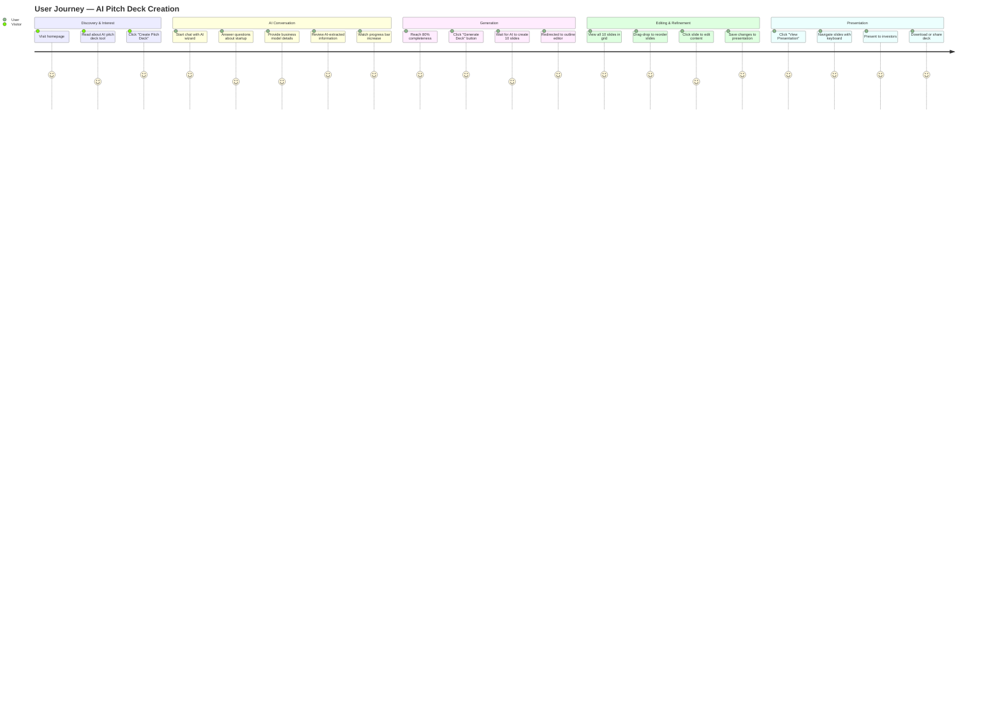
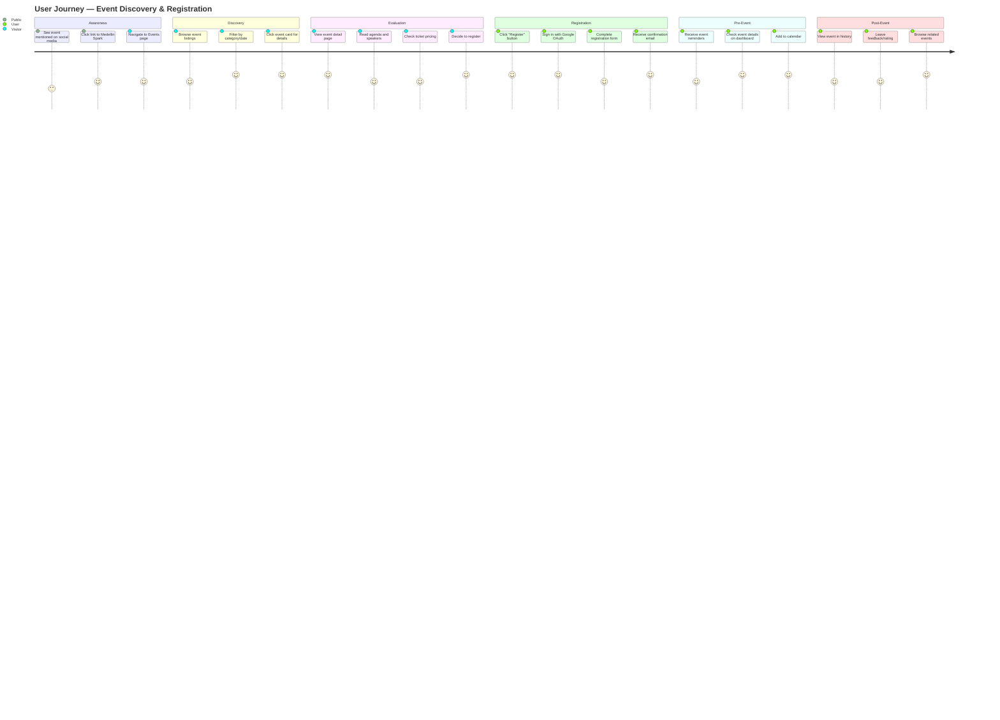
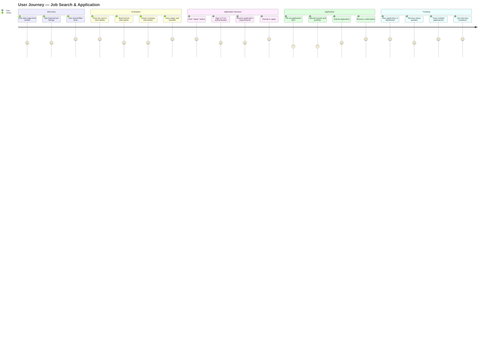
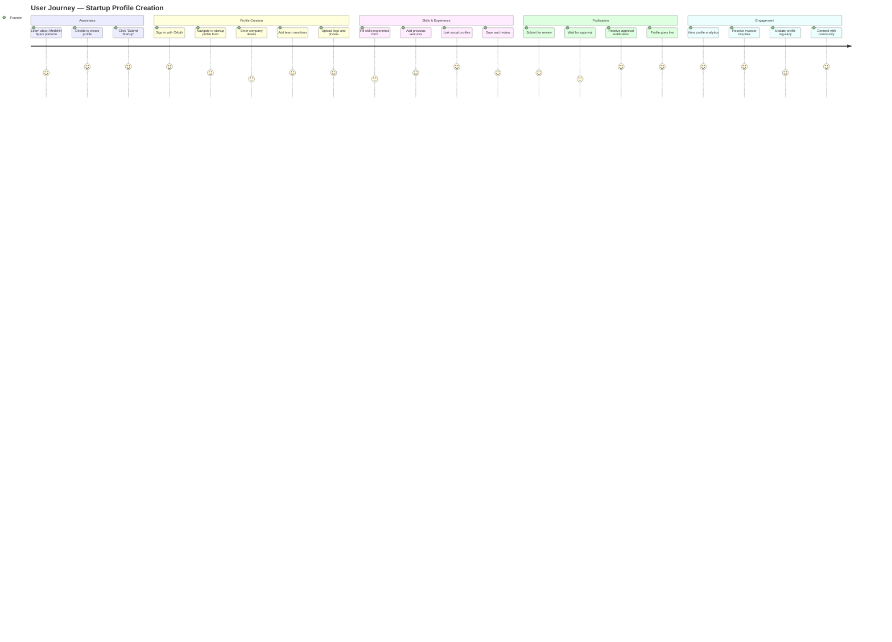
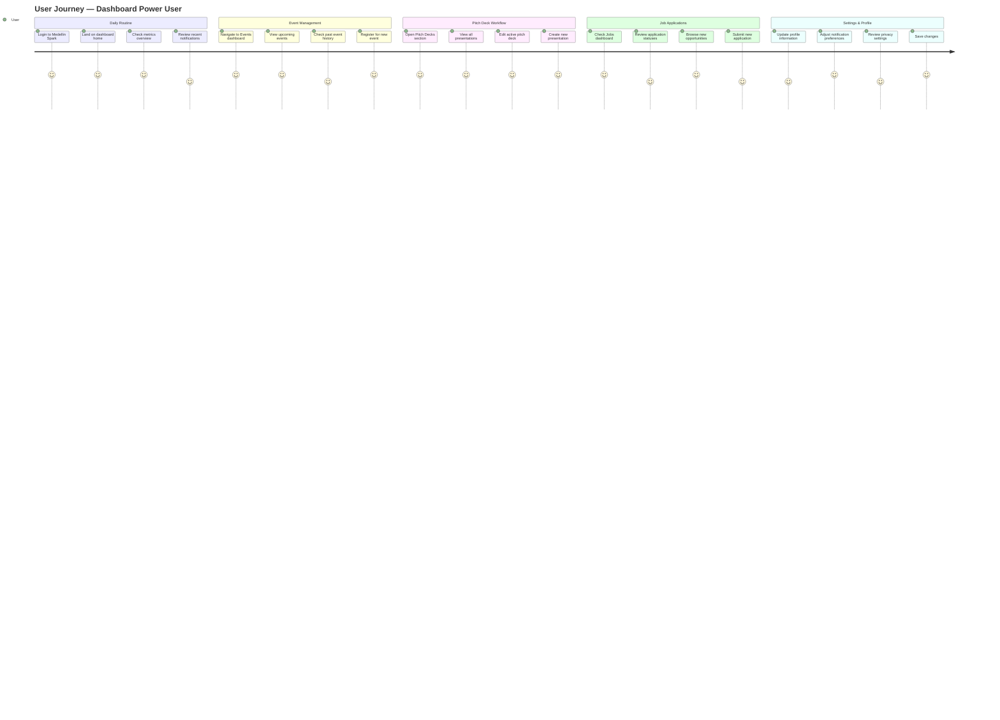
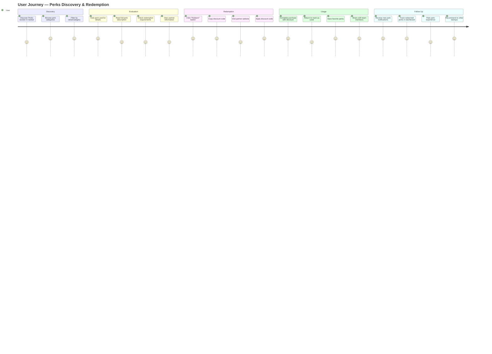
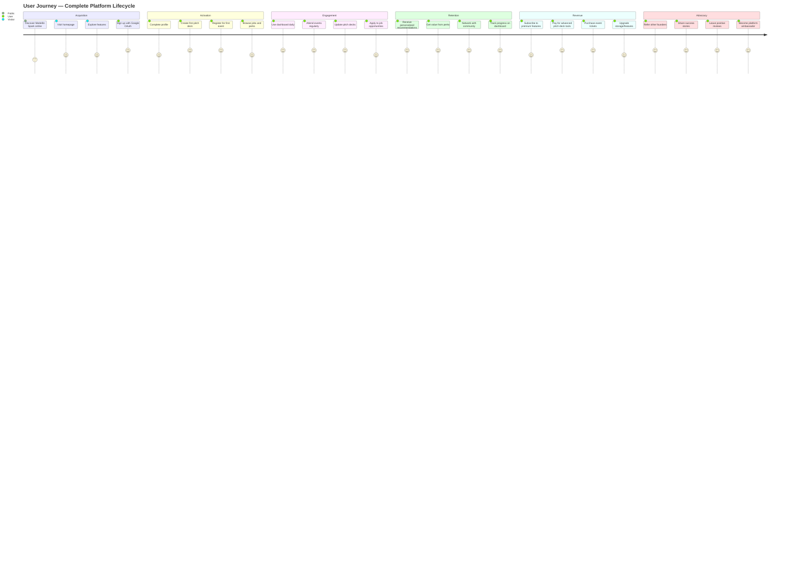

# Medellin Spark - User Journey Diagrams

**Date**: October 20, 2025
**Purpose**: Complete user journey visualizations using Mermaid
**Platform**: Medellin AI - Startup ecosystem platform with AI-powered pitch deck generation

---

## Journey 1: AI-Powered Pitch Deck Creation

**Primary Feature**: The flagship AI wizard that guides users through creating investor-ready presentations

**Summary**:
- **Discovery**: User learns about AI-powered pitch deck creation (emotional score: 4-5/5)
- **AI Conversation**: Interactive chat builds deck foundation with progress tracking (4-5/5)
- **Generation**: AI creates complete 10-slide presentation in seconds (4-5/5)
- **Editing**: Intuitive drag-drop interface for refinement (4-5/5)
- **Presentation**: Professional viewing and sharing capabilities (5/5)

**Friction Points**:
- Waiting for AI response (mitigated by streaming)
- Learning curve for first-time users (mitigated by guided wizard)

**Success Metrics**:
- 80%+ completeness before generation allowed
- 10 slides created automatically
- Instant redirect to outline editor

---

## Journey 2: Event Discovery & Registration

**Feature**: Browse and register for startup ecosystem events

**Summary**:
- **Awareness**: Social sharing drives traffic (emotional score: 3-4/5)
- **Discovery**: Clean browsing with filtering (4-5/5)
- **Evaluation**: Detailed event pages with all information (4-5/5)
- **Registration**: Smooth OAuth flow with instant confirmation (4-5/5)
- **Pre-Event**: Proactive reminders and dashboard access (4-5/5)
- **Post-Event**: Engagement tracking and recommendations (4-5/5)

**Friction Points**:
- Authentication required for registration
- Payment flow (if paid events)

**Success Metrics**:
- List → Detail page conversion: >40%
- Detail → Registration conversion: >25%
- Email open rates: >60%

---

## Journey 3: Job Search & Application

**Feature**: Find and apply to startup opportunities

**Summary**:
- **Discovery**: Easy access from navigation with clear listings (4-5/5)
- **Evaluation**: Comprehensive job detail pages (4-5/5)
- **Application Decision**: Clear call-to-action with auth flow (4-5/5)
- **Application**: Standard form process (emotional dip 3-4/5 - necessary friction)
- **Tracking**: Dashboard provides visibility and updates (5/5)

**Friction Points**:
- Form filling is tedious but necessary
- Resume upload required
- Competition visibility may discourage some users

**Success Metrics**:
- Job views → Applications: >15%
- Application completion rate: >80%
- Time to apply: <10 minutes

---

## Journey 4: Startup Onboarding

**Feature**: Founders submit their startup for visibility

**Summary**:
- **Awareness**: Clear value proposition attracts founders (4-5/5)
- **Profile Creation**: Comprehensive form (dips to 3/5 - necessary data collection)
- **Skills & Experience**: Additional context builds credibility (3-4/5)
- **Publication**: Approval process ensures quality (3-5/5 - waiting is friction)
- **Engagement**: Dashboard analytics drive continued use (5/5)

**Friction Points**:
- Long form completion time
- Approval wait time
- Keeping profile updated

**Success Metrics**:
- Form start → completion: >60%
- Average completion time: <20 minutes
- Profile update frequency: Monthly

---

## Journey 5: Dashboard Power User

**Feature**: Comprehensive dashboard for managing all activities

**Summary**:
- **Daily Routine**: Quick overview of all activities (4-5/5)
- **Event Management**: Centralized event tracking (4-5/5)
- **Pitch Deck Workflow**: Easy access to presentations (5/5)
- **Job Applications**: Application tracking and discovery (4-5/5)
- **Settings & Profile**: Full control over account (4-5/5)

**Friction Points**:
- None major - dashboard is optimized for frequent use
- Information overload if user has many activities

**Success Metrics**:
- Daily active users: >30%
- Pages per session: >4
- Session duration: >5 minutes
- Return rate: >70%

---

## Journey 6: Perks Discovery & Redemption

**Feature**: Access exclusive startup perks and benefits

**Summary**:
- **Discovery**: Easy navigation with clear categories (4-5/5)
- **Evaluation**: Detailed perk pages with partner info (4/5)
- **Redemption**: Simple code-based redemption (4-5/5)
- **Usage**: External partner experience (4-5/5)
- **Follow-Up**: Tracking and sharing capabilities (4-5/5)

**Friction Points**:
- Leaving platform to redeem (necessary)
- Tracking usage manually
- Limited availability of some perks

**Success Metrics**:
- Perk views → Redemptions: >20%
- User returns for more perks: >50%
- Average perks per user: >3

---

## Journey 7: Complete Platform Lifecycle

**Feature**: Full user lifecycle from discovery to advocacy

**Summary**:
- **Acquisition**: SEO, social, word-of-mouth drive traffic (3-4/5)
- **Activation**: Quick wins with pitch deck creation (4-5/5)
- **Engagement**: Daily habit formation through dashboard (4-5/5)
- **Retention**: Personalization and community keep users active (5/5)
- **Revenue**: Value-based monetization (4-5/5)
- **Advocacy**: Delighted users become promoters (5/5)

**Friction Points**:
- Initial discovery (cold traffic)
- Premium pricing may limit some users
- Competition from other platforms

**Success Metrics**:
- Sign-up → Activation: >60%
- Weekly active users: >40%
- Monthly retention: >70%
- NPS (Net Promoter Score): >50

---

## Cross-Journey Insights

### Emotional Patterns Across All Journeys

**Common Highs** (5/5 satisfaction):
1. **AI Pitch Deck Generation** - "Wow" moment when AI creates presentation
2. **OAuth Sign-In** - Frictionless authentication
3. **Dashboard Overview** - Central hub for all activities
4. **Real-Time Updates** - Progress tracking and notifications
5. **Detail Pages** - Comprehensive information at fingertips

**Common Lows** (3/5 satisfaction):
1. **Form Filling** - Necessary but tedious data entry
2. **Waiting States** - Approval processes, AI generation delays
3. **Initial Discovery** - Cold traffic finding the platform
4. **External Redirects** - Leaving platform for partner services
5. **Learning Curve** - First-time feature usage

### Platform Strengths

| Feature | Average Score | Key Benefit |
|---------|--------------|-------------|
| AI Pitch Deck Wizard | 4.8/5 | Revolutionary time-savings |
| Dashboard Navigation | 4.9/5 | Everything in one place |
| OAuth Authentication | 5.0/5 | Zero-friction login |
| Event Discovery | 4.6/5 | Clear, filterable listings |
| Detail Pages | 4.7/5 | Comprehensive information |

### Improvement Opportunities

| Friction Point | Impact | Solution Priority |
|----------------|--------|------------------|
| Form completion fatigue | Medium | P2 - Add autosave, progress indicators |
| Waiting for approvals | Low | P3 - Auto-approve with post-review |
| Premium feature discovery | Medium | P2 - Better onboarding tours |
| Mobile responsiveness | High | P1 - Optimize for mobile screens |
| Search functionality | Medium | P2 - Add global search |

---

## Technical Implementation Notes

### Routes Mapped to Journeys

**Journey 1 - Pitch Deck**:
- `/pitch-deck-wizard` (Chat interface)
- `/presentations/:id/outline` (Grid editor)
- `/presentations/:id/edit` (Slide editor)
- `/presentations/:id/view` (Presentation mode)

**Journey 2 - Events**:
- `/events` (List page)
- `/events/:id` (Detail page) ✅ NEW
- `/dashboard/events` (User's events)

**Journey 3 - Jobs**:
- `/jobs` (List page)
- `/jobs/:id` (Detail page) ✅ NEW
- `/dashboard/jobs` (Applications - to be implemented)

**Journey 4 - Startup**:
- `/startup-profile` (Submission form)
- `/skills-experience` (Additional info)
- `/startups` (Directory)

**Journey 5 - Dashboard**:
- `/dashboard` (Overview)
- `/dashboard/events` (Events management)
- `/dashboard/pitch-decks` (Presentations)
- `/dashboard/settings` (User settings)

**Journey 6 - Perks**:
- `/perks` (List page)
- `/perks/:id` (Detail page) ✅ NEW
- `/dashboard/perks` (Saved perks - to be implemented)

---

## Recommendations to Reduce Friction

### High Priority (Implement First)

1. **Add Progress Indicators**
   - Form completion: "Step 2 of 5"
   - Upload status: "Processing..."
   - AI generation: Streaming responses

2. **Implement Auto-Save**
   - Pitch deck conversations
   - Form data (drafts)
   - User preferences

3. **Improve Mobile Experience**
   - Responsive dashboard
   - Touch-optimized controls
   - Faster load times

### Medium Priority

4. **Add Onboarding Tours**
   - First-time user walkthrough
   - Feature discovery prompts
   - Tooltips for complex features

5. **Enhance Search & Discovery**
   - Global search bar
   - AI-powered recommendations
   - "Similar to this" suggestions

6. **Expand Dashboard Analytics**
   - Pitch deck view counts
   - Event attendance history
   - Application success rates

### Low Priority (Future Enhancements)

7. **Add Social Features**
   - User-to-user messaging
   - Community forums
   - Startup showcases

8. **Implement Gamification**
   - Profile completion badges
   - Activity streaks
   - Leaderboards

9. **Add Collaboration Tools**
   - Team pitch deck editing
   - Shared event registration
   - Group applications

---

## Success Metrics Summary

### Platform-Wide KPIs

| Metric | Target | Current Status |
|--------|--------|----------------|
| **Sign-up Conversion** | >5% of visitors | To measure |
| **Activation Rate** | >60% (create pitch deck) | To measure |
| **Weekly Active Users** | >40% of total | To measure |
| **Monthly Retention** | >70% | To measure |
| **NPS Score** | >50 | To measure |
| **Feature Adoption** | >80% try 2+ features | To measure |

### Feature-Specific KPIs

| Feature | Metric | Target |
|---------|--------|--------|
| Pitch Deck | Deck creation rate | >60% of users |
| Events | Registration conversion | >25% |
| Jobs | Application submission | >15% |
| Perks | Redemption rate | >20% |
| Dashboard | Daily active usage | >30% |

---

**Created**: October 20, 2025
**Last Updated**: October 20, 2025
**Status**: ✅ Complete - All 7 journeys documented with Mermaid diagrams
**Next**: Use these diagrams for user testing, feature prioritization, and product roadmap planning
