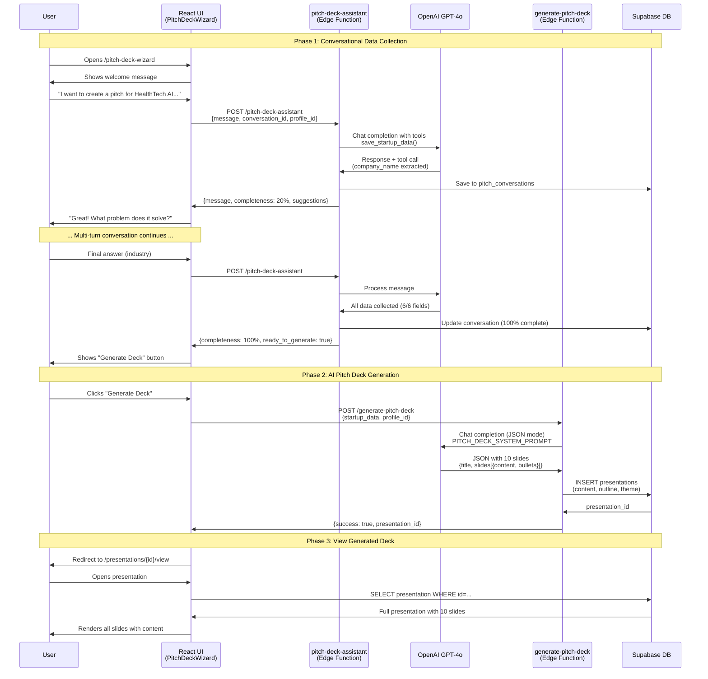

# Pitch Deck Generator - User Journey Sequence Diagram

🏷️ **Diagram Type:** Sequence Diagram

💬 **Description:** This sequence diagram shows the complete end-to-end user journey from opening the chat interface to viewing the generated pitch deck with AI-powered content.

---

---

## Key Interactions

1. **Multi-turn Conversation:** User and AI exchange 5-8 messages to collect startup data
2. **Tool Calling:** OpenAI extracts structured data via `save_startup_data` tool
3. **Progress Tracking:** UI shows 0-100% completeness as fields are collected
4. **Two OpenAI Calls:**
   - Conversation: GPT-4o with function calling
   - Generation: GPT-4o with JSON mode for structured output
5. **Database Operations:**
   - Conversations saved in real-time
   - Final presentation stored with all 10 slides

---

**Performance:**
- Conversation turn: ~2 seconds per message
- Deck generation: ~15 seconds (OpenAI API call)
- Total end-to-end: ~3-5 minutes for complete flow
