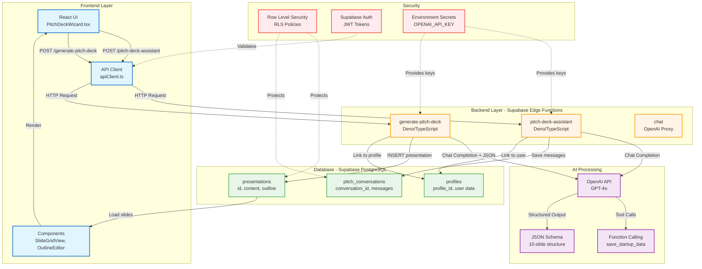

# Pitch Deck Generator - System Architecture

🏷️ **Diagram Type:** Flowchart (Architecture)

💬 **Description:** This flowchart shows the complete system architecture including frontend, backend (Edge Functions), AI services, and database layers with their relationships.

---

---

## Component Responsibilities

### Frontend Layer
- **PitchDeckWizard.tsx** - Chat interface, progress tracking, user input
- **apiClient.ts** - Centralized HTTP client with error handling
- **SlideGridView** - Visual thumbnail grid showing slide content
- **OutlineEditor** - Slide management, reordering, theme selection

### Backend Layer (Edge Functions)
- **pitch-deck-assistant** - Conversational AI handler, tool calling orchestration
- **generate-pitch-deck** - Final deck generation with OpenAI JSON mode
- **chat** - Generic OpenAI proxy for secure API key handling

### AI Processing
- **OpenAI GPT-4o** - Language model for conversation and content generation
- **Function Calling** - Structured data extraction (save_startup_data tool)
- **JSON Schema** - Enforced 10-slide pitch deck structure

### Database (Supabase PostgreSQL)
- **pitch_conversations** - Multi-turn conversation history with progress tracking
- **presentations** - Final generated decks with content and metadata
- **profiles** - User profiles linked to auth.users

### Security
- **RLS Policies** - Row-level security for data isolation
- **Supabase Auth** - JWT token validation
- **Environment Secrets** - API keys stored server-side only

---

## Data Flow
1. User input → Frontend
2. Frontend → API Client → Edge Functions
3. Edge Functions → OpenAI API (with API key from env)
4. OpenAI → Structured responses (tool calls or JSON)
5. Edge Functions → Database (save data)
6. Database → Frontend (load presentations)
7. Frontend → User (render slides)
