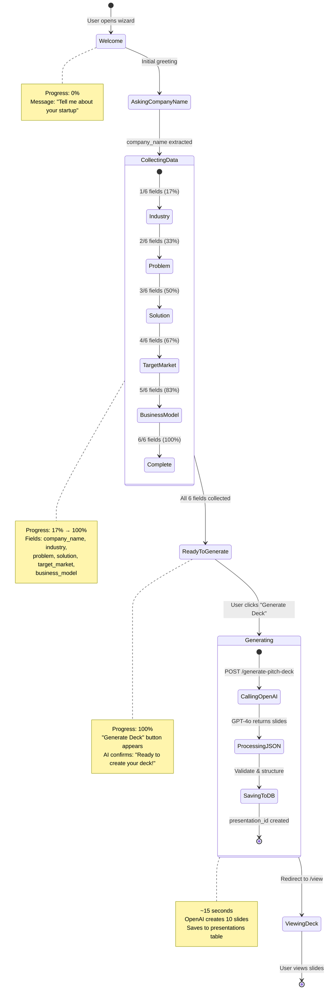
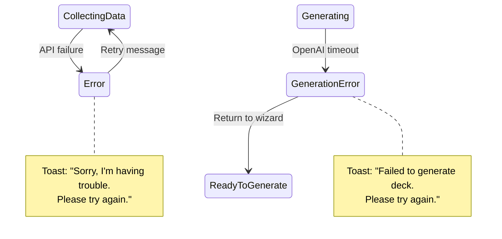

# Pitch Deck Generator - Conversation State Machine

🏷️ **Diagram Type:** State Diagram

💬 **Description:** This state diagram shows how the conversational AI progresses through different states while collecting startup data, tracking completeness from 0% to 100%.

---



---

## State Transitions

### 1. **Welcome** → **AskingCompanyName**
- **Trigger:** User opens `/pitch-deck-wizard`
- **Action:** Display welcome message
- **Next:** Wait for first user input

### 2. **AskingCompanyName** → **CollectingData**
- **Trigger:** User describes their startup
- **Action:** OpenAI extracts `company_name` via tool calling
- **Next:** Ask for next missing field (industry, problem, etc.)

### 3. **CollectingData** (Progressive Loop)
- **Sub-states:** Industry → Problem → Solution → TargetMarket → BusinessModel
- **Progress:** 17% → 33% → 50% → 67% → 83% → 100%
- **Action:** Each message extracts 1+ fields
- **Next:** Continue until all 6 fields collected

### 4. **CollectingData** → **ReadyToGenerate**
- **Trigger:** `completeness === 100%`
- **Action:** Set `ready_to_generate: true`
- **UI Change:** "Generate Deck" button appears in sidebar

### 5. **ReadyToGenerate** → **Generating**
- **Trigger:** User clicks "Generate Deck"
- **Action:** Call `/generate-pitch-deck` Edge Function
- **Duration:** ~15 seconds (OpenAI API call)

### 6. **Generating** → **ViewingDeck**
- **Trigger:** Presentation saved to database
- **Action:** Redirect to `/presentations/{id}/view`
- **Result:** All 10 slides rendered with AI content

---

## Error Handling States



---

## Field Validation

Each field has specific validation:

| Field | Type | Example | Validation |
|-------|------|---------|------------|
| company_name | string | "HealthTech AI" | Min 1 char |
| industry | string | "Healthcare Technology" | Min 1 char |
| problem | string | "Patients waste hours..." | Min 10 chars |
| solution | string | "AI-powered telemedicine..." | Min 10 chars |
| target_market | string | "Busy professionals 25-45" | Min 5 chars |
| business_model | string | "Subscription $29/month" | Min 5 chars |

**Completeness Formula:**
```javascript
completeness = (fields_collected / 6) * 100
```

---

## AI Behavior by State

### Welcome State
- **Personality:** Friendly, encouraging
- **Message:** "Hi! I'm Claude, your AI pitch deck assistant..."
- **Suggestions:** None (wait for user to start)

### Collecting Data (0-99%)
- **Personality:** Focused, asking targeted questions
- **Message:** "Great! Now, what problem does {company_name} solve?"
- **Suggestions:** 2-3 example answers
- **Progress Bar:** Visible, updating in real-time

### Ready to Generate (100%)
- **Personality:** Excited, confirming readiness
- **Message:** "Perfect! We have everything. Ready to create your pitch deck?"
- **Button:** "Generate Deck" (primary action)
- **Data Review:** Sidebar shows all 6 collected fields with green checkmarks

### Generating
- **UI:** Loading spinner, toast notification
- **Message:** "Generating your pitch deck... This will take 30-60 seconds"
- **No Interaction:** User cannot send messages during generation
