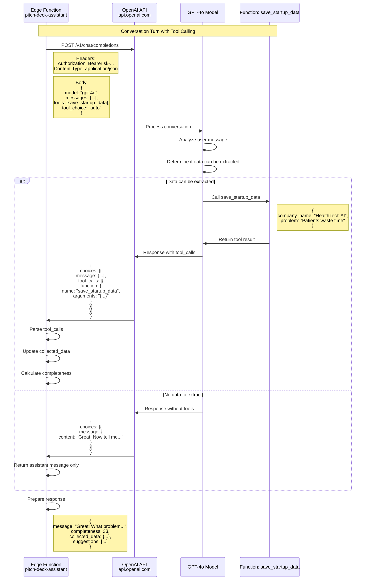
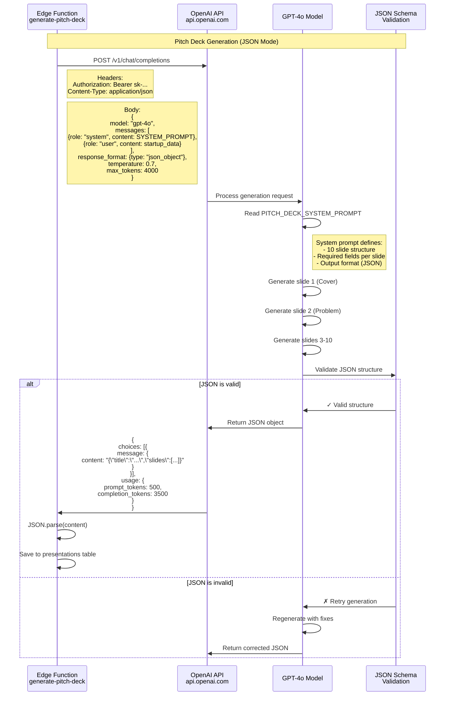

# Pitch Deck Generator - OpenAI Integration Details

🏷️ **Diagram Type:** Sequence Diagram (AI Integration)

💬 **Description:** This sequence diagram shows the detailed OpenAI API integration for both the conversation (with function calling) and slide generation (with JSON mode).

---

## Conversation Flow (Function Calling)



---

## Slide Generation Flow (JSON Mode)



---

## Tool Definition (Function Calling)

```mermaid
graph TB
    subgraph "save_startup_data Tool"
        TOOL_DEF[Tool Definition]
        PARAMS[Parameters<br/>6 optional fields]
        LOGIC[Extraction Logic]
    end

    TOOL_DEF -->|Defines| PARAMS
    PARAMS -->|company_name: string| FIELD1[Company Name]
    PARAMS -->|industry: string| FIELD2[Industry]
    PARAMS -->|problem: string| FIELD3[Problem]
    PARAMS -->|solution: string| FIELD4[Solution]
    PARAMS -->|target_market: string| FIELD5[Target Market]
    PARAMS -->|business_model: string| FIELD6[Business Model]

    FIELD1 --> LOGIC
    FIELD2 --> LOGIC
    FIELD3 --> LOGIC
    FIELD4 --> LOGIC
    FIELD5 --> LOGIC
    FIELD6 --> LOGIC

    LOGIC -->|Returns| RESULT[Merged Data Object<br/>{<br/>  company_name?: string,<br/>  industry?: string,<br/>  ...<br/>}]

    style TOOL_DEF fill:#e1f5fe
    style PARAMS fill:#fff3e0
    style LOGIC fill:#f3e5f5
    style RESULT fill:#e8f5e9
```

---

## System Prompts

### Conversation System Prompt (pitch-deck-assistant)

```typescript
const SYSTEM_PROMPT = `You are an expert startup pitch deck consultant helping entrepreneurs create investor presentations.

Your role:
1. Ask targeted questions to collect 6 key pieces of information
2. Use the save_startup_data tool to extract structured data
3. Track progress (0-100%) based on fields collected
4. Provide helpful suggestions and examples
5. Once all data is collected, confirm readiness to generate

Required fields:
- company_name: The startup's name
- industry: What industry/sector
- problem: What problem are they solving
- solution: How does their product solve it
- target_market: Who are their customers
- business_model: How do they make money

Style: Friendly, encouraging, focused on clarity`;
```

### Generation System Prompt (generate-pitch-deck)

```typescript
const PITCH_DECK_SYSTEM_PROMPT = `You are an expert startup pitch deck consultant. Generate a professional 10-slide investor presentation.

OUTPUT FORMAT (JSON):
{
  "title": "Company Name Pitch Deck",
  "company_name": "Company Name",
  "industry": "Industry",
  "outline": ["Problem", "Solution", "Product", "Market Size", "Business Model", "Traction", "Competition", "Team", "Financials", "Ask"],
  "slides": [
    {
      "slide_number": 1,
      "title": "Problem",
      "layout": "title_content",
      "content": {
        "headline": "3-5 word headline",
        "bullets": ["Bullet 1", "Bullet 2", "Bullet 3"],
        "notes": "Speaker notes"
      }
    }
  ]
}

SLIDES (in order):
1. Cover (company name, tagline, logo placeholder)
2. Problem (3-4 pain points, market need)
3. Solution (how product solves problem, unique value prop)
4. Product (key features, screenshots/mockups)
5. Market Size (TAM/SAM/SOM, growth trends)
6. Business Model (revenue streams, pricing)
7. Traction (metrics, milestones, social proof)
8. Competition (landscape, differentiation)
9. Team (founders, advisors, key hires)
10. Ask (funding amount, use of funds, contact)

IMPORTANT: Return ONLY valid JSON. Use professional language. Focus on clarity and impact.`;
```

---

## OpenAI API Request Examples

### Conversation Request

```json
{
  "model": "gpt-4o",
  "messages": [
    {
      "role": "system",
      "content": "You are an expert startup pitch deck consultant..."
    },
    {
      "role": "user",
      "content": "I want to create a pitch deck for HealthTech AI"
    }
  ],
  "tools": [
    {
      "type": "function",
      "function": {
        "name": "save_startup_data",
        "description": "Extract and save startup information from conversation",
        "parameters": {
          "type": "object",
          "properties": {
            "company_name": {"type": "string"},
            "industry": {"type": "string"},
            "problem": {"type": "string"},
            "solution": {"type": "string"},
            "target_market": {"type": "string"},
            "business_model": {"type": "string"}
          }
        }
      }
    }
  ],
  "tool_choice": "auto",
  "temperature": 0.7
}
```

### Generation Request

```json
{
  "model": "gpt-4o",
  "messages": [
    {
      "role": "system",
      "content": "You are an expert startup pitch deck consultant. Generate a professional 10-slide investor presentation..."
    },
    {
      "role": "user",
      "content": "Create a professional 10-slide pitch deck for:\n\nCompany: HealthTech AI\nIndustry: Healthcare Technology\nProblem: Patients waste hours in waiting rooms\nSolution: AI-powered telemedicine platform\nTarget Market: Busy professionals aged 25-45\nBusiness Model: Subscription-based: $29/month"
    }
  ],
  "response_format": { "type": "json_object" },
  "temperature": 0.7,
  "max_tokens": 4000
}
```

---

## Performance & Cost

### Conversation (per turn)
- **Model:** GPT-4o
- **Avg Input Tokens:** 500-800
- **Avg Output Tokens:** 100-200
- **Response Time:** 2-3 seconds
- **Cost:** ~$0.01-0.02 per turn

### Generation (one-time)
- **Model:** GPT-4o
- **Input Tokens:** ~500 (system prompt + startup data)
- **Output Tokens:** ~3,000-4,000 (10 slides with content)
- **Response Time:** 10-15 seconds
- **Cost:** ~$0.15-0.20 per deck

### Total Per User Journey
- **Conversation:** 5-8 turns = $0.05-0.16
- **Generation:** 1 deck = $0.15-0.20
- **Total Cost:** ~$0.20-0.36 per completed pitch deck
- **Total Time:** ~3-5 minutes end-to-end
