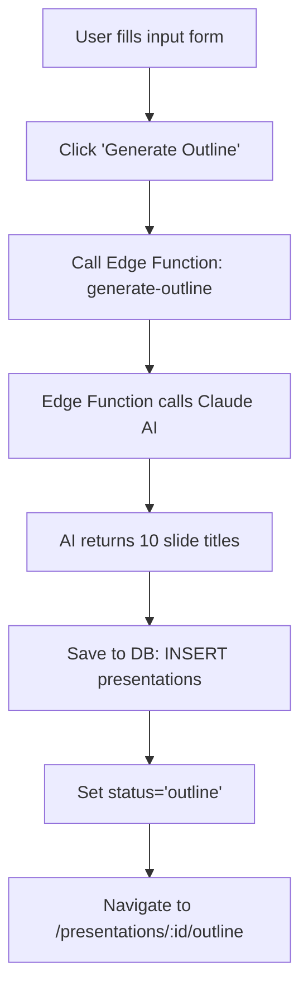
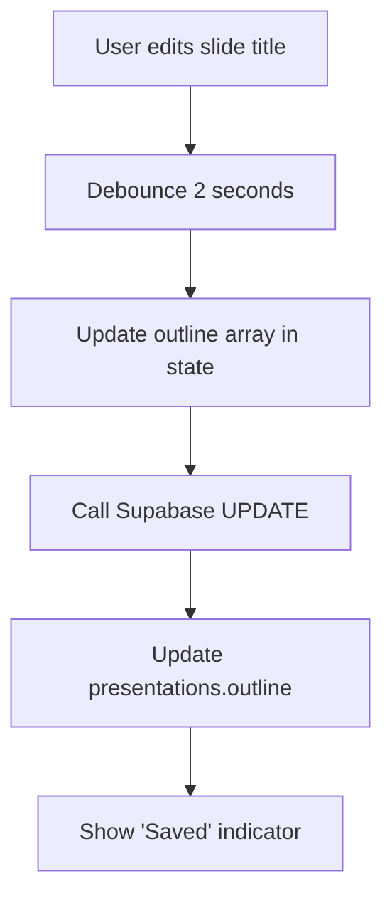
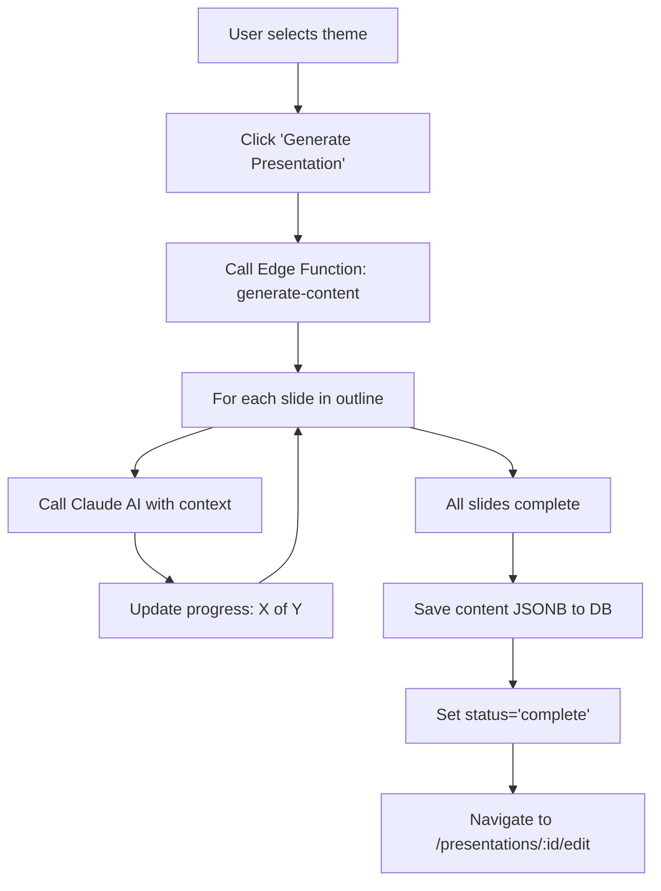
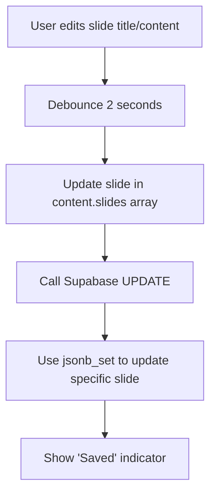

# 02 - Database Architecture

**Created:** 2025-01-15  
**Purpose:** Define all database operations, schemas, and data flows

---

## 📊 Database Schema

### Presentations Table

**Columns Used in MVP:**

```sql
-- Core identification
id                  uuid PRIMARY KEY DEFAULT gen_random_uuid()
profile_id          uuid NOT NULL  -- Owner of the presentation
title               text NOT NULL  -- Presentation title
status              text DEFAULT 'draft'  -- draft | outline | complete

-- User inputs
prompt              text NULL  -- Original user description
presentation_style  text NULL  -- professional | casual | technical
language            text DEFAULT 'en-US'
slide_count         integer DEFAULT 10

-- AI-generated content
outline             text[] NULL  -- Array of slide titles
content             jsonb DEFAULT '{}'  -- Full slide content

-- Visual settings
theme               text DEFAULT 'purple'  -- purple | blue | dark
image_source        text DEFAULT 'ai'

-- Metadata
created_at          timestamptz DEFAULT now()
updated_at          timestamptz DEFAULT now()
last_edited_at      timestamptz DEFAULT now()
```

**Columns NOT used in MVP:**
- `search_results`, `thumbnail_url`, `custom_theme_id`, `is_public`
- `description`, `cover_image_url`, `share_link`, `view_count`
- `last_presented_at`, `deleted_at`, `template_id`, `category`

---

## 📝 Data Structures

### 1. Outline Array (text[])

**Purpose:** Store slide titles for outline editing phase  
**Format:** PostgreSQL text array  

```json
// Database stores as: {"Problem Statement", "Solution Overview", "Market Opportunity"}
// JavaScript receives as:
[
  "Problem Statement",
  "Solution Overview", 
  "Market Opportunity",
  "Business Model",
  "Traction & Metrics",
  "Team & Advisors",
  "Competition Analysis",
  "Financial Projections",
  "Investment Ask",
  "Contact Information"
]
```

**Operations:**
- **Create:** AI generates 10 default titles based on prompt
- **Read:** Display in outline editor as draggable list
- **Update:** Save reordered/edited array on each change
- **Delete:** Remove slide from array (minimum 3 slides required)

---

### 2. Content JSONB

**Purpose:** Store full presentation with all slide content  
**Format:** PostgreSQL JSONB object  

```json
{
  "slides": [
    {
      "id": "slide-1",
      "title": "Problem Statement",
      "content": "Event organizers spend 40+ hours per event on repetitive manual tasks:\n\n• Email back-and-forth with speakers\n• Spreadsheet chaos for attendee tracking\n• Last-minute venue changes\n• No centralized communication hub\n\nThis leads to stress, errors, and poor attendee experience.",
      "layout": "content",
      "notes": "Emphasize pain points. Ask audience if they've experienced this."
    },
    {
      "id": "slide-2",
      "title": "Solution Overview",
      "content": "EventOS is an AI-powered event management platform that automates the entire event lifecycle...",
      "layout": "content",
      "notes": ""
    }
  ],
  "slideCount": 10,
  "metadata": {
    "generatedAt": "2025-01-15T10:30:00Z",
    "aiModel": "claude-sonnet-4-5",
    "version": "1.0"
  }
}
```

**Slide Object Properties:**
- `id` (string): Unique identifier `slide-1`, `slide-2`, etc.
- `title` (string): Slide title (from outline)
- `content` (string): Markdown-formatted slide content
- `layout` (string): `"title"` for first slide, `"content"` for others
- `notes` (string): Speaker notes (optional)

**Note:** Order is determined by array index, not a separate field. `slides[0]` is first slide, `slides[1]` is second, etc.

**Operations:**
- **Create:** AI generates full content for all slides
- **Read:** Display current slide in editor
- **Update:** Save modified slide content (debounced 2s)
- **Navigate:** Switch between slides by index

---

## ✅ JSONB Validation & Constraints

### Database Constraints

**Add CHECK constraints to ensure data integrity:**

```sql
-- Ensure content JSONB has required structure
ALTER TABLE presentations
ADD CONSTRAINT content_structure_check
CHECK (
  content ? 'slides' AND
  content ? 'slideCount' AND
  content ? 'metadata' AND
  jsonb_typeof(content->'slides') = 'array'
);

-- Ensure theme is one of allowed values
ALTER TABLE presentations
ADD CONSTRAINT theme_check
CHECK (theme IN ('purple', 'blue', 'dark'));

-- Ensure status is valid
ALTER TABLE presentations
ADD CONSTRAINT status_check
CHECK (status IN ('draft', 'outline', 'complete'));

-- Ensure presentation_style is valid
ALTER TABLE presentations
ADD CONSTRAINT style_check
CHECK (presentation_style IS NULL OR presentation_style IN ('professional', 'casual', 'technical'));

-- Ensure slide_count is reasonable
ALTER TABLE presentations
ADD CONSTRAINT slide_count_check
CHECK (slide_count >= 3 AND slide_count <= 30);

-- Ensure outline has minimum slides when set
ALTER TABLE presentations
ADD CONSTRAINT outline_length_check
CHECK (outline IS NULL OR array_length(outline, 1) >= 3);
```

### Application-Level Validation

**TypeScript type guards for JSONB data:**

```typescript
// Type definitions
interface Slide {
  id: string;
  title: string;
  content: string;
  layout: 'title' | 'content';
  notes: string;
}

interface PresentationContent {
  slides: Slide[];
  slideCount: number;
  metadata: {
    generatedAt: string;
    aiModel: string;
    version: string;
  };
}

// Validation function
function validateContent(data: unknown): data is PresentationContent {
  if (!data || typeof data !== 'object') return false;

  const content = data as any;

  // Check required top-level keys
  if (!content.slides || !Array.isArray(content.slides)) return false;
  if (typeof content.slideCount !== 'number') return false;
  if (!content.metadata || typeof content.metadata !== 'object') return false;

  // Validate each slide
  for (const slide of content.slides) {
    if (typeof slide.id !== 'string') return false;
    if (typeof slide.title !== 'string') return false;
    if (typeof slide.content !== 'string') return false;
    if (!['title', 'content'].includes(slide.layout)) return false;
    if (typeof slide.notes !== 'string') return false;
  }

  // Validate metadata
  if (typeof content.metadata.generatedAt !== 'string') return false;
  if (typeof content.metadata.aiModel !== 'string') return false;
  if (typeof content.metadata.version !== 'string') return false;

  return true;
}

// Usage in components
const { data } = await supabase
  .from('presentations')
  .select('content')
  .eq('id', presentationId)
  .single();

if (!validateContent(data.content)) {
  throw new Error('Invalid presentation content structure');
}

// Now TypeScript knows data.content is PresentationContent
const slides = data.content.slides;
```

### Performance Indexes

**Add indexes for common queries:**

```sql
-- Index for dashboard listing (most common query)
CREATE INDEX idx_presentations_profile_status ON presentations(profile_id, status, last_edited_at DESC);

-- Index for filtering by status
CREATE INDEX idx_presentations_status ON presentations(status);

-- GIN index for JSONB queries (if needed for search)
CREATE INDEX idx_presentations_content_gin ON presentations USING GIN (content);

-- Partial index for active presentations (exclude deleted)
CREATE INDEX idx_presentations_active ON presentations(profile_id, last_edited_at DESC)
WHERE deleted_at IS NULL;
```

---

## 🔄 Data Flow Diagrams

### Flow 1: Create New Presentation



**Database Operations:**
```sql
-- 1. Create new presentation
INSERT INTO presentations (
  profile_id,
  title,
  prompt,
  presentation_style,
  language,
  slide_count,
  outline,
  theme,
  status
) VALUES (
  auth.uid(),
  $1,  -- First 50 chars of prompt
  $2,  -- Full user input
  $3,  -- Selected style
  $4,  -- Selected language
  10,  -- Default slide count
  $5,  -- Array of AI-generated titles
  'purple',  -- Default theme
  'outline'
) RETURNING id;
```

---

### Flow 2: Edit Outline



**Database Operations:**
```sql
-- 2. Update outline (reorder, edit, delete)
UPDATE presentations
SET 
  outline = $1,  -- New array with changes
  updated_at = NOW(),
  last_edited_at = NOW()
WHERE id = $2 AND profile_id = auth.uid();
```

---

### Flow 3: Generate Full Presentation



**Database Operations:**
```sql
-- 3. Save generated content
UPDATE presentations
SET 
  content = $1,  -- Full JSONB with all slides
  theme = $2,    -- Selected theme
  status = 'complete',
  updated_at = NOW(),
  last_edited_at = NOW()
WHERE id = $3 AND profile_id = auth.uid();
```

---

### Flow 4: Edit Slide Content



**Database Operations:**
```sql
-- 4. Update specific slide in content JSONB
UPDATE presentations
SET 
  content = jsonb_set(
    content,
    '{slides, $1}',  -- Path to slide by index
    $2::jsonb        -- Updated slide object
  ),
  updated_at = NOW(),
  last_edited_at = NOW()
WHERE id = $3 AND profile_id = auth.uid();
```

---

## 🔐 Row-Level Security (RLS)

**Existing Policies:**

```sql
-- Users can create own presentations
CREATE POLICY "Users can create own presentations"
ON presentations FOR INSERT
WITH CHECK (auth.uid() = profile_id);

-- Users can view own or public presentations
CREATE POLICY "Users can view own presentations or public ones"
ON presentations FOR SELECT
USING (auth.uid() = profile_id OR is_public = true);

-- Users can update own presentations
CREATE POLICY "Users can update own presentations"
ON presentations FOR UPDATE
USING (auth.uid() = profile_id)
WITH CHECK (auth.uid() = profile_id);

-- Users can delete own presentations
CREATE POLICY "Users can delete own presentations"
ON presentations FOR DELETE
USING (auth.uid() = profile_id);
```

**No changes needed for MVP** - existing policies are sufficient.

---

## 📊 Query Patterns

### 1. Fetch Presentation for Editing

```typescript
const { data: presentation, error } = await supabase
  .from('presentations')
  .select('*')
  .eq('id', presentationId)
  .eq('profile_id', userId)
  .single();
```

### 2. Update Outline

```typescript
const { error } = await supabase
  .from('presentations')
  .update({ 
    outline: newOutlineArray,
    updated_at: new Date().toISOString(),
    last_edited_at: new Date().toISOString()
  })
  .eq('id', presentationId)
  .eq('profile_id', userId);
```

### 3. Update Single Slide (with Optimistic Locking)

```typescript
// OPTION 1: Client-side update (recommended for MVP)
// Keep content in React state, update locally, debounce save
const [slides, setSlides] = useState<Slide[]>([]);

// Update locally
const updateSlide = (index: number, updates: Partial<Slide>) => {
  setSlides(prev => prev.map((slide, idx) =>
    idx === index ? { ...slide, ...updates } : slide
  ));
};

// Debounced save (triggers 2s after last edit)
const debouncedSave = useDebouncedCallback(async (updatedSlides: Slide[]) => {
  const { error } = await supabase
    .from('presentations')
    .update({
      content: {
        slides: updatedSlides,
        slideCount: updatedSlides.length,
        metadata: { /* ... */ }
      },
      updated_at: new Date().toISOString(),
      last_edited_at: new Date().toISOString()
    })
    .eq('id', presentationId)
    .eq('profile_id', userId);

  if (error) {
    toast.error('Failed to save changes');
    // Optionally: refetch from DB to get latest version
  }
}, 2000);

// Call debounced save after each edit
useEffect(() => {
  if (slides.length > 0) {
    debouncedSave(slides);
  }
}, [slides]);

// OPTION 2: PostgreSQL jsonb_set (for single field updates)
// Use when updating only one field without fetching entire content
await supabase.rpc('update_slide_field', {
  p_presentation_id: presentationId,
  p_slide_index: slideIndex,
  p_field_name: 'content',
  p_field_value: newContent
});

// PostgreSQL function:
/*
CREATE OR REPLACE FUNCTION update_slide_field(
  p_presentation_id uuid,
  p_slide_index integer,
  p_field_name text,
  p_field_value text
)
RETURNS void AS $$
BEGIN
  UPDATE presentations
  SET content = jsonb_set(
    content,
    ARRAY['slides', p_slide_index::text, p_field_name],
    to_jsonb(p_field_value)
  ),
  updated_at = NOW(),
  last_edited_at = NOW()
  WHERE id = p_presentation_id;
END;
$$ LANGUAGE plpgsql;
*/
```

**Race Condition Handling:**
- MVP uses client-side state + debounced saves (Option 1)
- Last-write-wins strategy (acceptable for single-user editing)
- Future: Add `version` field for optimistic locking
- Future: Use Supabase real-time for collaborative editing

### 4. Fetch All User Presentations

```typescript
const { data: presentations, error } = await supabase
  .from('presentations')
  .select('id, title, status, slide_count, theme, updated_at, last_edited_at')
  .eq('profile_id', userId)
  .order('last_edited_at', { ascending: false });
```

---

## 🎯 Performance Considerations

**Indexing:**
- `profile_id` already has index (FK)
- `status` should have index for filtering
- `last_edited_at` for sorting dashboard

**JSONB Queries:**
- Avoid frequent `jsonb_set` - use debouncing
- Fetch entire content JSONB, update in memory, save once
- Use `content->>'slides'` for specific queries

**Auto-save Strategy:**
- Debounce user input for 2 seconds
- Show "Saving..." → "Saved" indicator
- Optimistic UI updates (update local state immediately)
- Handle conflicts with last-write-wins

---

## 🔗 Next Steps

1. ✅ Understand database structure
2. → Read `03-user-journey.md` for complete user flow
3. → Read `04-component-architecture.md` for UI components
4. → Read `05-implementation-plan.md` for build order
