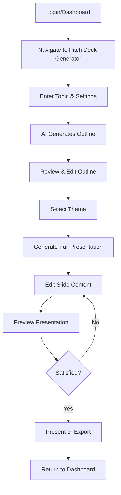

# 03 - User Journey & Flow

**Created:** 2025-01-15  
**Purpose:** Map complete user experience from start to finish

---

## 🗺️ Complete User Journey (16 Steps)



---

## 📍 Step-by-Step Breakdown

### Step 1: Authentication & Entry

**Current Location:** Any page  
**User Action:** User clicks "Generate Pitch Deck" or navigates to pitch deck section  
**System Response:** Checks authentication status  

**Routes:**
- From `/dashboard` → Click "📊 Generate Pitch Deck" button
- From `/dashboard/pitch-decks` → Click "AI Generate" card
- From navbar (future) → Click "Pitch Deck" link

**Redirect:** `/pitch-deck`

---

### Step 2: Enhanced Input Form (`/pitch-deck`)

**Page Purpose:** Collect user input for AI generation  
**Current State:** Basic form exists, needs enhancement

**UI Elements:**
```
┌─────────────────────────────────────┐
│  Create Your Pitch Deck             │
│                                     │
│  Quick Start Templates:             │
│  [SaaS] [Marketplace] [AI/ML]       │
│  [Fintech] [E-commerce] [DevTools]  │
│                                     │
│  Describe your startup:             │
│  ┌─────────────────────────────┐   │
│  │ We're building an AI-powered│   │
│  │ event management platform   │   │
│  │ that automates...           │   │
│  │ (10 lines tall)             │   │
│  └─────────────────────────────┘   │
│                                     │
│  Number of slides: [10 ▼]          │
│  Language: [English ▼]              │
│  Style: [Professional ▼]            │
│                                     │
│  [Generate Pitch Deck →]            │
└─────────────────────────────────────┘
```

**User Actions:**
1. User reads quick start templates
2. User clicks template (optional) → fills textarea with template text
3. User types or edits description (minimum 50 characters)
4. User selects number of slides (default: 10)
5. User selects language (default: English)
6. User selects presentation style (default: Professional)
7. User clicks "Generate Pitch Deck" button

**Validation:**
- Description required (min 50 chars, max 2000 chars)
- Slide count: 5-20 slides
- Style: professional | casual | technical

**On Submit:**
```typescript
// 1. Show loading state
setIsLoading(true);
setLoadingMessage("Generating outline...");

// 2. Call Edge Function
const { data, error } = await supabase.functions.invoke('generate-outline', {
  body: {
    topic: formData.description,
    slideCount: formData.slideCount,
    language: formData.language,
    presentationStyle: formData.style
  }
});

// 3. Navigate to outline editor
if (data.presentationId) {
  navigate(`/presentations/${data.presentationId}/outline`);
}
```

---

### Step 3: AI Generates Outline (Backend)

**Edge Function:** `generate-outline`  
**AI Model:** Claude Sonnet 4.5  
**Duration:** 10-30 seconds

**Process:**
1. Receive user input from form
2. Construct AI prompt with context:
```typescript
const systemPrompt = `You are an experienced pitch deck consultant who has helped 500+ startups raise funding. Your task is to create a compelling, investor-ready pitch deck outline.`;

const userPrompt = `
Create an investor pitch deck outline with exactly ${slideCount} slide titles for this startup:

**STARTUP DESCRIPTION:**
${userTopic}

**REQUIREMENTS:**
- Style: ${presentationStyle}
- Target Audience: Venture Capital Investors & Angel Investors
- Stage: Seed to Series A
- Slide Count: Exactly ${slideCount} slides

**PITCH DECK STRUCTURE:**
${slideCount === 10 ? `
1. Title Slide (company name & tagline)
2. Problem Statement (pain points, market need)
3. Solution Overview (your product/service)
4. Market Opportunity (TAM/SAM/SOM)
5. Business Model (revenue streams)
6. Traction & Metrics (early results, KPIs)
7. Team & Advisors (founders, key hires)
8. Competition Analysis (competitive advantage)
9. Financial Projections (3-5 year forecast)
10. Investment Ask (amount, use of funds, contact)
` : `Create ${slideCount} slides following standard pitch deck structure`}

**GUIDELINES:**
- Use action-oriented, clear titles (not generic)
- Start strong with problem/opportunity
- Build narrative momentum slide-by-slide
- End with clear call-to-action (investment ask)
- Avoid buzzwords; be specific and concrete
- Consider investor psychology and common questions

**OUTPUT FORMAT:**
Return ONLY a valid JSON array of exactly ${slideCount} slide titles.
Example: ["Problem: Event Planning Chaos", "Solution: AI-Powered Automation", ...]

Do not include any other text, explanations, or markdown formatting.
`;

// AI Configuration
const apiConfig = {
  model: 'claude-sonnet-4-5-20250929',
  max_tokens: 1024,
  temperature: 0.7, // Balanced creativity
  top_p: 0.9
};
```
3. Call Claude AI API with retry logic
4. Parse and validate JSON response
5. Save to database:
```sql
INSERT INTO presentations (
  profile_id, title, prompt, presentation_style, 
  language, slide_count, outline, theme, status
) VALUES (
  auth.uid(),
  first_50_chars(topic),
  topic,
  style,
  language,
  slide_count,
  ai_generated_titles_array,
  'purple',
  'outline'
) RETURNING id;
```
6. Return presentation ID

**Error Handling:**
- AI API timeout → Retry once, then show error
- Invalid JSON → Parse manually or regenerate
- Database error → Show user-friendly message

---

### Step 4: Navigate to Outline Editor

**Redirect:** `/presentations/:id/outline`  
**Load:** Fetch presentation from database  
**Display:** Show outline editing interface

---

### Step 5: Review & Edit Outline (`/presentations/:id/outline`)

**Page Purpose:** Let user review, edit, reorder, add/delete slides before generating content

**UI Layout:**
```
┌──────────────────────────────────────────────┐
│ ← Back        Edit Your Outline       Saved ✓│
├──────────────────────────────────────────────┤
│ Edit your slide titles, reorder, or remove   │
│ slides before generating the full content.   │
│                                              │
│ 10 slides • ~5 minute presentation           │
├──────────────────────────────────────────────┤
│                                              │
│  ☰ 1. Problem Statement             ︙ [×]  │
│  ☰ 2. Solution Overview              ︙ [×]  │
│  ☰ 3. Market Opportunity             ︙ [×]  │
│  ☰ 4. Business Model                 ︙ [×]  │
│  ☰ 5. Traction & Metrics             ︙ [×]  │
│  ☰ 6. Team & Advisors                ︙ [×]  │
│  ☰ 7. Competition Analysis           ︙ [×]  │
│  ☰ 8. Financial Projections          ︙ [×]  │
│  ☰ 9. Investment Ask                 ︙ [×]  │
│  ☰ 10. Contact Information           ︙ [×]  │
│                                              │
│  [+ Add Slide]                               │
│                                              │
├──────────────────────────────────────────────┤
│ Choose a Theme:                              │
│                                              │
│  ┌────────┐  ┌────────┐  ┌────────┐        │
│  │ Purple │  │  Blue  │  │  Dark  │        │
│  │ ● ● ●  │  │ ● ● ●  │  │ ● ● ●  │        │
│  │Selected│  │        │  │        │        │
│  └────────┘  └────────┘  └────────┘        │
│                                              │
├──────────────────────────────────────────────┤
│ [Back]  [Generate Presentation →]            │
└──────────────────────────────────────────────┘
```

**User Actions:**

**A. Drag to Reorder:**
- User clicks and drags `☰` handle
- Row becomes semi-transparent while dragging
- Drop position shows visual indicator
- On drop: Update outline array, save to DB

**B. Click Title to Edit:**
- User clicks on slide title text
- Title becomes editable input field
- User types new title
- On blur: Update outline array, debounce save (2s)

**C. Delete Slide:**
- User clicks `[×]` button
- Show confirmation: "Delete this slide?"
- On confirm: Remove from array, save to DB
- Minimum 3 slides required

**D. Add Slide:**
- User clicks "[+ Add Slide]" button
- Insert new slide with default title "New Slide"
- Focus on new title for editing
- Save updated array

**E. Select Theme:**
- User clicks anywhere on theme card
- Card shows selected state (thick purple border)
- Update theme in database immediately

**F. Generate Presentation:**
- User clicks "Generate Presentation" button
- Validate: minimum 3 slides
- Call Edge Function `generate-content`
- Show progress modal with animated progress

---

### Step 6: AI Generates Content (Backend)

**Edge Function:** `generate-content`  
**AI Model:** Claude Sonnet 4.5  
**Duration:** 30-90 seconds (depends on slide count)

**Process:**
1. Fetch presentation outline and settings
2. For each slide (sequential generation with context):
```typescript
const slides = [];

for (let i = 0; i < outline.length; i++) {
  const slideTitle = outline[i];
  const isFirstSlide = i === 0;
  const isLastSlide = i === outline.length - 1;

  // Build context from previous slides
  const previousContext = slides.length > 0
    ? `\n**PREVIOUS SLIDES FOR CONTEXT:**\n${slides.slice(-2).map(s => `${s.title}: ${s.content.substring(0, 100)}...`).join('\n')}`
    : '';

  // Construct detailed prompt with full context
  const systemPrompt = `You are an expert pitch deck writer specializing in investor presentations. Write compelling, data-driven content that tells a clear story.`;

  const userPrompt = `
Create content for slide ${i + 1} of ${outline.length} in an investor pitch deck.

**STARTUP DESCRIPTION:**
${presentation.prompt}

**COMPLETE DECK OUTLINE:**
${outline.map((title, idx) => `${idx + 1}. ${title}`).join('\n')}
${previousContext}

**CURRENT SLIDE:**
Title: "${slideTitle}"
Position: Slide ${i + 1} of ${outline.length}
${isFirstSlide ? 'This is the TITLE SLIDE' : ''}
${isLastSlide ? 'This is the CLOSING SLIDE with call-to-action' : ''}

**CONTENT REQUIREMENTS:**
${isFirstSlide ? `
- Company name and one-line tagline
- Keep it minimal and impactful
- Example: "EventOS\nAI-Powered Event Management for Modern Organizers"
` : `
- Write ${presentation.presentation_style} content for investors
- Use bullet points for clarity (3-5 points optimal)
- Include specific metrics, numbers, percentages when relevant
- Be concrete, not abstract (avoid buzzwords)
- Target length: 150-250 words or 3-5 bullet points
- Consider what investors want to know at this stage
- Build on the narrative from previous slides
`}

**STYLE GUIDE:**
${presentation.presentation_style === 'professional' ? '- Formal tone, data-driven, metrics-focused' : ''}
${presentation.presentation_style === 'casual' ? '- Conversational but credible, story-driven' : ''}
${presentation.presentation_style === 'technical' ? '- Technical depth, architecture details, specs' : ''}

**OUTPUT FORMAT:**
Return ONLY the slide content.
${isFirstSlide ? 'Format: Company Name on one line, tagline on next line' : 'Use bullet points (•) or short paragraphs'}
Do not include the slide title (we already have it).
Do not use markdown headers or formatting.
Do not include speaker notes.
`;

  // API Configuration
  const apiConfig = {
    model: 'claude-sonnet-4-5-20250929',
    max_tokens: 512, // Enough for slide content
    temperature: 0.8, // Higher creativity for content
    top_p: 0.95
  };

  // Call AI with error handling
  let content;
  try {
    content = await callClaudeAPI(systemPrompt, userPrompt, apiConfig);
  } catch (error) {
    // Retry once on failure
    await sleep(2000);
    content = await callClaudeAPI(systemPrompt, userPrompt, apiConfig);
  }

  // Build slide object
  slides.push({
    id: `slide-${i + 1}`,
    title: slideTitle,
    content: content.trim(),
    layout: i === 0 ? 'title' : 'content',
    notes: '' // Empty for MVP, can be populated later
  });

  // Send real-time progress update to client
  await sendProgressUpdate(presentationId, {
    current: i + 1,
    total: outline.length,
    slideTitle: slideTitle,
    percentComplete: Math.round(((i + 1) / outline.length) * 100)
  });
}
```
3. Save complete content JSONB to database:
```sql
UPDATE presentations
SET 
  content = jsonb_build_object(
    'slides', $1,
    'slideCount', $2,
    'metadata', jsonb_build_object(
      'generatedAt', NOW(),
      'aiModel', 'claude-sonnet-4-5'
    )
  ),
  status = 'complete',
  updated_at = NOW()
WHERE id = $3 AND profile_id = $4;
```

**Progress Updates:**
```typescript
// Client receives Server-Sent Events (SSE) or polling
interface ProgressUpdate {
  current: number;
  total: number;
  slideTitle: string;
  percentComplete: number;
  status: 'generating' | 'complete' | 'error';
}

// Frontend displays:
"Generating slide 1 of 10: Problem Statement... (10%)"
"Generating slide 2 of 10: Solution Overview... (20%)"
...
"Generation complete! (100%)"
```

---

## 🤖 AI Prompt Engineering Best Practices

### Response Validation

**Always validate AI responses before saving:**

```typescript
interface AIResponse {
  content: string;
  usage?: {
    input_tokens: number;
    output_tokens: number;
  };
}

function validateOutlineResponse(response: any): string[] {
  // Check if valid JSON array
  if (!Array.isArray(response)) {
    throw new Error('AI response must be an array');
  }

  // Check slide count matches request
  if (response.length !== requestedSlideCount) {
    console.warn(`Expected ${requestedSlideCount} slides, got ${response.length}`);
  }

  // Validate each title
  const validatedTitles = response
    .filter(title => typeof title === 'string' && title.length > 0)
    .slice(0, requestedSlideCount);

  if (validatedTitles.length < 3) {
    throw new Error('Must have at least 3 valid slide titles');
  }

  return validatedTitles;
}

function validateContentResponse(content: string): string {
  // Remove common AI artifacts
  let cleaned = content.trim();

  // Remove markdown headers if present
  cleaned = cleaned.replace(/^#+\s+.+$/gm, '');

  // Validate length
  if (cleaned.length < 20) {
    throw new Error('Content too short');
  }

  if (cleaned.length > 2000) {
    console.warn('Content exceeds recommended length');
    cleaned = cleaned.substring(0, 2000);
  }

  return cleaned;
}
```

### Error Handling & Retry Logic

```typescript
async function generateWithRetry<T>(
  promptFn: () => Promise<T>,
  maxRetries: number = 2,
  timeoutMs: number = 30000
): Promise<T> {
  for (let attempt = 1; attempt <= maxRetries; attempt++) {
    try {
      // Set timeout
      const timeoutPromise = new Promise((_, reject) =>
        setTimeout(() => reject(new Error('AI request timeout')), timeoutMs)
      );

      const result = await Promise.race([
        promptFn(),
        timeoutPromise
      ]);

      return result as T;

    } catch (error) {
      console.error(`AI generation attempt ${attempt} failed:`, error);

      if (attempt === maxRetries) {
        throw new Error(`AI generation failed after ${maxRetries} attempts: ${error.message}`);
      }

      // Exponential backoff
      await sleep(1000 * Math.pow(2, attempt - 1));
    }
  }

  throw new Error('Unexpected error in retry logic');
}
```

### Cost & Token Management

```typescript
interface TokenUsage {
  presentationId: string;
  operation: 'outline' | 'content';
  inputTokens: number;
  outputTokens: number;
  estimatedCost: number;
  timestamp: Date;
}

function estimateCost(inputTokens: number, outputTokens: number): number {
  // Claude Sonnet 4.5 pricing (example rates)
  const INPUT_COST_PER_1K = 0.003;  // $3 per 1M tokens
  const OUTPUT_COST_PER_1K = 0.015; // $15 per 1M tokens

  const inputCost = (inputTokens / 1000) * INPUT_COST_PER_1K;
  const outputCost = (outputTokens / 1000) * OUTPUT_COST_PER_1K;

  return inputCost + outputCost;
}

async function trackTokenUsage(
  presentationId: string,
  operation: string,
  usage: any
) {
  const cost = estimateCost(usage.input_tokens, usage.output_tokens);

  // Log for monitoring and billing
  await supabase
    .from('ai_usage_logs')
    .insert({
      presentation_id: presentationId,
      operation,
      input_tokens: usage.input_tokens,
      output_tokens: usage.output_tokens,
      estimated_cost: cost,
      timestamp: new Date().toISOString()
    });

  // Alert if costs are high
  if (cost > 0.50) {
    console.warn(`High AI cost for presentation ${presentationId}: $${cost.toFixed(4)}`);
  }
}

// Typical costs for 10-slide deck:
// - Outline generation: ~500 input + 150 output = $0.003
// - Content generation: ~3000 input + 2500 output = $0.046
// - Total per deck: ~$0.05 (5 cents)
```

### Rate Limiting

```typescript
// Implement rate limiting to avoid API throttling
const rateLimiter = {
  requests: [] as number[],
  maxRequests: 50, // Max requests per minute
  windowMs: 60000  // 1 minute window
};

async function checkRateLimit(): Promise<void> {
  const now = Date.now();

  // Remove old requests outside window
  rateLimiter.requests = rateLimiter.requests.filter(
    time => now - time < rateLimiter.windowMs
  );

  // Check if under limit
  if (rateLimiter.requests.length >= rateLimiter.maxRequests) {
    const oldestRequest = rateLimiter.requests[0];
    const waitTime = rateLimiter.windowMs - (now - oldestRequest);

    throw new Error(`Rate limit exceeded. Try again in ${Math.ceil(waitTime / 1000)}s`);
  }

  // Record this request
  rateLimiter.requests.push(now);
}
```

---

### Step 7: Navigate to Slide Editor

**Redirect:** `/presentations/:id/edit`  
**Load:** Fetch presentation with full content  
**Display:** Show first slide in editor

---

### Step 8-12: Edit Slides (`/presentations/:id/edit`)

**Page Purpose:** Edit title and content for each slide

**UI Layout:**
```
┌─────────────────────────────────────────────┐
│                                              │
│  THUMBNAILS          SLIDE EDITOR            │
│  ┌──────┐           ← Back  SLIDE 1 OF 10  ✓│
│  │▶Slide│           ────────────────────────│
│  │  1   │           Title:                  │
│  └──────┘           ┌──────────────────────┐│
│  ┌──────┐           │ Problem Statement    ││
│  │ Slide│           └──────────────────────┘│
│  │  2   │                                    │
│  └──────┘           Content:                 │
│  ┌──────┐           ┌──────────────────────┐│
│  │ Slide│           │ Event organizers     ││
│  │  3   │           │ spend 40+ hours per  ││
│  └──────┘           │ event on...          ││
│  ┌──────┐           │ (8 lines tall)       ││
│  │ Slide│           └──────────────────────┘│
│  │  4   │                                    │
│  └──────┘           [← Previous] [Next →]   │
│  ┌──────┐                                    │
│  │ Slide│           [View Presentation]      │
│  │  5   │                                    │
│  └──────┘                                    │
│  ...                                         │
└─────────────────────────────────────────────┘
```

**User Actions:**

**A. Navigate Slides:**
- Click thumbnail → Switch to that slide
- Click "Previous" → Go to previous slide (disabled on slide 1)
- Click "Next" → Go to next slide (disabled on last slide)
- Keyboard: Left/Right arrows also work

**B. Edit Content:**
- User clicks in title input → Edit title
- User types in content textarea → Edit content
- On change: Debounce 2 seconds
- Auto-save: Update content JSONB in database
- Show "Saving..." then "Saved ✓" indicator

**Auto-Save Logic:**
```typescript
const [slideContent, setSlideContent] = useState({
  title: currentSlide.title,
  content: currentSlide.content
});

const debouncedSave = useMemo(
  () => 
    debounce(async (slideIndex, updates) => {
      setIsSaving(true);
      
      // Update local content
      const updatedContent = {
        ...presentation.content,
        slides: presentation.content.slides.map((s, idx) =>
          idx === slideIndex ? { ...s, ...updates } : s
        )
      };
      
      // Save to Supabase
      await supabase
        .from('presentations')
        .update({ 
          content: updatedContent,
          last_edited_at: new Date().toISOString()
        })
        .eq('id', presentationId);
      
      setIsSaving(false);
    }, 2000),
  [presentation, presentationId]
);

// On title change
const handleTitleChange = (newTitle) => {
  setSlideContent(prev => ({ ...prev, title: newTitle }));
  debouncedSave(currentSlideIndex, { title: newTitle });
};

// On content change
const handleContentChange = (newContent) => {
  setSlideContent(prev => ({ ...prev, content: newContent }));
  debouncedSave(currentSlideIndex, { content: newContent });
};
```

---

### Step 13-14: View Presentation (`/presentations/:id/view`)

**Page Purpose:** Full-screen presentation mode with keyboard navigation

**UI Layout:**
```
┌─────────────────────────────────────────────┐
│                                              │
│                                              │
│                                              │
│          PROBLEM STATEMENT                   │
│                                              │
│     Event organizers spend 40+ hours         │
│     per event on repetitive manual           │
│     tasks:                                   │
│                                              │
│     • Email back-and-forth with speakers     │
│     • Spreadsheet chaos for tracking         │
│     • Last-minute venue changes              │
│     • No centralized communication hub       │
│                                              │
│                                              │
│                          [◀] 3 / 10 [▶] [×] │
└─────────────────────────────────────────────┘
```

**Keyboard Navigation:**
- `←` / `PageUp` → Previous slide
- `→` / `Space` / `PageDown` → Next slide
- `Escape` → Exit to editor
- `F` → Toggle fullscreen (future)

**Mouse Navigation:**
- Click left/right arrows
- Click `[×]` to exit
- Mouse move → Show controls temporarily
- No movement for 3s → Auto-hide controls

**Theme Application:**
```typescript
// Purple theme
background: linear-gradient(135deg, #8B5CF6, #7C3AED)
text: white
accent: #A78BFA

// Blue theme
background: linear-gradient(135deg, #3B82F6, #2563EB)
text: white
accent: #60A5FA

// Dark theme
background: #1F2937
text: #F9FAFB
accent: #9CA3AF
```

---

### Step 15: Return to Dashboard

**User Action:** Click "Exit" or navigate away  
**System Response:** Save any pending changes  
**Redirect:** `/dashboard/pitch-decks`  

**Dashboard shows:**
- Updated "Last edited" timestamp
- Status badge: "Complete"
- Slide count: "10 slides"
- Quick actions: [Edit Deck] [View]

---

### Step 16: Future Actions

**From Dashboard:**
- **Edit:** Go back to `/presentations/:id/edit`
- **View:** Open `/presentations/:id/view`
- **Duplicate:** Create copy with new ID
- **Delete:** Soft delete (set deleted_at)
- **Share:** Generate public link (future)
- **Export:** Download PDF/PPTX (future)

---

## 🚦 Error States & Edge Cases

### Error: AI Generation Fails

**Scenario:** Claude API timeout or error  
**User sees:** Error toast + option to retry  
**System:** Log error, preserve user input  
**Recovery:** "Try again" button calls Edge Function again

### Error: Auto-save Fails

**Scenario:** Network issue or permission error  
**User sees:** "Failed to save" indicator (red)  
**System:** Queue changes in local state  
**Recovery:** Retry on next edit or manual "Save" button

### Edge Case: User Leaves During Generation

**Scenario:** User closes tab while AI is generating  
**System:** Edge Function completes in background  
**Result:** User returns to find presentation ready  
**UX:** Dashboard shows status "Generating..." → "Complete"

### Edge Case: Concurrent Edits

**Scenario:** User edits same presentation in 2 tabs  
**System:** Last write wins (simple conflict resolution)  
**Future:** Real-time sync with Supabase Realtime

---

## 🎯 Success Metrics

**User completes journey when:**
1. ✅ Outline generated (< 30 seconds)
2. ✅ User reviews and optionally edits outline
3. ✅ Full content generated (< 90 seconds)
4. ✅ User makes at least 1 edit to content
5. ✅ User views presentation in full-screen mode
6. ✅ All changes successfully saved to database

**Quality indicators:**
- Auto-save success rate > 99%
- AI generation success rate > 95%
- Average time to complete: 10-15 minutes
- User satisfaction: Can create presentation end-to-end

---

## 🔗 Next Steps

1. ✅ Understand user journey
2. → Read `04-component-architecture.md` for UI component breakdown
3. → Read `05-implementation-plan.md` for build order and priorities
