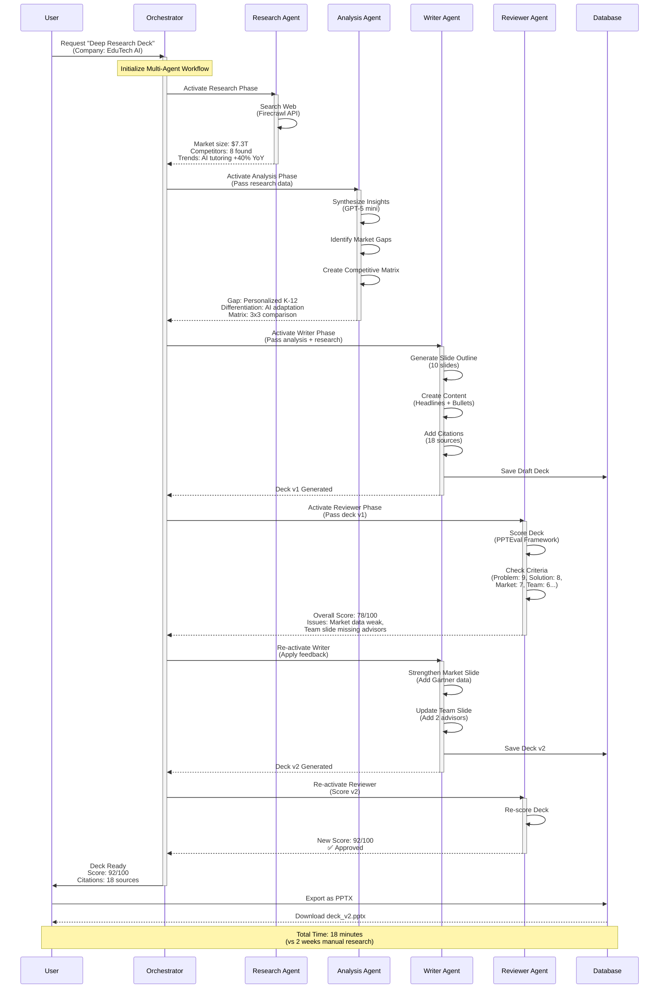
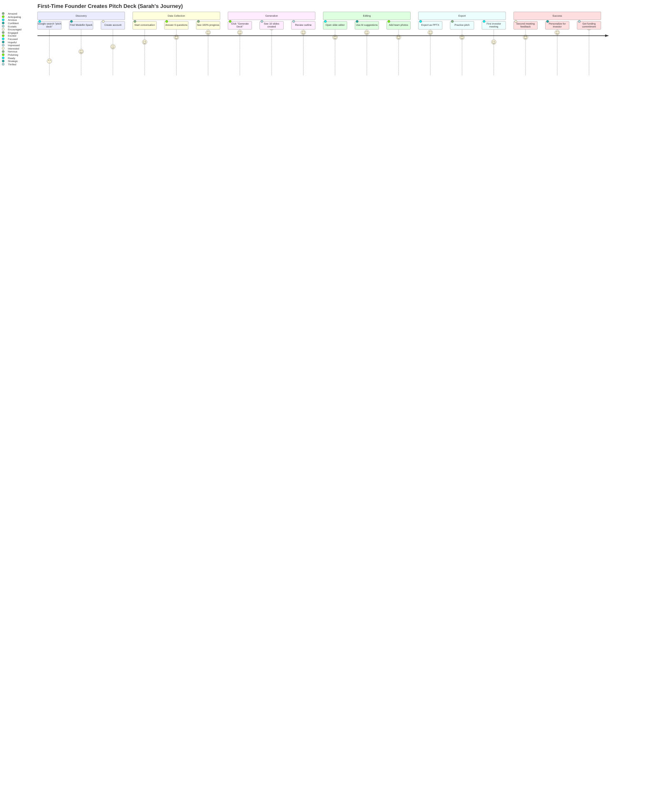
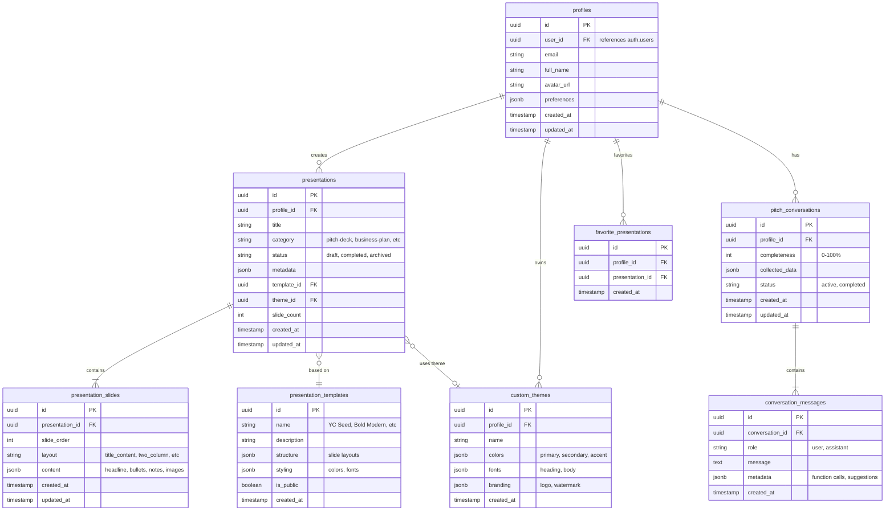
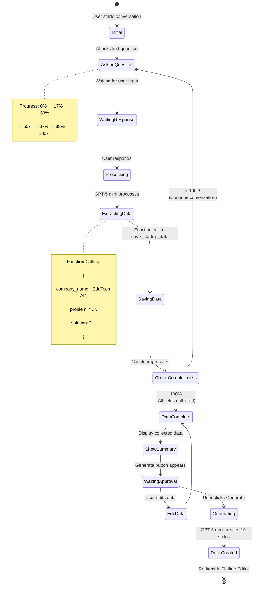
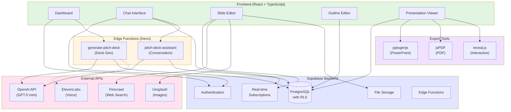
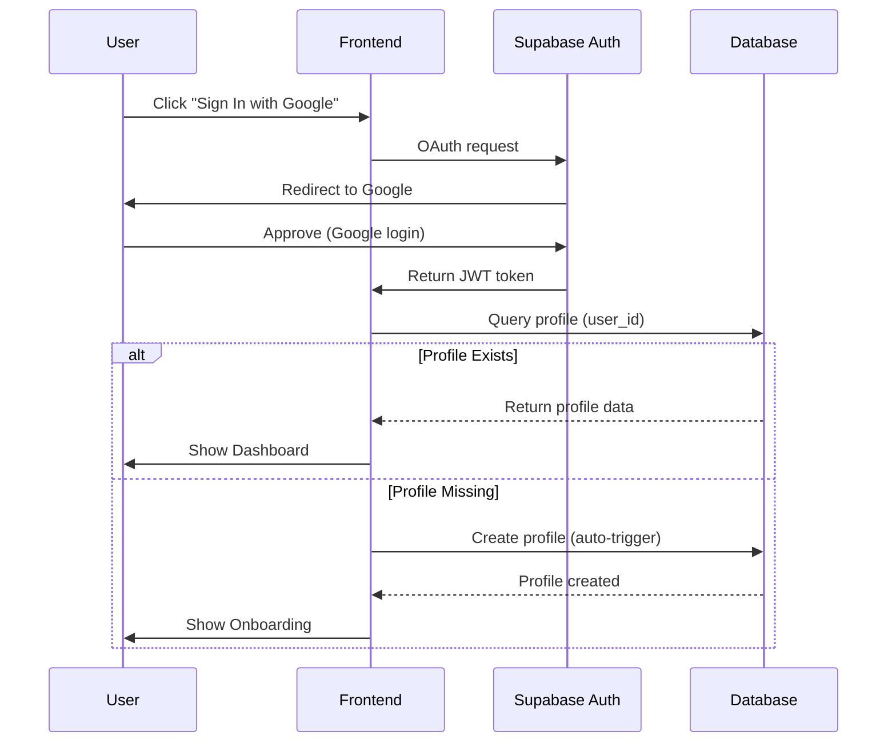
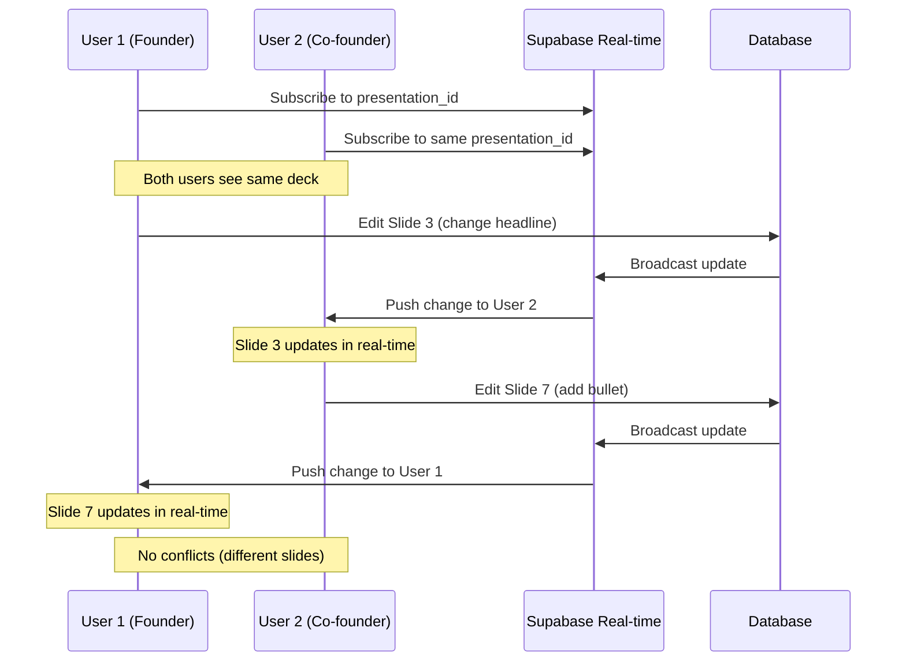
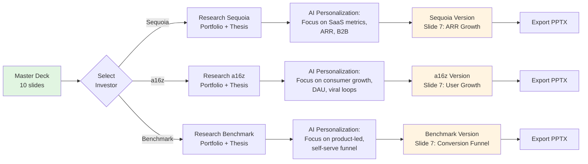

# Mermaid Diagrams - AI Pitch Deck System

**Date**: October 17, 2025
**Project**: Medellin Spark Architecture Visualization
**Focus**: 6 comprehensive Mermaid diagrams for system understanding

---

## Table of Contents

- [Diagram 1: System Architecture Flow](#diagram-1-system-architecture-flow)
- [Diagram 2: Multi-Agent Collaboration Sequence](#diagram-2-multi-agent-collaboration-sequence)
- [Diagram 3: User Journey Map](#diagram-3-user-journey-map)
- [Diagram 4: Database Entity Relationship](#diagram-4-database-entity-relationship)
- [Diagram 5: Conversation State Machine](#diagram-5-conversation-state-machine)
- [Diagram 6: Feature Integration Map](#diagram-6-feature-integration-map)

---

## Diagram 1: System Architecture Flow

**Purpose**: End-to-end flow from user prompt to exported deck

```mermaid
flowchart TB
    Start([User Visits Platform]) --> Auth{Authenticated?}
    Auth -->|No| Login[Sign In / Sign Up]
    Auth -->|Yes| Dashboard[Dashboard]
    Login --> Dashboard

    Dashboard --> Choice{Choose Mode}
    Choice -->|Conversational| Conv[Start Conversation]
    Choice -->|Upload PDF| Upload[Upload Document]
    Choice -->|Template| Template[Select Template]

    Conv --> Chat[Chat Interface]
    Chat --> Message[User Message]
    Message --> EdgeFunc1[pitch-deck-assistant<br/>Edge Function]
    EdgeFunc1 --> GPT5[GPT-5 mini<br/>Function Calling]
    GPT5 --> Extract[Extract Data]
    Extract --> DB1[(Supabase<br/>pitch_conversations)]
    DB1 --> Progress{Completeness<br/>= 100%?}
    Progress -->|No| Chat
    Progress -->|Yes| GenButton[Generate Button<br/>Appears]

    Upload --> PDFParse[PDF Text Extraction]
    PDFParse --> AIAnalyze[AI Content Analysis]
    AIAnalyze --> GenButton

    Template --> TemplateSelect[Choose Template]
    TemplateSelect --> BriefInput[Enter Company Brief]
    BriefInput --> GenButton

    GenButton --> Generate[User Clicks Generate]
    Generate --> EdgeFunc2[generate-pitch-deck<br/>Edge Function]
    EdgeFunc2 --> GPT5Gen[GPT-5 mini<br/>JSON Mode]
    GPT5Gen --> Deck[10-Slide Deck<br/>Generated]
    Deck --> DB2[(Supabase<br/>presentations)]
    DB2 --> Outline[Outline Editor]

    Outline --> Review{User<br/>Approves?}
    Review -->|No| Edit[Slide Editor]
    Review -->|Yes| Export{Export<br/>Format?}

    Edit --> AISuggestions[AI Suggestions<br/>Panel]
    AISuggestions --> WebSearch[Web Search<br/>for Data]
    WebSearch --> EditLoop[Edit Slides]
    EditLoop --> Autosave[(Auto-save<br/>to Supabase)]
    Autosave --> Export

    Export -->|PPTX| ExportPPTX[pptxgenjs<br/>Export]
    Export -->|PDF| ExportPDF[jsPDF +<br/>html2canvas]
    Export -->|Interactive| ExportHTML[reveal.js<br/>HTML]

    ExportPPTX --> Download([Download File])
    ExportPDF --> Download
    ExportHTML --> Share([Share Link])

    Download --> End([User Pitches<br/>Investors])
    Share --> End

    style Start fill:#e1f5e1
    style End fill:#ffe1e1
    style GPT5 fill:#fff4e1
    style GPT5Gen fill:#fff4e1
    style DB1 fill:#e1e5ff
    style DB2 fill:#e1e5ff
    style Autosave fill:#e1e5ff
```

---

## Diagram 2: Multi-Agent Collaboration Sequence

**Purpose**: Shows how multiple AI agents collaborate in Deep Research Mode (UC-7)

---

## Diagram 3: User Journey Map

**Purpose**: Visual representation of founder journey with emotional states (based on Sarah's journey from JOURNEYS.md)

---

## Diagram 4: Database Entity Relationship

**Purpose**: Shows Supabase database schema for pitch deck system

---

## Diagram 5: Conversation State Machine

**Purpose**: State transitions during conversational deck creation

---

## Diagram 6: Feature Integration Map

**Purpose**: Shows how different features and services integrate

---

## Additional Diagrams (Optional Reference)

### Diagram 7: Authentication Flow

### Diagram 8: Real-Time Collaboration

### Diagram 9: Multi-Deck Personalization Workflow

---

## Diagram Usage Guide

### For Developers
- **Diagram 1** (Architecture Flow): Understand overall system flow
- **Diagram 4** (ER Diagram): Database schema reference
- **Diagram 5** (State Machine): Implement conversation logic
- **Diagram 6** (Integration Map): Service dependencies

### For Product Managers
- **Diagram 3** (User Journey): User experience optimization
- **Diagram 2** (Multi-Agent): Advanced feature understanding
- **Diagram 9** (Personalization): Feature specification

### For Stakeholders
- **Diagram 1** (Architecture): High-level overview
- **Diagram 3** (User Journey): User satisfaction metrics
- **Diagram 6** (Integration): Technology stack

---

## Mermaid Rendering

These diagrams can be rendered in:
- **GitHub** (automatic Mermaid support)
- **Notion** (import as code blocks)
- **Obsidian** (with Mermaid plugin)
- **VS Code** (with Markdown Preview Mermaid Support extension)
- **Online**: [Mermaid Live Editor](https://mermaid.live)

---

**Prepared by**: Claude AI (Sonnet 4.5)
**Last Updated**: October 17, 2025
