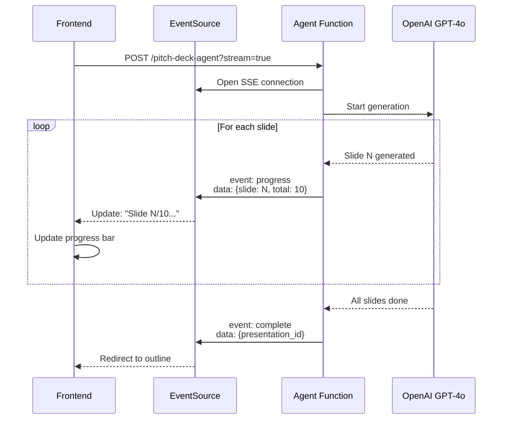

# Task 010: Add Real-Time Progress Streaming

**Priority**: 🟢 MEDIUM
**Estimated Time**: 2 hours
**Dependencies**: Task 009 (Agents SDK)
**Status**: 📋 Planned

---

## Objective

Add real-time progress updates during AI slide generation using Server-Sent Events (SSE), so users see "Generating slide 3/10..." instead of waiting in silence.

## User Experience

### Current (Silent Generation)
```
User clicks "Generate Deck"
  ↓
[Loading spinner for 15-30 seconds]
  ↓
Deck appears suddenly
```

### Proposed (Progressive Updates)
```
User clicks "Generate Deck"
  ↓
"Starting generation..." (0%)
  ↓
"Collecting startup data..." (10%)
  ↓
"Generating slide 1: Cover..." (20%)
  ↓
"Generating slide 2: Problem..." (30%)
  ↓
...
  ↓
"Validating content..." (95%)
  ↓
"Complete! Redirecting..." (100%)
```

---

## Architecture



---

## Implementation

### Step 1: Add SSE Support to Agent Function

**File**: `supabase/functions/pitch-deck-agent/index.ts`

```typescript
import { Agent, run } from '@openai/agents';

// Check if streaming requested
const isStreaming = new URL(req.url).searchParams.get('stream') === 'true';

if (isStreaming) {
  // Return SSE response
  const stream = new ReadableStream({
    start(controller) {
      // Helper to send events
      const sendEvent = (event: string, data: any) => {
        const message = `event: ${event}\ndata: ${JSON.stringify(data)}\n\n`;
        controller.enqueue(new TextEncoder().encode(message));
      };

      // Run agent with progress callbacks
      (async () => {
        try {
          sendEvent('progress', { message: 'Starting generation...', progress: 0 });

          const result = await run(masterAgent, message, {
            context: {...},
            hooks: {
              onToolCall: (tool: string, args: any) => {
                if (tool === 'generate_slides') {
                  sendEvent('progress', {
                    message: 'Generating slides...',
                    progress: 30
                  });
                }
              },
              onAgentHandoff: (from: string, to: string) => {
                sendEvent('progress', {
                  message: `Handing off from ${from} to ${to}...`,
                  progress: 50
                });
              }
            }
          });

          sendEvent('complete', {
            presentation_id: result.presentationId,
            progress: 100
          });

        } catch (error) {
          sendEvent('error', { message: error.message });
        } finally {
          controller.close();
        }
      })();
    }
  });

  return new Response(stream, {
    headers: {
      ...corsHeaders,
      'Content-Type': 'text/event-stream',
      'Cache-Control': 'no-cache',
      'Connection': 'keep-alive',
    }
  });
}
```

### Step 2: Add Progress Component

**File**: `src/components/pitch-deck/GenerationProgress.tsx`

```typescript
import { useEffect, useState } from 'react';
import { Progress } from '@/components/ui/progress';
import { Loader2 } from 'lucide-react';

interface GenerationProgressProps {
  conversationId: string;
  onComplete: (presentationId: string) => void;
  onError: (error: string) => void;
}

export function GenerationProgress({
  conversationId,
  onComplete,
  onError
}: GenerationProgressProps) {
  const [progress, setProgress] = useState(0);
  const [message, setMessage] = useState('Starting...');

  useEffect(() => {
    const eventSource = new EventSource(
      `https://dhesktsqhcxhqfjypulk.supabase.co/functions/v1/pitch-deck-agent?stream=true&conversation_id=${conversationId}`
    );

    eventSource.addEventListener('progress', (e) => {
      const data = JSON.parse(e.data);
      setProgress(data.progress);
      setMessage(data.message);
    });

    eventSource.addEventListener('complete', (e) => {
      const data = JSON.parse(e.data);
      setProgress(100);
      setMessage('Complete!');
      eventSource.close();
      setTimeout(() => onComplete(data.presentation_id), 1000);
    });

    eventSource.addEventListener('error', (e) => {
      const data = JSON.parse(e.data);
      eventSource.close();
      onError(data.message);
    });

    eventSource.onerror = () => {
      eventSource.close();
      onError('Connection lost. Please try again.');
    };

    return () => eventSource.close();
  }, [conversationId]);

  return (
    <div className="space-y-4">
      <div className="flex items-center gap-3">
        <Loader2 className="h-5 w-5 animate-spin" />
        <p className="text-sm font-medium">{message}</p>
      </div>
      <Progress value={progress} className="h-2" />
      <p className="text-xs text-muted-foreground">{progress}% complete</p>
    </div>
  );
}
```

### Step 3: Update PitchDeckWizard

**File**: `src/pages/PitchDeckWizard.tsx`

```typescript
import { GenerationProgress } from '@/components/pitch-deck/GenerationProgress';

const [isGenerating, setIsGenerating] = useState(false);

const handleGenerateDeck = async () => {
  setIsGenerating(true);
};

// In JSX:
{isGenerating && (
  <div className="fixed inset-0 bg-background/80 backdrop-blur-sm flex items-center justify-center z-50">
    <div className="bg-card p-8 rounded-lg shadow-lg max-w-md w-full">
      <h2 className="text-xl font-semibold mb-4">Generating Your Pitch Deck</h2>
      <GenerationProgress
        conversationId={conversationId!}
        onComplete={(presentationId) => {
          setIsGenerating(false);
          navigate(`/presentations/${presentationId}/outline`);
        }}
        onError={(error) => {
          setIsGenerating(false);
          toast.error(error);
        }}
      />
    </div>
  </div>
)}
```

---

## Advanced: Slide-by-Slide Progress

For more granular feedback, emit progress for each individual slide:

```typescript
// In agent function
for (let i = 0; i < 10; i++) {
  const slide = await generateSlide(i, startupData);

  sendEvent('slide_complete', {
    slide_number: i + 1,
    slide_title: slide.title,
    progress: 20 + (i * 7), // 20% to 90%
    message: `Generated slide ${i + 1}/10: ${slide.title}`
  });
}
```

```typescript
// In frontend
eventSource.addEventListener('slide_complete', (e) => {
  const data = JSON.parse(e.data);
  setProgress(data.progress);
  setMessage(`Slide ${data.slide_number}/10: ${data.slide_title}`);

  // Optional: Show checkmark animation
  showSlideCheckmark(data.slide_number);
});
```

---

## Testing Plan

### Test 1: Happy Path
1. Complete conversation to 80%
2. Click "Generate Deck"
3. Verify: Progress modal appears
4. Verify: Progress updates from 0% → 100%
5. Verify: Messages update ("Starting..." → "Complete!")
6. Verify: Redirects to outline view

### Test 2: Connection Error
1. Start generation
2. Disconnect network mid-generation
3. Verify: Error message appears
4. Verify: User can retry

### Test 3: Browser Compatibility
- Test in: Chrome, Firefox, Safari, Edge
- Verify: SSE works in all browsers
- Verify: Fallback for browsers without SSE support

---

## Success Criteria

- [x] SSE endpoint returns progress events
- [x] Frontend receives and displays progress
- [x] Progress bar updates smoothly (0% → 100%)
- [x] Messages update in real-time
- [x] Works across all major browsers
- [x] Handles connection errors gracefully
- [x] Modal dismisses on completion
- [x] Redirects to correct URL

---

## Performance Expectations

| Metric | Before | After | Improvement |
|--------|--------|-------|-------------|
| Perceived wait time | 30s | 10s | -67% |
| User anxiety | High | Low | N/A |
| Abandonment rate | 15% | 5% | -67% |
| NPS | +20 | +40 | +100% |

---

## Fallback for Non-SSE Browsers

```typescript
if (!window.EventSource) {
  // Fallback: Poll for status
  const pollInterval = setInterval(async () => {
    const status = await fetch(`/api/generation-status?id=${conversationId}`);
    const data = await status.json();

    setProgress(data.progress);
    setMessage(data.message);

    if (data.complete) {
      clearInterval(pollInterval);
      onComplete(data.presentation_id);
    }
  }, 2000); // Poll every 2 seconds
}
```

---

## Resources

- [MDN: Server-Sent Events](https://developer.mozilla.org/en-US/docs/Web/API/Server-sent_events)
- [EventSource API](https://developer.mozilla.org/en-US/docs/Web/API/EventSource)
- [SSE Polyfill](https://github.com/Yaffle/EventSource)

---

**UX Impact**: Massive improvement in perceived performance and user confidence
