# 004 - Entity Relationship Diagram: Medellin-Spark Data Model

## Mermaid Diagram

```mermaid
erDiagram
    %% AUTH & CORE
    auth_users ||--o{ profiles : "has"
    profiles ||--o{ organizers : "owns"
    profiles ||--o{ companies : "owns"
    profiles ||--o{ candidates : "is"
    profiles ||--o{ startup_profiles : "is"
    profiles ||--o{ wizard_sessions : "creates"

    %% EVENTS DOMAIN
    organizers ||--o{ events : "hosts"
    events ||--o{ tickets : "has"
    events ||--o{ registrations : "receives"
    events ||--o{ waitlist : "has"
    events ||--o{ sponsors : "has"
    events }o--o{ venues : "at"

    profiles ||--o{ registrations : "registers"
    tickets ||--o{ registrations : "for"

    %% JOBS DOMAIN
    companies ||--o{ jobs : "posts"
    jobs ||--o{ job_skills : "requires"
    jobs ||--o{ applications : "receives"
    jobs ||--o{ matches : "matched_to"

    candidates ||--o{ candidate_skills : "has"
    candidates ||--o{ applications : "submits"
    candidates ||--o{ matches : "matched_to"

    %% PERKS DOMAIN
    startup_profiles ||--o{ saved_perks : "saves"
    startup_profiles ||--o{ perk_claims : "claims"
    perks ||--o{ saved_perks : "saved_by"
    perks ||--o{ perk_claims : "claimed_via"

    %% AUTH.USERS (Supabase managed)
    auth_users {
        uuid id PK "Supabase auth ID"
        string email UK "Auth email"
        jsonb raw_user_meta_data "OAuth profile data"
        jsonb raw_app_meta_data "Role storage"
        timestamptz created_at
    }

    %% PROFILES
    profiles {
        uuid id PK
        uuid user_id UK "FK to auth.users"
        string email UK
        string full_name
        string avatar_url
        string bio
        string company
        string job_title
        string linkedin_url
        string twitter_url
        string website_url
        timestamptz created_at
        timestamptz updated_at
    }

    %% ORGANIZERS
    organizers {
        uuid id PK
        uuid profile_id FK
        string name
        string description
        string logo_url
        string website_url
        string contact_email
        timestamptz created_at
        timestamptz updated_at
    }

    %% VENUES
    venues {
        uuid id PK
        string name
        string address
        string city "default Medellin"
        string country "default Colombia"
        decimal latitude
        decimal longitude
        integer capacity
        string description
        string_array amenities
        string image_url
        timestamptz created_at
        timestamptz updated_at
    }

    %% EVENTS
    events {
        uuid id PK
        uuid organizer_id FK
        string title
        string slug UK
        string description
        timestamptz event_date
        timestamptz end_date
        enum status "draft|published|cancelled|completed"
        string image_url
        integer capacity
        integer registered_count "auto-updated"
        boolean is_virtual
        string virtual_url
        string_array tags
        timestamptz created_at
        timestamptz updated_at
        timestamptz deleted_at "soft delete"
    }

    %% EVENT_VENUES (junction)
    event_venues {
        uuid event_id FK
        uuid venue_id FK
        timestamptz created_at
    }

    %% TICKETS
    tickets {
        uuid id PK
        uuid event_id FK
        string name
        string description
        decimal price "default 0"
        integer capacity
        integer sold_count "auto-updated"
        boolean early_bird
        timestamptz early_bird_deadline
        timestamptz created_at
        timestamptz updated_at
    }

    %% REGISTRATIONS
    registrations {
        uuid id PK
        uuid event_id FK
        uuid profile_id FK
        uuid ticket_id FK
        enum status "pending|confirmed|cancelled|attended|no_show"
        enum payment_status "pending|completed|failed|refunded"
        decimal payment_amount
        string payment_reference
        boolean attended
        timestamptz check_in_time
        timestamptz created_at
        timestamptz updated_at
    }

    %% WAITLIST
    waitlist {
        uuid id PK
        uuid event_id FK
        uuid profile_id FK
        integer position
        boolean notified
        timestamptz created_at
        timestamptz updated_at
    }

    %% SPONSORS
    sponsors {
        uuid id PK
        uuid event_id FK
        string company_name
        enum tier "platinum|gold|silver|bronze"
        string logo_url
        string website_url
        string description
        timestamptz created_at
        timestamptz updated_at
    }

    %% COMPANIES
    companies {
        uuid id PK
        uuid profile_id FK
        string name
        string description
        string logo_url
        string website_url
        string industry
        string size_range "1-10, 11-50, etc"
        string location
        boolean published
        timestamptz created_at
        timestamptz updated_at
    }

    %% JOBS
    jobs {
        uuid id PK
        uuid company_id FK
        string title
        string slug UK
        string description
        string requirements
        string responsibilities
        enum type "full_time|part_time|contract|internship"
        enum status "draft|published|closed|filled"
        string location
        boolean remote_allowed
        decimal salary_min
        decimal salary_max
        string salary_currency "default USD"
        timestamptz created_at
        timestamptz updated_at
        timestamptz deleted_at "soft delete"
    }

    %% JOB_SKILLS (junction)
    job_skills {
        uuid job_id FK
        string skill_name
        boolean required "default true"
        timestamptz created_at
    }

    %% CANDIDATES
    candidates {
        uuid id PK
        uuid profile_id UK
        string resume_url
        string portfolio_url
        integer years_experience
        boolean open_to_opportunities
        string_array preferred_locations
        boolean preferred_remote
        timestamptz created_at
        timestamptz updated_at
    }

    %% CANDIDATE_SKILLS (junction)
    candidate_skills {
        uuid candidate_id FK
        string skill_name
        string proficiency_level "beginner|intermediate|expert"
        timestamptz created_at
    }

    %% APPLICATIONS
    applications {
        uuid id PK
        uuid job_id FK
        uuid candidate_id FK
        enum stage "submitted|screening|interview|offer|hired|rejected"
        string cover_letter
        decimal fit_score "AI score 0-100"
        string notes "hiring manager notes"
        timestamptz created_at
        timestamptz updated_at
    }

    %% MATCHES
    matches {
        uuid id PK
        uuid job_id FK
        uuid candidate_id FK
        decimal match_score "AI score 0-100"
        string_array reasons "match reasons"
        timestamptz created_at
    }

    %% STARTUP_PROFILES
    startup_profiles {
        uuid id PK
        uuid profile_id UK
        string company_name
        string description
        string logo_url
        string website_url
        string industry
        string stage "pre-seed|seed|series-a"
        integer team_size
        boolean verified
        timestamptz created_at
        timestamptz updated_at
    }

    %% PERKS
    perks {
        uuid id PK
        string title
        string slug UK
        string description
        string provider_name
        string provider_logo_url
        string category "cloud|marketing|legal"
        string value_description "$10k credits"
        string terms_url
        string how_to_claim
        boolean active
        boolean featured
        string eligibility_criteria
        timestamptz created_at
        timestamptz updated_at
    }

    %% SAVED_PERKS (junction)
    saved_perks {
        uuid startup_profile_id FK
        uuid perk_id FK
        timestamptz created_at
    }

    %% PERK_CLAIMS
    perk_claims {
        uuid id PK
        uuid startup_profile_id FK
        uuid perk_id FK
        enum status "pending|approved|redeemed|expired|rejected"
        jsonb claim_details "flexible claim data"
        string approval_notes
        timestamptz claimed_at
        timestamptz approved_at
        timestamptz redeemed_at
        timestamptz expires_at
        timestamptz created_at
        timestamptz updated_at
    }

    %% WIZARD_SESSIONS
    wizard_sessions {
        uuid id PK
        uuid profile_id FK
        string startup_name
        jsonb session_data "wizard state"
        boolean completed
        string deck_url "generated PDF URL"
        timestamptz created_at
        timestamptz updated_at
    }
```



## Explanation

The Medellin-Spark data model uses a **multi-tenant, role-based architecture** built on Supabase. The schema consists of 19 tables across 4 primary domains: **Events**, **Jobs Marketplace**, **Startup Perks**, and **Pitch Deck Wizard**. All user data is linked to `profiles`, which connects to Supabase's `auth.users` table via a one-to-one relationship. The `profiles` table serves as the central hub for all user interactions across the platform, supporting multiple roles (attendees, organizers, job seekers, hiring managers, startup founders).

**Events Domain**: Organizers create events with tickets, registrations, waitlists, and sponsors. The `events` table supports both virtual and in-person events via `is_virtual` and `event_venues` junction. The `registered_count` and `sold_count` fields are automatically maintained via database triggers (`update_event_registered_count()`, `update_ticket_sold_count()`), ensuring consistency without application-layer logic.

**Jobs Domain**: Companies post jobs with skill requirements. Candidates apply, and the system generates AI-powered matches with `fit_score` (0-100). The `applications` table tracks the hiring pipeline stage, while `matches` represents AI-suggested pairings before candidates formally apply.

**Perks Domain**: Verified startups can browse and claim perks from providers. The `startup_profiles.verified` boolean gates perk claiming (enforced via RLS policy). `saved_perks` acts as a bookmark system, while `perk_claims` tracks the claim lifecycle (pending → approved → redeemed → expired).

**Pitch Deck Wizard**: The `wizard_sessions` table stores flexible wizard state in `session_data` (JSONB), allowing the wizard UI to persist progress without rigid schema constraints. The `deck_url` field stores the final generated pitch deck PDF.

## Key Design Patterns

### 1. **Soft Delete Pattern**
Tables: `events`, `jobs`
- Uses `deleted_at` timestamp instead of hard deletes
- Allows recovery and audit trails
- Partial indexes exclude soft-deleted rows: `WHERE deleted_at IS NULL`

### 2. **Auto-Incrementing Counters**
Fields: `events.registered_count`, `tickets.sold_count`
- Maintained via PostgreSQL triggers (not application code)
- Triggers: `update_event_registered_count()`, `update_ticket_sold_count()`
- Ensures consistency even with concurrent registrations

### 3. **Junction Tables for Many-to-Many**
- `event_venues`: Events can have multiple venues (hybrid events)
- `job_skills`, `candidate_skills`: Flexible skill matching
- `saved_perks`: User bookmarks for perks

### 4. **JSONB for Flexibility**
- `perk_claims.claim_details`: Varies by perk provider
- `wizard_sessions.session_data`: Wizard state (step answers, progress)
- `auth.users.raw_app_meta_data`: Stores user roles (`admin`, `user`)

### 5. **Enum Types for Constrained Values**
- `event_status`, `registration_status`, `payment_status`
- `job_type`, `job_status`, `application_stage`
- `sponsor_tier`, `claim_status`
- Ensures data integrity at database level

## Indexing Strategy

**Primary Indexes (PKs and UKs):**
- All tables use UUID primary keys (`gen_random_uuid()`)
- Unique constraints on: `profiles.email`, `events.slug`, `jobs.slug`, `perks.slug`
- Unique composite keys on junction tables

**Foreign Key Indexes:**
- Every FK has a corresponding index (60+ FK indexes total)
- Speeds up JOIN queries and ON DELETE CASCADE operations

**Partial Indexes:**
- `idx_events_active` - Active events only (`WHERE deleted_at IS NULL`)
- `idx_jobs_active` - Published jobs only (`WHERE status = 'published' AND deleted_at IS NULL`)
- `idx_perks_featured` - Featured active perks (`WHERE featured = true AND active = true`)

**Composite Indexes:**
- `idx_events_status_date` - Filter by status, sort by date
- `idx_applications_fit_score` - Sort by AI score DESC
- `idx_matches_job_score`, `idx_matches_candidate_score` - Top matches

## Row Level Security (RLS) Model

**Security Model:**
- ✅ **Public read** for published content (events, jobs, perks, profiles)
- ✅ **Authenticated write** with ownership checks
- ✅ **Owner/admin manage** for updates/deletes

**Helper Functions:**
- `has_role(role_name)` - Check if user has admin/organizer role
- `current_profile_id()` - Get profile ID for current auth user
- `is_owner(table_name, record_id)` - Generic ownership check

**Example Policies:**
- **Events**: Anyone can view published events; organizers manage their own
- **Jobs**: Anyone can view published jobs; companies manage their own
- **Applications**: Candidates see own applications; companies see applications for their jobs
- **Perks**: Anyone views active perks; only verified startups can claim

## Data Flow Examples

### Event Registration Flow
```
1. User browses published events (RLS: status='published', deleted_at IS NULL)
2. User selects ticket tier (validates capacity via CHECK constraint)
3. User creates registration (RLS: profile_id = current_profile_id())
4. Trigger: update_event_registered_count() increments events.registered_count
5. Trigger: update_ticket_sold_count() increments tickets.sold_count
6. If capacity full → user joins waitlist (position auto-incremented)
```

### Job Application Flow
```
1. Candidate browses published jobs (RLS + partial index on status)
2. Candidate submits application (RLS: candidate_id ownership check)
3. AI generates fit_score (0-100) based on skills match
4. Company reviews applications sorted by fit_score DESC
5. Company updates application.stage (screening → interview → offer → hired)
6. Hired candidates appear in company's hires list
```

### Perk Claim Flow
```
1. Startup saves interesting perks (saved_perks junction table)
2. Admin verifies startup (startup_profiles.verified = true)
3. Verified startup submits claim (RLS blocks unverified)
4. Admin approves claim (sets approved_at timestamp)
5. Startup redeems perk (sets redeemed_at timestamp)
6. Claim expires after N days (expires_at check)
```

## Best Practices Demonstrated

✅ **UUID primary keys** - Better for distributed systems than serial IDs
✅ **Timestamptz everywhere** - UTC timestamps with timezone awareness
✅ **Soft deletes** - Recovery window for events/jobs
✅ **Auto-updated timestamps** - `update_updated_at()` trigger on all tables
✅ **CHECK constraints** - Enforce business rules at DB level (salary_max >= salary_min)
✅ **Enum types** - Type-safe status fields
✅ **Partial indexes** - Faster queries on common filters
✅ **Cascade deletes** - Automatic cleanup of related records
✅ **RLS policies** - Row-level security for multi-tenant data
✅ **Security definer functions** - Centralized security logic

## Recommendations

### 1. Add Missing Indexes
**Current**: No full-text search indexes on text fields
**Fix**: Add GIN indexes for text search on descriptions:
```sql
CREATE INDEX idx_events_description_fts ON events USING gin(to_tsvector('english', description));
CREATE INDEX idx_jobs_description_fts ON jobs USING gin(to_tsvector('english', description));
```

### 2. Audit Trail Table
**Current**: No audit log for sensitive operations (perk approvals, application rejections)
**Fix**: Add `audit_log` table with trigger to track changes:
```sql
CREATE TABLE audit_log (
  id uuid PRIMARY KEY DEFAULT gen_random_uuid(),
  table_name text NOT NULL,
  record_id uuid NOT NULL,
  action text NOT NULL, -- 'INSERT', 'UPDATE', 'DELETE'
  old_data jsonb,
  new_data jsonb,
  user_id uuid REFERENCES auth.users(id),
  created_at timestamptz DEFAULT now()
);
```

---

**Database**: PostgreSQL 15 (Supabase)
**Total Tables**: 19 core tables + auth tables
**Total Indexes**: 70+ indexes (60+ FK indexes, 10+ composite/partial indexes)
**Total RLS Policies**: 100+ policies across all tables
**Documentation**: Medellin-Spark MVP - Current State
