# EventOS Mermaid Diagrams - System Architecture

**Date**: October 17, 2025
**Project**: EventOS AI Agent Visualization
**Focus**: OpenAI SDKs & Multi-Agent Workflows

---

## Table of Contents

- [Diagram 1: EventOS System Architecture](#diagram-1-eventos-system-architecture)
- [Diagram 2: Multi-Agent Sponsor Prospecting Sequence](#diagram-2-multi-agent-sponsor-prospecting-sequence)
- [Diagram 3: Organizer Journey Map](#diagram-3-organizer-journey-map)
- [Diagram 4: EventOS Database Schema](#diagram-4-eventos-database-schema)
- [Diagram 5: Event Lifecycle State Machine](#diagram-5-event-lifecycle-state-machine)
- [Diagram 6: OpenAI Integration Architecture](#diagram-6-openai-integration-architecture)
- [Diagram 7: Ticketing Workflow (Stripe + Webhooks)](#diagram-7-ticketing-workflow-stripe--webhooks)
- [Diagram 8: WhatsApp Support Agent Flow](#diagram-8-whatsapp-support-agent-flow)
- [Diagram 9: Crisis Response Sequence](#diagram-9-crisis-response-sequence)

---

## Diagram 1: EventOS System Architecture

**Purpose**: End-to-end flow from organizer sign-up to post-event analytics

```mermaid
flowchart TB
    Start([Organizer Visits EventOS]) --> Auth{Auth?}
    Auth -->|No| SignUp[Sign Up via Google OAuth]
    Auth -->|Yes| Dashboard[Dashboard]
    SignUp --> Dashboard

    Dashboard --> CreateEvent[Click "Create Event"]
    CreateEvent --> Wizard[Event Creation Wizard]
    Wizard --> ChatUI[Conversational UI]
    ChatUI --> GPT5Mini[OpenAI GPT-5 mini<br/>Function Calling]
    GPT5Mini --> Extract[Extract Event Data]
    Extract --> SaveDB[(Supabase<br/>events table)]
    SaveDB --> EventPage[Event Page Generated]

    EventPage --> Phase2{Next Phase?}
    Phase2 -->|Venue| VenueAgent[Venue Match Agent]
    Phase2 -->|Sponsors| SponsorAgent[Sales Ops Agent]
    Phase2 -->|Tickets| TicketingAgent[Ticketing Agent]

    VenueAgent --> CrewAI[CrewAI Multi-Agent<br/>Research + Analysis + Writer]
    CrewAI --> Firecrawl[Firecrawl Web Search]
    Firecrawl --> VenueResults[Top 3 Venues]
    VenueResults --> OrganizerApproval{Organizer<br/>Approves?}
    OrganizerApproval -->|Yes| BookVenue[Send Contract Email]

    SponsorAgent --> CrewAI2[CrewAI Multi-Agent<br/>Prospecting]
    CrewAI2 --> SponsorSearch[Find 50 Companies]
    SponsorSearch --> PersonalizedEmails[AI-Generated Emails]
    PersonalizedEmails --> SponsorMeetings[Sales Calls]

    TicketingAgent --> StripeSetup[Stripe Checkout Setup]
    StripeSetup --> PublishEvent[Event Published]
    PublishEvent --> AttendeeBuys[Attendee Buys Ticket]
    AttendeeBuys --> StripeWebhook[Stripe Webhook]
    StripeWebhook --> n8nFlow[n8n Workflow]
    n8nFlow --> UpdateDB[(Update attendance count)]
    n8nFlow --> SendEmail[Send Confirmation Email]
    n8nFlow --> SendWhatsApp[Send WhatsApp Confirmation]

    SendWhatsApp --> PreEvent[24hrs Before Event]
    PreEvent --> WhatsAppReminders[WhatsApp Reminders<br/>n8n Scheduled Trigger]
    WhatsAppReminders --> EventDay[Event Day]

    EventDay --> LiveSupport[WhatsApp Support Agent]
    LiveSupport --> GPT5MiniSupport[OpenAI GPT-5 mini<br/>Real-time Responses]
    GPT5MiniSupport --> AttendeeQuestions[Attendee Questions Answered]

    EventDay --> LiveDashboard[Sponsor ROI Dashboard]
    LiveDashboard --> SupabaseRealtime[(Supabase Real-time<br/>WebSocket)]
    SupabaseRealtime --> SponsorMetrics[Live Metrics]

    EventDay --> CrisisMonitor[Crisis Monitoring Agent]
    CrisisMonitor --> WeatherAPI[Weather + Traffic APIs]
    WeatherAPI --> CrisisDetected{Crisis<br/>Detected?}
    CrisisDetected -->|Yes| GPT5High[OpenAI GPT-5 high<br/>Complex Reasoning]
    GPT5High --> CrisisSolutions[Suggest 3 Options]
    CrisisSolutions --> OrganizerDecision{Organizer<br/>Approves?}
    OrganizerDecision -->|Yes| MassWhatsApp[Send WhatsApp to All Attendees]

    EventDay --> EventEnds[Event Ends]
    EventEnds --> PostEventAgent[Post-Event Insights Agent]
    PostEventAgent --> AnalyzeData[Analyze Supabase Data]
    AnalyzeData --> GenerateReports[Generate PDF Reports]
    GenerateReports --> SendReports[Email Reports to Sponsors]
    GenerateReports --> RenewalCampaign[Renewal Campaign]
    RenewalCampaign --> NextYearEvent([Plan Next Year])

    style Start fill:#e1f5e1
    style Dashboard fill:#e1e5ff
    style GPT5Mini fill:#fff4e1
    style GPT5MiniSupport fill:#fff4e1
    style GPT5High fill:#fff4e1
    style SaveDB fill:#e1e5ff
    style UpdateDB fill:#e1e5ff
    style SupabaseRealtime fill:#e1e5ff
    style NextYearEvent fill:#ffe1e1
```

---

## Diagram 2: Multi-Agent Sponsor Prospecting Sequence

**Purpose**: Shows UC-10 (Sales Ops Agent) multi-agent collaboration for sponsor outreach


---

## Diagram 3: Organizer Journey Map

**Purpose**: Sarah's emotional journey from discovery to renewal (Mermaid journey format)

```mermaid
journey
    title Event Organizer Journey (Sarah Chen)

    section Discovery (Week -12)
      Google "how to plan conference": 5: Anxious
      Find EventOS: 6: Hopeful
      Sign up: 7: Interested

    section Event Creation (Week -12)
      Start Event Wizard AI: 8: Engaged
      Answer 6 questions: 9: Amazed
      Event page generated: 10: Thrilled

    section Venue Search (Week -8)
      Click "Find Venues": 9: Excited
      AI shows 3 options: 9: Impressed
      Book JW Marriott: 8: Confident

    section Sponsor Prospecting (Week -6)
      Need $25k sponsors: 6: Stressed
      AI finds 50 companies: 10: Wow!
      AI writes emails: 9: Relieved
      6 meetings scheduled: 8: Hopeful
      3 sponsors closed: 10: Ecstatic

    section Ticketing (Week -4)
      Setup ticket tiers: 8: Focused
      Stripe integration: 10: Magic!
      First ticket sold: 10: Real!
      287 tickets sold: 9: Successful

    section Pre-Event (Week -1)
      Vendor coordination: 6: Overwhelmed
      AI creates timeline: 10: Saved!
      WhatsApp reminders sent: 9: Professional
      Attendee questions handled: 9: Confident

    section Live Event (Event Day)
      Event starts: 8: Nervous
      WhatsApp agent handles 73 questions: 9: Relieved
      Storm detected: 4: Panic!
      AI re-schedules session: 10: Hero!
      Event ends perfectly: 10: Triumph

    section Post-Event (Week +1)
      AI generates report: 9: Impressed
      134 attendees renew: 10: Validated
      2 sponsors renew: 10: Secure
      Planning 2027 event: 10: Committed
```

---

## Diagram 4: EventOS Database Schema

**Purpose**: Supabase database entity relationships for EventOS


---

## Diagram 5: Event Lifecycle State Machine

**Purpose**: 8-phase event lifecycle with AI agent triggers

```mermaid
stateDiagram-v2
    [*] --> Inception: Organizer has idea

    Inception --> Planning: Event Creation Wizard (UC-1)<br/>✅ Event created in 3 minutes

    Planning --> Sponsorship: Venue Match Agent (UC-2)<br/>✅ Venue booked
    Planning --> Sponsorship: Agenda defined

    Sponsorship --> Marketing: Sales Ops Agent (UC-10)<br/>✅ 3+ sponsors secured
    Sponsorship --> Marketing: Skip if no sponsors

    Marketing --> Ticketing: Event page published

    Ticketing --> PreEventOps: Ticketing Agent (UC-3)<br/>✅ Stripe checkout live
    Ticketing --> PreEventOps: 50%+ tickets sold

    PreEventOps --> LiveEvent: Multi-Agent Scheduler (UC-6)<br/>✅ All vendors coordinated
    PreEventOps --> LiveEvent: WhatsApp Reminders sent (UC-5)<br/>✅ 24hrs before

    LiveEvent --> PostEvent: Event completes successfully
    LiveEvent --> CrisisHandling: Crisis detected!

    CrisisHandling --> LiveEvent: Crisis Ops Agent (UC-8)<br/>✅ Issue resolved
    CrisisHandling --> EventCancelled: Cannot resolve

    PostEvent --> [*]: Post-Event Insights (UC-9)<br/>✅ Reports sent, renewals triggered

    EventCancelled --> [*]: Refund attendees

    note right of Inception
        Phase I: Inception/BD
        Week -12 to -8
        AI: Event Wizard
    end note

    note right of Planning
        Phase II: Planning/Design
        Week -8 to -4
        AI: Venue Match, Scheduler
    end note

    note right of Sponsorship
        Phase III: Sponsorship
        Week -8 to -2
        AI: Sales Ops, ROI Tracker
    end note

    note right of Marketing
        Phase IV: Marketing/Comms
        Week -6 to Event Day
        Future: AI Social Agent
    end note

    note right of Ticketing
        Phase V: Ticketing/CRM
        Week -4 to Event Day
        AI: Ticketing, Personalization
    end note

    note right of PreEventOps
        Phase VI: Pre-Event Ops
        Week -1 to Event Day
        AI: Scheduler, WhatsApp Reminders
    end note

    note right of LiveEvent
        Phase VII: Live Event
        Event Day
        AI: WhatsApp Support, ROI Tracker, Crisis Ops
    end note

    note right of PostEvent
        Phase VIII: Post-Event
        Week +1 to +4
        AI: Insights, Renewals
    end note
```



---

## Diagram 6: OpenAI Integration Architecture

**Purpose**: Shows how EventOS integrates OpenAI SDKs, tools, and external services


---

## Diagram 7: Ticketing Workflow (Stripe + Webhooks)

**Purpose**: Detailed UC-3 (Ticketing automation) with webhook flow

```mermaid
sequenceDiagram
    participant A as Attendee
    participant EP as Event Page
    participant S as Stripe
    participant WH as Webhook Handler<br/>(n8n)
    participant DB as Supabase
    participant EM as Email Service
    participant WA as WhatsApp API
    participant O as Organizer

    A->>EP: Click "Buy VIP Ticket ($299)"
    EP->>S: Redirect to Stripe Checkout
    S->>A: Show payment form
    A->>S: Enter card details, click Pay

    S->>S: Process payment ($299)
    S-->>A: Show success page
    S->>WH: POST /webhooks/stripe<br/>Event: checkout.session.completed

    activate WH
    Note over WH: n8n workflow triggered

    WH->>DB: INSERT into attendees table<br/>(attendee_id, event_id, ticket_tier: 'VIP')
    DB-->>WH: ✅ Saved

    WH->>DB: UPDATE tickets SET quantity_sold = quantity_sold + 1<br/>WHERE tier = 'VIP'
    DB-->>WH: ✅ Updated (VIP: 2/20 sold)

    WH->>DB: SELECT event details, attendee email
    DB-->>WH: Event: AI Summit 2026, Email: elena@example.com

    WH->>EM: Send confirmation email<br/>Subject: "VIP Ticket Confirmed!"<br/>Attachment: ticket_QR_code.pdf
    EM-->>A: Email delivered

    WH->>WA: Send WhatsApp message<br/>"Thanks Elena! VIP ticket confirmed.<br/>Event: March 15, 9 AM @ JW Marriott"
    WA-->>A: WhatsApp delivered

    WH->>O: Slack notification<br/>"💰 VIP ticket sold! ($299)<br/>Total: 2/20 VIP tickets sold"

    deactivate WH

    Note over A,O: Total time: 3 seconds (webhook to all notifications)

    A->>EP: Check dashboard
    EP->>DB: Query ticket status
    DB-->>EP: VIP ticket confirmed, QR code: abc123
    EP-->>A: Show ticket + QR code
```



---

## Diagram 8: WhatsApp Support Agent Flow

**Purpose**: UC-5 (WhatsApp Agent) conversational support with handoffs

```mermaid
flowchart TB
    Start([Attendee Texts<br/>"Where is parking?"]) --> WebhookReceive[WhatsApp Webhook<br/>Received by n8n]
    WebhookReceive --> ParseMessage[Parse Message<br/>Extract: phone, body, timestamp]
    ParseMessage --> CheckCache{Recent<br/>Conversation?}

    CheckCache -->|Yes| LoadHistory[Load Chat History<br/>from Supabase]
    CheckCache -->|No| NewChat[Start New Conversation]

    LoadHistory --> RunAgent[OpenAI Agents SDK<br/>Support Agent]
    NewChat --> RunAgent

    RunAgent --> GPT5Mini[OpenAI GPT-5 mini<br/>Model: gpt-5-mini-2025-08-07]
    GPT5Mini --> FunctionCall{Function<br/>Call?}

    FunctionCall -->|query_event_info| QueryDB[(Supabase<br/>events table)]
    FunctionCall -->|check_schedule| QuerySessions[(Supabase<br/>sessions table)]
    FunctionCall -->|lookup_attendee| QueryAttendee[(Supabase<br/>attendees table)]
    FunctionCall -->|No| DirectResponse[Generate Text Response]

    QueryDB --> DBResult[Parking: Valet $25<br/>or public lot 2 blocks]
    QuerySessions --> SessionResult[Next session: 2 PM<br/>Design Thinking Workshop]
    QueryAttendee --> AttendeeResult[Ticket: VIP #A4752<br/>Check-in: ✅]

    DBResult --> GenerateResponse[AI Generates Response]
    SessionResult --> GenerateResponse
    AttendeeResult --> GenerateResponse
    DirectResponse --> GenerateResponse

    GenerateResponse --> ComplexityCheck{Complex<br/>Issue?}

    ComplexityCheck -->|No| SimpleResponse["Parking is at 110 E 2nd St.<br/>Valet $25 or public lot 2 blocks away.<br/>Enjoy the event! 🅿️"]
    ComplexityCheck -->|Yes| HandoffDecision{Needs<br/>Human?}

    HandoffDecision -->|Yes| EscalateToOps[Handoff to humanOpsAgent<br/>"Connecting you with ops team"]
    HandoffDecision -->|No| SimpleResponse

    SimpleResponse --> SendWhatsApp[Send WhatsApp Message<br/>via WhatsApp Business API]
    EscalateToOps --> SendWhatsApp

    SendWhatsApp --> LogConversation[(Log to Supabase<br/>attendee_messages table)]
    LogConversation --> TrackMetrics[Update AgentOps<br/>Cost: $0.01 OpenAI<br/>+ $0.008 WhatsApp]

    TrackMetrics --> End([Response Delivered<br/>3 seconds total])

    style Start fill:#e1f5e1
    style GPT5Mini fill:#fff4e1
    style End fill:#ffe1e1
    style QueryDB fill:#e1e5ff
    style QuerySessions fill:#e1e5ff
    style QueryAttendee fill:#e1e5ff
    style LogConversation fill:#e1e5ff
```

---

## Diagram 9: Crisis Response Sequence

**Purpose**: UC-8 (Crisis Ops Agent) showing weather alert → AI decision → mass communication


---

## Diagram Usage Guide

### For Developers
- **Diagram 1** (Architecture): Understand end-to-end system flow
- **Diagram 4** (Database): Schema reference for Supabase tables
- **Diagram 6** (Integration): OpenAI SDK connections
- **Diagram 7** (Ticketing): Stripe webhook implementation

### For Product Managers
- **Diagram 3** (Journey): User experience optimization
- **Diagram 5** (Lifecycle): Event phase transitions
- **Diagram 2** (Multi-Agent): Complex workflow understanding
- **Diagram 9** (Crisis): Edge case handling

### For Stakeholders
- **Diagram 1** (Architecture): High-level overview
- **Diagram 3** (Journey): User satisfaction metrics
- **Diagram 8** (WhatsApp): Customer support automation
- **Diagram 9** (Crisis): Risk mitigation

---

## Mermaid Rendering

These diagrams can be rendered in:
- **GitHub** (automatic Mermaid support in Markdown)
- **Notion** (paste as code blocks with `mermaid` language)
- **VS Code** (Markdown Preview Mermaid Support extension)
- **Obsidian** (built-in Mermaid support)
- **Online**: [Mermaid Live Editor](https://mermaid.live)

---

**Technical Notes**:

1. **Diagram 1** shows the complete EventOS flow from sign-up to renewal
2. **Diagram 2** demonstrates CrewAI multi-agent pattern (UC-10)
3. **Diagram 3** uses Mermaid `journey` syntax for emotional tracking
4. **Diagram 4** uses `erDiagram` for database relationships
5. **Diagram 5** uses `stateDiagram-v2` for lifecycle transitions
6. **Diagram 6** uses `graph TB` for system architecture
7. **Diagram 7** uses `sequenceDiagram` for webhook flow
8. **Diagram 8** uses `flowchart TB` for decision logic
9. **Diagram 9** uses `sequenceDiagram` for crisis timeline

---

**Report Prepared By**: Claude AI (Sonnet 4.5)
**Last Updated**: October 17, 2025
**Next**: Read SNIPPETS.md for implementation code examples
