# 002 - Pitch Deck Generator Agent Implementation Plan

> **Reading Time**: 45 minutes  
> **Audience**: Developers, Architects  
> **Purpose**: Comprehensive plan to build an AI-powered pitch deck generator using Blaxel + CopilotKit  
> **Status**: 📋 Planning Phase

---

## 📋 Table of Contents

1. [Executive Summary](#executive-summary)
2. [Existing Infrastructure](#existing-infrastructure)
3. [System Analysis](#system-analysis)
4. [Architecture Design](#architecture-design)
5. [Implementation Strategy](#implementation-strategy)
6. [Development Roadmap](#development-roadmap)
7. [Code Examples](#code-examples)
8. [Integration Points](#integration-points)
9. [Success Criteria](#success-criteria)

---

## Executive Summary

**Goal**: Build a production-ready AI pitch deck generator that combines:
- **Blaxel** (multi-agent orchestration)
- **CopilotKit** (conversational UI)
- **Presenton.ai** (template system + presentation generation)
- **Existing Routes** (from sitemap: `/pitch-deck-wizard`)

**Current State**:
- ✅ Blaxel template working (`template-copilot-kit-py`)
- ✅ CopilotKit PowerPoint app working (`100-copilotkit-powerpoint`)
- ✅ Presenton.ai templates documented (`phase-2/`)
- ✅ Pitch deck routes planned (`sitemap.md`)

**Target Architecture**:
```
User → CopilotKit UI → Blaxel Agent → Multi-Agent System → Presentation Generator → Template System → PPTX Export
```

---

## Existing Infrastructure

### Routes Already Created (from `sitemap.md`)

The application already has a complete routing structure for pitch deck functionality:

#### **Pitch Deck Routes** 🎨

```mermaid
graph TD
    A[Home Page] --> B[/pitch-deck<br/>Landing Page]
    B --> C[/pitch-deck-wizard<br/>AI Wizard]
    C --> D[Dashboard<br/>Pitch Decks]
    D --> E[/presentations/:id/outline<br/>Outline Editor]
    D --> F[/presentations/:id/edit<br/>Slide Editor]
    D --> G[/presentations/:id/view<br/>Viewer]
    
    style B fill:#e1f5e1
    style C fill:#fff4e1
    style D fill:#e1f5ff
    style E fill:#ffe1f5
    style F fill:#ffe1f5
    style G fill:#f5e1ff
```

**Existing Routes Status**:
- ✅ `/pitch-deck` - Landing page (public)
- ✅ `/pitch-deck-wizard` - AI Pitch Deck Wizard (public)
- ✅ `/dashboard/pitch-decks` - Pitch Decks Dashboard (authenticated)
- ✅ `/presentations/:id/outline` - Outline Editor (authenticated)
- ✅ `/presentations/:id/edit` - Slide Editor (authenticated)
- ✅ `/presentations/:id/view` - Presentation Viewer (authenticated)

### How We'll Use Existing Routes

#### **Route Integration Flow**


#### **1. Landing Page (`/pitch-deck`)**
**Current State**: 🟢 Working  
**How We'll Enhance**:
- Add "Create with AI" CTA button
- Link to `/pitch-deck-wizard`
- Show example presentations generated by AI
- Display pricing/tiers

**Integration**:
```typescript
// Add to existing /pitch-deck page
<Button onClick={() => navigate('/pitch-deck-wizard')}>
  Create Pitch Deck with AI
</Button>
```

#### **2. AI Wizard (`/pitch-deck-wizard`)**
**Current State**: ✅ Already exists, needs Blaxel integration  
**How We'll Enhance**:
- Integrate CopilotKit UI from `app-sample`
- Connect to Blaxel agent endpoint
- Add real-time slide preview
- Implement conversational flow

**Integration**:
```typescript
// Enhance existing wizard page
import { CopilotKit } from "@copilotkit/react-core";
import { PitchDeckAgent } from "./components/PitchDeckAgent";

export default function PitchDeckWizard() {
  return (
    <CopilotKit url="/api/copilotkit/">
      <PitchDeckAgent />
    </CopilotKit>
  );
}
```

#### **3. Dashboard (`/dashboard/pitch-decks`)**
**Current State**: 🟢 Working  
**How We'll Enhance**:
- List all AI-generated presentations
- Show generation status (pending, completed, failed)
- Add "Create New" button
- Filter by template type

**Integration**:
```typescript
// Add to existing dashboard
<Button onClick={() => navigate('/pitch-deck-wizard')}>
  Create New Pitch Deck
</Button>

{/* Display AI-generated presentations */}
<PresentationList presentations={aiGeneratedPresentations} />
```

#### **4. Slide Editor (`/presentations/:id/edit`)**
**Current State**: 🟢 Working  
**How We'll Enhance**:
- Add "AI Assistant" sidebar
- Enable real-time AI content updates
- Add template switching via AI
- Implement AI-powered slide suggestions

**Integration**:
```typescript
// Enhance existing editor
import { CopilotKit } from "@copilotkit/react-core";
import { CopilotSidebar } from "@copilotkit/react-ui";

export default function SlideEditor({ presentationId }) {
  return (
    <CopilotKit url="/api/copilotkit/">
      <CopilotSidebar
        instructions="Help user edit this pitch deck presentation"
        presentationId={presentationId}
      >
        <ExistingSlideEditor />
      </CopilotSidebar>
    </CopilotKit>
  );
}
```

### Existing Components We'll Reuse

#### **From Current Codebase**:
```typescript
// Already Created Components
- Slide.tsx                    // Individual slide component
- Presentation.tsx             // Presentation container
- SlideEditor.tsx              // Editor interface
- DashboardPitchDecks.tsx      // Dashboard listing
- PitchDeckWizard.tsx          // Wizard flow (to be enhanced)
```

#### **Integration Points**:
1. **Slide Component** → Use for preview in wizard
2. **Presentation Container** → Display generated slides
3. **Editor Component** → Edit AI-generated content
4. **Dashboard** → List and manage presentations

### Data Flow with Existing Routes

```mermaid
flowchart TD
    Start([User arrives at /pitch-deck]) --> Landing[Landing Page]
    Landing --> Wizard[Click Create → /pitch-deck-wizard]
    
    Wizard --> Chat[Start Chat with AI]
    Chat --> Agent[Blaxel Agent Generates]
    Agent --> Save[Save to Database]
    Save --> Redirect[Redirect to /dashboard/pitch-decks]
    
    Redirect --> List[See Presentation in List]
    List --> View[Click View → /presentations/:id/view]
    List --> Edit[Click Edit → /presentations/:id/edit]
    
    Edit --> AIAssistant[Use AI Assistant]
    AIAssistant --> Update[Update Slides]
    Update --> Save2[Save Changes]
    
    View --> Export[Export PPTX]
    Export --> Download[Download File]
    
    style Start fill:#e1f5e1
    style Download fill:#e1f5e1
    style Agent fill:#fff4e1
    style AIAssistant fill:#ffe1f5
```



### Integration Strategy

#### **Phase 1: Connect Routes**
- ✅ Routes already exist in `App.tsx`
- ✅ Components already created
- 🔄 Need to: Add CopilotKit to wizard page
- 🔄 Need to: Connect to Blaxel agent

#### **Phase 2: Enhance Existing Components**
- ✅ Use existing `Slide.tsx` component
- ✅ Use existing `Presentation.tsx` container
- 🔄 Enhance with AI capabilities
- 🔄 Add real-time updates

#### **Phase 3: Backend Integration**
- ✅ Database schema exists (Presentations table)
- 🔄 Add Blaxel agent endpoint
- 🔄 Connect agent to database
- 🔄 Implement presentation save/load

### Migration Path

**Old Flow** (Manual):
```
User → Wizard → Manual Entry → Save → Dashboard
```

**New Flow** (AI-Powered):
```
User → Wizard → AI Chat → Agent Generates → Auto-Save → Dashboard
         ↓
    (Same routes)
```

**No Route Changes Needed** ✅  
**Existing routes work seamlessly** ✅  
**Just add AI layer on top** ✅

---

## System Analysis

### Component Inventory

#### 1. **template-copilot-kit-py** (Blaxel Agent Template)
**Purpose**: Multi-agent conversational assistant framework  
**Tech Stack**: Python + FastAPI + LangGraph + CopilotKit  
**Key Features**:
- Supervisor agent for task delegation
- Multiple specialized agents (flight, hotel)
- CopilotKit integration endpoint
- Streaming responses
- Hot reload development

**Strengths**:
- ✅ Production-ready agent architecture
- ✅ Multi-agent coordination with LangGraph
- ✅ CopilotKit endpoint integration
- ✅ Blaxel deployment ready

**Files**:
- `src/agent.py` - Supervisor agent orchestration
- `src/main.py` - FastAPI application + CopilotKit endpoint
- `src/flight.py` - Flight booking agent
- `src/hotel.py` - Hotel booking agent
- `blaxel.toml` - Deployment configuration

#### 2. **100-copilotkit-powerpoint** (CopilotKit UI)
**Purpose**: AI-powered presentation creation interface  
**Tech Stack**: Next.js + TypeScript + CopilotKit + Tailwind  
**Key Features**:
- Conversational AI assistant
- Slide creation and editing
- Background image generation
- Spoken narration support
- Real-time slide preview

**Strengths**:
- ✅ Clean CopilotKit integration
- ✅ Slide management (add, edit, delete)
- ✅ AI content generation
- ✅ Responsive UI

**Files**:
- `src/app/components/Presentation.tsx` - Slide management
- `src/app/page.tsx` - CopilotKit sidebar integration
- `src/app/components/Slide.tsx` - Individual slide component

#### 3. **200-presenton** (Template System)
**Purpose**: Advanced AI presentation generator with templates  
**Tech Stack**: Next.js + FastAPI + PostgreSQL + React + Zod  
**Key Features**:
- Multi-provider AI support (OpenAI, Google, Anthropic, Ollama)
- Template system (static + custom)
- Dynamic template compilation
- Schema validation with Zod
- PPTX/PDF export

**Strengths**:
- ✅ Sophisticated template architecture
- ✅ Multi-provider AI integration
- ✅ Schema-driven data validation
- ✅ Custom template compilation
- ✅ Production-ready export system

**Architecture Insights** (from phase-2 docs):
- Template loading with caching
- Component compilation with Babel
- Multi-provider AI abstraction
- Streaming responses
- Asset generation pipeline

#### 4. **mvp/sitemap.md** (Route Planning)
**Key Routes for Pitch Deck**:
- `/pitch-deck` - Landing page
- `/pitch-deck-wizard` - AI Pitch Deck Wizard
- `/dashboard/pitch-decks` - Dashboard
- `/presentations/:id/edit` - Editor
- `/presentations/:id/view` - Viewer

---

## Architecture Design

### Target System Architecture


### Complete System Data Flow


### Multi-Agent System Flow


### User Journey Flow


### End-to-End Process Flow


### Database Entity Relationship Diagram (ERD)


### Agent Communication Flow


### API Request Flow


---

## Implementation Strategy

### Phase 1: Foundation (Week 1)

**Goal**: Setup basic pitch deck agent infrastructure

#### Task 1.1: Create Pitch Deck Agent Structure
```bash
# Clone template
cp -r template-copilot-kit-py pitch-deck-agent
cd pitch-deck-agent

# Remove travel-specific agents
rm src/flight.py src/hotel.py

# Create pitch deck agents
touch src/content_agent.py
touch src/template_agent.py
touch src/export_agent.py
```

#### Task 1.2: Build Content Generation Agent
**File**: `src/content_agent.py`

```python
from langgraph.graph import StateGraph, END
from langchain_core.messages import BaseMessage
from typing import TypedDict, Annotated
from blaxel.langgraph import bl_model

class State(TypedDict):
    messages: Annotated[list[BaseMessage], "The messages in the conversation"]
    topic: str
    slides: list[dict]

async def agent():
    """Content generation agent for pitch deck slides"""
    model = await bl_model("sandbox-openai")
    
    def call_model(state: State):
        # Generate pitch deck content based on topic
        topic = state.get("topic", "Startup pitch")
        
        # Call AI to generate slide content
        response = model.invoke([
            {"role": "system", "content": f"""
            You are a pitch deck expert. Generate compelling content for a 
            {topic} pitch deck. Return structured JSON with slide data.
            """},
            {"role": "user", "content": "Generate content for cover slide and 5 more slides"}
        ])
        
        return {"messages": [response], "slides": parse_slides(response.content)}
    
    workflow = StateGraph(State)
    workflow.add_node("content_generator", call_model)
    workflow.add_edge("content_generator", END)
    workflow.set_entry_point("content_generator")
    
    return workflow.compile(name="content-agent", checkpointer=MemorySaver())
```

#### Task 1.3: Build Template Agent
**File**: `src/template_agent.py`

```python
async def agent():
    """Template management agent"""
    # Load available templates
    templates = await load_templates()
    
    def select_template(state: State):
        # AI selects best template based on content
        content = state.get("slides", [])
        selected_template = ai_select_template(content, templates)
        return {"template": selected_template}
    
    workflow = StateGraph(State)
    workflow.add_node("template_selector", select_template)
    workflow.add_edge("template_selector", END)
    workflow.set_entry_point("template_selector")
    
    return workflow.compile(name="template-agent", checkpointer=MemorySaver())
```

#### Task 1.4: Update Supervisor Agent
**File**: `src/agent.py`

```python
from .content_agent import agent as content_agent
from .template_agent import agent as template_agent
from .export_agent import agent as export_agent

async def agent():
    model = await bl_model("sandbox-openai")
    
    # Initialize specialized agents
    content = await content_agent()
    template = await template_agent()
    export = await export_agent()
    
    supervisor_graph = create_supervisor(
        [content, template, export],
        model=model,
        supervisor_name="pitch-deck-supervisor",
        prompt="""
        You are a pitch deck generation supervisor. You orchestrate multiple 
        agents to create professional pitch decks:
        
        - content-agent: Generates compelling slide content using AI
        - template-agent: Selects and applies appropriate presentation templates
        - export-agent: Converts slides to PPTX/PDF format
        
        Workflow:
        1. Understand user's pitch deck requirements
        2. Generate content with content-agent
        3. Apply template with template-agent
        4. Export presentation with export-agent
        
        Guide the user through each step and ask clarifying questions when needed.
        """,
    )
    
    return supervisor_graph.compile(
        name="pitch-deck-supervisor", 
        checkpointer=MemorySaver()
    )
```

### Phase 2: Integration (Week 2)

**Goal**: Integrate with existing UI and template system

#### Task 2.1: Update CopilotKit Frontend
**File**: `app-sample/src/app/page.tsx`

```typescript
export default function PitchDeckGenerator() {
  return (
    <CopilotKit url="/api/copilotkit/">
      <CopilotSidebar
        instructions="You are a pitch deck generation assistant. Help users create 
        professional pitch decks through conversation. Guide them through:
        1. Understanding their business/startup
        2. Selecting the right template
        3. Generating compelling content
        4. Exporting the final presentation
        
        Always ask clarifying questions before generating content."
        defaultOpen={true}
        labels={{
          title: "Pitch Deck Assistant",
          initial: "Hi! 👋 Let's create an amazing pitch deck together. 
          Tell me about your startup or business idea.",
        }}
      >
        <Presentation />
      </CopilotSidebar>
    </CopilotKit>
  );
}
```

#### Task 2.2: Integrate Presenton Templates
**File**: `src/template_agent.py`

```python
# Load templates from Presenton.ai system
async def load_presenton_templates():
    """Load templates from presenton template system"""
    templates = [
        {
            "id": "general",
            "name": "General Business",
            "description": "Standard business presentation templates",
            "slides": ["IntroSlideLayout", "BulletWithIconsSlideLayout", "ChartWithBulletsSlideLayout"]
        },
        {
            "id": "modern",
            "name": "Modern Pitch Deck",
            "description": "Modern startup pitch deck templates",
            "slides": ["1IntroSlideLayout", "2AboutCompanySlideLayout", "3ProblemSlideLayout"]
        },
        {
            "id": "standard",
            "name": "Standard Format",
            "description": "Traditional business presentation format",
            "slides": ["TitleSlide", "ContentSlide", "ConclusionSlide"]
        }
    ]
    return templates
```

### Phase 3: Advanced Features (Week 3)

**Goal**: Add production-ready features

#### Task 3.1: Multi-Provider AI Support
**File**: `src/content_agent.py`

```python
async def generate_with_multiple_providers(prompt: str):
    """Generate content using multiple AI providers"""
    providers = ["openai", "google", "anthropic"]
    
    # Try each provider with fallback
    for provider in providers:
        try:
            result = await call_ai_provider(provider, prompt)
            return result
        except Exception as e:
            logger.warning(f"Provider {provider} failed: {e}")
            continue
    
    raise Exception("All AI providers failed")
```

#### Task 3.2: Streaming Responses
**File**: `src/main.py`

```python
# Update CopilotKit endpoint to support streaming
@app.get("/copilotkit/stream")
async def stream_generation(presentation_id: str):
    """Stream pitch deck generation progress"""
    async def generate():
        async for progress in generate_pitch_deck_stream(presentation_id):
            yield progress
    
    return StreamingResponse(generate(), media_type="text/event-stream")
```

#### Task 3.3: Template Customization
**File**: `src/template_agent.py`

```python
async def customize_template(template_id: str, customizations: dict):
    """Customize a template with user preferences"""
    # Load base template
    template = await load_template(template_id)
    
    # Apply customizations
    customized = apply_customizations(template, customizations)
    
    # Validate schema
    validated = validate_template_schema(customized)
    
    return validated
```

---

## Development Roadmap

### Sprint 1: Core Agent Setup (Days 1-3)
- [ ] Create agent structure from template
- [ ] Implement content generation agent
- [ ] Implement template agent
- [ ] Implement export agent
- [ ] Update supervisor agent
- [ ] Test basic agent communication

### Sprint 2: UI Integration (Days 4-6)
- [ ] Update CopilotKit frontend
- [ ] Integrate with presentation components
- [ ] Add slide preview functionality
- [ ] Implement conversational flow
- [ ] Test end-to-end conversation

### Sprint 3: Template System (Days 7-9)
- [ ] Integrate Presenton templates
- [ ] Add template selection logic
- [ ] Implement template customization
- [ ] Add schema validation
- [ ] Test template application

### Sprint 4: Export & Polish (Days 10-12)
- [ ] Implement PPTX export
- [ ] Add streaming responses
- [ ] Multi-provider AI support
- [ ] Error handling & recovery
- [ ] Performance optimization

### Sprint 5: Testing & Deployment (Days 13-15)
- [ ] End-to-end testing
- [ ] Load testing
- [ ] Security review
- [ ] Deploy to Blaxel
- [ ] Document API & usage

---

## Code Examples

### Example 1: Complete Agent Orchestration

```python
# src/agent.py - Full implementation
from blaxel.langgraph import bl_model
from langgraph_supervisor import create_supervisor
from .content_agent import agent as content_agent
from .template_agent import agent as template_agent
from .export_agent import agent as export_agent

async def agent():
    model = await bl_model("sandbox-openai")
    
    # Initialize specialized agents
    content = await content_agent()
    template = await template_agent()
    export = await export_agent()
    
    supervisor_graph = create_supervisor(
        [content, template, export],
        model=model,
        supervisor_name="pitch-deck-supervisor",
        prompt="""You are a pitch deck generation supervisor...""",
    )
    
    return supervisor_graph.compile(
        name="pitch-deck-supervisor", 
        checkpointer=MemorySaver()
    )
```

### Example 2: Frontend Integration

```typescript
// app-sample/src/app/page.tsx
"use client";

import { CopilotKit } from "@copilotkit/react-core";
import { CopilotSidebar } from "@copilotkit/react-ui";
import { Presentation } from "./components/Presentation";

export default function PitchDeckGenerator() {
  return (
    <CopilotKit url="/api/copilotkit/">
      <CopilotSidebar
        instructions="Help users create professional pitch decks..."
        defaultOpen={true}
        labels={{
          title: "Pitch Deck Assistant",
          initial: "Let's create an amazing pitch deck! Tell me about your startup.",
        }}
      >
        <Presentation />
      </CopilotSidebar>
    </CopilotKit>
  );
}
```

### Example 3: Template Integration

```python
# src/template_agent.py - Template Management
from presenton_templates import load_templates, apply_template, validate_schema

async def agent():
    """Template management agent"""
    templates = await load_templates()
    
    def select_and_apply(state: State):
        # Get generated content
        slides = state.get("slides", [])
        
        # Select best template using AI
        selected_template = ai_select_template(slides, templates)
        
        # Apply template to slides
        templated_slides = apply_template(slides, selected_template)
        
        # Validate schema
        validated = validate_schema(templated_slides, selected_template.schema)
        
        return {"slides": validated, "template": selected_template}
    
    workflow = StateGraph(State)
    workflow.add_node("template_manager", select_and_apply)
    workflow.add_edge("template_manager", END)
    workflow.set_entry_point("template_manager")
    
    return workflow.compile(name="template-agent", checkpointer=MemorySaver())
```

---

## Integration Points

### CopilotKit ↔ Blaxel Agent


### Blaxel Agent ↔ Presenton Templates

```python
# Integration point for Presenton templates
async def load_presenton_template(template_id: str):
    """Load template from Presenton system"""
    # Option 1: Direct file access
    template_path = f"/path/to/presenton/templates/{template_id}"
    
    # Option 2: API access
    async with aiohttp.ClientSession() as session:
        async with session.get(f"http://presenton/api/templates/{template_id}") as response:
            template = await response.json()
    
    return template
```

---

## Success Criteria

### Functional Requirements
- [ ] ✅ Multi-agent orchestration working
- [ ] ✅ Conversational UI operational
- [ ] ✅ Content generation functional
- [ ] ✅ Template system integrated
- [ ] ✅ PPTX export working
- [ ] ✅ Multi-provider AI support

### Performance Requirements
- [ ] ✅ Agent response time < 5 seconds
- [ ] ✅ Presentation generation < 30 seconds
- [ ] ✅ Template loading < 2 seconds
- [ ] ✅ PPTX export < 10 seconds

### Quality Requirements
- [ ] ✅ Error handling comprehensive
- [ ] ✅ Schema validation working
- [ ] ✅ Streaming responses functional
- [ ] ✅ Hot reload operational
- [ ] ✅ Production deployment ready

---

## Next Steps

### Immediate Actions
1. Clone `template-copilot-kit-py` as base
2. Create specialized agents (content, template, export)
3. Update supervisor agent
4. Test agent communication

### Short-term (Week 1-2)
1. Integrate CopilotKit UI
2. Add slide management
3. Connect to template system
4. Implement basic export

### Long-term (Week 3-4)
1. Add advanced features
2. Optimize performance
3. Deploy to production
4. Document APIs

---

**Document Status**: 📋 Planning Complete  
**Next Review**: After Sprint 1 completion  
**Created**: 2025-10-24  
**Version**: 1.0.0

