# 003 - Pitch Deck Generator Diagrams

> **Visual Reference Document**  
> **Purpose**: Comprehensive diagrams showing architecture, flows, and system design  
> **Status**: 📊 Complete Visual Documentation

---

## 📋 Table of Contents

1. [Architecture Diagrams](#architecture-diagrams)
2. [Process Flows](#process-flows)
3. [User Journeys](#user-journeys)
4. [Data Flow Diagrams](#data-flow-diagrams)
5. [Database Schema](#database-schema)
6. [Sequence Diagrams](#sequence-diagrams)
7. [Integration Diagrams](#integration-diagrams)

---

## Architecture Diagrams

### Target System Architecture


### Routes Architecture

```mermaid
graph TD
    A[Home Page] --> B[/pitch-deck<br/>Landing Page]
    B --> C[/pitch-deck-wizard<br/>AI Wizard]
    C --> D[Dashboard<br/>Pitch Decks]
    D --> E[/presentations/:id/outline<br/>Outline Editor]
    D --> F[/presentations/:id/edit<br/>Slide Editor]
    D --> G[/presentations/:id/view<br/>Viewer]
    
    style B fill:#e1f5e1
    style C fill:#fff4e1
    style D fill:#e1f5ff
    style E fill:#ffe1f5
    style F fill:#ffe1f5
    style G fill:#f5e1ff
```

---

## Process Flows

### Complete System Data Flow


### End-to-End Process Flow


### API Request Flow


### Data Flow with Existing Routes

```mermaid
flowchart TD
    Start([User arrives at /pitch-deck]) --> Landing[Landing Page]
    Landing --> Wizard[Click Create → /pitch-deck-wizard]
    
    Wizard --> Chat[Start Chat with AI]
    Chat --> Agent[Blaxel Agent Generates]
    Agent --> Save[Save to Database]
    Save --> Redirect[Redirect to /dashboard/pitch-decks]
    
    Redirect --> List[See Presentation in List]
    List --> View[Click View → /presentations/:id/view]
    List --> Edit[Click Edit → /presentations/:id/edit]
    
    Edit --> AIAssistant[Use AI Assistant]
    AIAssistant --> Update[Update Slides]
    Update --> Save2[Save Changes]
    
    View --> Export[Export PPTX]
    Export --> Download[Download File]
    
    style Start fill:#e1f5e1
    style Download fill:#e1f5e1
    style Agent fill:#fff4e1
    style AIAssistant fill:#ffe1f5
```



---

## User Journeys

### Complete Pitch Deck Creation Journey


---

## Data Flow Diagrams

### Component Communication Flow


---

## Database Schema

### Entity Relationship Diagram (ERD)


---

## Sequence Diagrams

### Multi-Agent System Flow


### Agent Communication Flow


### Route Integration Flow


---

## Integration Diagrams

### CopilotKit ↔ Blaxel Agent Integration


### Blaxel Agent ↔ Presenton Templates Integration


---

## System Context Diagrams

### C4 Model: System Context


### C4 Model: Container Diagram


---

## Agent State Machine

### Pitch Deck Generation State Flow


---

## Network Architecture

### Request Flow Through Stack


---

## Template Processing Flow

### Template Selection and Application


---

## Error Handling Flow

### Error Recovery Process


---

**Document Status**: 📊 Visual Reference Complete  
**Last Updated**: 2025-10-24  
**Version**: 1.0.0

