# 📦 TASK 1: INSTALL DEPENDENCIES & ENVIRONMENT SETUP

**Priority**: 🔴 CRITICAL
**Estimated Time**: 15-20 minutes
**Dependencies**: None
**Status**: 🔴 NOT STARTED

---

## 🎯 OBJECTIVE

Install all required Python dependencies for Supabase integration and verify the development environment is properly configured.

---

## 📊 WORKFLOW DIAGRAM

```mermaid
flowchart TD
    A[Start: Task 1] --> B[Navigate to Backend]
    B --> C[Activate Virtual Environment]
    C --> D[Install supabase-py]
    D --> E[Install python-dotenv]
    E --> F[Update pyproject.toml]
    F --> G[Verify Imports]
    G --> H{All Imports OK?}
    H -->|Yes| I[✅ TASK COMPLETE]
    H -->|No| J[Debug Import Errors]
    J --> G

    style A fill:#90EE90
    style I fill:#90EE90
    style H fill:#FFD700
    style J fill:#FFB6C1
```



---

## 🔧 STEP-BY-STEP INSTRUCTIONS

### Step 1: Navigate to Backend Directory

```bash
cd /home/sk/mde/template-copilot-kit-py
```

**Expected Output**: Directory changes to template-copilot-kit-py

**Verification**:
```bash
pwd
# Should show: /home/sk/mde/template-copilot-kit-py
```

---

### Step 2: Activate Virtual Environment

```bash
source .venv/bin/activate
```

**Expected Output**: Command prompt shows `(.venv)` prefix

**Verification**:
```bash
which python3
# Should show: /home/sk/mde/template-copilot-kit-py/.venv/bin/python3
```

**Troubleshooting**:
- If `.venv` doesn't exist:
  ```bash
  python3 -m venv .venv
  source .venv/bin/activate
  ```

---

### Step 3: Install Supabase Python Client

```bash
uv pip install supabase
```

**Expected Output**:
```
Resolved X packages in Y.XXs
Installed 1 package in Z.XXs
 + supabase==2.x.x
```

**Verification**:
```bash
python3 -c "from supabase import create_client; print('✅ supabase-py installed successfully')"
```

**Expected**: `✅ supabase-py installed successfully`

---

### Step 4: Install Python-dotenv

```bash
uv pip install python-dotenv
```

**Expected Output**:
```
Resolved X packages in Y.XXs
Installed 1 package in Z.XXs
 + python-dotenv==1.x.x
```

**Verification**:
```bash
python3 -c "from dotenv import load_dotenv; print('✅ python-dotenv installed successfully')"
```

**Expected**: `✅ python-dotenv installed successfully`

---

### Step 5: Update pyproject.toml

**Edit file**: `/home/sk/mde/template-copilot-kit-py/pyproject.toml`

Add these two lines to the `dependencies` array:

```toml
dependencies = [
    "asgi-correlation-id>=4.3.4",
    "blaxel[langgraph,telemetry]==0.2.19",
    "copilotkit>=0.1.46",
    "fastapi[standard]>=0.115.12",
    "langgraph-supervisor>=0.0.4",
    "rich>=13.9.4",
    "playwright>=1.51.0",
    "html2text>=2025.4.15",
    "supabase>=2.10.0",          # ⭐ ADD THIS LINE
    "python-dotenv>=1.0.0",      # ⭐ ADD THIS LINE
]
```

**Verification**:
```bash
grep "supabase" pyproject.toml
grep "python-dotenv" pyproject.toml
```

**Expected**: Both lines should be present

---

### Step 6: Install All Dependencies

```bash
uv pip install -e .
```

**Expected Output**:
```
Resolved X packages in Y.XXs
Audited X packages in Z.XXs
```

---

### Step 7: Comprehensive Verification

Run all verification tests:

```bash
# Test 1: Check Python version
python3 --version
# Expected: Python 3.10.x or higher

# Test 2: Check Blaxel CLI
bl version
# Expected: 0.1.49 or higher

# Test 3: Test Supabase import
python3 -c "
from supabase import create_client, Client
print('✅ Supabase import: OK')
"

# Test 4: Test python-dotenv import
python3 -c "
from dotenv import load_dotenv
import os
print('✅ Python-dotenv import: OK')
"

# Test 5: Test all project imports
python3 -c "
from blaxel.langgraph import bl_model, bl_tools
from copilotkit import CopilotKitSDK
from fastapi import FastAPI
print('✅ All project imports: OK')
"

# Test 6: List installed packages
uv pip list | grep -E "(supabase|dotenv|blaxel|copilotkit)"
```

**Expected Output**: All tests pass with ✅

---

## ✅ SUCCESS CRITERIA

### Must Pass ALL:

- [x] Virtual environment activated (`(.venv)` in prompt)
- [x] `supabase-py` installed (version 2.10.0+)
- [x] `python-dotenv` installed (version 1.0.0+)
- [x] `pyproject.toml` updated with both dependencies
- [x] All imports work without errors
- [x] Python version 3.10+ confirmed
- [x] Blaxel CLI version 0.1.49+ confirmed

### Verification Command:

```bash
cd /home/sk/mde/template-copilot-kit-py
source .venv/bin/activate

# Run comprehensive test
python3 << 'EOF'
import sys

print("🧪 DEPENDENCY VERIFICATION TEST")
print("=" * 50)

# Test 1: Supabase
try:
    from supabase import create_client, Client
    print("✅ supabase-py: INSTALLED")
except ImportError as e:
    print(f"❌ supabase-py: FAILED - {e}")
    sys.exit(1)

# Test 2: Python-dotenv
try:
    from dotenv import load_dotenv
    print("✅ python-dotenv: INSTALLED")
except ImportError as e:
    print(f"❌ python-dotenv: FAILED - {e}")
    sys.exit(1)

# Test 3: Blaxel
try:
    from blaxel.langgraph import bl_model
    print("✅ blaxel: INSTALLED")
except ImportError as e:
    print(f"❌ blaxel: FAILED - {e}")
    sys.exit(1)

# Test 4: CopilotKit
try:
    from copilotkit import CopilotKitSDK
    print("✅ copilotkit: INSTALLED")
except ImportError as e:
    print(f"❌ copilotkit: FAILED - {e}")
    sys.exit(1)

print("=" * 50)
print("🎉 ALL DEPENDENCIES VERIFIED!")
print("✅ TASK 1 COMPLETE")
EOF
```

**Expected Final Output**:
```
🧪 DEPENDENCY VERIFICATION TEST
==================================================
✅ supabase-py: INSTALLED
✅ python-dotenv: INSTALLED
✅ blaxel: INSTALLED
✅ copilotkit: INSTALLED
==================================================
🎉 ALL DEPENDENCIES VERIFIED!
✅ TASK 1 COMPLETE
```

---

## 🚨 TROUBLESHOOTING

### Issue 1: "No module named 'supabase'"

**Cause**: Package not installed or wrong Python interpreter

**Solution**:
```bash
# Ensure virtual environment is active
source .venv/bin/activate

# Reinstall
uv pip install supabase --force-reinstall

# Verify which Python
which python3
```

---

### Issue 2: "No module named 'dotenv'"

**Cause**: Package named differently in some versions

**Solution**:
```bash
# Try alternative name
uv pip install python-dotenv

# Or
pip install python-dotenv
```

---

### Issue 3: Virtual environment not activating

**Cause**: .venv doesn't exist or corrupted

**Solution**:
```bash
# Remove old venv
rm -rf .venv

# Create new one
python3 -m venv .venv

# Activate
source .venv/bin/activate

# Reinstall all
uv pip install -e .
```

---

### Issue 4: uv command not found

**Cause**: uv not installed

**Solution**:
```bash
# Install uv
curl -LsSf https://astral.sh/uv/install.sh | sh

# Or use pip directly
pip install -e .
```

---

## 📝 PROOF OF COMPLETION

### Screenshot Required:

Take a screenshot showing:
1. Terminal output of the verification command
2. All ✅ checks passing
3. "TASK 1 COMPLETE" message

### Log Output:

Save the verification output:
```bash
cd /home/sk/mde/template-copilot-kit-py
source .venv/bin/activate
python3 -c "
from supabase import create_client
from dotenv import load_dotenv
from blaxel.langgraph import bl_model
from copilotkit import CopilotKitSDK
print('✅ ALL IMPORTS SUCCESSFUL')
print('✅ TASK 1 VERIFIED AND COMPLETE')
" | tee /home/sk/mde/pitch-deck/tasks/logs/task-01-verification.log
```

---

## 📊 DEPENDENCY TREE


---

## 🔗 RELATED TASKS

- **Next Task**: TASK-02-SECURITY-FIXES.md
- **Depends On**: None (this is the first task)
- **Enables**: TASK-03-DATABASE-MODULE.md

---

## 📋 CHECKLIST SUMMARY

Copy this checklist to track your progress:

```markdown
## Task 1: Install Dependencies

- [ ] Navigated to `/home/sk/mde/template-copilot-kit-py`
- [ ] Activated virtual environment
- [ ] Installed `supabase-py`
- [ ] Installed `python-dotenv`
- [ ] Updated `pyproject.toml`
- [ ] Ran `uv pip install -e .`
- [ ] Verified all imports work
- [ ] Ran comprehensive verification test
- [ ] All tests passed ✅
- [ ] Screenshot saved
- [ ] Log file created

**Status**: ⬜ Not Started | ⏳ In Progress | ✅ Complete
```

---

**Task Created**: October 26, 2025
**Last Updated**: October 26, 2025
**Estimated Duration**: 15-20 minutes
**Difficulty**: ⭐ Easy
**Critical Path**: YES

---

**Ready to proceed?** Once all checks pass, move to **TASK-02-SECURITY-FIXES.md**
