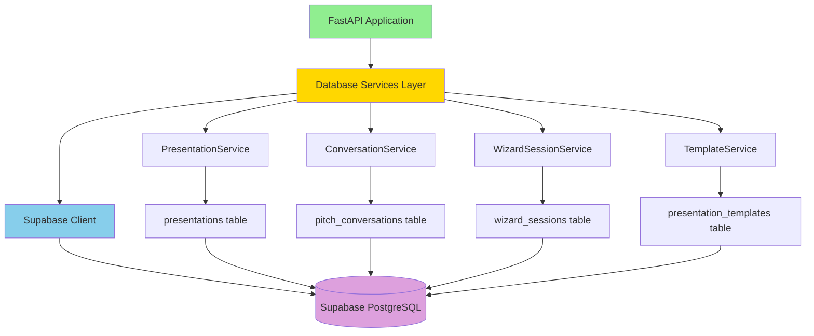
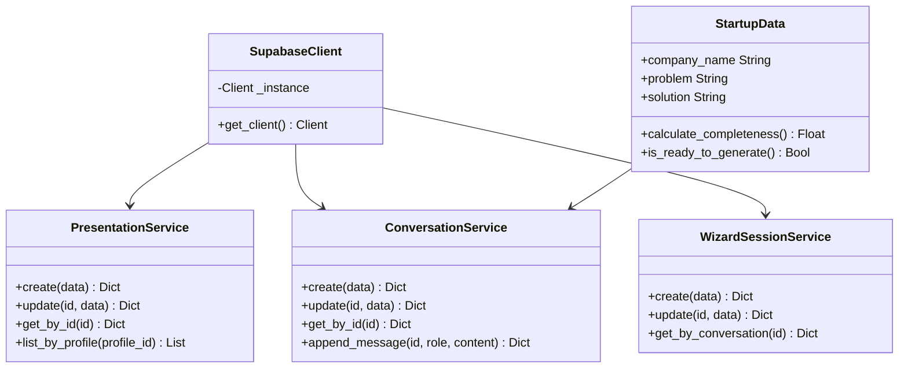

# 🗄️ TASK 3: CREATE DATABASE MODULE

**Priority**: 🟡 HIGH
**Estimated Time**: 30-40 minutes
**Dependencies**: TASK-01 (Install Dependencies)
**Status**: 🔴 NOT STARTED

---

## 🎯 OBJECTIVE

Create a complete database service layer for Supabase integration, including client connection, Pydantic models, and CRUD services for pitch deck data.

---

## 📊 ARCHITECTURE DIAGRAM



---

## 📁 FILE STRUCTURE

```
/home/sk/mde/template-copilot-kit-py/src/
└── database/
    ├── __init__.py
    ├── supabase_client.py    ← Singleton client
    ├── models.py             ← Pydantic models
    └── services.py           ← CRUD operations
```

---

## 🔧 STEP-BY-STEP INSTRUCTIONS

### Step 1: Create Database Directory

```bash
cd /home/sk/mde/template-copilot-kit-py/src
mkdir -p database
cd database
```

**Verification**:
```bash
pwd
# Expected: /home/sk/mde/template-copilot-kit-py/src/database
```

---

### Step 2: Create __init__.py

```bash
cat > __init__.py << 'EOF'
"""
Database module for Supabase integration.

Provides:
- Supabase client singleton
- Pydantic models for data validation
- Service layer for CRUD operations
"""
from .supabase_client import supabase, SupabaseClient
from .services import (
    PresentationService,
    ConversationService,
    WizardSessionService,
    TemplateService,
)

__all__ = [
    "supabase",
    "SupabaseClient",
    "PresentationService",
    "ConversationService",
    "WizardSessionService",
    "TemplateService",
]
EOF
```

---

### Step 3: Create supabase_client.py

```bash
cat > supabase_client.py << 'EOF'
"""
Supabase client configuration for backend services.
Provides database access with service role permissions.
"""
import os
from typing import Optional
from supabase import create_client, Client
from dotenv import load_dotenv

# Load environment variables from parent directory
load_dotenv(dotenv_path="/home/sk/mde/.env")


class SupabaseClient:
    """Singleton Supabase client for backend services."""

    _instance: Optional[Client] = None

    @classmethod
    def get_client(cls) -> Client:
        """
        Get or create Supabase client instance.
        Uses service role key for backend operations.
        """
        if cls._instance is None:
            url = os.getenv("SUPABASE_PROJECT_URL")
            service_key = os.getenv("SUPABASE_SERVICE_ROLE_KEY")

            if not url or not service_key:
                raise ValueError(
                    "Missing Supabase credentials. "
                    "Ensure SUPABASE_PROJECT_URL and SUPABASE_SERVICE_ROLE_KEY "
                    "are set in /home/sk/mde/.env"
                )

            cls._instance = create_client(url, service_key)
            print(f"✅ Supabase client initialized: {url}")

        return cls._instance


# Singleton instance
supabase: Client = SupabaseClient.get_client()
EOF
```

**Test immediately**:
```bash
cd /home/sk/mde/template-copilot-kit-py
source .venv/bin/activate
python3 -c "from src.database.supabase_client import supabase; print('✅ Client works!')"
```

---

### Step 4: Create models.py

```bash
cd /home/sk/mde/template-copilot-kit-py/src/database

cat > models.py << 'EOF'
"""
Pydantic models for Supabase database tables.
Matches schema from dhesktsqhcxhqfjypulk project.
"""
from typing import Optional, List, Dict, Any
from datetime import datetime
from pydantic import BaseModel, Field
from uuid import UUID


class PresentationCreate(BaseModel):
    """Model for creating a new presentation."""
    profile_id: UUID
    title: str
    prompt: Optional[str] = None
    presentation_style: Optional[str] = "professional"
    language: Optional[str] = "en"
    status: str = "draft"
    template_id: Optional[UUID] = None


class PresentationUpdate(BaseModel):
    """Model for updating a presentation."""
    title: Optional[str] = None
    content: Optional[Dict[str, Any]] = None
    outline: Optional[List[str]] = None
    status: Optional[str] = None
    slide_count: Optional[int] = None
    thumbnail_url: Optional[str] = None


class PitchConversationCreate(BaseModel):
    """Model for creating a new pitch conversation."""
    profile_id: UUID
    deck_id: Optional[UUID] = None
    messages: List[Dict[str, Any]] = Field(default_factory=list)
    collected_data: Dict[str, Any] = Field(default_factory=dict)
    status: str = "active"


class PitchConversationUpdate(BaseModel):
    """Model for updating a pitch conversation."""
    messages: Optional[List[Dict[str, Any]]] = None
    collected_data: Optional[Dict[str, Any]] = None
    status: Optional[str] = None
    deck_id: Optional[UUID] = None


class WizardSessionCreate(BaseModel):
    """Model for creating a new wizard session."""
    profile_id: UUID
    conversation_id: UUID
    current_step: int = 0
    completeness: float = 0.0
    collected_data: Dict[str, Any] = Field(default_factory=dict)
    status: str = "active"


class WizardSessionUpdate(BaseModel):
    """Model for updating a wizard session."""
    current_step: Optional[int] = None
    completeness: Optional[float] = None
    collected_data: Optional[Dict[str, Any]] = None
    status: Optional[str] = None
    metadata: Optional[Dict[str, Any]] = None


class StartupData(BaseModel):
    """Collected startup information from AI conversation."""
    company_name: Optional[str] = None
    industry: Optional[str] = None
    problem: Optional[str] = None
    solution: Optional[str] = None
    target_market: Optional[str] = None
    business_model: Optional[str] = None
    competitive_advantage: Optional[str] = None
    team: Optional[str] = None
    traction: Optional[str] = None
    financials: Optional[str] = None
    ask: Optional[str] = None

    def calculate_completeness(self) -> float:
        """Calculate how complete the data is (0-100)."""
        fields = [
            self.company_name,
            self.industry,
            self.problem,
            self.solution,
            self.target_market,
            self.business_model,
            self.competitive_advantage,
            self.team,
            self.traction,
            self.financials,
            self.ask,
        ]
        completed = sum(1 for field in fields if field)
        return (completed / len(fields)) * 100

    def is_ready_to_generate(self) -> bool:
        """Check if enough data collected to generate deck."""
        # Minimum required: company, problem, solution, market
        required = [
            self.company_name,
            self.problem,
            self.solution,
            self.target_market,
        ]
        return all(required) and self.calculate_completeness() >= 60
EOF
```

**Test models**:
```bash
python3 -c "from src.database.models import StartupData; s = StartupData(company_name='Test'); print(f'✅ Completeness: {s.calculate_completeness()}%')"
```

---

### Step 5: Create services.py (Part 1 - PresentationService)

```bash
cd /home/sk/mde/template-copilot-kit-py/src/database

cat > services.py << 'EOF'
"""
Database service layer for Supabase operations.
Provides high-level functions for pitch deck wizard.
"""
from typing import Optional, Dict, Any, List
from uuid import UUID
from datetime import datetime

from .supabase_client import supabase
from .models import (
    PresentationCreate,
    PresentationUpdate,
    PitchConversationCreate,
    PitchConversationUpdate,
    WizardSessionCreate,
    WizardSessionUpdate,
    StartupData,
)


class PresentationService:
    """Service for managing presentations."""

    @staticmethod
    async def create(data: PresentationCreate) -> Dict[str, Any]:
        """Create a new presentation."""
        result = supabase.table("presentations").insert({
            "profile_id": str(data.profile_id),
            "title": data.title,
            "prompt": data.prompt,
            "presentation_style": data.presentation_style,
            "language": data.language,
            "status": data.status,
            "template_id": str(data.template_id) if data.template_id else None,
            "created_at": datetime.utcnow().isoformat(),
            "updated_at": datetime.utcnow().isoformat(),
        }).execute()

        return result.data[0] if result.data else None

    @staticmethod
    async def update(presentation_id: UUID, data: PresentationUpdate) -> Dict[str, Any]:
        """Update an existing presentation."""
        update_data = data.model_dump(exclude_none=True)
        update_data["updated_at"] = datetime.utcnow().isoformat()

        result = supabase.table("presentations").update(update_data).eq(
            "id", str(presentation_id)
        ).execute()

        return result.data[0] if result.data else None

    @staticmethod
    async def get_by_id(presentation_id: UUID) -> Optional[Dict[str, Any]]:
        """Get presentation by ID."""
        result = supabase.table("presentations").select("*").eq(
            "id", str(presentation_id)
        ).execute()

        return result.data[0] if result.data else None

    @staticmethod
    async def list_by_profile(profile_id: UUID) -> List[Dict[str, Any]]:
        """Get all presentations for a user."""
        result = supabase.table("presentations").select("*").eq(
            "profile_id", str(profile_id)
        ).order("created_at", desc=True).execute()

        return result.data or []


class ConversationService:
    """Service for managing pitch conversations."""

    @staticmethod
    async def create(data: PitchConversationCreate) -> Dict[str, Any]:
        """Create a new conversation."""
        result = supabase.table("pitch_conversations").insert({
            "profile_id": str(data.profile_id),
            "deck_id": str(data.deck_id) if data.deck_id else None,
            "messages": data.messages,
            "collected_data": data.collected_data,
            "status": data.status,
            "created_at": datetime.utcnow().isoformat(),
            "updated_at": datetime.utcnow().isoformat(),
        }).execute()

        return result.data[0] if result.data else None

    @staticmethod
    async def update(conversation_id: UUID, data: PitchConversationUpdate) -> Dict[str, Any]:
        """Update a conversation."""
        update_data = data.model_dump(exclude_none=True)
        update_data["updated_at"] = datetime.utcnow().isoformat()

        result = supabase.table("pitch_conversations").update(update_data).eq(
            "id", str(conversation_id)
        ).execute()

        return result.data[0] if result.data else None

    @staticmethod
    async def get_by_id(conversation_id: UUID) -> Optional[Dict[str, Any]]:
        """Get conversation by ID."""
        result = supabase.table("pitch_conversations").select("*").eq(
            "id", str(conversation_id)
        ).execute()

        return result.data[0] if result.data else None

    @staticmethod
    async def append_message(
        conversation_id: UUID,
        role: str,
        content: str
    ) -> Dict[str, Any]:
        """Append a message to the conversation."""
        # Get current conversation
        conversation = await ConversationService.get_by_id(conversation_id)
        if not conversation:
            raise ValueError(f"Conversation {conversation_id} not found")

        # Append new message
        messages = conversation.get("messages", [])
        messages.append({
            "role": role,
            "content": content,
            "timestamp": datetime.utcnow().isoformat(),
        })

        # Update conversation
        return await ConversationService.update(
            conversation_id,
            PitchConversationUpdate(messages=messages)
        )


class WizardSessionService:
    """Service for managing wizard sessions."""

    @staticmethod
    async def create(data: WizardSessionCreate) -> Dict[str, Any]:
        """Create a new wizard session."""
        result = supabase.table("wizard_sessions").insert({
            "profile_id": str(data.profile_id),
            "conversation_id": str(data.conversation_id),
            "current_step": data.current_step,
            "completeness": data.completeness,
            "collected_data": data.collected_data,
            "status": data.status,
            "created_at": datetime.utcnow().isoformat(),
            "updated_at": datetime.utcnow().isoformat(),
        }).execute()

        return result.data[0] if result.data else None

    @staticmethod
    async def update(session_id: UUID, data: WizardSessionUpdate) -> Dict[str, Any]:
        """Update a wizard session."""
        update_data = data.model_dump(exclude_none=True)
        update_data["updated_at"] = datetime.utcnow().isoformat()

        result = supabase.table("wizard_sessions").update(update_data).eq(
            "id", str(session_id)
        ).execute()

        return result.data[0] if result.data else None

    @staticmethod
    async def get_by_conversation(conversation_id: UUID) -> Optional[Dict[str, Any]]:
        """Get session by conversation ID."""
        result = supabase.table("wizard_sessions").select("*").eq(
            "conversation_id", str(conversation_id)
        ).execute()

        return result.data[0] if result.data else None


class TemplateService:
    """Service for managing presentation templates."""

    @staticmethod
    async def list_all() -> List[Dict[str, Any]]:
        """Get all available templates."""
        result = supabase.table("presentation_templates").select("*").order(
            "usage_count", desc=True
        ).execute()

        return result.data or []

    @staticmethod
    async def get_by_category(category: str) -> List[Dict[str, Any]]:
        """Get templates by category."""
        result = supabase.table("presentation_templates").select("*").eq(
            "category", category
        ).order("usage_count", desc=True).execute()

        return result.data or []

    @staticmethod
    async def get_by_id(template_id: UUID) -> Optional[Dict[str, Any]]:
        """Get template by ID."""
        result = supabase.table("presentation_templates").select("*").eq(
            "id", str(template_id)
        ).execute()

        return result.data[0] if result.data else None
EOF
```

---

## ✅ SUCCESS CRITERIA

### Must Pass ALL:

- [ ] `database/` directory created
- [ ] `__init__.py` exports all modules
- [ ] `supabase_client.py` connects successfully
- [ ] `models.py` defines all Pydantic models
- [ ] `services.py` implements all CRUD operations
- [ ] All imports work without errors
- [ ] Can create test conversation
- [ ] Can query presentations table

### Comprehensive Verification:

```bash
cd /home/sk/mde/template-copilot-kit-py
source .venv/bin/activate

python3 << 'EOF'
import asyncio
from uuid import uuid4
from src.database.supabase_client import supabase
from src.database.models import StartupData, PitchConversationCreate
from src.database.services import ConversationService

print("🧪 DATABASE MODULE VERIFICATION")
print("=" * 50)

# Test 1: Client connection
try:
    result = supabase.table("presentations").select("id").limit(1).execute()
    print("✅ Supabase client: CONNECTED")
except Exception as e:
    print(f"❌ Supabase client: FAILED - {e}")
    exit(1)

# Test 2: Models
try:
    data = StartupData(company_name="Test Corp", problem="Test problem")
    completeness = data.calculate_completeness()
    print(f"✅ Pydantic models: WORKING (completeness: {completeness}%)")
except Exception as e:
    print(f"❌ Pydantic models: FAILED - {e}")
    exit(1)

# Test 3: Services (async test)
async def test_services():
    try:
        # Create test conversation
        conv = await ConversationService.create(
            PitchConversationCreate(profile_id=uuid4())
        )
        print(f"✅ Database services: WORKING (created conversation: {conv['id'][:8]}...)")
        return True
    except Exception as e:
        print(f"❌ Database services: FAILED - {e}")
        return False

# Run async test
if asyncio.run(test_services()):
    print("=" * 50)
    print("🎉 ALL DATABASE MODULE TESTS PASSED!")
    print("✅ TASK 3 COMPLETE")
else:
    exit(1)
EOF
```

**Expected Output**:
```
🧪 DATABASE MODULE VERIFICATION
==================================================
✅ Supabase client: CONNECTED
✅ Pydantic models: WORKING (completeness: 18.18%)
✅ Database services: WORKING (created conversation: a1b2c3d4...)
==================================================
🎉 ALL DATABASE MODULE TESTS PASSED!
✅ TASK 3 COMPLETE
```

---

## 🚨 TROUBLESHOOTING

### Issue: "Missing Supabase credentials"

**Solution**:
```bash
# Verify .env exists
cat /home/sk/mde/.env | grep SUPABASE_PROJECT_URL

# Ensure keys are set
export $(cat /home/sk/mde/.env | xargs)
echo $SUPABASE_PROJECT_URL
```

---

### Issue: "Table 'presentations' not found"

**Solution**:
```bash
# Verify database schema
# Check Supabase dashboard: https://dhesktsqhcxhqfjypulk.supabase.co
```

---

## 📊 MODULE STRUCTURE DIAGRAM



---

**Task Created**: October 26, 2025
**Estimated Time**: 30-40 minutes
**Difficulty**: ⭐⭐ Medium

**Next Task**: TASK-04-CONTENT-AGENT.md
