# 🗺️ USER JOURNEY & SYSTEM FLOWS

**Project**: Medellin Spark AI Pitch Deck Generator
**Created**: October 26, 2025
**Purpose**: Complete user journey mapping with mermaid diagrams

---

## 📊 COMPLETE USER JOURNEY

### Overview Flow

```mermaid
flowchart TD
    Start([User Visits Site]) --> Landing[/pitch-deck or /pitch-deck-wizard]

    Landing --> Input[Enter Startup Description]
    Input --> AI[AI Processes Input]

    AI --> Extract[Content Agent Extracts Data]
    Extract --> Progress{Progress >= 60%?}

    Progress -->|No| MoreQuestions[AI Asks Follow-up Questions]
    MoreQuestions --> Input

    Progress -->|Yes| Generate[Generate Deck Button Appears]
    Generate --> Slides[Slides Agent Creates 10 Slides]

    Slides --> SaveDB[(Save to Database)]
    SaveDB --> Redirect[Redirect to Outline Editor]

    Redirect --> Outline[/presentations/:id/outline]
    Outline --> EditOutline{User Action}

    EditOutline -->|Reorder Slides| DragDrop[Drag & Drop Slides]
    EditOutline -->|Edit Titles| InlineEdit[Inline Title Editing]
    EditOutline -->|Change Theme| ThemeSelector[Select Theme]
    EditOutline -->|Continue| ToSlideEditor[Click Edit Slides]

    DragDrop --> AutoSave1[(Auto-save to DB)]
    InlineEdit --> AutoSave1
    ThemeSelector --> AutoSave1
    AutoSave1 --> Outline

    ToSlideEditor --> SlideEditor[/presentations/:id/edit]

    SlideEditor --> EditSlides{User Action}
    EditSlides -->|Edit Content| EditContent[Edit Headlines/Bullets/Notes]
    EditSlides -->|Change Layout| LayoutSelector[Choose Layout from 12 Options]
    EditSlides -->|Navigate| Thumbnails[Click Thumbnail Panel]
    EditSlides -->|Present| ToViewer[Click Present Button]

    EditContent --> AutoSave2[(Auto-save to DB)]
    LayoutSelector --> AutoSave2
    AutoSave2 --> SlideEditor
    Thumbnails --> SlideEditor

    ToViewer --> Viewer[/presentations/:id/view]
    Viewer --> Present{Presentation Mode}

    Present -->|Arrow Keys| Navigate[Navigate Slides]
    Present -->|ESC| Exit[Exit Presentation]

    Navigate --> Present
    Exit --> Dashboard[Return to Dashboard]

    Dashboard --> End([Journey Complete])

    style Start fill:#90EE90
    style End fill:#90EE90
    style AI fill:#FFD700
    style Extract fill:#FFD700
    style Slides fill:#FFD700
    style SaveDB fill:#87CEEB
    style AutoSave1 fill:#87CEEB
    style AutoSave2 fill:#87CEEB
```

---

## 🎯 PHASE 1: CONTENT GATHERING

### Landing Page Flow

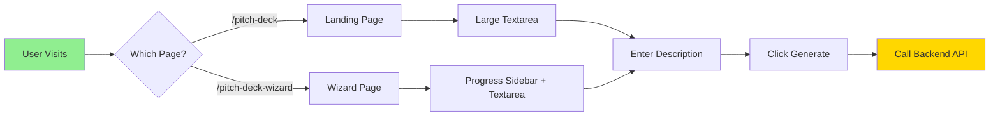

### Backend Processing Flow

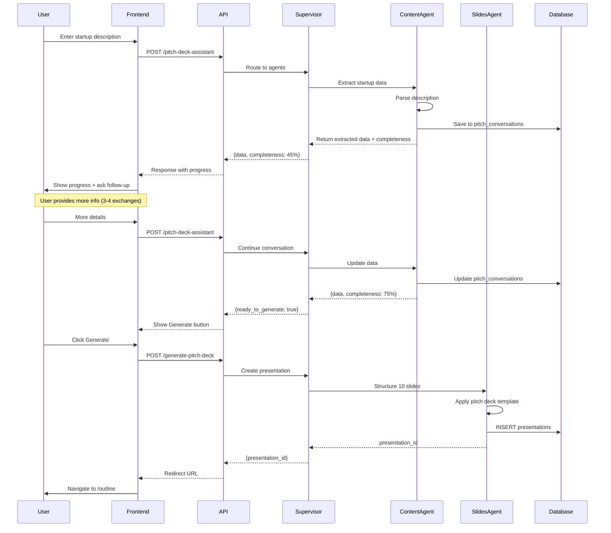

---

## 🎨 PHASE 2: OUTLINE EDITING

### Outline Editor Flow

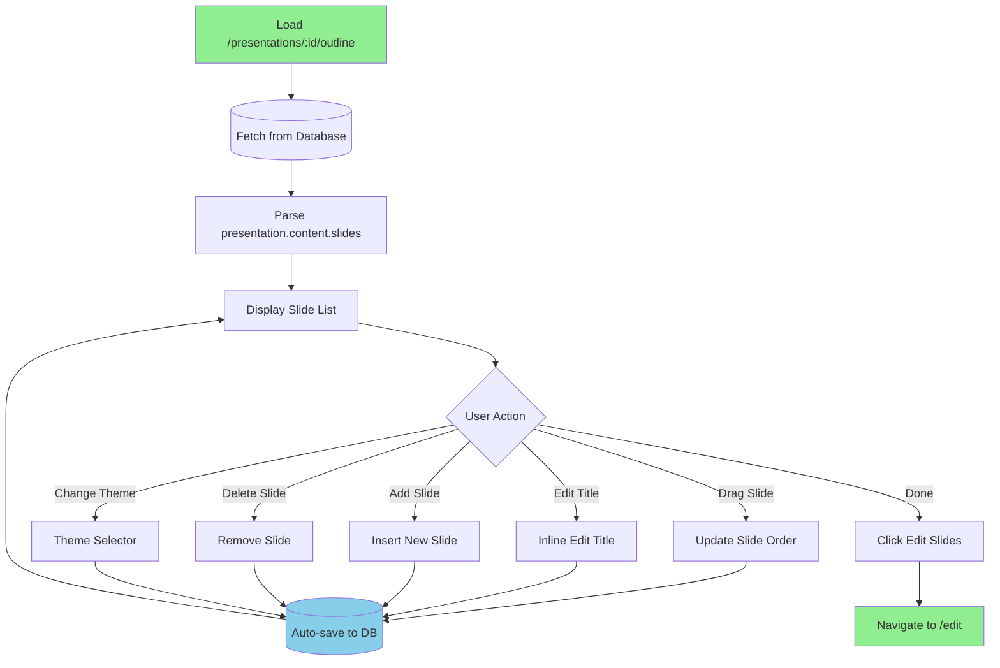

### Drag & Drop Implementation

```mermaid
flowchart LR
    A[User Grabs Slide] --> B[@dnd-kit/sortable]
    B --> C[Calculate New Position]
    C --> D[Reorder Array]
    D --> E[Update State]
    E --> F[Debounce 500ms]
    F --> G[(Save to Database)]
    G --> H[Show Success Indicator]

    style A fill:#FFD700
    style G fill:#87CEEB
```

---

## 📝 PHASE 3: SLIDE EDITING

### Slide Editor Flow

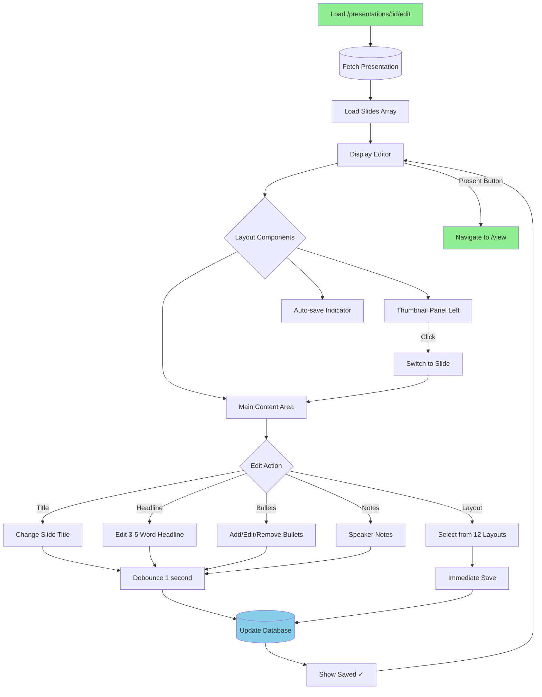

### Content Structure

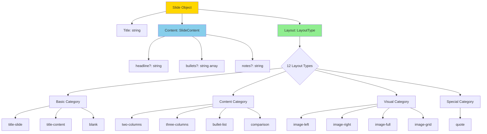

---

## 🎬 PHASE 4: PRESENTATION MODE

### Viewer Flow

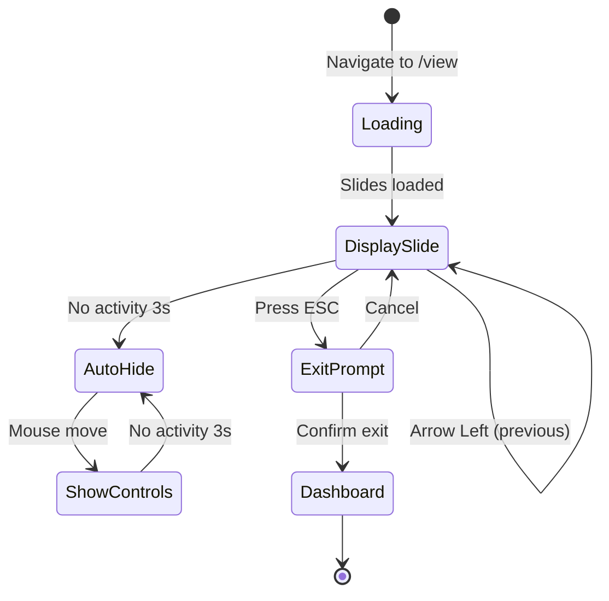

### Keyboard Navigation

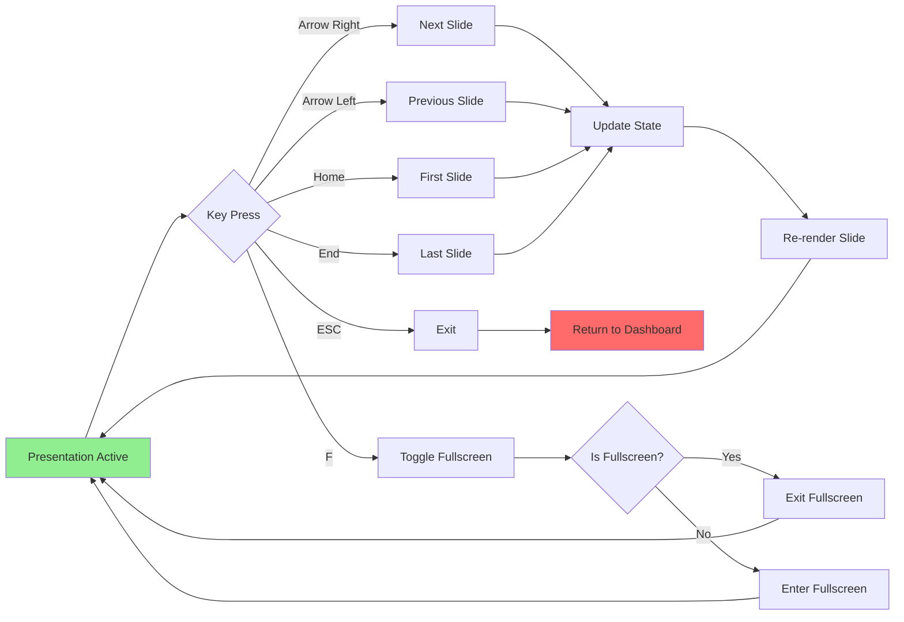

---

## 💾 DATABASE INTERACTION FLOWS

### Data Persistence Pattern

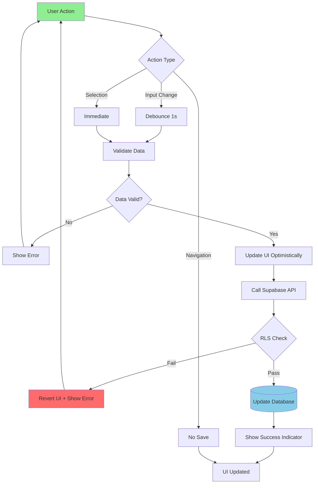

### Database Schema Relationships

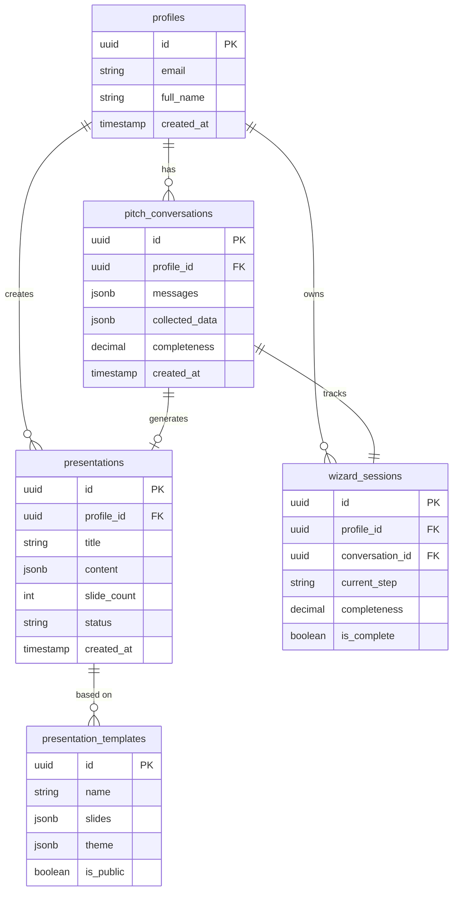

---

## 🤖 AI AGENT ORCHESTRATION

### Multi-Agent System Flow

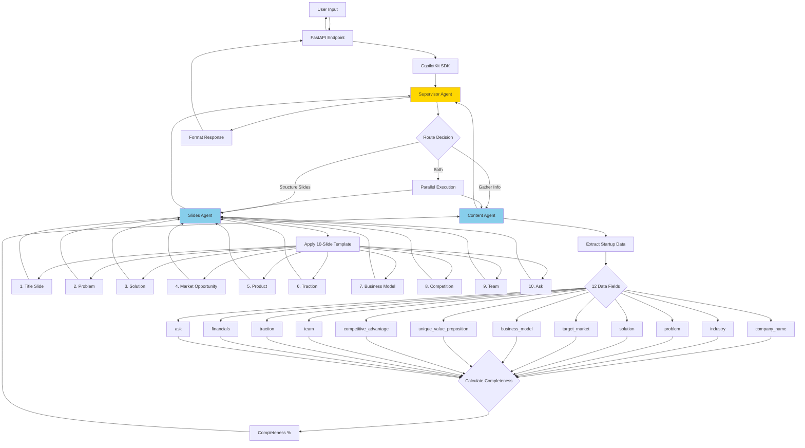

### Agent Communication Pattern

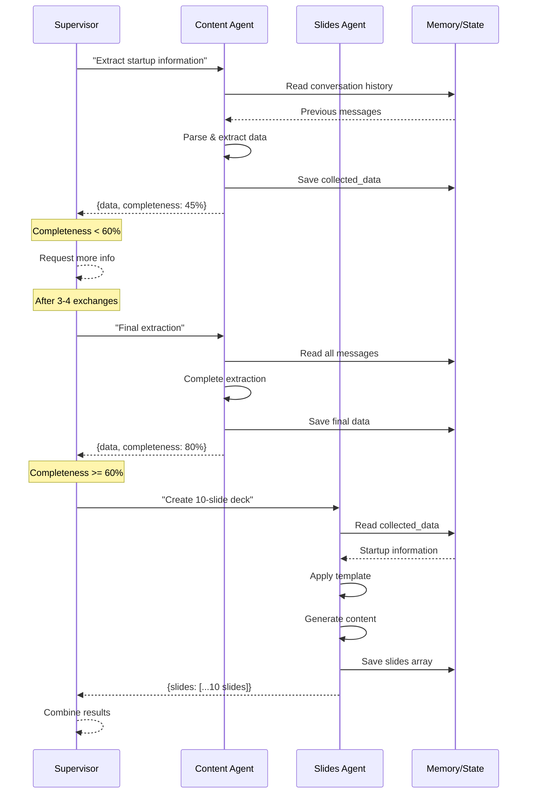

---

## 🎯 BEST PRACTICES

### 1. Performance Optimization

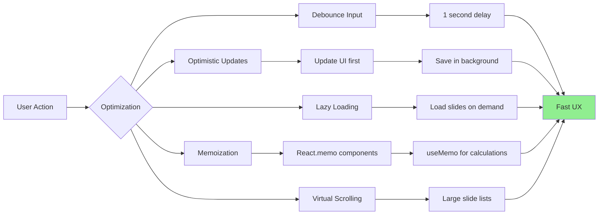

### 2. Error Handling Strategy

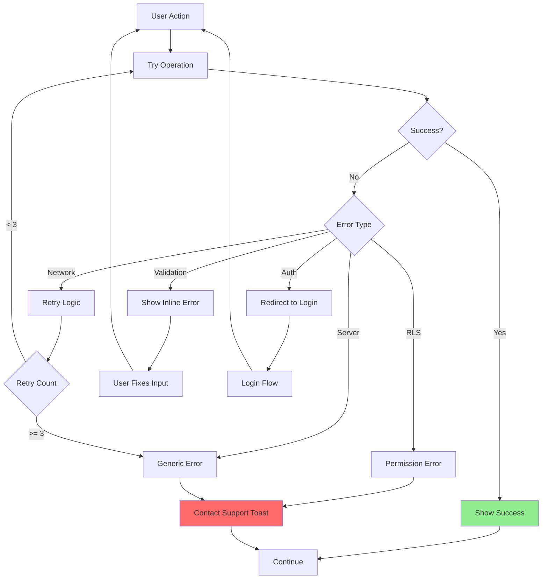

### 3. State Management Pattern

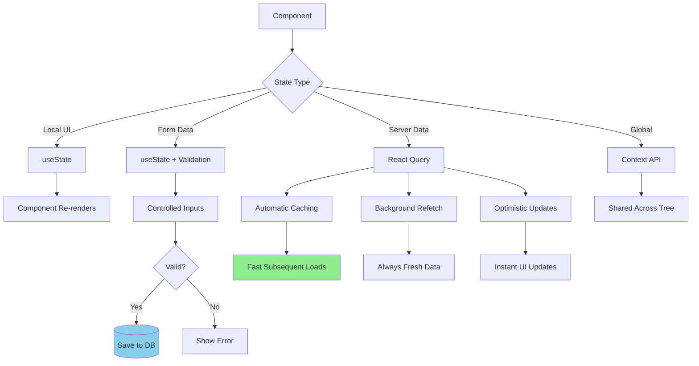

### 4. Security Best Practices

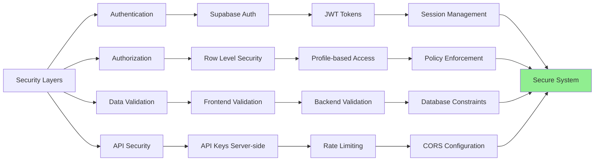

### 5. Testing Strategy

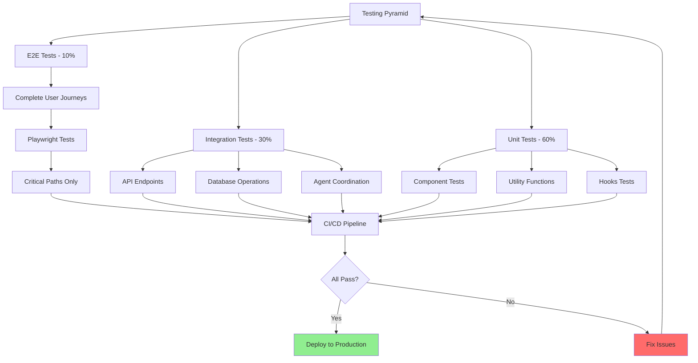

---

## 📱 RESPONSIVE DESIGN FLOW

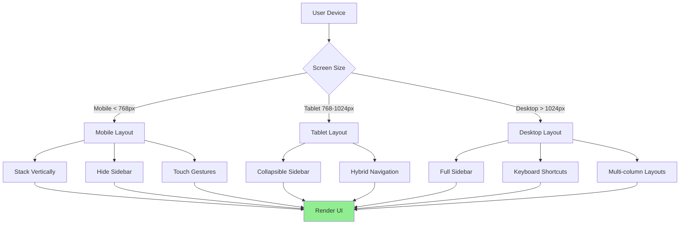

---

## 🚀 DEPLOYMENT FLOW

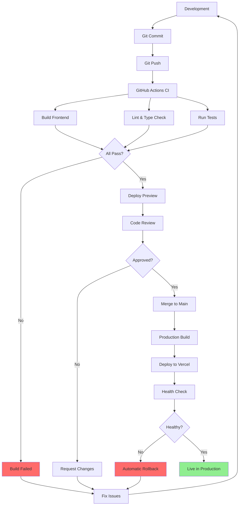

---

## 📊 MONITORING & ANALYTICS

```mermaid
flowchart LR
    User[User Actions] --> Track[Analytics Events]

    Track --> Events{Event Types}

    Events --> E1[Page Views]
    Events --> E2[Conversions]
    Events --> E3[Errors]
    Events --> E4[Performance]

    E1 --> GA[Google Analytics]
    E2 --> GA
    E3 --> Sentry[Error Tracking]
    E4 --> Perf[Performance Monitoring]

    GA --> Dashboard[Analytics Dashboard]
    Sentry --> Alerts[Error Alerts]
    Perf --> Metrics[Performance Metrics]

    Dashboard --> Insights[Business Insights]
    Alerts --> Fix[Bug Fixes]
    Metrics --> Optimize[Performance Optimization]

    style Insights fill:#90EE90
    style Fix fill:#FFD700
    style Optimize fill:#87CEEB
```

---

**Created**: October 26, 2025
**Last Updated**: October 26, 2025
**Status**: ✅ Complete Reference Documentation
