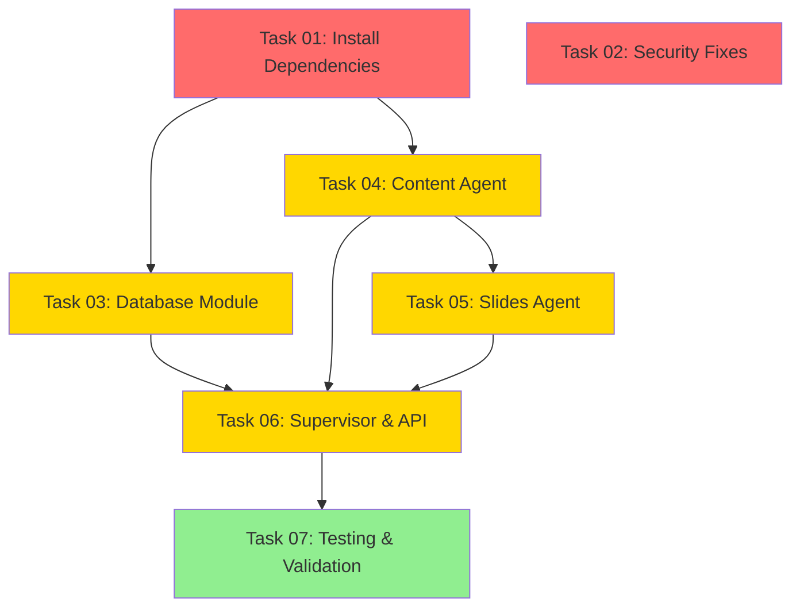

# 🎯 PITCH DECK WIZARD - IMPLEMENTATION TASKS

**Project**: Medellin Spark AI Pitch Deck Generator
**Backend**: `/home/sk/mde/template-copilot-kit-py`
**Frontend**: `/home/sk/mde/src`
**Database**: Supabase (`dhesktsqhcxhqfjypulk`)

---

## 📋 TASK OVERVIEW

| Task | Name | Priority | Time | Dependencies | Status |
|------|------|----------|------|--------------|--------|
| 01 | Install Dependencies | 🔴 CRITICAL | 15-20 min | None | 🔴 NOT STARTED |
| 02 | Security Fixes | 🔴 CRITICAL | 30-45 min | None | 🔴 NOT STARTED |
| 03 | Database Module | 🟡 HIGH | 30-40 min | Task 01 | 🔴 NOT STARTED |
| 04 | Content Agent | 🟡 HIGH | 30-40 min | Task 01 | ✅ READY |
| 05 | Slides Agent | 🟡 HIGH | 30-40 min | Task 01, 04 | ✅ READY |
| 06 | Supervisor & API | 🟡 HIGH | 20-30 min | Task 01, 04, 05 | ✅ READY |
| 07 | Testing & Validation | 🟢 MEDIUM | 30-45 min | All above | ✅ READY |

**Total Estimated Time**: 3-4 hours

---

## 🚀 QUICK START

### Option 1: Sequential Execution

```bash
# Complete tasks in order
# Task 01 → Task 02 (parallel) → Task 03 → Task 04 → Task 05 → Task 06 → Task 07
```

### Option 2: Parallel Execution

```bash
# Run these in parallel:
# - Task 01 (Install Dependencies)
# - Task 02 (Security Fixes)

# Then continue sequentially:
# Task 03 → Task 04 → Task 05 → Task 06 → Task 07
```

---

## 📊 TASK DEPENDENCY GRAPH



---

## ✅ COMPLETION TRACKING

### Day 1 Goals (CRITICAL)
- [ ] Task 01: Install Dependencies (15-20 min)
- [ ] Task 02: Security Fixes (30-45 min)
- [ ] Task 03: Database Module (30-40 min)
- [ ] Task 04: Content Agent (30-40 min)

**Day 1 Total**: ~2 hours

### Day 2 Goals
- [ ] Task 05: Slides Agent (30-40 min)
- [ ] Task 06: Supervisor & API (20-30 min)
- [ ] Task 07: Testing & Validation (30-45 min)

**Day 2 Total**: ~1.5 hours

---

## 🎓 TASK DETAILS

Each task file includes:
- ✅ **Multi-step instructions** with verification
- 🎯 **Success criteria** with pass/fail tests
- 🧪 **Testing procedures** to prove it works
- 📊 **Mermaid diagrams** for visualization
- 🚨 **Troubleshooting guides** for common issues
- 📝 **Proof of completion** requirements

---

## 📁 FILE LOCATIONS

```
/home/sk/mde/pitch-deck/tasks/
├── README.md                          ← You are here
├── 01-INSTALL-DEPENDENCIES.md         ✅ Ready
├── 02-SECURITY-FIXES.md               ✅ Ready
├── 03-DATABASE-MODULE.md              ✅ Ready
├── TASK-04-CONTENT-AGENT.md           ✅ Created
├── TASK-05-SLIDES-AGENT.md            ✅ Created
├── TASK-06-SUPERVISOR-API.md          ✅ Created
├── TASK-07-TESTING-VALIDATION.md      ✅ Created
└── logs/                              ← Verification logs
```

---

## 🔍 HOW TO USE THESE TASKS

1. **Read entire task** before starting
2. **Check dependencies** - complete prerequisite tasks first
3. **Follow steps sequentially** - don't skip steps
4. **Run verification** after each major step
5. **Save proof of completion** (logs, screenshots)
6. **Mark complete** only when ALL success criteria pass

---

## 🆘 SUPPORT

If you get stuck:
1. Check task's troubleshooting section
2. Review `/home/sk/mde/CLAUDE.md`
3. Run validation scripts:
   ```bash
   cd /home/sk/mde/template-copilot-kit-py
   bash scripts/validate-environment.sh
   bash scripts/validate-dependencies.sh
   ```
4. Check logs in `pitch-deck/tasks/logs/`

---

**Created**: October 26, 2025
**Last Updated**: October 26, 2025
**Status**: Ready for implementation

**🚀 START HERE**: Begin with **TASK-01-INSTALL-DEPENDENCIES.md**
